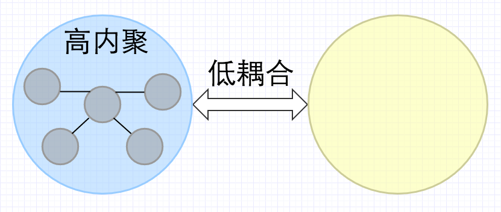

## 设计模式六大原则——SOLID

2018年08月12日 20:34:32           [rocketeerLi](https://me.csdn.net/rocketeerLi)           阅读数：3289                                                                  
 版权声明：本文为 rocketeerLi 原创文章，转载请注明出处，谢谢          https://blog.csdn.net/rocketeerLi/article/details/81585705        

> 辅助参考 [原文](http://www.apkbus.com/blog-892197-78029.html) 
>  [solid原则（面相对象的七大原则）](https://www.imooc.com/article/51098) 
> https://www.imooc.com/article/51098

#####	[GitHub地址](https://github.com/PowerDG/DgBook.architect-awesome/blob/master/ABP.Net%20Core/ABP-%E8%AE%BE%E8%AE%A1%E6%A8%A1%E5%BC%8F%E4%B8%8E%E5%8E%9F%E5%88%99/%E8%AE%BE%E8%AE%A1%E5%8E%9F%E5%88%99.md)


> 【接口隔离原则ISP】与【依赖倒置原则DIP】用例相关
> 结合 ABP领域层 - 实体[约定接口【基本概念-扩展/审计】](https://www.52abp.com/Wiki/abp-cn/latest/3.1ABP%E9%A2%86%E5%9F%9F%E5%B1%82-%E5%AE%9E%E4%BD%93#3-1-3-?tdsourcetag=s_pctim_aiomsg)
> https://www.52abp.com/Wiki/abp-cn/latest/3.1ABP%E9%A2%86%E5%9F%9F%E5%B1%82-%E5%AE%9E%E4%BD%93#3-1-3-?tdsourcetag=s_pctim_aiomsg
>
> 实体类添加以下[常用接口【实体审计/历史追踪】](https://blog.csdn.net/tianxiaode/article/details/78880387)
> https://blog.csdn.net/tianxiaode/article/details/78880387

##### SOLID

设计模式的六大原则有：

- Single Responsibility Principle：单一职责原则
- Open Closed Principle：开闭原则
- Liskov Substitution Principle：里氏替换原则
- Law of Demeter：迪米特法则
- Interface Segregation Principle：接口隔离原则
- Dependence Inversion Principle：依赖倒置原则


把这六个原则的首字母联合起来（ `L` 算做一个）就是 `SOLID` （solid，稳定的），其代表的含义就是这六个原则结合使用的好处：**建立稳定、灵活、健壮的设计**

下面我们来分别看一下这六大设计原则。

### 单一职责原则SPP

（Single Responsibility Principle）

------

单一职责原则简称 `SRP` ，顾名思义，就是一个类只负责一个职责。它的定义也很简单：

```
There should never be more than one reason for a class to change.1
```

这句话很好理解，就是说，不能有多个导致类变更的原因。


##### 一个对象只承担一种责任，所有服务接口只通过它来执行这种任务。


那这个原则有什么用呢，它让类的职责更单一。这样的话，每个类只需要负责自己的那部分，类的复杂度就会降低。如果职责划分得很清楚，那么代码维护起来也更加容易。试想如果所有的功能都放在了一个类中，那么这个类就会变得非常臃肿，而且一旦出现bug，要在所有代码中去寻找；更改某一个地方，可能要改变整个代码的结构，想想都非常可怕。当然一般时候，没有人会去这么写的。

当然，这个原则不仅仅适用于类，对于接口和方法也适用，即一个接口/方法，只负责一件事，这样的话，接口就会变得简单，方法中的代码也会更少，易读，便于维护。

事实上，由于一些其他的因素影响，类的单一职责在项目中是很难保证的。通常，接口和方法的单一职责更容易实现。

单一原则的好处：

- 代码的粒度降低了，类的复杂度降低了。

- 可读性提高了，每个类的职责都很明确，可读性自然更好。

- 可维护性提高了，可读性提高了，一旦出现 `bug` ，自然更容易找到他问题所在。

- 改动代码所消耗的资源降低了，更改的风险也降低了。

  

#####   餐馆员工分工

```csharp
public interface RestaurantStaff
    {//原先餐馆员工的工作日常
        void Cooking();
        void Order();
        void Deliver();
        void CastAccounts();
    }
```


```csharp
  
public interface RestaurantStaff
    {
        void PhysicalTraining(); 
    }

/// <summary>
    /// 负责烹饪的厨师
    /// </summary>
public interface Chef: RestaurantStaff
    { void Cooking();
    }
  
/// <summary>
    /// 负责点餐 送餐和其他的服务员
    /// </summary>
public interface Waiter: RestaurantStaff
    {
        void Order(); 
        void Deliver(); 
        void OtherServe(); 
    }
	/// <summary>
    /// 负责结算，核账的收银员
    /// </summary>
    public  interface Cashier: RestaurantStaff
    {
        void CastAccounts();
        void SettlementAccount();
    }

```


### 里氏替换原则LSP

（Liskov Substitution Principle）

里氏替换原则的定义如下：

```
Functions that use use pointers or references to base classes must be able to use objects of derived classes without knowing it. 
1
```

翻译过来就是，所有引用基类的地方必须能透明地使用其子类的对象。

里氏替换原则的意思是，所有基类在的地方，都可以换成子类，程序还可以正常运行。这个原则是与面向对象语言的 `继承` 特性密切相关的。

这是为什么呢？由于面向对象语言的继承特性，子类拥有父类的所有方法，因此，将基类替换成具体的子类，子类也可以调用父类中的方法（其实是它自己的方法，继承于父类），但是如果要保证完全可以调用，光名称相同不行，还需要满足下面两个条件：

- **子类中的方法的前置条件必须与超类中被覆写的方法的前置条件相同或更宽松。**
- **子类中的方法的后置条件必须与超类中被覆写的方法的后置条件相同或更严格。**

这样的话，调用就没有问题了。否则，我在父类中传入一个 `List` 类型的参数，子类中重写的方法参数却变为 `ArrayList` ，那客户端使用的时候传入一个 `LinkedList` 类型的参数，使用父类的时候程序正常运行，但根据 `LSP` 原则，替换成子类后程序就会出现问题。同理，后置条件也是如此。

是不是很好理解？

但是这个原则并不是这么简单的，语法上是肯定不能有任何问题。但是，同时，功能上也要和替换前相同。

那么这就有些困难了，因为子类重写父类中的方法天经地义，子类中的方法不同于父类中的方法也是很正常的，但是，如果这么随便重写父类中的方法的话，那么肯定会违背 `LSP` 原则，可以看下面的例子：

首先有一个父类，水果类：

```
public class Fruit {
    void introduce() {
        System.out.println("我是水果父类...");
    }
}12345
```

其次，它有一个子类，苹果类：

```
public class Apple extends Fruit {
    @Override
    void introduce() {
        System.out.println("我是水果子类——苹果");
    }
}123456
```

客户端代码如下：

```
public static void main(String[] args) {
    Fruit fruit = new Fruit();
    HashMap map = new HashMap<>();
    fruit.introduce();
}12345
```

运行结果：

```
我是水果父类...
1
```

那么，如果按照 `LSP` 原则，所有父类出现的地方都能换成其子类，代码如下：

```
public static void main(String[] args) {
    Apple fruit = new Apple();
    HashMap map = new HashMap<>();
    fruit.introduce();
}12345
```

那么运行结果就会变成：

```
我是水果子类——苹果
1
```

与原来的输出不同，程序的功能被改变了，违背了 `LSP` 原则。

因此，可以看到， `LSP` 原则最重要的一点就是：**避免子类重写父类中已经实现的方法**。这就是 `LSP` 原则的本质。这里由于 `Fruit` 父类已经实现了 `introduce` 方法，因此子类应该避免再对其进行重写，如果需要增加个性化，就应该对父类进行扩展，而不是重写，否则也会违背开闭原则。

一般来讲，程序中父类大多是抽象类，因为父类只是一个框架，具体功能还需要子类来实现。因此很少直接去 `new` 一个父类。而如果出现这种情况，那么就说明父类中实现的代码已经很好了，子类只需要对其进行扩展就会，尽量避免对其已经实现的方法再去重写。

#####	咕咾肉-食材的切换


### 接口隔离原则ISP

（Interface Segregation Principle）

------

首先声明，该原则中的接口，是一个泛泛而言的接口，不仅仅指Java中的接口，还包括其中的抽象类。

首先，给出该原则的定义，该原则有两个定义：

1. Clients should not be forced to depend upon interfaces that they don`t use. 

   客户端不应该依赖它不需要的接口。

2. The dependency of one class to another one should depend on the smallest possible. 

   类间的依赖关系应该建立在最小的接口上。

这是什么意思呢，这是让我们把接口进行细分。举个例子，如果一个类实现一个接口，但这个接口中有它不需要的方法，那么就需要把这个接口拆分，把它需要的方法提取出来，组成一个新的接口让这个类去实现，这就是接口隔离原则。简而言之，就是说，接口中的所有方法对其实现的子类都是有用的。否则，就将接口继续细分。

看起来，该原则与单一职责原则很相像。确实很像，二者都是强调要将接口进行细分，只不过分的方式不同。单一职责原则是按照 `职责` 进行划分接口的；而接口隔离原则则是按照实现类对方法的使用来划分的。可以说，接口隔离原则更细一些。

要想完美地实现该原则，基本上就需要每个实现类都有一个专用的接口。但实际开发中，这样显然是不可能的，而且，这样很容易违背单一职责原则（可能出现同一个职责分成了好几个接口的情况），因此我们能做的就是尽量细分。

该原则主要强调两点：

1. 接口尽量小。

   就像前面说的那样，接口中只有实现类中有用的方法。

2. 接口要高内聚

   就是说，在接口内部实现的方法，不管怎么改，都不会影响到接口外的其他接口或是实现类，只能影响它自己。

##### ABP实体审计接口

> 审计接口

修改审计

> 【接口隔离原则ISP】与【依赖倒置原则DIP】用例相关
> 结合 ABP领域层 - 实体[约定接口【基本概念-扩展/审计】](https://www.52abp.com/Wiki/abp-cn/latest/3.1ABP%E9%A2%86%E5%9F%9F%E5%B1%82-%E5%AE%9E%E4%BD%93#3-1-3-?tdsourcetag=s_pctim_aiomsg)
> https://www.52abp.com/Wiki/abp-cn/latest/3.1ABP%E9%A2%86%E5%9F%9F%E5%B1%82-%E5%AE%9E%E4%BD%93#3-1-3-?tdsourcetag=s_pctim_aiomsg
>
> 实体类添加以下[常用接口【实体审计/历史追踪】](https://blog.csdn.net/tianxiaode/article/details/78880387)
> https://blog.csdn.net/tianxiaode/article/details/78880387


namespace Abp.Dapper.Filters.Action
ModificationAuditDapperActionFilter


```csharp
namespace Abp.Dapper.Filters.Action
{
    public class ModificationAuditDapperActionFilter : DapperActionFilterBase, IDapperActionFilter
    {
        public void ExecuteFilter<TEntity, TPrimaryKey>(TEntity entity) where TEntity : class, IEntity<TPrimaryKey>
        {
            if (entity is IHasModificationTime)
            {
                entity.As<IHasModificationTime>().LastModificationTime = Clock.Now;
            }

            if (entity is IModificationAudited)
            {
                var record = entity.As<IModificationAudited>();
                long? userId = GetAuditUserId();
                if (userId == null)
                {
                    record.LastModifierUserId = null;
                    return;
                } 
                //Special check for multi-tenant entities
                if (entity is IMayHaveTenant || entity is IMustHaveTenant)
                {
                    //Sets LastModifierUserId only if current user is in same tenant/host with the given entity
                    if (entity is IMayHaveTenant && entity.As<IMayHaveTenant>().TenantId == AbpSession.TenantId ||
                        entity is IMustHaveTenant && entity.As<IMustHaveTenant>().TenantId == AbpSession.TenantId)
                    {
                        record.LastModifierUserId = userId;
                    }
                    else
                    {
                        record.LastModifierUserId = null;
                    }
                }
                else
                {
                    record.LastModifierUserId = userId;
                }
            }
        }
    }
}

```


##### 软删除审计


###### 软删除过滤

namespace Abp.EntityFramework
public abstract class AbpDbContext : DbContext, ITransientDependency, IShouldInitialize


###### 软删除实体审计-----记录


###### 软删除-EFCore中表达式过滤


```csharp
  if (typeof(ISoftDelete).IsAssignableFrom(typeof(TEntity)))
            {
                /* This condition should normally be defined as below:
                 * !IsSoftDeleteFilterEnabled || !((ISoftDelete) e).IsDeleted
                 * But this causes a problem with EF Core (see https://github.com/aspnet/EntityFrameworkCore/issues/9502)
                 * So, we made a workaround to make it working. It works same as above.
                 */ 
                Expression<Func<TEntity, bool>> softDeleteFilter = e => 
                    !((ISoftDelete)e).IsDeleted || 
                    ((ISoftDelete)e).IsDeleted != IsSoftDeleteFilterEnabled;
                expression = expression == null 
                    ? softDeleteFilter : CombineExpressions(expression, softDeleteFilter);
            }	
```


###### 删除审计，添加删除操作人的时候


###### 软删除-EFCore在【修改操作】中实现机制。


```csharp
 protected virtual void ApplyAbpConceptsForModifiedEntity(EntityEntry entry, long? userId, EntityChangeReport changeReport)
        {
            SetModificationAuditProperties(entry.Entity, userId);
            if (entry.Entity is ISoftDelete && 
                entry.Entity.As<ISoftDelete>().IsDeleted)
            {
                SetDeletionAuditProperties(entry.Entity, userId);
                changeReport.ChangedEntities.Add(new EntityChangeEntry(entry.Entity, EntityChangeType.Deleted));
            }
            else
            {
                changeReport.ChangedEntities.Add(new EntityChangeEntry(entry.Entity, EntityChangeType.Updated));
            }
        }
```

###### 软删除-EFCore在【删除操作】中实现机制。


```csharp
        protected virtual void ApplyAbpConceptsForDeletedEntity(EntityEntry entry, long? userId, EntityChangeReport changeReport)
        {
            if (IsHardDeleteEntity(entry))
            {
                changeReport.ChangedEntities.Add(new EntityChangeEntry(entry.Entity, EntityChangeType.Deleted));
                return;
            }

            CancelDeletionForSoftDelete(entry);
            SetDeletionAuditProperties(entry.Entity, userId);
            changeReport.ChangedEntities.Add(new EntityChangeEntry(entry.Entity, EntityChangeType.Deleted));
        }
```


实体审计


### 依赖倒置原则DIP

（Dependence Inversion Principle）

------

依赖倒置原则的原始定义是这样的：

```
High level modules should not depend upon low level modules. 
Both should depend upon abstractions. 
Abstractions should not depend upon details. Details should depend upon abstractions.
123
```


##### 分层扩展不依赖类，而是依赖抽象

翻译一下，就是下面三句话：

- 高层模块不应该依赖底层模块，两者都应该依赖其抽象。
- 抽象不应该依赖细节。
- 细节应该依赖抽象。

在Java语言中的表现就是：

- 模块间的依赖通过抽象发生，实现类之间不发生直接的依赖关系，其依赖关系是通过接口或抽象类产生的。
- 接口或抽象类不依赖于实现类。
- 实现类依赖于接口或抽象类。

简而言之，我们**要尽可能使用接口或抽象类**。也就是**“面向接口编程”** 或者说  **“面向抽象编程”**  ，也就是说程序中要尽可能使用抽象类或是接口。

可能现在还没有使用抽象的习惯，可以看一个例子：比如我们要写一个人吃苹果的程序，首先创建一个苹果类：

```
public class Apple {
    public void eaten() {
        System.out.println("正在吃苹果...");
    }
}
123456
```

然后写人的类：

```
public class Person {
    void eat(Apple apple) {
        apple.eaten();
    }   
}12345
```

这样，在客户端中我们就可以这样调用：

```
Person xiaoMing = new Person();
Apple apple = new Apple();
xiaoMing.eat(apple);123
```

但是这样就有一个问题，如果我不仅仅想吃苹果，还想吃橘子怎么办，在 `Person` 类中再加一个函数处理橘子？那么吃别的水果呢？？总不能程序中每增加一种水果就要在其中增加一个函数吧。

这时候就需要接口了（抽象类也是可以的）

程序就可以这样更改，增加一个水果接口：

```
public interface Fruit {
    void eaten(); 
}123
```

让苹果类实现该接口：

```
public class Apple implements Fruit {
    @Override
    public void eaten() {
        System.out.println("正在吃苹果...");
    }
}123456
```

然后将Person类中的函数的参数稍作修改：

```
public class Person {
    void eat(Fruit fruit) {
        fruit.eaten();
    }
}
123456
```

这样，客户端代码也稍作修改：

```
Person xiaoMing = new Person();
Fruit apple = new Apple();
xiaoMing.eat(apple);123
```

这样改完之后，如果再增加一种新的水果，就不需要改变 `Person` 类了，方便吧。

那么再回来说我们的依赖倒置原则，依赖就是类与类之间的依赖，主要是函数传参，上面的例子已经很明白地介绍了，参数要尽可能使用抽象类或接口，这就是**“高层模块不应该依赖底层模块，两者都应该依赖其抽象”** 的解释。那么如果要实现这个，就要求每个实现类都应该尽可能从抽象中派生，这就是上面的 **“细节应该依赖抽象”**。 

简而言之，该原则主要有下面几点要求：

- **每个类都尽量要有接口或抽象类，或者两者都有**
- **变量的表面类型尽量是接口或者抽象类**（比如程序中的 `Fruit apple  = new Apple()`  `Fruit` 是表面类型， `Apple` 是实际类型）
- **任何类都不应该从具体类中派生**

##### ABP分层架构解析图


##### 	功能图


##### ABP分层架构解析

######	原图


> 【接口隔离原则ISP】与【依赖倒置原则DIP】用例相关
> 结合 ABP领域层 - 实体[约定接口【基本概念-扩展/审计】](https://www.52abp.com/Wiki/abp-cn/latest/3.1ABP%E9%A2%86%E5%9F%9F%E5%B1%82-%E5%AE%9E%E4%BD%93#3-1-3-?tdsourcetag=s_pctim_aiomsg)
> https://www.52abp.com/Wiki/abp-cn/latest/3.1ABP%E9%A2%86%E5%9F%9F%E5%B1%82-%E5%AE%9E%E4%BD%93#3-1-3-?tdsourcetag=s_pctim_aiomsg
>
> 实体类添加以下[常用接口【实体审计/历史追踪】](https://blog.csdn.net/tianxiaode/article/details/78880387)
> https://blog.csdn.net/tianxiaode/article/details/78880387

###### ABP分层架构解析	关键点


###### ABP分层架构解析	纯分层


###### ABP分层架构解析	分层+重点


###### ABP分层架构解析	汉堡+官网解析


##### ABP分层架构源码解析

> IEntity-仓储-服务-应用


###### 基础层 - 仓储模式

```csharp
public interface IPersonRepository : IRepository<Person> { }

public interface IPersonRepository : IRepository<Person, long> { }


```

###### 领域层 - 领域服务


```csharp

    public class EfCoreRepositoryBase<TDbContext, TEntity, TPrimaryKey> : 
        AbpRepositoryBase<TEntity, TPrimaryKey>,
        ISupportsExplicitLoading<TEntity, TPrimaryKey>,
        IRepositoryWithDbContext
        
        where TEntity : class, IEntity<TPrimaryKey>
        where TDbContext : DbContext
        
    public abstract class AbpRepositoryBase<TEntity, TPrimaryKey> : IRepository<TEntity, TPrimaryKey>, IUnitOfWorkManagerAccessor
        where TEntity : class, IEntity<TPrimaryKey>   
        
                public abstract class AbpRepositoryBase<TEntity, TPrimaryKey> : IRepository<TEntity, TPrimaryKey>, IUnitOfWorkManagerAccessor
        where TEntity : class, IEntity<TPrimaryKey>
            
                public interface IRepository<TEntity, TPrimaryKey> : IRepository where TEntity : class, IEntity<TPrimaryKey>
            
public abstract class DomainService : AbpServiceBase, IDomainService, ITransientDependency

public abstract class RQCoreAppServiceBase : ApplicationService
public abstract class ApplicationService : AbpServiceBase, IApplicationService, ITransientDependency, IAvoidDuplicateCrossCuttingConcerns

public interface ITaskManager : IDomainService
{
    void AssignTaskToPerson(Task task, Person person);
}


public class TaskManager : DomainService, ITaskManager
{
    public const int MaxActiveTaskCountForAPerson = 3;

    private readonly ITaskRepository _taskRepository;

    public TaskManager(ITaskRepository taskRepository)
    {
        _taskRepository = taskRepository;
    }

    public void AssignTaskToPerson(Task task, Person person)
    {}
}
```

```csharp
public class TaskAppService : ApplicationService, ITaskAppService
{
    private readonly IRepository<Task, long> _taskRepository;
    private readonly IRepository<Person> _personRepository;
    private readonly ITaskManager _taskManager; 
    public TaskAppService(IRepository<Task, long> taskRepository, IRepository<Person> personRepository , ITaskManager taskManager)
    { 
    } 
       public void AssignTaskToPerson(AssignTaskToPersonInput input)
    { 
    }
}
```

###### 应用层 - 应用服务

```csharp
public interface IPersonAppService : IApplicationService
{
    void CreatePerson(CreatePersonInput input);
}
```


在不同的用例中。 我们可能会有另外的应用场景，

以某种方式更新任务并且这个更新可能包含了分配任务给另外的人。

所以，我们可以在这里用相同的领域逻辑。(说白了就是**业务规则重用**)

还有就是，我们可以有2中不同的前端可以**共享相同的领域**。

如果你的业务领域相对简单，那么你可以**不考虑使用领域服务**来实现这些逻辑【降级到实体操作/仓储】


### 迪米特法则LOD

（Law of Demeter）

------

迪米特法则也叫最少知道原则（Least Knowledge Principle, LKP ），虽然名称不同，但都是同一个意思：**一个对象应该对其他对象有最少的了解。**

该原则也很好理解，我们在写一个类的时候，应该尽可能的少暴露自己的接口。什么意思呢？就是说，在写类的时候，能不 `public` 就不 `public` ，所有暴露的属性或是接口，都是不得不暴露的，这样的话，就能保证其他类对这个类有最少的了解了。

这个原则也没什么需要多讲的，调用者只需要知道被调用者公开的方法就好了，至于它内部是怎么实现的或是有其他别的方法，调用者并不关心，调用者只关心它需要用的。反而，如果被调用者暴露太多不需要暴露的属性或方法，那么就可能导致调用者滥用其中的方法，或是引起一些其他不必要的麻烦。

#####	低耦合




##### 六边形


### 开闭原则OCP

（Open Closed Principle）

------

开闭原则所有设计模式原则中，最基础的那个原则。首先，还是先来看一下它的定义：

```
Software entities like classes, modules and functions should be open for extension but closed for modifications.
1
```

翻译过来就是：一个软件实体，如类、模块和函数应该对扩展开放，对修改关闭。

开闭原则之前也提到过，在 `LSP` 中，我们说，要避免子类重写父类中已经实现的方法。这个时候，继承父类就是对其进行扩展，但没有进行修改。这就是开闭原则一个很好的体现。

那是不是开闭原则与 `LSP` 原则混淆了呢？并不是， `LSP` 原则强调的是基类与子类的关系，只是其中的一种实现方式用到了开闭原则而已。

那么开闭原则具体是什么呢？可以说，开闭原则贯穿于以上五个设计模式原则。开闭原则中的对扩展开放，就是说，如果在项目中添加一个功能的时候，可以直接对代码进行扩展；如果要修改某一部分的功能时，我们应该做的是，尽量少做修改（完全不修改是不可能的），但是修改的时候，要保留原来的功能，只是在上面扩展出新的功能，就像版本更新一样，更新后，依然支持旧版本。

开闭原则是一个特别重要的原则，无论是在设计模式中还是在其他领域中，这都是一个非常基础的设计理念。


##### 扩展重载

> 中介者模式采用
>
> 扩展重载

##### 各数据库操作


##### 抽象中介者


>  **使用策略类**
> 概念：本文中的“使用策略类” 是指用设计模式中的策略模式来替换原来的switch case 和if else 语句，这样可以解开耦合，同时也使维护性和系统的可扩展性大大增强。
>
> 总结：这种重构在设计模式当中把它单独取了一个名字——策略模式，这样做的好处就是可以隔开耦合，以注入的形式实现功能，这使增加功能变得更加容易和简便，同样也增强了整个系统的稳定性和健壮性。  


##### 	抽象者操作

>  **使用多态代替条件判断**
> 概念：本文中的”使用多态代替条件判断”是指如果你需要检查对象的类型或者根据类型执行一些操作时，一种很好的办法就是将算法封装到类中，并利用多态性进行抽象调用。
>
> 正文：本文展示了面向对象编程的基础之一“多态性”， 有时你需要检查对象的类型或者根据类型执行一些操作时，一种很好的办法就是将算法封装到类中，并利用多态性进行抽象调用。
>   


> **去除中间人对象**
> 概念：本文中的”去除中间人对象”是指把 在中间关联而不起任何其他作用的类移除，让有关系的两个类直接进行交互。


### 总结

总而言之，这六个设计模式原则是以后学习设计模式的基础，它们的共同目的就是 `SOLID` ——建立稳定、灵活、健壮的设计。


1. 一个对象只承担一种责任，所有服务接口只通过它来执行这种任务。

   SRP	The Single Responsibility Principle 	单一责任原则

2. 程序实体，比如类和对象，向扩展行为开放，向修改行为关闭。

   OCP	The Open Closed Principle	开放封闭原则

3. 子类应该可以用来替代它所继承的类。

   LSP	The Liskov Substitution Principle	里氏替换原则

4. 一个类对另一个类的依赖应该限制在最小化的接口上。

   ISP	The Interface Segregation Principle	接口分离原则

5. 依赖抽象层(接口)，而不是具体类。

   DIP	The Dependency Inversion Principle	依赖倒置原则


> 原则归原则，有时候由于种种原因，这些条条框框是不得不去打破的，一味地遵循它是不会有好果子吃的（就像接口隔离原则，不可能创建那么多的接口）。因此我们应该正确使用这些原则，主要目的还是为了我们软件的稳定性、灵活性、健壮性和可维护性。
>
> **注：本文所有原则定义皆出自《设计模式之禅》。**