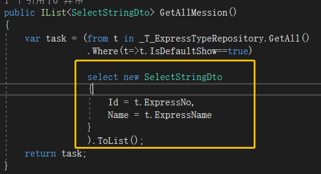

### 	Microsoft.AspNet.Identity;

```csharp
using Microsoft.AspNet.Identity;

private async Task<UserPermissionCacheItem> GetUserPermissionCacheItemAsync(long userId)
```

###	策略权限==》Bool判定


```csharp
//控制器or类的权限
[AttributeUsage(AttributeTargets.Class | AttributeTargets.Method, AllowMultiple = true)]
public class AbpAuthorizeAttribute : Attribute, IAbpAuthorizeAttribute
{
 public virtual async Task AuthorizeAsync(IEnumerable<IAbpAuthorizeAttribute> authorizeAttributes)
    {
       ......
        foreach (var authorizeAttribute in authorizeAttributes)
        {//【原始方案】遍历所有授权特性
        //通过 IPermissionChecker 来验证用户是否拥有这些特性所标注的权限
            await PermissionChecker.AuthorizeAsync
            (authorizeAttribute.RequireAllPermissions, authorizeAttribute.Permissions);
        } 
        //using代码块限定，决定对操作的执行
        using (CurrentUnitOfWork.DisableFilter(AbpDataFilters.MayHaveTenant, AbpDataFilters.MustHaveTenant))
           {
               var usersInfo = UserManager.Users;
           } 
    }

}
```


------

##### 微信数据包的泛型


------


### 分页GetAll()


### 	两种Mapper

#####	Plan.A	AutoMapper


#####	Plan.B		Dto赋值

> **移除重复内容**
> 概念：本文中的“移除重复内容”是指把一些很多地方都用到的逻辑提炼出来，然后提供给调用者统一调用。





##### Plan.C	匿名


###	仓储泛型

##### 	 泛型约束

怎么解决类型不安全的问题呢？那就是使用泛型约束。 
所谓的泛型约束，实际上就是约束的类型T。使T必须遵循一定的规则。比如T必须继承自某个类，或者T必须实现某个接口等等。那么怎么给泛型指定约束？其实也很简单，只需要where关键字，加上约束的条件。 
泛型约束总共有五种。

1. 基类约束

   基类约束时，基类不能是密封类，即不能是sealed类。

   sealed类表示该类不能被继承，在这里用作约束就无任何意义，因为sealed类没有子类。

2. 接口约束

3. 引用类型约束 class

   引用类型约束保证T一定是引用类型的。

4. 值类型约束  struct

   值类型约束保证T一定是值类型的。

5. 无参数构造函数约束  new()

   泛型约束也可以同时约束多个

   

| 约束          | s说明                                                        |
| ------------- | ------------------------------------------------------------ |
| T：结构       | 类型参数必须是值类型                                         |
| T：类         | 类型参数必须是引用类型；这一点也适用于任何类、接口、委托或数组类型。 |
| T：new()      | 类型参数必须具有无参数的公共构造函数。 当与其他约束一起使用时，new() 约束必须最后指定。 |
| T：<基类名>   | 类型参数必须是指定的基类或派生自指定的基类。                 |
| T：<接口名称> | 类型参数必须是指定的接口或实现指定的接口。 可以指定多个接口约束。 约束接口也可以是泛型的。 |

##### 泛型仓储-基类/接口


---


### 软删除

>  **分离职责**
> 概念：本文中的“分离职责”是指当一个类有许多职责时，将部分职责分离到独立的类中，这样也符合面向对象的五大特征之一的单一职责原则，同时也可以使代码的结构更加清晰，维护性更高。
>
> 总结：这个重构经常会用到，它和之前的“移动方法”有几分相似之处，让方法放在合适的类中，并且简化类的职责，同时这也是面向对象五大原则之一和设计模式中的重要思想。  


>  **提取方法对象**
> 概念：本文中的“提取方法对象”是指当你发现一个方法中存在过多的局部变量时，你可以通过使用“提取方法对象”重构来引入一些方法，每个方法完成任务的一个步骤，这样可以使得程序变得更具有可读性。
>
> 总结：本文的重构方法在有的时候还是比较有用，但这样会造成字段的增加，同时也会带来一些维护的不便，它和“提取方法”最大的区别就是一个通过方法返回需要的数据，另一个则是通过字段来存储方法的结果值，所以在很大程度上我们都会选择“提取方法”。  
>
> 


###### 软删除-EFCore在【修改操作】中实现机制。


```csharp
 protected virtual void ApplyAbpConceptsForModifiedEntity(EntityEntry entry, long? userId, EntityChangeReport changeReport)
        {
            SetModificationAuditProperties(entry.Entity, userId);
            if (entry.Entity is ISoftDelete && 
                entry.Entity.As<ISoftDelete>().IsDeleted)
            {
                SetDeletionAuditProperties(entry.Entity, userId);
                changeReport.ChangedEntities.Add(new EntityChangeEntry(entry.Entity, EntityChangeType.Deleted));
            }
            else
            {
                changeReport.ChangedEntities.Add(new EntityChangeEntry(entry.Entity, EntityChangeType.Updated));
            }
        }
```

###### 软删除-EFCore在【删除操作】中实现机制。


```csharp
        protected virtual void ApplyAbpConceptsForDeletedEntity(EntityEntry entry, long? userId, EntityChangeReport changeReport)
        {
            if (IsHardDeleteEntity(entry))
            {
                changeReport.ChangedEntities.Add(new EntityChangeEntry(entry.Entity, EntityChangeType.Deleted));
                return;
            }

            CancelDeletionForSoftDelete(entry);
            SetDeletionAuditProperties(entry.Entity, userId);
            changeReport.ChangedEntities.Add(new EntityChangeEntry(entry.Entity, EntityChangeType.Deleted));
        }
```

