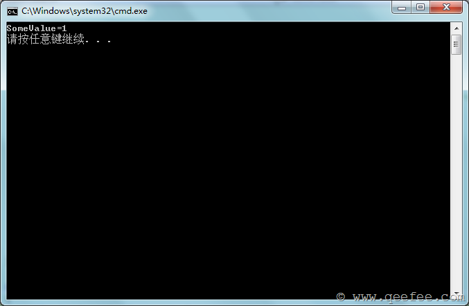
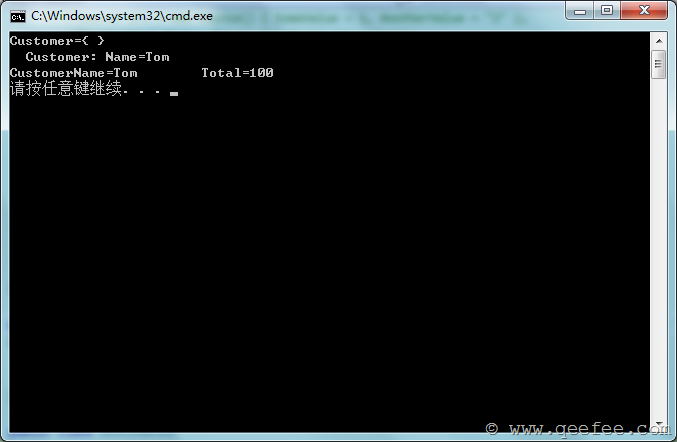
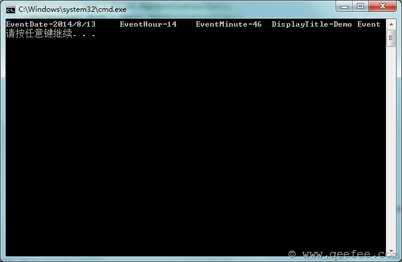

#                  [AutoMapper用法](https://www.cnblogs.com/youring2/p/automapper.html)             

AutoMapper是对象到对象的映射工具。在完成映射规则之后，AutoMapper可以将源对象转换为目标对象。

 

## 配置AutoMapper映射规则[#](https://www.cnblogs.com/youring2/p/automapper.html#96490652)

AutoMapper是基于约定的，因此在实用映射之前，我们需要先进行映射规则的配置。

```csharp
public class Source
{
    public int SomeValue { get; set; }
    public string AnotherValue { get; set; }
}

public class Destination
{
    public int SomeValue { get; set; }
}
```

在上面的代码中，我们定义了两个类，我们需要将Source类的对象映射到Destination类的对象上面。要完成这个操作，我们需要对AutoMapper进行如下配置：

```csharp
Mapper.CreateMap<Source, Destination>();
```

进行一下测试：

```
Source src = new Source() { SomeValue = 1, AnotherValue = "2" };
Destination dest = Mapper.Map<Destination>(src);

ObjectDumper.Write(dest);
```

我们可以在控制台看到dest对象的属性值：

[](https://images0.cnblogs.com/blog/44814/201408/181014249097751.png)

这样我们就完成了一个简单的AutoMapper映射。

## Profile的用法[#](https://www.cnblogs.com/youring2/p/automapper.html#4066753446)

Profile提供了一个命名的映射类，所有继承自Profile类的子类都是一个映射集合。

我们来看一下Profile的用法，这个例子中仍然使用上面的Source类和Destination类。

```
public class SourceProfile : Profile
{
    protected override void Configure()
    {
        CreateMap<Source, Destination>();
    }
}
```

我们可以再Profile中重写Configure方法，从而完成映射规则的配置。从Profile初始化Mapper规则：

```
Mapper.Initialize(x => x.AddProfile<SourceProfile>());
```

在一个Profile中，我们可以完成多个、更复杂的规则的约定：

```
public class Destination2
{
    public int SomeValue { get; set; }
    public string AnotherValue2 { get; set; }
}

public class SourceProfile : Profile
{
    protected override void Configure()
    {
        //Source->Destination
        CreateMap<Source, Destination>();

        //Source->Destination2
        CreateMap<Source, Destination2>().ForMember(d => d.AnotherValue2, opt =>
        {
            opt.MapFrom(s => s.AnotherValue);
        });
    }
}
```

 

## AutoMapper最佳实践[#](https://www.cnblogs.com/youring2/p/automapper.html#3420797228)

这段内容将讨论AutoMapper的规则写在什么地方的问题。

在上一段中，我们已经知道了如何使用AutoMapper进行简单的对象映射，但是，在实际的项目中，我们会有很多类进行映射（从Entity转换为Dto，或者从Entity转换为ViewModel等），这么多的映射如何组织将成为一个问题。

首先我们需要定义一个Configuration.cs的类，该类提供AutoMapper规则配置的入口，它只提供一个静态的方法，在程序第一次运行的时候调用该方法完成配置。

当有多个Profile的时候，我们可以这样添加：

```csharp
public class Configuration
{
    public static void Configure()
    {
        Mapper.Initialize(cfg =>
        {
            cfg.AddProfile<Profiles.SourceProfile>();
            cfg.AddProfile<Profiles.OrderProfile>();
            cfg.AddProfile<Profiles.CalendarEventProfile>();
        });
    }
}
```

在程序运行的时候，只需要调用Configure方法即可。

了解了这些实现以后，我们可以再项目中添加AutoMapper文件夹，文件夹结构如下：

[](https://images0.cnblogs.com/blog/44814/201408/181014254878095.png)

Configuration为我们的静态配置入口类；Profiles文件夹为我们所有Profile类的文件夹。如果是MVC，我们需要在Global中调用：

```csharp
AutoMapper.Configuration.Configure();
```

## 扁平化映射【Get】（Flattening）[#](https://www.cnblogs.com/youring2/p/automapper.html#1636994142)

默认情况下，我们的Source类和Destination类是根据属性名称进行匹配映射的。除此之外，默认的映射规则还有下面两种情况，我们称之为扁平化映射，即当Source类中不包含Destination类中的属性的时候，AutoMapper会将Destination类中的属性进行分割，**或匹配“Get”开头的方法**，例如：

Order类：

```csharp
public class Order
{
    public Customer Customer { get; set; }

    public decimal GetTotal()
    {
        return 100M;
    }
}
```

Order类中包含了一个customer对象和一个GetTotal方法，为了方便演示，我直接将GetTotal方法返回100；

Customer类的定义如下：

```
public class Customer
{
    public string Name { get; set; }
}
```

OrderDto类的定义如下：

```
public class OrderDto
{
    public string CustomerName { get; set; }
    public string Total { get; set; }
}
```

我们在进行映射的时候，不需要进行特殊的配置，既可以完成从Order到OrderDto的映射。

```
public class OrderProfile : Profile
{
    protected override void Configure()
    {
        CreateMap<Entity.Order, Dto.OrderDto>();
    }
}
```

测试代码：

```csharp
Entity.Customer customer = new Entity.Customer() { Name = "Tom" };
Entity.Order order = new Entity.Order() { Customer = customer };
Dto.OrderDto orderDto = Mapper.Map<Dto.OrderDto>(order);
ObjectDumper.Write(order, 2);
ObjectDumper.Write(orderDto);
```

测试结果：

[](https://images0.cnblogs.com/blog/44814/201408/181014259876181.png)

## 指定映射字段【ForMember】（Projection）[#](https://www.cnblogs.com/youring2/p/automapper.html#370843209)

在实际的业务环境中，我们的Source类和Destination类的字段不可能一对一的匹配，这个时候我们就需要来指定他们的实际映射关系，例如：

```csharp
public class CalendarEvent
{
    public DateTime Date { get; set; }
    public string Title { get; set; }
}

public class CalendarEventForm
{
    public DateTime EventDate { get; set; }
    public int EventHour { get; set; }
    public int EventMinute { get; set; }
    public string DisplayTitle { get; set; }
}
```

在这两个类中，CalendarEvent的Date将被拆分为CalendarEventForm的日期、时、分三个字段，Title也将对应DisplayTitle字段，那么相应的Profile定义如下：

```csharp
public class CalendarEventProfile : Profile
{
    protected override void Configure()
    {
        CreateMap<Entity.CalendarEvent, Entity.CalendarEventForm>()
            .ForMember(dest => dest.EventDate, opt => opt.MapFrom(src => src.Date.Date))
            .ForMember(dest => dest.EventHour, opt => opt.MapFrom(src => src.Date.Hour))
            .ForMember(dest => dest.EventMinute, opt => opt.MapFrom(src => src.Date.Minute))
            .ForMember(dest => dest.DisplayTitle, opt => opt.MapFrom(src => src.Title));
    }
}
```

测试代码：

```csharp
Entity.CalendarEvent calendarEvent = new Entity.CalendarEvent()
{
    Date = DateTime.Now,
    Title = "Demo Event"
};
Entity.CalendarEventForm calendarEventForm = Mapper.Map<Entity.CalendarEventForm>(calendarEvent);
ObjectDumper.Write(calendarEventForm);
```

测试结果：

[](https://images0.cnblogs.com/blog/44814/201408/181014265964768.png)

## 验证配置项（Configuration Validation）[#](https://www.cnblogs.com/youring2/p/automapper.html#3577401060)

AutoMapper提供了一种验证机制，用来判断Destination类中的所有属性是否都被映射，如果存在未被映射的属性，则抛出异常。

验证的用法：

```csharp
Mapper.AssertConfigurationIsValid();
```

例如：

```csharp
public class Source
{
    public int SomeValue { get; set; }
    public string AnotherValue { get; set; }
}
```

Destination代码：

```csharp
public class Destination
{
    public int SomeValuefff { get; set; }
}
```

测试：

```csharp
Mapper.CreateMap<Entity.Source, Entity.Destination>();
Mapper.AssertConfigurationIsValid();
```

运行程序将会出现AutoMapperConfigurationException异常：

[](https://images0.cnblogs.com/blog/44814/201408/181014273314925.png)

这是因为SomeValuefff在Source类中没有对应的字段造成的。

解决这种异常的方法有：

指定映射字段，例如：

```csharp
Mapper.CreateMap<Entity.Source, Entity.Destination>()
    .ForMember(dest => dest.SomeValuefff, opt =>
    {
        opt.MapFrom(src => src.SomeValue);
    });
```

或者使用Ignore方法：

```csharp
Mapper.CreateMap<Entity.Source, Entity.Destination>()
    .ForMember(dest => dest.SomeValuefff, opt =>
    {
        opt.Ignore();
    });
```

或者使用自定义解析器，自定义解析器在下面讲到。

## 自定义解析器（Custom value resolvers）[#](https://www.cnblogs.com/youring2/p/automapper.html#4070589263)

AutoMapper允许我们自定义解析器来完成Source到Destination的值的转换。例如：

```csharp
public class Source
{
    public int Value1 { get; set; }
    public int Value2 { get; set; }
}

public class Destination
{
    public int Total { get; set; }
}
```

Total属性在Source中不存在，如果现在创建映射规则，在映射的时候必然会抛出异常。这个时候我们就需要使用自定义解析器来完成映射。

自定义解析器需要实现 IValueResolver 接口，接口的定义如下：

```csharp
public interface IValueResolver
{
    ResolutionResult Resolve(ResolutionResult source);
}
```

我们来自定义一个Resolver：

```csharp
public class CustomResolver : ValueResolver<Source, int>
{
    protected override int ResolveCore(Source source)
    {
        return source.Value1 + source.Value2;
    }
}
```

然后在映射规则中使用这个解析器：

```
public class SourceProfile : Profile
{
    protected override void Configure()
    {
        //Source->Destination
        CreateMap<Source, Destination>()
            .ForMember(dest => dest.Total, opt =>
            {
                opt.ResolveUsing<CustomResolver>();
            });
    }
}
```

测试代码：

```
Source src = new Source()
{
    Value1 = 1,
    Value2 = 2
};
Destination dest = Mapper.Map<Destination>(src);
ObjectDumper.Write(dest);
```

测试结果：

[](https://images0.cnblogs.com/blog/44814/201408/181014277682226.png)

在使用自定义Resolver中，我们还可以指定Resolver的构造函数，例如：

```
//Source->Destination
CreateMap<Source, Destination>()
    .ForMember(dest => dest.Total, opt =>
    {
        opt.ResolveUsing<CustomResolver>()
            .ConstructedBy(() => 
```

new CustomResolver

```
());
    });
```

## 自定义类型转换器（Custom type converters）[#](https://www.cnblogs.com/youring2/p/automapper.html#1661356045)

AutoMapper通过ConvertUsing来使用自定义类型转换器。ConvertUsing有三种用法：

```csharp
void ConvertUsing(Func<TSource, TDestination> mappingFunction);
void ConvertUsing(ITypeConverter<TSource, TDestination> converter);
void ConvertUsing<TTypeConverter>() where TTypeConverter : ITypeConverter<TSource, TDestination>;
```

当我们有如下的Source类和Destination类：

```csharp
public class Source
{
    public string Value1 { get; set; }
}

public class Destination
{
    public int Value1 { get; set; }
}
```

我们可以使用如下配置：

```csharp
public class SourceProfile : Profile
{
    protected override void Configure()
    {
        //string->int
        CreateMap<string, int>()
            .ConvertUsing(Convert.ToInt32);
        //Source->Destination
        CreateMap<Source, Destination>();
    }
}
```

在上面的配置中，我们首先创建了从string到int的类型转换，这里使用了系统自带的Convert.ToInt32转换方法。

除了这种方法之外，我们还可以自定义类型转换器：

```
public class CustomConverter : ITypeConverter<Source, Destination>
{
    public Destination Convert(ResolutionContext context)
    {
        Source src = context.SourceValue as Source;
        Destination dest = new Destination();
        dest.Value1 = System.Convert.ToInt32(src.Value1);

        return dest;
    }
}
```

通过这个转换器，我们可以绕过string到int的转换，直接将Source类的对象转换为Destination类的对象。

对应的配置如下：

```
public class SourceProfile : Profile
{
    protected override void Configure()
    {
        //Source->Destination
        CreateMap<Source, Destination>()
            .ConvertUsing<CustomConverter>();
    }
}
```

或者，我们也可以使用下面的配置：

```
public class SourceProfile : Profile
{
    protected override void Configure()
    {
        //Source->Destination
        CustomConverter converter = new CustomConverter();
        CreateMap<Source, Destination>()
            .ConvertUsing(converter);
    }
}
```

## 空值替换（Null substitution）[#](https://www.cnblogs.com/youring2/p/automapper.html#2775902680)

空值替换允许我们将Source对象中的空值在转换为Destination的值的时候，使用指定的值来替换空值。

```
public class Source
{
    public string Value { get; set; }
}

public class Destination
{
    public string Value { get; set; }
}
```

配置代码：

```
public class SourceProfile : Profile
{
    protected override void Configure()
    {
        //Source->Destination
        CreateMap<Source, Destination>()
            .ForMember(dest => dest.Value, opt =>
            {
                opt.NullSubstitute("原始值为NULL");
            });
    }
}
```

测试代码：

```
Source src = new Source();
Destination dest = Mapper.Map<Destination>(src);
ObjectDumper.Write(dest);
```

测试结果：

[](https://images0.cnblogs.com/blog/44814/201408/181014283785111.png)

## 条件映射（Conditional mapping）[#](https://www.cnblogs.com/youring2/p/automapper.html#2258308799)

条件映射只当Source类中的属性值满足一定条件的时候才进行映射。例如：

```
public class Foo
{
    public int baz;
}

public class Bar
{
    public uint baz;
}
```

对应的配置代码如下：

```
Mapper.CreateMap<Foo, Bar>()
    .ForMember(dest => dest.baz, opt =>
    {
        opt.Condition(src => (src.baz >= 0));
    });
```

 

## 总结[#](https://www.cnblogs.com/youring2/p/automapper.html#1551589702)

AutoMapper的一些常用方法都已经整理出来，代码也都在文章中，不再提供下载。

 

如果认为此文对您有帮助，别忘了支持一下哦！

**声明：**本博客原创文字只代表本人工作中在某一时间内总结的观点或结论，与本人所在单位没有直接利益关系。转载时请在文章页面明显位置给出原文链接。

​    分类:             [ASP.NET](https://www.cnblogs.com/youring2/category/165538.html)

​    标签:             [AutoMapper](https://www.cnblogs.com/youring2/tag/AutoMapper/)