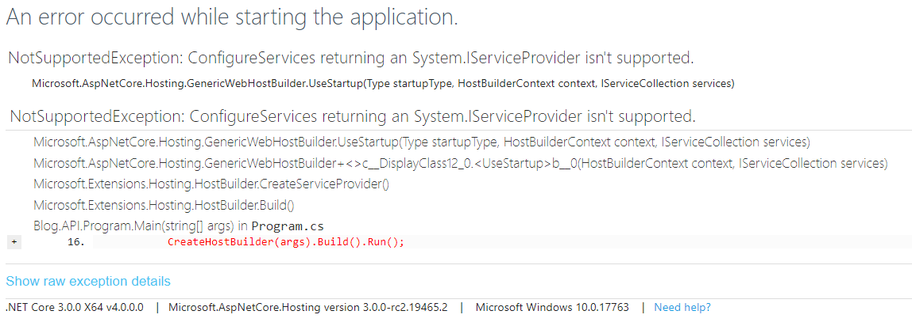

#                   [NET Core 3.0 A utoFac替换内置DI的新姿势](https://www.cnblogs.com/ZaraNet/p/11591915.html)

　　.NET Core 3.0 和 以往版本不同，替换AutoFac服务的方式有了一定的变化，在尝试着升级项目的时候出现了一些问题。

　　原来在NET Core 2.1时候，AutoFac返回一个 IServiceProvider 参数注入到ConfigureServices .NET Core 服务中，基本大痣是这样做的。

　　首先我们需要一个重写 Autofac.Module 的方法，这将用于将我们 Register [数据访问层] 以及  Services [逻辑层] 的注册。

[](javascript:void(0);)

```
public class AutofacModuleRegister : Autofac.Module
    {
        //重写Autofac管道Load方法，在这里注册注入
        protected override void Load(ContainerBuilder builder)
        {
            //必须是Service结束的
            builder.RegisterAssemblyTypes(GetAssemblyByName("BlogService")).Where(a => a.Name.EndsWith("Service")).AsImplementedInterfaces();
            builder.RegisterAssemblyTypes(GetAssemblyByName("BlogRepository")).Where(a => a.Name.EndsWith("Repository")).AsImplementedInterfaces();
            //单一注册
            //  builder.RegisterType<PersonService>().Named<IPersonService>(typeof(PersonService).Name);
        }
        /// <summary>
        /// 根据程序集名称获取程序集
        /// </summary>
        /// <param name="AssemblyName">程序集名称</param>
        public static Assembly GetAssemblyByName(String AssemblyName)
        {
            return Assembly.Load(AssemblyName);
        }
    }
```

[](javascript:void(0);)

 　随后，将.NET Core的ConfigureServices方法的返回值改成IServiceProvider，这将用于注入你的服务。

[](javascript:void(0);)

```
 public IServiceProvider ConfigureServices(IServiceCollection services)
        {
            services.AddMvc().SetCompatibilityVersion(CompatibilityVersion.Version_2_1);
            return Blog.AutoFacModule.Solucation.AutoFac.Provider.RegisterAutofac.ForRegisterAutofac(services);
        }
```

[](javascript:void(0);)

　　上面的代码中我们调用了 ForRegisterAutoFac 我们自定义的方法，这将我们定义的策略和AutoFac 一起替换内置DI.

[](javascript:void(0);)

```
public static class RegisterAutofac
    {
        public static IServiceProvider ForRegisterAutofac(IServiceCollection services)
        {
            var builder = new ContainerBuilder();
            builder.Populate(services);
            builder.RegisterModule<Blog.AutoFacModule.Solucation.AutoFac.Register.AutofacModuleRegister>();
            var container = builder.Build(); 
            return new AutofacServiceProvider(container);
        }
    }
```

[](javascript:void(0);)

 　在API层，我们依赖注入Service，这样我们.NET Core2.1基本的AutoFac就实现了。

[](javascript:void(0);)

```
[Route("api/[controller]")]
    [ApiController]
    public class ValuesController : ControllerBase
    {
        private IPersonService _personService;
        public ValuesController(IPersonService personService)
        {
            _personService = personService;
        }
        // GET api/values
        [HttpGet]
        public ActionResult<string> Get()
        {
            return Newtonsoft.Json.JsonConvert.SerializeObject(_personService.people());
        }}
```

[](javascript:void(0);)

　　就现在我们说一说.NET Core3.0 和 以往版本的区别。我将所有项目以及依赖项全部改成3.0版本，就现在启动，你会发现意想不到的事情。

 

 

啥?你说啥？弄萨累? 咋不管用了嘞？


 

　　经过看了官方文档，才知道..NET Core 3.0 引入了具有强类型容器配置的功能。它提供了 ConfigureContainer 方法，您可以在其中使用Autofac来注册事物，而不必通过 ServiceCollection 来注册事物。so....好吧！在.NET Core3.0 将如何配置。

　　首先我们需要在 Program.cs 中修改服务工厂，内置是 ServiceProviderFactory 的，我们将要指定为： AutofacServiceProviderFactory 。

[](javascript:void(0);)

```
 public static IHostBuilder CreateHostBuilder(string[] args) =>
            Host.CreateDefaultBuilder(args)
                .ConfigureWebHostDefaults(webBuilder =>
                {
                    webBuilder.UseStartup<Startup>();
                })
       .UseServiceProviderFactory(new AutofacServiceProviderFactory());
```

[](javascript:void(0);)

　　现在需要在 Startup.cs 中添加方法 ConfigureContainer ，并添加以下代码。

[](javascript:void(0);)

```
public void ConfigureContainer(ContainerBuilder builder)
        {
            //添加依赖注入关系
            builder.RegisterModule(new Blog.AutoFacModule.Solucation.AutoFac.Register.AutofacModuleRegister());
            var controllerBaseType = typeof(ControllerBase);
            //在控制器中使用依赖注入
            builder.RegisterAssemblyTypes(typeof(Program).Assembly)
                .Where(t => controllerBaseType.IsAssignableFrom(t) && t != controllerBaseType)
                .PropertiesAutowired();
        }
```

[](javascript:void(0);)

然后大功告成，启动再也没问题了~。


>  Github地址：https://github.com/zaranetCore/Blog.DDD.Solucation

​    分类:             [.NET-ASP.NET Core](https://www.cnblogs.com/ZaraNet/category/1272000.html),             [DependencyInjection](https://www.cnblogs.com/ZaraNet/category/1558258.html)