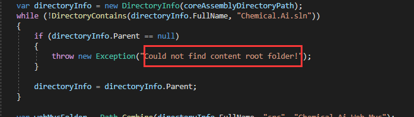
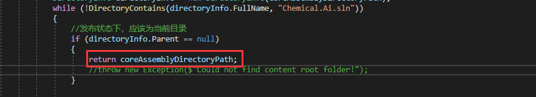

#  			[ABP在MultipleDbContext也就是多库的场景下发布后异常“Could not find content root folder”问题处理](https://www.cnblogs.com/albertay/p/11008348.html) 		


**ABP多库支持**

ABP支持多库的方案在abp的案例中[aspnetboilerplate-samples](https://github.com/aspnetboilerplate/aspnetboilerplate-samples)中给了现成的demo，其中[MultipleDbContextDemo](https://github.com/aspnetboilerplate/aspnetboilerplate-samples/tree/master/MultipleDbContextDemo)是EF的相关针对dotnet的版本，[MultipleDbContextEfCoreDemo](https://github.com/aspnetboilerplate/aspnetboilerplate-samples/tree/master/MultipleDbContextEfCoreDemo)则是dotnet core版本的多库方案

按照改demo的思路，添加我们的abp的多库支持，F5直接允许，一切ok，欣慰，没有报错。

按照业务要求，完成代码一切美美哒。

**ABP多库发布后异常**

发布正式环境，请求访问第二个数据库的相关接口，抛出“应用程序内部错误的异常”

查看唯一App_Data目录下的日志文件 发现抛出异常，“Could not find content root folder”

然后就是各种bing，百度，google一通搜，没有找到结果。

**问题查找调试**

本地发布了一个和正式环境一样的环境，手动去调试一下，想追到是什么地方抛出来的，找到我们应用的进程（dotnet core下不是W3W了，而是你应用的dll名称）。附加到进程，发现我擦怎么进不了断点，换个接口试一下，发现依旧进不来断点。

测试发现附加的时候比之前多了一个选择，有个coreCLR的选择如下图，不知道这个玩意是什么鬼，先去掉吧，点击选择，选中“自动选择要调试的代码类型”。然后再来附加，进断点了，为啥呢，没有深究！


接下来继续排除我们的多库报错问题

跟代码发现异常是从Core下面的WebContentDirectoryFinder.cs抛出来的，如下图



找到问题源头了，我们就看怎么怎么解决，看一下当前代码干了什么事情。

[](javascript:void(0);)

```
public static string CalculateContentRootFolder()
        {
            var coreAssemblyDirectoryPath = Path.GetDirectoryName(typeof(AiCoreModule).GetAssembly().Location);
            if (coreAssemblyDirectoryPath == null)
            {
                throw new Exception("Could not find location of Chemical.Ai.Core assembly!");
            }

            DirectoryInfo directoryInfo = new DirectoryInfo(coreAssemblyDirectoryPath);
            while (!DirectoryContains(directoryInfo.FullName, "Chemical.Ai.sln"))
            {
                //发布状态下，应该为当前目录
                if (directoryInfo.Parent == null)
                {
                    return coreAssemblyDirectoryPath;
                    //throw new Exception($"Could not find content root folder!");
                }               

                directoryInfo = directoryInfo.Parent;
            }

            var webMvcFolder = Path.Combine(directoryInfo.FullName, "src", "Chemical.Ai.Web.Mvc");
            if (Directory.Exists(webMvcFolder))
            {
                return webMvcFolder;
            }

            var webHostFolder = Path.Combine(directoryInfo.FullName, "src", "Chemical.Ai.Web.Host");
            if (Directory.Exists(webHostFolder))
            {
                return webHostFolder;
            }

            throw new Exception("Could not find root folder of the web project!");
        }

        private static bool DirectoryContains(string directory, string fileName)
        {
            return Directory.GetFiles(directory).Any(filePath => string.Equals(Path.GetFileName(filePath), fileName));
        }
```

[](javascript:void(0);)

**代码翻译**：当前代码就是从dll的所在目录一层层找，直到找到解决方案文件所在的目录，然后将解决方案所在的目录的上层目录（A）返回给下面的逻辑使用。而下面的逻辑就是从上层目录A开始往下找到src下面的mvc或者host目录，

也就是我们的应用启动目录，返回appsettings.json所在的目录。

**异常原因**：在F5的调试状态下，appsettings.json是位于mvc或host下面的。但是当我们发布后，appsettings.json就是当前启动目录了，dll和appsettings.json是并列的级别

，我们在发布状态下，根本没有解决方案，所以根据解决方案找appsettings.json的方案行不通，也就会抛出我们看到的异常。

**解决方案**：发布状态下，无需如此复杂的逻辑，直接返回程序运行目录就可以了，如下图



 

 修改完成发布，运行，异常没有了，程序完美运行！