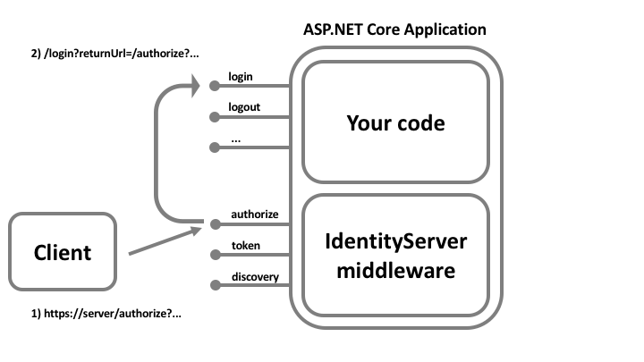

### 配置服务

通过以下方式调用将IdentityServer服务添加到DI系统：

```
public void ConfigureServices(IServiceCollection services)
{
    var builder = services.AddIdentityServer();
}
```

这将返回一个生成器对象，而这个对象又有一些方便的方法来连接其他的服务。

# 密钥

- `AddSigningCredential`
   添加一个签名密钥服务，该服务将指定的密钥提供给各种令牌创建/验证服务。 您可以传入`X509Certificate2`，`SigningCredential`或对证书存储区中证书的引用。
- `AddDeveloperSigningCredential`
   在启动时创建临时密钥。 这是仅用于开发场景，当您没有证书使用。 生成的密钥将被保存到文件系统，以便在服务器重新启动之间保持稳定（可以通过传递false来禁用）。 这解决了在开发期间client / api元数据缓存不同步的问题。
- `AddValidationKey`
   添加验证令牌的密钥。 它们将被内部令牌验证器使用，并将显示在发现文档中。 您可以传入`X509Certificate2`，`SigningCredential`或对证书存储区中证书的引用。 这对于关键的转换场景很有用。


# 内存存储配置

也可能适用于生产方案，或者如果必须更改值，则需要重新启动应用程序并不方便。

- `AddInMemoryClients`
   添加基于`IClientStore`和`ICorsPolicyService`的内存集合注册实现，以注册客户端配置对象。
- `AddInMemoryIdentityResources`
   添加基于`IResourceStore`的`IdentityResource`的内存集合注册实现，以注册身份验证资源。
- `AddInMemoryApiResources`
   添加基于`IResourceStore`的`ApiResource`的内存集合注册实现，以注册API资源。


# 额外服务

- `AddExtensionGrantValidator`
   添加用于扩展授权的`IExtensionGrantValidator`实现。
- `AddSecretParser`
   添加用于解析客户端或API资源凭证的`ISecretParser`实现。
- `AddSecretValidator`
   添加`ISecretValidator`实现，以针对凭证存储验证客户端或API资源凭证。
- `AddResourceOwnerValidator 添加`IResourceOwnerPasswordValidator`实现，用于验证资源所有者密码凭据授权类型的用户凭证。
- `AddProfileService 添加`IProfileService`以实现连接到您的自定义用户配置文件存储。`DefaultProfileService`类提供了默认实现，它依靠身份验证cookie作为唯一的令牌发放源。
- `AddAuthorizeInteractionResponseGenerator`
   添加`IAuthorizeInteractionResponseGenerator`实现来在授权端点定制逻辑，以便显示用户错误，登录，同意或任何其他自定义页面的UI。 AuthorizeInteractionResponseGenerator类提供了一个默认的实现，因此如果需要增加现有的行为，可以考虑从这个现有的类派生。
- `AddCustomAuthorizeRequestValidator`
   添加`ICustomAuthorizeRequestValidator`实现，以在授权端点定制请求参数验证。
- `AddCustomTokenRequestValidator`
   添加`ICustomTokenRequestValidator`实现来定制令牌端点处的请求参数验证。
- `AddRedirectUriValidator`
   添加`IRedirectUriValidator`实现来自定义重定向URI验证。
- `AddAppAuthRedirectUriValidator`
   添加一个“AppAuth”（OAuth 2.0 for Native Apps）兼容的重定向URI验证器（进行严格的验证，但也允许随机端口为http://127.0.0.1）。
- `AddJwtBearerClientAuthentication`
   使用JWT对客户机认证的支持。


# 缓存

客户端和资源配置数据经常被IdentityServer使用。 如果从数据库或其他外部存储装载此数据，那么频繁地重新加载相同的数据代价可能是昂贵的。

- `AddInMemoryCaching`
   要使用下面描述的任何缓存，必须在DI中注册ICache的实现。 此API注册基于ASP.NET Core的ICache 的MemoryCache默认内存缓存实现。
- `AddClientStoreCache`
   注册一个`IClientStore`装饰器实现，它将维护客户端配置对象的内存缓存。 缓存持续时间可以在`IdentityServerOptions`上的缓存配置选项上配置。
- `AddResourceStoreCache`
   注册一个`IResourceStore`装饰器实现，它将维护`IdentityResource`和`ApiResource`配置对象的内存缓存。 缓存持续时间可以在`IdentityServerOptions`上的缓存配置选项上配置。
- `AddCorsPolicyCache`
   注册一个`ICorsPolicyService`装饰器实现，它将维护一个CORS策略服务评估结果的内存缓存。 缓存持续时间可以在IdentityServerOptions上的缓存配置选项上配置。

可以进一步定制缓存：
 默认缓存依赖于ICache实现。 如果您希望自定义特定配置对象的缓存行为，则可以在依赖注入系统中替换此实现。

`ICache<T>`的默认实现依赖于.NET提供的`IMemoryCache`接口（和`MemoryCache`实现）。 如果您希望自定义内存中的缓存行为，则可以替换依赖注入系统中的`IMemoryCache`实现。

# 配置中间件

您需要通过以下方式调用将IdentityServer添加到管道中：

```
public void Configure(IApplicationBuilder app)
{
    app.UseIdentityServer();
}
```

> `UseIdentityServer`包含对`UseAuthentication`的调用，所以没有必要同时调用这两个。

中间件没有额外的配置。

请注意，添加顺序在管道配置中很重要。 例如，您需要在添加MVC中间件之前添加IdentitySever。


--[定义资源](https://www.cnblogs.com/stulzq/p/8144185.html)

`IResourceStore`的实现处理这些低级细节。 本文使用的是in-memory的实现。

# 定义身份资源

身份资源也是数据，如用户ID，姓名或用户的电子邮件地址。  身份资源具有唯一的名称，您可以为其分配任意身份信息单元（比如姓名、性别、身份证号和有效期等都是身份证的身份信息单元）类型。  这些身份信息单元将被包含在用户的身份标识（Id Token）中。 客户端将使用**scope**参数来请求访问身份资源。

OpenID Connect规范指定了一对标准的身份资源。 最低要求是，您提供支持为您的用户颁发一个唯一的ID - 也称为**subject id（sid）**。 这是通过暴露称为`openid`的标准身份资源完成的：

```
public static IEnumerable<IdentityResource> GetIdentityResources()
{
    return new List<IdentityResource>
    {
        new IdentityResources.OpenId()
    };
}
```

`IdentityResources`类支持定义规范中的所有作用域(scope)（openid，email，profile，电话和地址）。 如果您想全部支持，可以将它们添加到支持的身份资源列表中：

```
public static IEnumerable<IdentityResource> GetIdentityResources()
{
    return new List<IdentityResource>
    {
        new IdentityResources.OpenId(),
        new IdentityResources.Email(),
        new IdentityResources.Profile(),
        new IdentityResources.Phone(),
        new IdentityResources.Address()
    };
}
```

# 定义自定义身份资源

您还可以定义自定义身份资源。 创建一个新的` **IdentityResource**类，为其指定一个名称和一个可选的显示名称和描述，并在请求此资源时定义哪个用户身份单元应该包含在身份令牌（**Id Token**）中：

```
public static IEnumerable<IdentityResource> GetIdentityResources()
{
    var customProfile = new IdentityResource(
        name: "custom.profile",
        displayName: "Custom profile",
        claimTypes: new[] { "name", "email", "status" });

    return new List<IdentityResource>
    {
        new IdentityResources.OpenId(),
        new IdentityResources.Profile(),
        customProfile
    };
}
```

# 定义API资源

为了允许客户请求API的访问令牌，您需要定义API资源，例如：

要访问API的**令牌**，还需要为其注册**作用域（Scope）**。 这次作用域类型是Resource类型的：

```csharp
public static IEnumerable<ApiResource> GetApis()
{
    return new[]
    {
        // simple API with a single scope (in this case the scope name is the same as the api name)
        new ApiResource("api1", "Some API 1"),

        // expanded version if more control is needed
        new ApiResource
        {
            Name = "api2",

            // secret for using introspection endpoint
            ApiSecrets =
            {
                new Secret("secret".Sha256())
            },

            // include the following using claims in access token (in addition to subject id)
            UserClaims = { JwtClaimTypes.Name, JwtClaimTypes.Email },

            // this API defines two scopes
            Scopes =
            {
                new Scope()
                {
                    Name = "api2.full_access",
                    DisplayName = "Full access to API 2",
                },
                new Scope
                {
                    Name = "api2.read_only",
                    DisplayName = "Read only access to API 2"
                }
            }
        }
    };
}
```

> 装载用户身份单元资源由**IProfileService**实现来完成。


# [定义客户端](https://www.cnblogs.com/stulzq/p/8144247.html) 		


客户端指可以从你的 identityserver 请求令牌的应用程序。

细节可能有所不同，但是客户端通常有以下设置

- 一个唯一的客户端ID
- 一个密钥（非必须）
- 允许与令牌服务的交互（称为授权类型）
- 身份或访问令牌被发送到的url（称为重定向URI）
- 允许客户端访问的Scope列表（API资源）

> 在运行时，客户端通过`IClientStore`的实现来检索。 这允许从配置文件或数据库的任意数据源加载它们。 对于本文档，我们将使用客户端存储的内存存储版本。 您可以通过`AddInMemoryClients`扩展方法在`ConfigureServices`中配置内存存储。

## 一.定义Server到Server的客户端

在这种情况下，没有交互式用户 - 服务（也称为客户端）想要与API（aka范围）进行通信：

```csharp
public class Clients
{
    public static IEnumerable<Client> Get()
    {
        return new List<Client>
        {
            new Client
            {
                ClientId = "service.client",
                ClientSecrets = { new Secret("secret".Sha256()) },

                AllowedGrantTypes = GrantTypes.ClientCredentials,
                AllowedScopes = { "api1", "api2.read_only" }
            }
        };
    }
}
```

## 二.定义 JavaScript客户端（例如SPA）进行用户认证和授权访问和API

这个客户端使用implicit flow来从JavaScript请求身份和访问令牌：

```csharp
var jsClient = new Client
{
    ClientId = "js",
    ClientName = "JavaScript Client",
    ClientUri = "http://identityserver.io",

    AllowedGrantTypes = GrantTypes.Implicit,
    AllowAccessTokensViaBrowser = true,

    RedirectUris =           { "http://localhost:7017/index.html" },
    PostLogoutRedirectUris = { "http://localhost:7017/index.html" },
    AllowedCorsOrigins =     { "http://localhost:7017" },

    AllowedScopes =
    {
        IdentityServerConstants.StandardScopes.OpenId,
        IdentityServerConstants.StandardScopes.Profile,
        IdentityServerConstants.StandardScopes.Email,

        "api1", "api2.read_only"
    }
};
```

## 三.定义服务器端Web应用程序（例如MVC）以进行使用验证和授权的API访问

交互式服务器端（或本地桌面/移动）应用程序使用混合流程（hybrid flow）。 这个流程为您提供了最好的安全性，因为访问令牌仅通过反向通道传输（并允许您访问刷新令牌）：

```csharp
var mvcClient = new Client
{
    ClientId = "mvc",
    ClientName = "MVC Client",
    ClientUri = "http://identityserver.io",

    AllowedGrantTypes = GrantTypes.Hybrid,
    AllowOfflineAccess = true,
    ClientSecrets = { new Secret("secret".Sha256()) },

    RedirectUris =           { "http://localhost:21402/signin-oidc" },
    PostLogoutRedirectUris = { "http://localhost:21402/" },
    FrontChannelLogoutUri =  "http://localhost:21402/signout-oidc",

    AllowedScopes =
    {
        IdentityServerConstants.StandardScopes.OpenId,
        IdentityServerConstants.StandardScopes.Profile,
        IdentityServerConstants.StandardScopes.Email,

        "api1", "api2.read_only"
    },
};
```


# [登录](https://www.cnblogs.com/stulzq/p/8144344.html)


用户必须进行登录，才能够让 IdentityServer 发出 Token

## 一.Cookie认证

使用 ASP.NET Core 的 Cookie 认证（[传送门](https://docs.microsoft.com/en-us/aspnet/core/security/authentication/cookie?view=aspnetcore-2.1)）

IdentityServer 注册了两个cookie处理程序（一个用于身份验证会话，另一个用于临时的外部cookie）。 它们默认使用，如果你想手动引用它们，您可以从`IdentityServerConstants`类（`DefaultCookieAuthenticationScheme`和`ExternalCookieAuthenticationScheme`）获取它们的名称。

IdentityServer 只公开这些cookies的基本设置（过期和滑动），如果你需要更多的控制，你可以注册你自己的cookie处理程序。 当使用了 ASP.NET Core 的`AddAuthentication`方法时，IdentityServer 会使用与`AddAuthentication`添加的`AuthenticationOptions`上的`DefaultAuthenticateScheme`相匹配的 cookie 处理程序。

## 二.重写cookie处理程序配置

如果你想使用你自己的cookie身份验证处理程序，那么你必须自己配置它。 **在**DI中注册身份服务器**（使用`AddIdentityServer`）后**，必须在`ConfigureServices`中完成此操作。 例如：

```
services.AddIdentityServer()
    .AddInMemoryClients(Clients.Get())
    .AddInMemoryIdentityResources(Resources.GetIdentityResources())
    .AddInMemoryApiResources(Resources.GetApiResources())
    .AddDeveloperSigningCredential()
    .AddTestUsers(TestUsers.Users);

services.AddAuthentication("MyCookie")
    .AddCookie("MyCookie", options =>
    {
        options.ExpireTimeSpan = ...;
    });
```

> IdentityServer 内部使用自定义方案（通过常量`IdentityServerConstants.DefaultCookieAuthenticationScheme`）调用`AddAuthentication`和`AddCookie`，因此要覆盖它们，必须在`AddIdentityServer`之后进行相同的调用。

## 三.登录用户界面和身份管理系统

IdentityServer 本身不提供任何用户界面或用户数据库。 这些都需要你自己实现或者使用其他实现。

如果您需要基本用户界面（登录，注销，同意和管理授权）的快速入门，则可以使用IdentityServer提供的的[quickstart UI](https://github.com/IdentityServer/IdentityServer4.Quickstart.UI)。

quickstart UI根据内存数据库对用户进行认证。 你想取代这些那么请使用你的真实用户存储。 IdentityServer 有配合 ASP.NET Identity 的示例。

## 四.登录工作流程

当 IdentityServer 在授权终结点（connect/token）收到请求，且用户没有通过认证时，用户将被重定向到配置的登录页面。 您必须通过设置`UserInteraction`（默认为/ account / login）来通知IdentityServer您的登录页面的路径。 同时将会传递一个returnUrl参数，通知你的登录页面，一旦登录完成，用户应该被重定向到哪里。



> 注意通过returnUrl参数的开放重定向攻击。 你应该验证这个returnUrl指的是已知的位置。 请参阅API的交互服务来验证returnUrl参数（https://identityserver4.readthedocs.io/en/release/reference/interactionservice.html#refinteractionservice）。

## 五.登录上下文

在你的登录页面上，您可能需要有关请求上下文的信息，以便自定义登录体验（如客户端，提示参数，IdP提示或其他内容）。 这可以通过交互服务上的`GetAuthorizationContextAsync` API获得(https://identityserver4.readthedocs.io/en/release/reference/interactionservice.html#refinteractionservice)。

## 六.发出一个cookie和身份信息单元（Claim）

在 ASP.NET Core 的`HttpContext`上有与身份验证相关的扩展方法来发布**身份验证cookie**并签署用户。所使用的身份验证方案必须与您正在使用的cookie处理程序（请参阅上文）匹配。

当用户登录时，你必须至少发出一个`sub`身份单元和一个`name`身份单元。 IdentityServer还在HttpContext上提供了一些`SignInAsync`扩展方法，来方便使用。

您还可以选择发出`idp`身份信息单元（针对身份提供者名称，例如：QQ），`amr`身份信息单元针对使用的身份验证方法）或者`auth_time` 身份信息单元（表示用户认证的认证时间）。 如果你不设置这些，IdentityServer将设置为默认值。


# [使用第三方登录](https://www.cnblogs.com/stulzq/p/8144855.html) 		


ASP.NET Core 有一个灵活的方式来处理外部认证，有如下几个步骤：

> 如果你使用了 ASP.NET Identity，ASP.NET Identity 对于许多底层代码都做了封装， 建议阅读Microsoft文档并查看ASP.NET Identity快速入门源码，以此来充分了解 ASP.NET Identity。

## 一.添加外部认证处理程序

与外部认证提供者交互所需的协议实现被封装在一个认证处理程序中。 一些提供者使用专有协议（例如Facebook等社交提供者），一些使用标准协议， OpenID Connect，WS-Federation或SAML2p。

请参阅此[快速入门](http://www.cnblogs.com/stulzq/p/7879101.html)以了解添加外部认证并对其进行配置的分步说明。

## 二.cookies的作用


# [Windows身份验证](https://www.cnblogs.com/stulzq/p/8145288.html) 		


在Windows平台上，你可以让IdentityServer使用 **Windows身份验证** 对用户进行身份验证。 当你使用以下类型托管运行 IdentityServer 时， Windows身份验证功能可用：

- 使用Kestrel服务器但需要使用IIS integration或者IIS
- 使用HTTP.sys服务器

在这两种情况下，Windows身份认证将会触发 HttpContext 的 ChallengeAsync 方法，使用 Scheme "Windows"。快速入门：[quickstart UI](https://github.com/IdentityServer/IdentityServer4.Quickstart.UI) 的 AccountController 实现了该逻辑，


## 使用Kestrel

当使用Kestrel，在代码中使用`IIS integration`，且必须通过IIS来运行：

```
var host = new WebHostBuilder()
    .UseKestrel()
    .UseUrls("http://localhost:5000")
    .UseContentRoot(Directory.GetCurrentDirectory())
    .UseIISIntegration()
    .UseStartup<Startup>()
    .Build();
```

在使用`WebHost.CreateDefaultBuilder`方法设置`WebHostBuilder`时，Kestrel会自动配置。

此外，IIS（或IIS Express）中的虚拟目录必须启用Windows和匿名身份验证。

IIS integration 层将配置一个Windows身份验证处理程序到DI，可以通过身份验证服务调用。 通常在IdentityServer中，建议禁用此自动行为。 可以在 `ConfigureServices` 中完成：

```csharp
services.Configure(iis =>
 {
 iis.AuthenticationDisplayName = "**Windows**";
 iis.AutomaticAuthentication = false;
 });
```


# [注销](https://www.cnblogs.com/stulzq/p/8570695.html) 		


注销IdentityServer与删除身份cookie一样简单，但是我们必须考虑将用户从客户端应用程序（甚至可能是上游身份提供程序）中注销。


