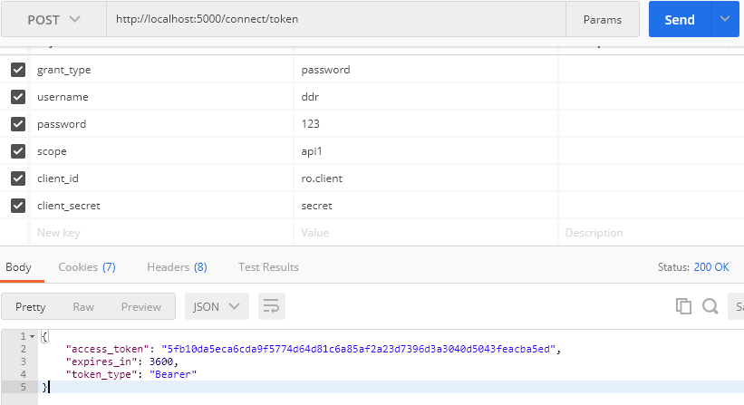

## 			[IdentityServer4之Resource Owner Password Credentials(资源拥有者密码凭据许可)](https://www.cnblogs.com/ddrsql/p/7909199.html)


  IdentityServer4之Resource Owner Password Credentials(资源拥有者密码凭据许可)

### **参考**

官方文档：[2_resource_owner_passwords](http://docs.identityserver.io/en/release/quickstarts/2_resource_owner_passwords.html)

概念：[资源拥有者密码凭据许可](http://www.cnblogs.com/ddrsql/p/7789064.html#PasswordCredentials)

 

### **认证服务端配置**

**认证服务ApiResource配置**

```
new ApiResource("api1", "api项目 一")
{
    ApiSecrets = { new Secret("api1pwd".Sha256()) }
},
```

**认证服务Client配置**

[](javascript:void(0);)

```
//resource owner password grant client
new Client
{
    ClientId = "ro.client",
    AllowedGrantTypes = GrantTypes.ResourceOwnerPassword,
    AccessTokenType = AccessTokenType.Reference,

    ClientSecrets =
    {
        new Secret("secret".Sha256())
    },
    AllowedScopes = { "api1" }
},
```

[](javascript:void(0);)

**认证服务Startup配置**

[](javascript:void(0);)

```
public void ConfigureServices(IServiceCollection services)
{
    // configure identity server with in-memory stores, keys, clients and scopes
    services.AddIdentityServer()
        .AddDeveloperSigningCredential()
        .AddInMemoryApiResources(Config.GetApiResources())
        .AddInMemoryClients(Config.GetClients())
        .AddTestUsers(Config.GetUsers());
}
```

[](javascript:void(0);)

 

配置完成启动访问http://localhost:5000/.well-known/openid-configuration


 

### 资源服务Api配置

**资源服务器Startup配置**

[](javascript:void(0);)

```
services.AddMvcCore()
    .AddAuthorization()
    .AddJsonFormatters();

services.AddAuthentication("Bearer")
    .AddIdentityServerAuthentication(options =>
    {
        options.Authority = "http://localhost:5000";
        options.RequireHttpsMetadata = false;

        options.ApiName = "api1";  
        options.ApiSecret = "api1pwd";  //对应ApiResources中的密钥
    });
```

[](javascript:void(0);)

添加接口

[](javascript:void(0);)

```
[Route("[controller]")]
[Authorize]
public class IdentityController : ControllerBase
{
    [HttpGet]
    public IActionResult Get()
    {
        var info = from c in User.Claims select new { c.Type, c.Value };
        var list = info.ToList();
        list.Add(new { Type = "api1返回", Value = DateTime.Now.ToString("yyyy-MM-dd HH:mm:ss") });
        return new JsonResult(list);
    }
}
```

[](javascript:void(0);)

### Client客户端

（A）资源拥有者提供给客户端它的用户名和密码。
 （B）通过包含从资源拥有者处接收到的凭据，客户端从授权服务器的令牌端点请求访问令牌。当发起请求时，客户端与授权服务器进行身份验证。
 （C）授权服务器对客户端进行身份验证，验证资源拥有者的凭证，如果有效，颁发访问令牌。

[](javascript:void(0);)

```
//resource owner password grant client
private void btnROAuth_Click(object sender, EventArgs e)
{
    Task<DiscoveryResponse> discoTask = DiscoveryClient.GetAsync(txtROAuthSer.Text);
    discoTask.Wait();
    var disco = discoTask.Result;
    if (disco.IsError)
    {
        MessageBox.Show(disco.Error, "提示信息", MessageBoxButtons.OK, MessageBoxIcon.Information);
        txtROResult.Text = string.Empty;
        txtAccessToken.Text = string.Empty;
        return;
    }

    // request token
    var tokenClient = new TokenClient(disco.TokenEndpoint, txtROClient.Text, txtROSecret.Text);
    Task<TokenResponse> tokenTask = tokenClient.RequestResourceOwnerPasswordAsync(txtROUser.Text, txtROPwd.Text, txtROScopes.Text);
    tokenTask.Wait();
    var tokenResponse = tokenTask.Result;

    if (tokenResponse.IsError)
    {
        MessageBox.Show(tokenResponse.Error, "提示信息", MessageBoxButtons.OK, MessageBoxIcon.Information);
        txtROResult.Text = string.Empty;
        txtAccessToken.Text = string.Empty;
        return;
    }

    txtROResult.Text = tokenResponse.Json.ToString();
    txtAccessToken.Text = tokenResponse.AccessToken;
}
```

[](javascript:void(0);)

调用Api

[](javascript:void(0);)

```
private void btnCallApi_Click(object sender, EventArgs e)
{
    // call api
    var client = new HttpClient();
    client.SetBearerToken(txtAccessToken.Text);

    var responseTask = client.GetAsync(txtCCApiUrl.Text);
    responseTask.Wait();
    var response = responseTask.Result;
    if (!response.IsSuccessStatusCode)
    {
        MessageBox.Show(response.StatusCode.ToString(), "提示信息", MessageBoxButtons.OK, MessageBoxIcon.Information);
        txtApiResult.Text = string.Empty;
    }
    else
    {
        var contentTask = response.Content.ReadAsStringAsync();
        contentTask.Wait();
        var content = contentTask.Result;
        txtApiResult.Text = JArray.Parse(content).ToString();
    }
}
```

[](javascript:void(0);)

 

### 获取token过程解析

Jwt形式获取access_token、客户端身份验证两种方式，参考[上一篇](http://www.cnblogs.com/ddrsql/p/7887083.html)获取token过程解析。

**Reference形式获取access_token**

将client的AccessTokenType设置为1


再次获取的access_token不包含Claim信息。



 

此时获取的access_token(加密后)对应PersistedGrants表中的key


 

### 调用Api资源服务过程解析

 调用过程与[上一篇](http://www.cnblogs.com/ddrsql/p/7887083.html)调用Api资源服务过程解析一样。