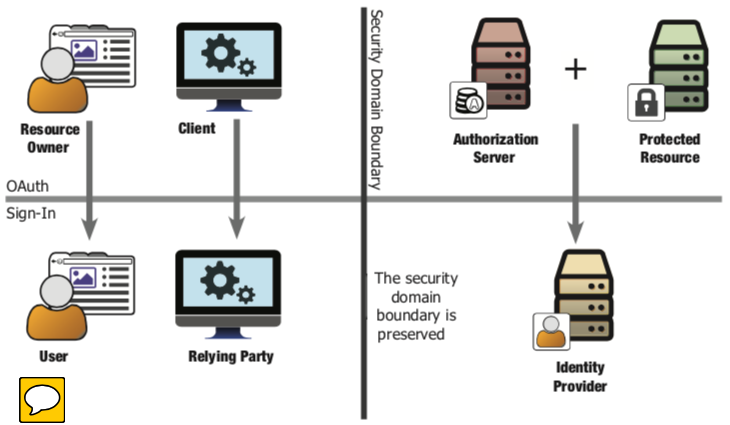
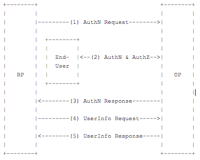

#  			[Identity Server 4 预备知识 -- OpenID Connect 简介](https://www.cnblogs.com/cgzl/p/9231219.html) 		

我之前的文章简单的介绍了OAuth 2.0 (在这里: <https://www.cnblogs.com/cgzl/p/9221488.html>), 还不是很全.

这篇文章我要介绍一下 OpenID Connect.

# OAuth 2.0 不是身份认证协议

**OAuth 2.0 不是身份认证(Authentication)协议**. 为什么有人会认为OAuth 2.0具有身份认证的功能? 这是因为OAuth2经常作为身份认证(Authentication)协议的一部分来使用. 例如在典型的OAuth2流程里, OAuth2经常会嵌入一些身份认证的事件.

那么**身份认证(Authentication)**是什么?

我们这里所说的身份认证就是指它可以告诉应用程序**当前的用户是谁**, 还有这些用户是否正在使用你的应用程序. 它是一种安全架构, 它可以告诉你用户是他们所**声明的身份**, 通常呢, 是通过提供一套**安全凭据**(例如用户名和密码)给应用程序来证明这一点.

而OAuth2则不管用户这些东西, OAuth2的客户端应用只考虑请求token, 得到token, 使用token访问API. 它不关心谁给客户端应用授权了, 也不关心是否有最终用户.\

 

# 身份认证(Authentication) vs 授权(Authorization)

引用《OAuth 2.0 in Action》里面的一个比喻来解释, 把**身份认证看作是软糖**, 而**授权是巧克力**. 这两种东西感觉略有相似, 但是本质上却截然不同: **巧克力是一种原料**, 而**软糖是一种糖果**. 可以使用巧克力作为主要原料做出巧克力口味的糖果, 但是巧克力和软糖绝不是等价的.

尽管巧克力可以单独作为一种最终产品, 但在这个比喻里巧克力是一种非常有用原料, 它极具多样性, 可以用来做蛋糕, 冰激凌, 雪糕等等.

 

在这个比喻里 **OAuth 2.0** 就是巧克力, 它**是众多web安全架构的一种多用途的基本成分**.

而软糖, 是一种糖果. 有一种特别可口的软糖叫做巧克力软糖. 很显然, 巧克力在这种软糖里是主要成分, 但是它还需要其它原料成分和一些关键的流程把巧克力转化成巧克力软糖.

制做出的产品是软糖的形式, 它以巧克力为主要成分. 这叫使用巧克力来制作软糖, 所以说巧克力不等价于软糖.

在这个比喻里, **身份认证**就更像软糖, 它需要一些关键的组件和流程, 而却要把这些组件和流程通过正确的组合起来并安全的使用, 针对这些组件和流程还是有很多的选项的.

可以说我们要制作巧克力软糖, 也就是需要一个基于OAuth2的身份认证协议. 而OpenID Connect就是这样的开放标准, 它可以工作于不同的身份供应商之间. **OpenID Connect 基于 OAuth 2.0, 在此之上, 它添加了一些组件来提供身份认证的能力**.

 

OpenID Connect的官方定义是: **OpenID Connect是建立在OAuth 2.0协议上的一个简单的身份标识层, OpenID Connect 兼容 OAuth 2.0**. 

 

# OAuth 2.0与身份认证协议的角色映射

想要基于OAuth2构建身份认证协议, 那么就需要把OAuth2里面的那些角色映射到身份认证的事务里面.

在OAuth2里面, **资源所有者(Resource Owner)和客户端应用(Client)**经常在一起工作,  因为客户端应用代表了资源所有者. 而授权服务器(Authorization Server)和被保护的资源(Protected  Resource)经常在一起, 因为授权服务器生成token, 而被保护的资源接收token. 所以说在**最终用户/客户端应用** 与  **授权服务器/被保护资源** 之前存在一个安全和信任的边界, 而OAuth2就是用来跨越这个边界的协议.

而在身份认证的事务里, 最终用户使用**身份提供商(Identity Provider, IdP)**登录到**依赖方(Relying Party, RP**, 可以理解为客户端).

总结一下前面这段话:

OAuth2里可以分为两部分: 1.资源所有者/客户端应用, 2.授权服务器/被保护资源.

身份认证协议里也是两大部分: 1.依赖方, 2.身份提供商.

所以考虑这样映射:

- OAuth2里的授权服务器/被保护资源 ---- 身份认证协议里的身份提供商进行映射
- OAuth2里面的资源所有者 ---- 身份认证协议里的最终用户
- OAuth2的客户端应用 ---- 身份认证协议里的依赖方(RP).

OAuth2里, 资源所有者的权限会委派给客户端应用, 但这时该权限对应的被保护资源就是他们自己的身份信息. 也就是说他们授权给依赖方(RP), 让其可以知道现在是谁在使用应用, 而这就是身份认证事务本质.

依赖方现在就可以知道是谁在使用系统并且他们是如何登录进来的. 不过这里还需要用到另外一种token, 叫做ID token, 这种token携带着身份认证事件本身的信息.

那么为什么不使用OAuth2里的access token把这些事都一次性解决了呢? 

因为首先**access token不含有任何关于身份认证的信息**; 其次access token的生命期可能会非常的长,  即使用户离开了它仍有可能有效, 它还有可能被用于无最终用户参与的情况; 还有一种情况就是access token可能会被其它的客户端应用借用.  所以, 无论客户端是如何得到的access token, 它都无法从access token里得到最终用户的信息以及最终用户的身份认证状态.

在OAuth2里, access token不是为客户端准备的, 它对于客户端应该是不透明的, 但是客户端也需要从access  token得到一些用户信息. 实际上客户端应用只是access token的展示者, **access token真正的目标观众是被保护的资源.**

在OpenID Connect里, 这个第二个叫做ID Token, 它会和access token一同发送给客户端应用.

 

# OpenID Connect

OpenID Connect是由OpenID基金会于2014年发布的一个开放标准, 简单的说就是, 它使用OAuth2来进行身份认证.  OpenID Connect直接构建于OAuth2.0的基础之上, 与其兼容. 通常OpenID  Connect是和OAuth2一同部署来使用的.

 

OpenID Connect的整体抽象流程如下图所示: 

\1. 依赖发(RP)发送请求到OpenID提供商(OP, 也就是身份提供商).

\2. OpenID提供商验证最终用户的身份, 并获得了用户委派的授权

\3. OpenID提供商返回响应, 里面带着ID Token, 也通常带着Access Token.

\4. 依赖方现在可以使用Access Token发送请求到用户信息的端点.

\5. 用户信息端点返回用户的声明(claims, 相当于是用户的信息).

 

*OpenID Connect的ID Token 和用户信息端点以后在使用Identity Server 4的时候在进行介绍.*

 

## 身份认证

OpenID Connect 会负责身份认证这个动作, 也就是把最终**用户登录到系统, 或者判断最终用户是否已经登录了**. OpenID  Connect会通过一种安全的方式从服务器把身份认证的结果返回给客户端, 这样客户端就可以依赖于它了. 也是因为这个原因,  客户端被称为了依赖方(RP). 这个身份认证的结果就是ID Token.

OpenID Connect身份认证有三个路径(三个流程, flow):

 **Authorization Code 流程**, **Implicit 流程**, **Hybrid 流程**.

 

### Authorization Code Flow

在Authorization Code 流程里, 一个授权码(Authorization Code)会被返回给客户端.  这个授权码可以被直接**用来交换ID Token和Access Token**. 该流程也可以在客户端使用授权码兑换Access  Token之前对其身份认证. 但是该流程要求客户端的身份认证动作在**后台**使用client id和secret来获得tokens, 这样就不会把tokens暴露给浏览器或其它可访问浏览器的恶意应用了.

这种流程要求客户端应用可以安全的在它和授权服务器之间维护客户端的secret, 也就是说只适合这样的客户端应用.

它还适合于长时间的访问(通过refresh token).

Authorization Code流程的授权码来自于授权端点, 而所有的tokens都来自于Token端点. 

Authorization Code流程的步骤如下:

1. 客户端准备身份认证请求, 请求里包含所需的参数
2. 客户端发送请求到授权服务器
3. 授权服务器对最终用户进行身份认证
4. 授权服务器获得最终用户的同意/授权
5. 授权服务器把最终用户发送回客户端, 同时带着授权码
6. 客户端使用授权码向Token端点请求一个响应
7. 客户端接收到响应, 响应的body里面包含着ID Token 和 Access Token
8. 客户端验证ID Token, 并获得用户的一些身份信息.

 

### Implicit Flow

Implicit流程在请求token的时候**不需要明确的客户端身份认证**, 它使**用重定向URI的方式来验证客户端的身份**. 因为这一点, refresh token也就无法使用了, 这同样也不适合于长时间有效的access token.

在Implicit流程里, 所有的**tokens都来自于授权端点**, 而Token端点并没有用到.

该流程主要用于浏览器内的应用, Access Token和ID Token一同被直接返回给客户端. 因为这个原因, 这些tokens也会暴露于最终用户和可以访问该浏览器的其它应用了. 

它并**不适合于长时间的访问**.

Implicit流程的步骤如下:

1. 客户端准备身份认证请求, 请求里包含所需的参数
2. 客户端发送请求到授权服务器
3. 授权服务器对最终用户进行身份认证
4. 授权服务器获得最终用户的同意/授权
5. 授权服务器把最终用户发送回客户端, 同时带着ID Token. 如果也请求了Access Token的话, 那么Access Token也会一同返回.
6. 客户端验证ID Token, 并获得用户的一些身份信息.

 

### Hybrid Flow

Hybrid流程是前两者的混合, 在该流程里, 有一些tokens和授权码来自于授权端点, 而另外一些tokens则来自于Token端点.

该流程允许客户端立即使用ID Token, 并且只需要一次往返即可获得授权码.

这种流程也要求客户端应用可以安全的维护secret.

它也适合于长时间的访问.

Hybrid流程的步骤如下:

1. 客户端准备身份认证请求, 请求里包含所需的参数
2. 客户端发送请求到授权服务器
3. 授权服务器对最终用户进行身份认证
4. 授权服务器**获得最终用户的同意/授权**
5. 授权服务器把最终用户发送回客户端, 同时带着授权码, 根据响应类型的不同, 也可能还带着一个或者多个其它的参数.
6. 客户端使用授权码向Token端点请求一个响应
7. 客户端接收到响应, 响应的body里面包含着ID Token 和 Access Token
8. 客户端验证ID Token, 并获得用户的一些身份信息.

 

### 三种流程特点的比较:

|                               | Authorization Code Flow | Implicit Flow | Hybrid Flow |
| :---------------------------- | :---------------------- | ------------- | ----------- |
| 所有的tokens都来自于授权端点  | no                      | yes           | no          |
| 所有的tokens都来自于Token端点 | yes                     | no            | no          |
| Tokens对浏览器隐藏            | yes                     | no            | no          |
| 客户端可以被认证              | yes                     | no            | yes         |
| 可以使用Refresh Token         | yes                     | no            | yes         |
| 只需一次往返通信              | no                      | yes           | no          |
| 大部分通信都是服务器对服务器  | yes                     | no            | 看情况      |

 

### 返回类型值的比较: 

| "response_type" 的值  | Flow                    |
| --------------------- | ----------------------- |
| `code`                | Authorization Code Flow |
| `id_token`            | Implicit Flow           |
| `id_token token`      | Implicit Flow           |
| `code id_token`       | Hybrid Flow             |
| `code token`          | Hybrid Flow             |
| `code id_token token` | Hybrid Flow             |

 

本文就简单介绍这些, OAuth 2.0 和 OpenID Connect 其余涉及到的内容会在后续Identity Server 4的系列文章里介绍.

博客文章可以转载，但不可以声明为原创. 

  我的.NET Core公众号: 