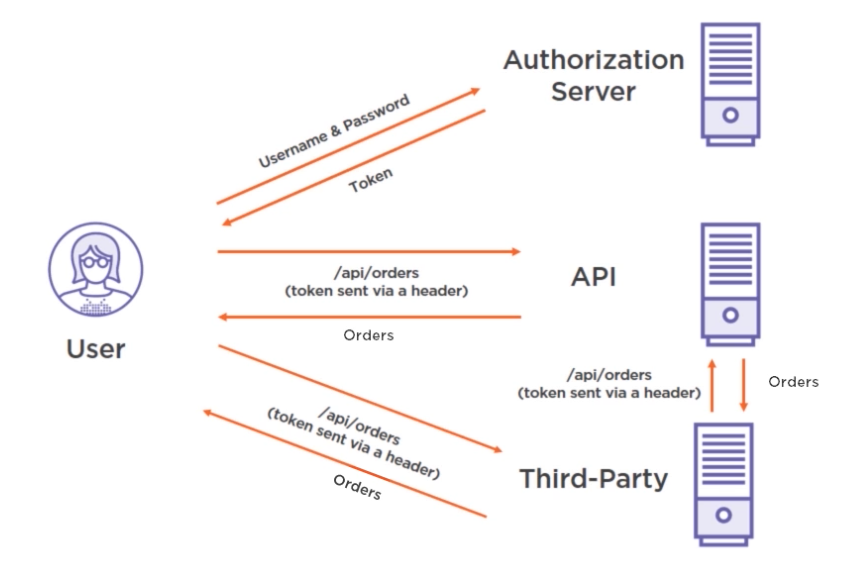
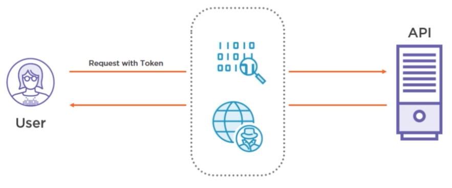
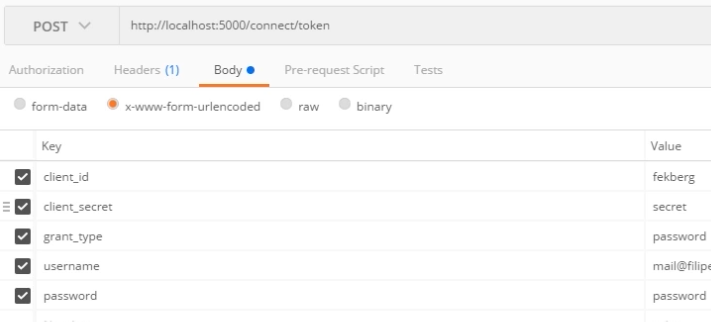
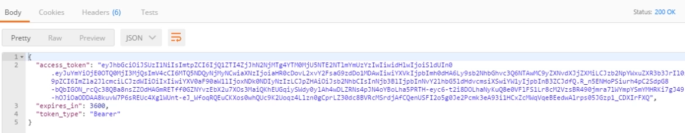
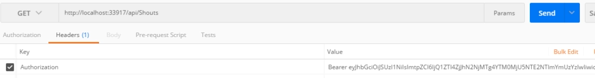
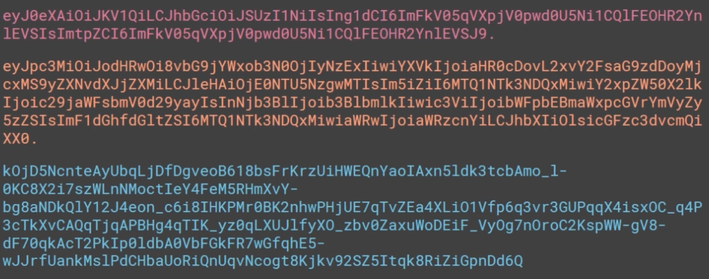
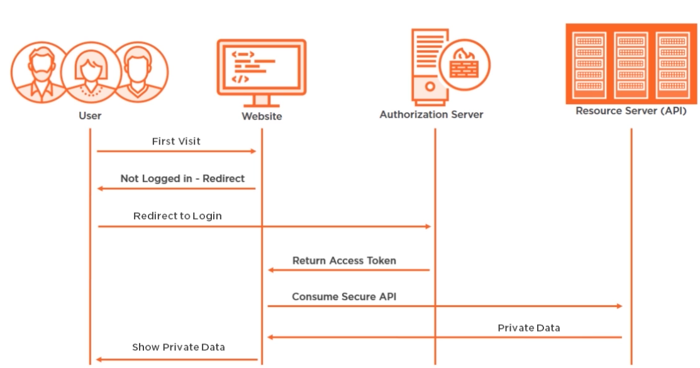

#  			[学习Identity Server 4的预备知识 (误删, 重补)](https://www.cnblogs.com/cgzl/p/9405796.html) 		

我要使用asp.net core 2.0 web api 搭建一个基础框架并立即应用于一个实际的项目中去.

这里需要使用identity server 4 做单点登陆.

下面就简单学习一下相关的预备知识.

# 基于Token的安全验证体系

这个比较简单, 简单来说就是为了证明我们有访问权限, 我们首先需要获得一个token.

什么是token? 比如说: 可以访问某些大楼的门禁卡就是一种token, 回家开门的钥匙也是一种token.

为了获取到token, 首先你需要验证你的身份, 以证明你确实有权利获得token. 比如说, 你可以亮出身份证来证明自己, 或者使用密码.

比如说你想访问我的办公室, 你首先去安全部门亮出身份证, 然后安全办公室给你一个token, 然后使用这个token你就可以进入办公室去干事了.

## 使用基于token的安全体系有什么优点?

如果不使用token, 你可能需要到处使用密码来证明身份. 这样的话, 那每个地方都会知道你的密码了.

如果token丢失了, 我们可以吊销token.

并且token都有一定的时效性. 过期作废

总之, 使用这种方式, 你可以只在一个地方使用密码, 别的地方不会知道你的密码.

# 交换凭证获取token并使用token

有一个已注册用户, 她为了获取token, 就需要与authorization server进行通信. 这个authorization  server负责发放token, 并且确保token是否仍然有效. 它同时也负责跟踪用户的用户名和密码. 而这个authorization  server可以存在于世界的任何地方, 它并不是非得和我们的web api或者网站放在一起. 它完全是一个独立的系统,  跟踪着用户的用户名密码以及用户的访问权限.

这里这个用户就向authorization server提供了用户名和密码, 然后她就获得了token. 然后她就可以使用这个token做一些事情了, 比如使用token访问api请求所有的订单信息, 这时api就会知道这个token是有效的.

甚至, 用户使用token可以访问第三方服务, 第三方服务再使用这个token来访问我们的api.

向第三方服务提供token肯定比提供用户名密码安全多了.

# 要把Token向密码一样对待

保护好token, 因为别人获得token后将会和你拥有一样的权限.

token是有时效性的, 具体有效期是多久是由authorization server决定的.

token是可以吊销的, 你可以告诉authorization server注销你的token, 但是要注意的是,  是由api决定是否向authorization server查询token的有效性,  如果你吊销token或api没有向authorization server进行查询, 那么你的token对api来说依然有效.

## 如何保证token的安全

如图, 用户带着token向api发出请求, token是附带在header中, api收到请求后会返回一些数据.

如果有人查看了这个token, 并要篡改token里面的数据, 那可就不好了

那么如何保证token不被篡改呢? 这个工作是由api来做的, 它要确保没人篡改过token.

在基于token验证的情景中, 所有从authorization server获取的token都是使用一个private key签过名的. token包括一些信息: 用户本身(email, 权限等等), 也可能包括是谁发布了token.

任何一个服务想确定没人篡改过token, 就需要使用public key.

private key 可以用于锁定 token.

针对token和它带的数据以及在token尾部的签名信息, 只要没人篡改数据, 那么token的签名就是一定的.

authorization server提供的public key是任何人都可以访问的, public key是用来确保没人篡改过数据.

# Token

如果在api里面验证了token的完整性, 那么我们就会知道token是ok的.

我们这里研究的token是Json Web Token.

token是由**authorization server**签名发布的.

authorization server就是使用oauth和openid connect等协议, 并且用户可以使用用户名密码等方式来换取token的服务, 这些token让我们拥有了访问一些资源的权限.

private key 是用来签发token用的, 它只存在于authorization server, 永远不要让别人知道private key.

public key 是用来验证token的, authorization server 会让所有人都知道这个public key的.

api或者各种消费者应该一直检验token, 以确保它们没有被篡改. 它们可以向authorization server申请public  key, 并使用它来验证token. 也可以把token传递给authorization server, 并让authorization  server来进行验证.

Token同时也包含着authorization server的一些信息. 比如是由哪个authorization server发布的token.

Token的信息是使用Base64编码的.

# OAuth 和 OpenId Connect

他们都是安全协议.

现在使用的都是OAuth 2.0, 注意它与1.0不兼容.

OAuth 2.0是用于authorization的工业标准协议. 它关注的是为web应用, 桌面应用, 移动应用等提供特定的authorization流程并保证开发的简单性.

Authorization的意思是授权, 它表示我们可以授权给某些用户, 以便他们能访问一些数据, 也就是提供访问权.

OAuth是基于token的协议.

> **Authorization** 
> 认证
>
> **Authentication** 
> 授权

有些人可能对Authorization和Authentication分不清, 上面讲了authorization, 而authentication则是证明我是谁, 例如使用用户名和密码进行登录就是authentication.

OAuth只负责Authorization. 那么谁来负责Authentication呢?

那就是OpenId Connect, OpenId Connect是对OAuth的一种补充, 因为它能进行Authentication.

OpenId Connect 是位于OAuth 2.0上的**一个简单的验证层**, 它允许客户端使用authorization server的authentication操作来验证终端用户的身份, 同时也可以或缺终端客户的一些基本信息.

可以有多种方式来实现OAuth和OpenId Connect这套协议.

你可以自己去实现. 

我要使用的是Identity Server 4.

其实也可以使用一些Saas/Paas服务, 例如Amazon Cognito, Auth0(这个用过, 有免费版), Stormpath.

# OAuth 2.0 RFC 6794

想研究的比较透彻的话, 还是要多读几遍 RC 6749文档: <https://tools.ietf.org/html/rfc6749>

OAuth通常有以下几种endpoint:

\1. /authorize, 请求token(通过特定的流程flows)

\2. /token, 请求token(通过特定的流程flows), 刷新token, 使用authorization code来换取token.

\3. /revocation, 吊销token.

OpenId Connect 通常有以下几种 endpoints:

\1. /userinfo, 获取用户信息

\2. /checksession, 检查当前用户的session

\3. /endsession, 终结当前用户的session

\4. /.well-known/openid-configuration, 提供了authorization server的信息(endpoints列表和配置信息等)

\5. /.well-known/jwks, 列出了JWT签名key的信息, 它们是用来验证token的.

# 获取Token的例子:

使用postman大约是这样发送请求.

请求返回的结果大约是这样的:

access_token就是token, expires_in是有效时间, 类型是 Bearer.

可以到jwt.io去解析token: <http://jwt.io/>

由于网络问题, 我今天无法使用这个网站.....以后做项目写文章的时候再介绍. 这里你可以试试把一个token的数据更改之后, token验证就出错了. 

下面这个图是如何使用token访问api:

# Access Token (JWT)

### 红色的是Header,

一个部分是Header, 包括算法和类型等信息:

###	橘色的是Payload,

第二部分是Payload(数据), 就是断点里Claims的数据:

###	蓝色的是签名Signature.

第三部分是签名:

 它们是用.分开的

Signature主要是来保证Payload的完整性. Header包含了token的结构信息.

Payload有时候也叫做Claims, 它通常包括发布者issuer(authorization server), Audience,  有效期, 有时也包括token应该是从什么时候开始有效, Client ID(这是那些注册于authorization server的应用),  Scopes(限定访问的范围), 自定义数据.

### Scopes

scopes可以限定访问的范围.

OpenId Connect为我们指定了一些 Scopes, 包括: openid, profile, email, address, offline_access等等.

当然也可以自定义scope.

# 选择一个流程 Flow

Redirect Flows, 它可以这样解释: 有一个用户想要访问我的网站, 我想让他登录, 但又不想让他把用户名和密码提供给我,  因为我没有用户的信息. 用户的信息都在authorization server上了. 所以我把用户重定向到authorization  server, 提供他们的用户名和密码, 然后重定向返回到我的网站, 获取了token, 这时我就知道他们已经登录好了.

 

Redirect Flows又分两种: 

1 Implicit Grant(就是上面说的那个), 

2 Authorization  Code(它并没有返回token, 而是返回了authorization code, 而网站可以使用authorization  code来换取token).

所以implicit grant适合于javascript客户端, 而其他应用更适合使用authorization code, 这些应用可以使用authorization code刷新token.

Credential Flows: 1.Resource Owner Password Credentials(用户名密码). 2. Client Credentials(例如适用于没有用户参与的情况).

博客文章可以转载，但不可以声明为原创. 

  我的.NET Core公众号: 

分类: [.Net Core](https://www.cnblogs.com/cgzl/category/1090036.html)

标签: [identity server 4](https://www.cnblogs.com/cgzl/tag/identity server 4/)

​         [好文要顶](javascript:void(0);)             [关注我](javascript:void(0);)     [收藏该文](javascript:void(0);)     ;)     ;) 

​             [solenovex](https://home.cnblogs.com/u/cgzl/)
​             [关注 - 11](https://home.cnblogs.com/u/cgzl/followees)
​             [粉丝 - 868](https://home.cnblogs.com/u/cgzl/followers)         

​                 [+加关注](javascript:void(0);)     

​         19     

​         0     

​     

[« ](https://www.cnblogs.com/cgzl/p/9399563.html) 上一篇：[.NET Core TDD 前传: 编写易于测试的代码 -- 全局状态](https://www.cnblogs.com/cgzl/p/9399563.html)
[» ](https://www.cnblogs.com/cgzl/p/9429557.html) 下一篇：[.NET Core TDD 前传: 编写易于测试的代码 -- 单一职责](https://www.cnblogs.com/cgzl/p/9429557.html)

posted @ 2018-08-02 14:34 [solenovex](https://www.cnblogs.com/cgzl/) 阅读(1853) 评论(5)  [编辑](https://i.cnblogs.com/EditPosts.aspx?postid=9405796) [收藏](https://www.cnblogs.com/cgzl/p/9405796.html#)