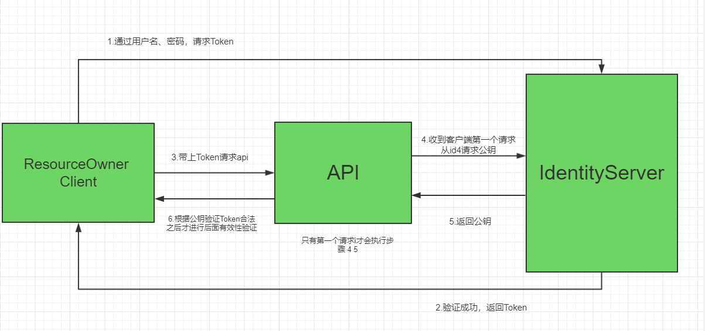

## 			[使用密码认证方式控制API访问（资源所有者密码授权模式）](https://www.cnblogs.com/stulzq/p/7509648.html)

IdentityServer4（8）


就像API资源（也称为 Scope）

修改 ·AllowedGrantTypes· 属性简单地添加对已有客户端授权类型的支持。

```csharp
  AllowedGrantTypes = GrantTypes.ResourceOwnerPassword,
```





##	[使用OpenID Connect添加用户身份验证（implicit）](https://www.cnblogs.com/stulzq/p/7797341.html)

###	添加 OpenID Connect Identity Scope

与OAuth 2.0类似，OpenID Connect也使用Scope概念。同样，Scope代表您想要保护的内容以及客户端想要访问的内容。与OAuth相比，**OIDC中的Scope不仅代表API资源，还代表用户ID，姓名或电子邮件地址等身份资源**。

通过修改`Config.cs` 中的 `GetIdentityResources` 方法，添加对标准 **`openid`**（subject id）和**`profile`** （名字，姓氏等）Scope的支持：

```
public static IEnumerable<IdentityResource> GetIdentityResources()
{
    return new List<IdentityResource>
    {
        new IdentityResources.OpenId(),
        new IdentityResources.Profile(),
    };
}
```

> 所有标准Scope及其相应的Claim都可以在[OpenID Connect规范](https://openid.net/specs/openid-connect-core-1_0.html#ScopeClaims)中找到。


##	[使用 ASP.NET Core Identity](https://www.cnblogs.com/stulzq/p/8120129.html)12


###	 Using ASP.NET Core Identity[[Git](https://github.com/IdentityServer/IdentityServer4/blob/master/docs/quickstarts/8_aspnet_identity.rst)]-[[Doc](https://identityserver4.readthedocs.io/en/latest/quickstarts/8_aspnet_identity.html)]


> 我们在将Asp.Net Identity添加到DI容器中时，一定要把注册IdentityServer放在Asp.Net Identity之后，因为注册IdentityServer会覆盖Asp.Net Identity的一些配置，这个非常重要。

**Configure**

使用UseIdentityServer代替了对UseIdentity的调用

```csharp
public void Configure(IApplicationBuilder app, IHostingEnvironment env)
{
    if (env.IsDevelopment())
    {
        app.UseDeveloperExceptionPage();
        app.UseBrowserLink();
        app.UseDatabaseErrorPage();
    }
    else
    {
        app.UseExceptionHandler("/Home/Error");
    }

    app.UseStaticFiles();

    // app.UseAuthentication(); // not needed, since UseIdentityServer adds the authentication middleware
    app.UseIdentityServer();

    app.UseMvc(routes =>
    {
        routes.MapRoute(
            name: "default",
            template: "{controller=Home}/{action=Index}/{id?}");
    });
}
```


## 	[使用 JavaScript 客户端13](https://www.cnblogs.com/stulzq/p/8120211.html)

使用Ajax跨域调用API

最后一点配置是在Web API项目中配置CORS。这将允许从`http// localhost:5003`到`http:// localhost:5001`进行Ajax跨域调用。

### **配置CORS**

在Startup.cs `ConfigureServices`中将CORS服务添加到依赖注入系统：

```csharp
public void ConfigureServices(IServiceCollection services)
{
    services.AddMvcCore()
        .AddAuthorization()
        .AddJsonFormatters(); 
    services.AddAuthentication("Bearer")
        .AddIdentityServerAuthentication(options =>
        {
            options.Authority = "http://localhost:5000";
            options.RequireHttpsMetadata = false; 
            options.ApiName = "api1";
        });

    services.AddCors(options =>
    {
        // this defines a CORS policy called "default"
        options.AddPolicy("default", policy =>
        {
            policy.WithOrigins("http://localhost:5003")
                .AllowAnyHeader()
                .AllowAnyMethod();
        });
    });
}
```

将CORS中间件添加到管道中`Configure`：

```csharp
public void Configure(IApplicationBuilder app)
{
    app.UseCors("default"); 
    app.UseAuthentication(); 
    app.UseMvc();
}
```


##	[通过EntityFramework Core持久化配置和操作数据14](https://www.cnblogs.com/stulzq/p/8120518.html)


> 为IdentityServer4.EntityFramework中的实体维护SqlServer的SQL脚本。 
> https://github.com/IdentityServer/IdentityServer4.EntityFramework/tree/dev/src/Host/Migrations/IdentityServer


```csharp
const string connectionString = @"Data Source=(LocalDb)\MSSQLLocalDB;database=IdentityServer4.Quickstart.EntityFramework-2.0.0;trusted_connection=yes;";
var migrationsAssembly = typeof(Startup).GetTypeInfo().Assembly.GetName().Name;

// configure identity server with in-memory stores, keys, clients and scopes
services.AddIdentityServer()
    .AddDeveloperSigningCredential()
    .AddTestUsers(Config.GetUsers())
    // this adds the config data from DB (clients, resources)
    .AddConfigurationStore(options =>
    {
        options.ConfigureDbContext = builder =>
            builder.UseSqlServer(connectionString,
                sql => sql.MigrationsAssembly(migrationsAssembly));
    })
    // this adds the operational data from DB (codes, tokens, consents)
    .AddOperationalStore(options =>
    {
        options.ConfigureDbContext = builder =>
            builder.UseSqlServer(connectionString,
                sql => sql.MigrationsAssembly(migrationsAssembly));

        // this enables automatic token cleanup. this is optional.
        options.EnableTokenCleanup = true;
        options.TokenCleanupInterval = 30;
    });
```


###	 添加迁移

要创建迁移，请在IdentityServer项目目录中打开命令提示符。 在命令提示符下运行这两个命令：

```bash
dotnet ef migrations add InitialIdentityServerPersistedGrantDbMigration -c PersistedGrantDbContext -o Data/Migrations/IdentityServer/PersistedGrantDb
dotnet ef migrations add InitialIdentityServerConfigurationDbMigration -c ConfigurationDbContext -o Data/Migrations/IdentityServer/ConfigurationDb
```

在项目中看到一个`〜/ Data / Migrations / IdentityServer`文件夹。 这包含新创建的迁移的代码。 