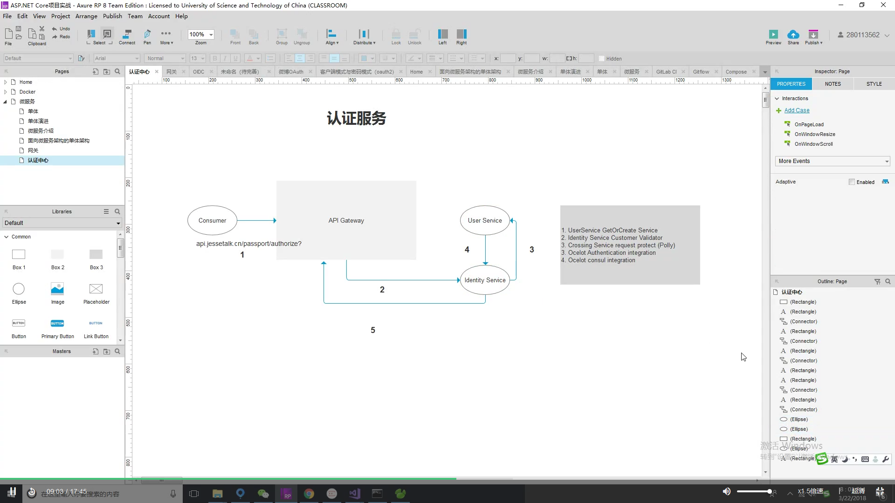
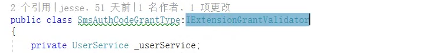
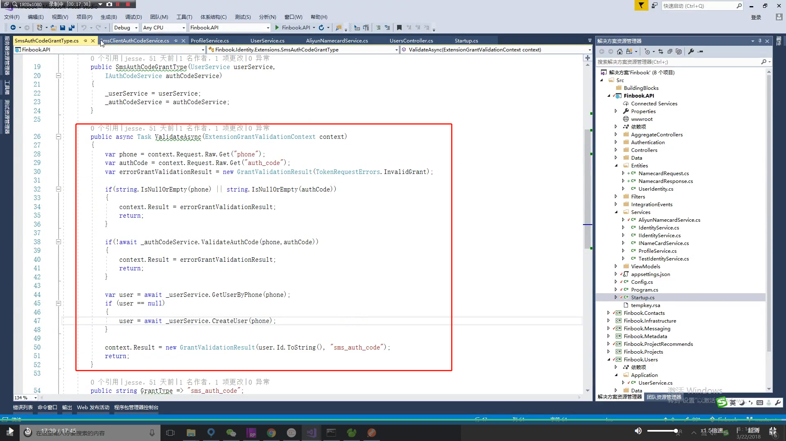

IAuthCodeService

IUserService

> void 	CheckOrCrate

Authentication

SmsAuthCodeValidator

​	improt 	Ids4	IIdentityServer4.Validation;

​	using 	Ids4	User.Identity.Services;

依赖注入 

IAuthCodeService		IUserService

