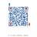

        [           Jessetalk       ](http://video.jessetalk.cn/) 

-    [小组 ](http://video.jessetalk.cn/group)   
-    [移动端 ](http://video.jessetalk.cn/mobile/)   
-    [博客 ](http://www.jessetalk.cn)   
-    [邀请返现 ](https://shimo.im/docs/R7hiBLZvegQKlkPY)   
-    [企业推荐 ](https://shimo.im/docs/5ExkCykyZZwgjaRX/)   

- 

  

1. [首页](http://video.jessetalk.cn/)
2. [ASP.NET Core](http://video.jessetalk.cn/course/explore/aspnet_core)
3. [ASP.NET Core分布式项目实战 ](http://video.jessetalk.cn/course/5)
4. 默认教学计划 

​                                  

​                默认教学计划                                                                       扫二维码继续学习二维码时效为半小时                                  

- ​               

​           

​                                    

 		 默认教学计划 

   

-  				[ 					目录 														](http://video.jessetalk.cn/my/course/5) 			
-  				[ 					话题 																							(187) 															](http://video.jessetalk.cn/my/course/5/threads) 			
-  				[ 					笔记 																							(136) 															](http://video.jessetalk.cn/my/course/5/notes) 			
-  				[ 					资料区 																							(2) 															](http://video.jessetalk.cn/my/course/5/material) 			
-  				[ 					评价 																							(33) 															](http://video.jessetalk.cn/my/course/5/reviews) 			
-  				[ 					介绍 														](http://video.jessetalk.cn/my/course/5/summary) 			
- 

##   [ 第1章: Identity Server 4 准备](javascript:)

 ### [ T1-1： 课程介绍               ](http://video.jessetalk.cn/course/5/task/51/show)                                      02:49                                      
 ### [ T1-2： 欢迎大家来聊一聊你现在职业生涯所处的位置以及将来的发展。               ](http://video.jessetalk.cn/course/5/task/52/show)                                                                            
 ### [ T2： 最小可行化产品MVP               ](http://video.jessetalk.cn/course/5/task/53/show)                                      06:16                                      
 ### [ T3： 两种软件开发模式：瀑布与敏捷               ](http://video.jessetalk.cn/course/5/task/54/show)                                      17:39                                      
 ### [ T4： 第一章计划与目录               ](http://video.jessetalk.cn/course/5/task/55/show)                                      07:45                                      
 ### [ T5： 业务介绍               ](http://video.jessetalk.cn/course/5/task/56/show)                                      18:46                                      
 ### [ T6： 架构设计               ](http://video.jessetalk.cn/course/5/task/58/show)                                      13:19                                      
 ### [ T7： oAuth2介绍               ](http://video.jessetalk.cn/course/5/task/59/show)                                      13:30                                      
 ### [ T8： IdentityServer4登录中心               ](http://video.jessetalk.cn/course/5/task/60/show)                                      17:47                                      
 ### [ T9： 客户端集成IdentityServer               ](http://video.jessetalk.cn/course/5/task/61/show)                                      13:23                                      
 ### [ T10： 第三方ClientCredential模式调用               ](http://video.jessetalk.cn/course/5/task/81/show)                                      10:23                                      
 ### [ T11： ClientCredential模式总结               ](http://video.jessetalk.cn/course/5/task/62/show)                                      04:49                                      
 ### [ T12： oauth密码模式identity server4实现               ](http://video.jessetalk.cn/course/5/task/64/show)                                      15:03                                      
 ### [ T13： 详解oauth2授权码流程               ](http://video.jessetalk.cn/course/5/task/65/show)                                      12:36                                      
 ### [ T14： oauth2与open id connect 对比               ](http://video.jessetalk.cn/course/5/task/66/show)                                      17:02                                      
 ### [ T15： oauth2 + oidc 实现 server部分               ](http://video.jessetalk.cn/course/5/task/68/show)                                      27:24                                      
 ### [ T16： oauth2 + oidc 实现 client部分               ](http://video.jessetalk.cn/course/5/task/67/show)                                      20:10                                      
 ### [ T17： Identity Server 4回顾               ](http://video.jessetalk.cn/course/5/task/70/show)                                      08:17                                      
 ### [ T18： Consent 实现思路介绍               ](http://video.jessetalk.cn/course/5/task/71/show)                                      10:24                                      
 ### [ T19： Consent视图制作               ](http://video.jessetalk.cn/course/5/task/72/show)                                      16:25                                      
 ### [ T20： Consent Controller Get请求逻辑实现               ](http://video.jessetalk.cn/course/5/task/73/show)                                      18:06                                      
 ### [ T21： 运行Consent Page               ](http://video.jessetalk.cn/course/5/task/74/show)                                      13:16                                      
 ### [ T22： Consent 确认逻辑实现               ](http://video.jessetalk.cn/course/5/task/75/show)                                      24:56                                      
 ### [ T23： Consent 代码重构               ](http://video.jessetalk.cn/course/5/task/76/show)                                      26:29                                      
 ### [ T24： 集成ASP.NETCore Identity               ](http://video.jessetalk.cn/course/5/task/77/show)                                      17:30                                      
 ### [ T25： ProfileService实现（调试）               ](http://video.jessetalk.cn/course/5/task/78/show)                                      37:52                                      
 ### [ T26： OpenIdConnect获取用户信息的两种方式               ](http://video.jessetalk.cn/course/5/task/80/show)                                      07:25                                      
 ### [ T27： 集成EFCore配置Client和API               ](http://video.jessetalk.cn/course/5/task/79/show)                                      23:25                                      
 ##   [ 第2章: Docker 准备](javascript:)                    
 ### [ T28： Docker介绍与目录               ](http://video.jessetalk.cn/course/5/task/82/show)                                      09:14                                      
 ### [ T29： 镜像容器与仓库               ](http://video.jessetalk.cn/course/5/task/83/show)                                      09:34                                      
 ### [ T30： 构建单机多容器环境-故障               ](http://video.jessetalk.cn/course/5/task/85/show)                                      01:48                                      
 ### [ T31： 构建单机多容器环境               ](http://video.jessetalk.cn/course/5/task/84/show)                                      18:59                                      
 ### [ T32： Docker安装MongoDb               ](http://video.jessetalk.cn/course/5/task/86/show)                                      12:20                                      
 ### [ T33： Docker安装Mysql及用户配置               ](http://video.jessetalk.cn/course/5/task/87/show)                                      19:32                                      
 ### [ T34： Docker安装Mysql参数及环境变量使用               ](http://video.jessetalk.cn/course/5/task/88/show)                                      08:42                                      
 ### [ T35： Docker安装Mysql挂载Host Volume               ](http://video.jessetalk.cn/course/5/task/90/show)                                      24:38                                      
 ### [ T36： Docker安装MongoDB挂载Host Volume               ](http://video.jessetalk.cn/course/5/task/91/show)                                      07:19                                      
 ### [ T37： Docker制作dotnet core控制台程序镜像               ](http://video.jessetalk.cn/course/5/task/92/show)                                      26:57                                      
 ### [ T38： Mysql EF Core 快速构建 web api               ](http://video.jessetalk.cn/course/5/task/93/show)                                      28:43                                      
 ### [ T39： ASPNETCORE WEB API与MYSQL互联               ](http://video.jessetalk.cn/course/5/task/94/show)                                      20:05                                      
 ### [ T40： Docker Network               ](http://video.jessetalk.cn/course/5/task/95/show)                                      14:56                                      
 ### [ T41： 制作 docker compose               ](http://video.jessetalk.cn/course/5/task/96/show)                                      18:44                                      
 ### [ T42： docker compose 启动容器               ](http://video.jessetalk.cn/course/5/task/97/show)                                      15:59                                      
 ### [ T43： 启动问题解决方式               ](http://video.jessetalk.cn/course/5/task/98/show)                                      06:05                                      
 ### [ T44： Gitlab安装               ](http://video.jessetalk.cn/course/5/task/99/show)                                      11:16                                      
 ### [ T45： GitFlow的三种流程               ](http://video.jessetalk.cn/course/5/task/100/show)                                      27:07                                      
 ### [ T46： GitLab Runner注册和安装                ](http://video.jessetalk.cn/course/5/task/102/show)                                      14:52                                      
 ### [ T47： Gitlab-CI Build Docker-compose自动发布               ](http://video.jessetalk.cn/course/5/task/101/show)                                      17:41                                      
 ### [ T48： Giitlab-CI yml语法说明以及第二章总结               ](http://video.jessetalk.cn/course/5/task/103/show)                                      11:01                                      
 ### [ T49： Docker仓库介绍以及阿里云镜像仓库的使用               ](http://video.jessetalk.cn/course/5/task/105/show)                                      18:03                                      
 ### [ T50： 本地部署Registry               ](http://video.jessetalk.cn/course/5/task/106/show)                                      13:30                                      
 ### [ T51： Registry公网https带认证部署               ](http://video.jessetalk.cn/course/5/task/104/show)                                      17:18                                      
 ##   [ 第3章: 项目开发-用户服务](javascript:)                    
 ### [ T52： 架构设计之单体架构               ](http://video.jessetalk.cn/course/5/task/107/show)                                      24:13                                      
 ### [ T53： 系统扩展升级演进思路               ](http://video.jessetalk.cn/course/5/task/110/show)                                      29:48                                      
 ### [ T54： 微服务架构介绍               ](http://video.jessetalk.cn/course/5/task/108/show)                                      25:56                                      
 ### [ T55： 面向微服务架构的单体架构               ](http://video.jessetalk.cn/course/5/task/109/show)                                      20:57                                      
 ### [ T56： UML业务分析之用户               ](http://video.jessetalk.cn/course/5/task/113/show)                                      26:47                                      
 ### [ T57： UML业务分析之项目机会与消息               ](http://video.jessetalk.cn/course/5/task/111/show)                                      25:29                                      
 ### [ T58： UML业务分析之项目流程详细介绍               ](http://video.jessetalk.cn/course/5/task/112/show)                                      24:26                                      
 ### [ T59： 微服务拆分与界限上下文的确定               ](http://video.jessetalk.cn/course/5/task/114/show)                                      31:37                                      
 ### [ T60： 用户服务EF Core模型设计               ](http://video.jessetalk.cn/course/5/task/115/show)                                      21:41                                      
 ### [ T61： EF Core 数据库初始化               ](http://video.jessetalk.cn/course/5/task/116/show)                                      10:44                                      
 ### [ T62： 用户服务API设计               ](http://video.jessetalk.cn/course/5/task/117/show)                                      17:33                                      
 ### [ T63： 获取用户信息-数据访问与模型处理               ](http://video.jessetalk.cn/course/5/task/118/show)                                      18:44                                      
 ### [ T64： 全局异常处理与日志记录               ](http://video.jessetalk.cn/course/5/task/119/show)                                      20:58                                      
 ### [ T65： 通过HTTP Patch更新用户信息               ](http://video.jessetalk.cn/course/5/task/120/show)                                      42:26                                      
 ### [ T66： 单元测试初探               ](http://video.jessetalk.cn/course/5/task/124/show)                                      15:56                                      
 ### [ T67： xunit+Moq+MemoryEFDbContext测试UserController               ](http://video.jessetalk.cn/course/5/task/122/show)                                      19:47                                      
 ### [ T68： FluentAPI写UserController测试用例（上）               ](http://video.jessetalk.cn/course/5/task/121/show)                                      14:51                                      
 ### [ T69： FluentAPI写UserController测试用例（下）               ](http://video.jessetalk.cn/course/5/task/123/show)                                      17:56                                      
 ### [ T70： GitLab CI完整部署UserAPI到线上测试环境-上               ](http://video.jessetalk.cn/course/5/task/127/show)                                      22:18                                      
 ### [ T71： GitLab CI完整部署UserAPI到线上测试环境-中               ](http://video.jessetalk.cn/course/5/task/125/show)                                      22:06                                      
 ### [ T72： GitLab CI完整部署UserAPI到线上测试环境-下               ](http://video.jessetalk.cn/course/5/task/126/show)                                      24:16                                      
 ### [ T73： GitLab CI完整部署UserAPI到线上测试环境-Debug               ](http://video.jessetalk.cn/course/5/task/128/show)                                      27:58                                      
 ##   [ 第4章: 项目开发-网关与认证](javascript:)                    
 ### [ T74： API网关与服务发现               ](http://video.jessetalk.cn/course/5/task/129/show)                                      24:20                                      
 ### [ T75： 用户注册与登录               ](http://video.jessetalk.cn/course/5/task/130/show)                                      17:45                                      
 ### [ T76： IdentityService4自定义Validator               ](http://video.jessetalk.cn/course/5/task/131/show)                                      17:47                                      
 ### [ T77： 自定义Validator与UserService互通               ](http://video.jessetalk.cn/course/5/task/132/show)                                      23:19                                      
 ### [ T78： 集成Identity Server4到Identity api并调试通过               ](http://video.jessetalk.cn/course/5/task/133/show)                                      27:01                                      
 ### [ T79： 添加Ocelot网关并集成identity server4认证               ](http://video.jessetalk.cn/course/5/task/134/show)                                      30:09                                      
 ### [ T80： Ocelot集成Consul服务发现               ](http://video.jessetalk.cn/course/5/task/135/show)                                      25:30                                      
 ### [ T81： 微服务之间的服务发现               ](http://video.jessetalk.cn/course/5/task/136/show)                                      46:26                                      
 ### [ T82： Polly在eShopsOnContainer项目中的使用设计解析               ](http://video.jessetalk.cn/course/5/task/137/show)                                      16:19                                      
 ### [ T83： 实现ResilienceHttpClient               ](http://video.jessetalk.cn/course/5/task/138/show)                                      19:28                                      
 ### [ T84： 集成ResilienceHttpClient到IdentityAPI               ](http://video.jessetalk.cn/course/5/task/139/show)                                      31:59                                      
 ### [ T85： 调试ResilienceHttpClient和IdentityAPI               ](http://video.jessetalk.cn/course/5/task/140/show)                                      16:21                                      
 ##   [ 第5章: 项目开发-通讯录服务](javascript:)                    
 ### [ T86： 通讯录服务实现章节介绍               ](http://video.jessetalk.cn/course/5/task/141/show)                                      09:45                                      
 ### [ T87： 详细业务分析设计及外部依赖检查               ](http://video.jessetalk.cn/course/5/task/142/show)                                      13:52                                      
 ### [ T88： 外部依赖UserService实现               ](http://video.jessetalk.cn/course/5/task/143/show)                                      24:34                                      
 ### [ T89： 内部实现 - 用户好友申请接口               ](http://video.jessetalk.cn/course/5/task/144/show)                                      27:24                                      
 ### [ T90： 内部实现 - 用户好友申请实现MongoRepository上               ](http://video.jessetalk.cn/course/5/task/145/show)                                      18:08                                      
 ### [ T91： 实现 - 用户好友申请实现Mongo查询与更新的基本用法               ](http://video.jessetalk.cn/course/5/task/146/show)                                      25:44                                      
 ### [ T92： 实现 - 用户好友申请实现               ](http://video.jessetalk.cn/course/5/task/147/show)                                      24:13                                      
 ### [ T93： 实现 - 用户好友通过实现                ](http://video.jessetalk.cn/course/5/task/148/show)                                      13:48                                      
 ### [ T94： 将Contact API加入网关               ](http://video.jessetalk.cn/course/5/task/152/show)                                      09:08                                      
 ### [ T95： 将profile添加到identity api和网关               ](http://video.jessetalk.cn/course/5/task/151/show)                                      22:07                                      
 ### [ T96： profile调试               ](http://video.jessetalk.cn/course/5/task/166/show)                                      07:01                                      
 ### [ T97： 在contact api 中获取profile               ](http://video.jessetalk.cn/course/5/task/156/show)                                      24:37                                      
 ### [ T98： Contact API 调试               ](http://video.jessetalk.cn/course/5/task/153/show)                                      04:31                                      
 ### [ T99： 实现Contact API 向 User API的调用               ](http://video.jessetalk.cn/course/5/task/155/show)                                      22:44                                      
 ### [ T100： Contact API 完整运行               ](http://video.jessetalk.cn/course/5/task/154/show)                                      13:57                                      
 ### [ T101： 服务交互 - RabbitMQ介绍               ](http://video.jessetalk.cn/course/5/task/150/show)                                      19:42                                      
 ### [ T102： 服务交互 - EventBus 之 MediatR,RawRabbit, eShopsOnContainer               ](http://video.jessetalk.cn/course/5/task/149/show)                                      10:34                                      
 ### [ T103： 集成Event Bus CAP               ](http://video.jessetalk.cn/course/5/task/157/show)                                      12:11                                      
 ### [ T104： User API事件发送实现               ](http://video.jessetalk.cn/course/5/task/159/show)                                      15:16                                      
 ### [ T105： Contact API集成CAP               ](http://video.jessetalk.cn/course/5/task/158/show)                                      06:13                                      
 ##   [ 第6章: 项目开发-[项目\][推荐]服务](javascript:)                    
 ### [ T106： 章节介绍               ](http://video.jessetalk.cn/course/5/task/165/show)                                      02:24                                      
 ### [ T107： DDD介绍-从三层到OOD OOP               ](http://video.jessetalk.cn/course/5/task/161/show)                                      24:04                                      
 ### [ T108： DDD介绍-结合业务需求来认识各种名词               ](http://video.jessetalk.cn/course/5/task/160/show)                                      15:41                                      
 ### [ T109： DDD介绍-分层               ](http://video.jessetalk.cn/course/5/task/164/show)                                      13:57                                      
 ### [ T110： DDD介绍-CQRS基本介绍               ](http://video.jessetalk.cn/course/5/task/162/show)                                      08:52                                      
 ### [ T111： 项目业务介绍 -  领域事件与集成事件               ](http://video.jessetalk.cn/course/5/task/163/show)                                      15:11                                      
 ### [ T112： 项目服务实现- 搭建框架               ](http://video.jessetalk.cn/course/5/task/168/show)                                      17:43                                      
 ### [ T113： 项目服务实现- 实现领域entity               ](http://video.jessetalk.cn/course/5/task/167/show)                                      13:45                                      
 ### [ T114： 项目服务实现 -MediatR与领域事件               ](http://video.jessetalk.cn/course/5/task/169/show)                                      09:38                                      
 ### [ T115： 项目服务实现- 创建查看加入Commands               ](http://video.jessetalk.cn/course/5/task/171/show)                                      19:17                                      
 ### [ T116： 项目服务实现 -通过MediatR完成API到Commands调用               ](http://video.jessetalk.cn/course/5/task/170/show)                                      18:44                                      
 ### [ T117： 项目服务实现 -添加EF Repository               ](http://video.jessetalk.cn/course/5/task/172/show)                                      19:21                                      
 ### [ T118： 项目服务实现 - 实现EF Repository               ](http://video.jessetalk.cn/course/5/task/174/show)                                      05:11                                      
 ### [ T119： 项目服务实现 - EF 实体配置和migrations数据库生成               ](http://video.jessetalk.cn/course/5/task/175/show)                                      24:47                                      
 ### [ T120： 项目服务实现 - 添加推荐服务调用               ](http://video.jessetalk.cn/course/5/task/173/show)                                      09:54                                      
 ### [ T121： 项目服务实现 - 添加Dapper Queries                ](http://video.jessetalk.cn/course/5/task/177/show)                                      17:49                                      
 ### [ T122： 项目服务实现 - 添加Dapper Queries下               ](http://video.jessetalk.cn/course/5/task/176/show)                                      02:43                                      
 ### [ T123： 项目服务实现 - 添加服务注册与发现debugging queries               ](http://video.jessetalk.cn/course/5/task/179/show)                                      20:17                                      
 ### [ T124： 项目服务实现 - debugging commands                ](http://video.jessetalk.cn/course/5/task/178/show)                                      11:31                                      
 ### [ T125： 项目服务实现 - 响应领域事件发布集成事件上               ](http://video.jessetalk.cn/course/5/task/180/show)                                      15:58                                      
 ### [ T126： 项目服务实现 - 响应领域事件发布集成事件下               ](http://video.jessetalk.cn/course/5/task/181/show)                                      06:56                                      
 ### [ T127： 推荐服务实现 -  添加集成事件处理器               ](http://video.jessetalk.cn/course/5/task/185/show)                                      10:13                                      
 ### [ T128： 推荐服务实现 - 添加EF和生成数据库                ](http://video.jessetalk.cn/course/5/task/184/show)                                      13:46                                      
 ### [ T129： 推荐服务实现 - 访问用户服务获取用户信息               ](http://video.jessetalk.cn/course/5/task/183/show)                                      20:55                                      
 ### [ T130： 推荐服务实现 - 访问联系人服务获取好友信息               ](http://video.jessetalk.cn/course/5/task/182/show)                                      18:07                                      
 ### [ T131： 推荐服务实现 - 调试推荐服务               ](http://video.jessetalk.cn/course/5/task/187/show)                                      21:00                                      
 ### [ T132： 推荐服务实现 - 推荐服务加入网关               ](http://video.jessetalk.cn/course/5/task/186/show)                                      14:13                                      
 ##   [ 第7章: 第七章：微服务监控与部署](javascript:)                    
 ### [ T133： 分布式追踪介绍以及zipkin server初始化               ](http://video.jessetalk.cn/course/5/task/188/show)                                      12:38                                      
 ### [ T134： 集成zipkin需要安装的nuget包               ](http://video.jessetalk.cn/course/5/task/190/show)                                                                            
 ### [ T135： 使用zipkin .NET客户端完成追踪和数据发送               ](http://video.jessetalk.cn/course/5/task/189/show)                                      05:04                                      
 ### [ T136： 在ResilienceHttpClient中添加 zipkin TrackingHandler               ](http://video.jessetalk.cn/course/5/task/191/show)                                                                            
 ### [ T137： Elastic Search30分钟快速入门               ](http://video.jessetalk.cn/course/5/task/192/show)                                      29:09                                      
 ### [ T138： 日志系统开篇               ](http://video.jessetalk.cn/course/5/task/195/show)                                      05:58                                      
 ### [ T139： 日志的类别               ](http://video.jessetalk.cn/course/5/task/193/show)                                      15:46                                      
 ### [ T140： 日志的生命周期               ](http://video.jessetalk.cn/course/5/task/196/show)                                      12:34                                      
 ### [ T141： EFK介绍               ](http://video.jessetalk.cn/course/5/task/194/show)                                      15:10                                      
 ### [ T142： Fluentd介绍               ](http://video.jessetalk.cn/course/5/task/199/show)                                      11:18                                      
 ### [ T143： Serilog介绍               ](http://video.jessetalk.cn/course/5/task/200/show)                                      17:47                                      
 ### [ T144： .Net Core日志通过 Kibana展示               ](http://video.jessetalk.cn/course/5/task/197/show)                                      12:20                                      
 ### [ T145： 日志过滤与筛选               ](http://video.jessetalk.cn/course/5/task/201/show)                                      05:26                                      
 ### [ T146： API性能与正确率搜集               ](http://video.jessetalk.cn/course/5/task/198/show)                                      22:32                                      

### 授课教师

​             [               ](http://video.jessetalk.cn/user/1)           

​               [Jesse](http://video.jessetalk.cn/user/1)             

程序员

### 最新学员

- ​           [                        ](http://video.jessetalk.cn/user/2966)         
- ​           [                        ](http://video.jessetalk.cn/user/3940)         
- ​           [                        ](http://video.jessetalk.cn/user/3991)         
- ​           [                        ](http://video.jessetalk.cn/user/4135)         
- ​           [                        ](http://video.jessetalk.cn/user/4559)         
- ​           [                        ](http://video.jessetalk.cn/user/4639)         
- ​           [                        ](http://video.jessetalk.cn/user/4699)         
- ​           [                        ](http://video.jessetalk.cn/user/4716)         
- ​           [                        ](http://video.jessetalk.cn/user/4722)         
- ​           [                        ](http://video.jessetalk.cn/user/4725)         
- ​           [                        ](http://video.jessetalk.cn/user/4726)         
- ​           [                        ](http://video.jessetalk.cn/user/4730)         
- ​           [                        ](http://video.jessetalk.cn/user/4732)         
- ​           [                        ](http://video.jessetalk.cn/user/4734)         
- ​           [                        ](http://video.jessetalk.cn/user/4741)         
- ​           [                        ](http://video.jessetalk.cn/user/4742)         
- ​           [                        ](http://video.jessetalk.cn/user/4766)         
- ​           [                        ](http://video.jessetalk.cn/user/4767)         
- ​           [                        ](http://video.jessetalk.cn/user/4771)         
- ​           [                        ](http://video.jessetalk.cn/user/4785)         

### 学员动态

​                 [sprints_heaven](http://video.jessetalk.cn/user/4722)                   开始学习 [Gitlab安装](http://video.jessetalk.cn/course/5/task/99/show?from=student_status)            

​                 [sprints_heaven](http://video.jessetalk.cn/user/4722)                   开始学习 [docker compose ...](http://video.jessetalk.cn/course/5/task/97/show?from=student_status)            

​                 [gao444](http://video.jessetalk.cn/user/3680)                   完成了 [UML业务分析之项目流程详细介...](http://video.jessetalk.cn/course/5/task/112/show?from=student_status)            

​                 [gao444](http://video.jessetalk.cn/user/3680)                   完成了 [UML业务分析之项目机会与消息](http://video.jessetalk.cn/course/5/task/111/show?from=student_status)            

​                 [gao444](http://video.jessetalk.cn/user/3680)                   完成了 [UML业务分析之用户](http://video.jessetalk.cn/course/5/task/113/show?from=student_status)            

​         Powered by 

EduSoho v8.2.13

   ©2014-2019 

好知网

课程存档

​                       