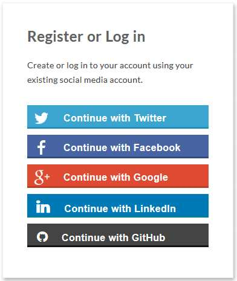
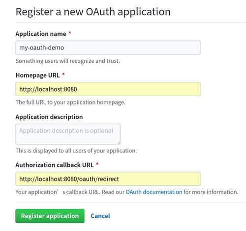
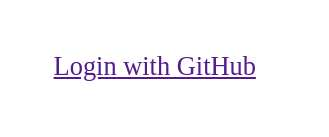
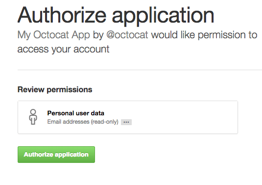

阮一峰的网络日志  » [首页](http://www.ruanyifeng.com/blog/) » [档案](http://www.ruanyifeng.com/blog/archives.html) 

​             

 [ ![img](data:image/png;base64,iVBORw0KGgoAAAANSUhEUgAAACAAAAAgCAYAAABzenr0AAAABGdBTUEAAK/INwWK6QAAABl0RVh0U29mdHdhcmUAQWRvYmUgSW1hZ2VSZWFkeXHJZTwAAAUzSURBVHjavFdbbFRVFF3nPjoz7dTWTittaW0jUDRAUqaNojyqREnEQKgfUj9MqqAmhqRt/OCD4CuY+Kckoh+aiGKC+gMJbdHoRysJ8dkhhmJLNdDKtJU+6GMK87j3Hs85d2Z6HzNtMYWb3Dn3NWftvfba+5xNYDl+e6Fkj6yqb/oDRbWq14vlPBLRKCITkxf0ROLt+hNjp1PPSRK4kA3vF1dXNRcWlyA2OQU9eos9opAkAiKxD+XkKO6t15aRWO7J/MgmAZU8MEgexgZHMX518Dh72sYMmVKShnxWuWHdHtxKIDIYTgMuDzgfmSOIQkYMpdUF8OY92Hytt4/jvkg47czzU16iQovM3QFwmNck+Yyduu7D6NA0Z6JR4THntFs9V4tWQg6Ui3s6MwKDncsFTnXKLJhDSeUK3AgPtyhccDzmVs999buRt/1Vm4i0od+hX7+MRG87jPGB/w1u8FPj9xEw7McVrnYuOCvtpjTth3J/nTg99c8LRhKhr6D3dTB5R24bXFwbMXBsyZzeoXaycEpJ95TB09AGX/NpqLVNtw8urnVzLvHjFNxiFqRy2OOHuqUVnue+ACkoWzo4O6lGzTmuHq6nPvY2m9rVqjrIK2rMEKxqyG5NPAKt+wjo0LklgfNxJkZMA3KJvqRUk3z5UFY3QH14P0h+WUY79HPvgv7VuSg4ZRGY1YgZgqXmORccF17sy2ehnf9AeO085K2HQFbtXBScj0LcpgF2cN+WV+DZ/LJQu6gD4R7oV7pBJwbSgtMvfiPoVp56DySwxm7EtkMs1WdAB7qzggsDJKQYsHucSkOudrkiCPWR/fA2nYCn8SNIK4NptSMyAu3sAdDRkIsJdfth0LzSrODUoPNZ4KI9SxJI5UHk7D4GdQfz2us31c7CoHMjRkKuDPHseCMrONVhNcDJwMJpKFVvg9L4OaTiNWm1x789KCqkrXhVBiEz0WYCT2nAzQAD1/vaETv1GrRfP4Vx5cfMNcDPwvP0h0DhanPym7OIf/+O67vcJ1/PCJ4KgdzaUP6Wz+dU+5yIL6fV+PsHGAOdwlPpvvUOyeeAVGyCdqkDNB6DPjsBSrnndfOGevOh3RhGItxvA+fX1CtbGFhgYUFkFMZPR6F1HnClHq8HyubWtJexX06CRmdt33hrd7nA7SFY4qoGpnYuOKcRykPPgDCBcsHx9Iv+fNL2PueBehCWUfYQIIMGLOCcOmXDXsh1+yCt35tUPfvzGFuSvzvoinXOxqa02qOhM6733nVP2MAdaej2XN11DPKjLZCD+yBvahGCo7JfTKAN9UD7s8Oe9zUNIhz8fWI8DG2k38WCFdxugANcXrvTVd1IEbuv3Jour7Hzn7jLMBNfKs7R3i67gRVrbeCOEDhinmWhAatsqdquM2XzHZINhK2cqTjHr/XZdVJUbgN3MWAVXKbSyg9jesRW2xP9di+lwrL5ojM3m2H/kG9hwcIA37c71W6wJdW2J2S5nrjYbq/t1AHAhJsKQeyfPvf6IMJgghPJhFZ4x0KlfLFvt22du45Au/A1SOlGc0P672XXwhLtOcM0kTTEMMd0qkVmMNXxMd/tsedUjInr4SQDgOfeXMSiN0FCL5WHah4L1qqYXPJOJlttd+a5M+YpcG5poLYKQ5f+6JJ4r8bbJYP47hq4r7QAs9PjYNhHJd4o8l5taiwuOpa7AS4XKqI/5NjJbTnaWK92nLdLuhQAJayRNMiygXPBeQN+Qbvu0zDc3y+aUzhbkGR73sI7ljvUnndx2q3t+X8CDAD66FtrIL864AAAAABJRU5ErkJggg==) ](http://www.ruanyifeng.com/feed.html)

- 上一篇：[每周分享第 52 期 ](http://www.ruanyifeng.com/blog/2019/04/weekly-issue-52.html)
- 下一篇：[每周分享第 53 期 ](http://www.ruanyifeng.com/blog/2019/04/weekly-issue-53.html)

分类：

- [开发者手册](http://www.ruanyifeng.com/blog/developer/)

# GitHub OAuth 第三方登录示例教程


作者： [阮一峰](http://www.ruanyifeng.com)

日期： [2019年4月21日](http://www.ruanyifeng.com/blog/2019/04/)

感谢 腾讯课堂NEXT学院 赞助本站，腾讯官方的前端培训 正在招生中。

     

这组 OAuth 系列教程，[第一篇](http://www.ruanyifeng.com/blog/2019/04/oauth_design.html)介绍了基本概念，[第二篇](http://www.ruanyifeng.com/blog/2019/04/oauth-grant-types.html)介绍了获取令牌的四种方式，今天演示一个实例，如何通过 OAuth 获取 API 数据。

很多网站登录时，允许使用第三方网站的身份，这称为"第三方登录"。



下面就以 GitHub 为例，写一个最简单的应用，演示第三方登录。

## 一、第三方登录的原理

所谓第三方登录，实质就是 OAuth 授权。用户想要登录 A 网站，A 网站让用户提供第三方网站的数据，证明自己的身份。获取第三方网站的身份数据，就需要 OAuth 授权。

举例来说，A 网站允许 GitHub 登录，背后就是下面的流程。

> 1. A 网站让用户跳转到 GitHub。
> 2. GitHub 要求用户登录，然后询问"A 网站要求获得 xx 权限，你是否同意？"
> 3. 用户同意，GitHub 就会重定向回 A 网站，同时发回一个授权码。
> 4. A 网站使用授权码，向 GitHub 请求令牌。
> 5. GitHub 返回令牌.
> 6. A 网站使用令牌，向 GitHub 请求用户数据。

下面就是这个流程的代码实现。

## 二、应用登记

一个应用要求 OAuth 授权，必须先到对方网站登记，让对方知道是谁在请求。

所以，你要先去 GitHub 登记一下。当然，我已经登记过了，你使用我的登记信息也可以，但为了完整走一遍流程，还是建议大家自己登记。这是免费的。

访问这个[网址](https://github.com/settings/applications/new)，填写登记表。



应用的名称随便填，主页 URL 填写`http://localhost:8080`，跳转网址填写 `http://localhost:8080/oauth/redirect`。

提交表单以后，GitHub 应该会返回客户端 ID（client ID）和客户端密钥（client secret），这就是应用的身份识别码。

## 三、示例仓库

我写了一个[代码仓库](https://github.com/ruanyf/node-oauth-demo)，请将它克隆到本地。

> ```bash
> $ git clone git@github.com:ruanyf/node-oauth-demo.git
> $ cd node-oauth-demo
> ```

两个配置项要改一下，写入上一步的身份识别码。

> - [`index.js`](https://github.com/ruanyf/node-oauth-demo/blob/master/index.js#L3)：改掉变量`clientID` and `clientSecret`
> - [`public/index.html`](https://github.com/ruanyf/node-oauth-demo/blob/master/public/index.html#L16)：改掉变量`client_id`

然后，安装依赖。

> ```bash
> $ npm install
> ```

启动服务。

> ```bash
> $ node index.js
> ```

浏览器访问`http://localhost:8080`，就可以看到这个示例了。

## 四、浏览器跳转 GitHub

示例的首页很简单，就是一个链接，让用户跳转到 GitHub。



跳转的 URL 如下。

> ```markup
> https://github.com/login/oauth/authorize?
>   client_id=7e015d8ce32370079895&
>   redirect_uri=http://localhost:8080/oauth/redirect
> ```

这个 URL 指向 GitHub 的 OAuth 授权网址，带有两个参数：`client_id`告诉 GitHub 谁在请求，`redirect_uri`是稍后跳转回来的网址。

用户点击到了 GitHub，GitHub 会要求用户登录，确保是本人在操作。

## 五、授权码

登录后，GitHub 询问用户，该应用正在请求数据，你是否同意授权。



用户同意授权， GitHub 就会跳转到`redirect_uri`指定的跳转网址，并且带上授权码，跳转回来的 URL 就是下面的样子。

> ```markup
> http://localhost:8080/oauth/redirect?
>   code=859310e7cecc9196f4af
> ```

后端收到这个请求以后，就拿到了授权码（`code`参数）。

## 六、后端实现

示例的[后端](https://github.com/ruanyf/node-oauth-demo/blob/master/index.js)采用 Koa 框架编写，具体语法请看[教程](http://www.ruanyifeng.com/blog/2017/08/koa.html)。

这里的关键是针对`/oauth/redirect`的请求，编写一个[路由](https://github.com/ruanyf/node-oauth-demo/blob/master/index.js#L16)，完成 OAuth 认证。

> ```javascript
> const oauth = async ctx => {
>   // ...
> };
> 
> app.use(route.get('/oauth/redirect', oauth));
> ```

上面代码中，`oauth`函数就是路由的处理函数。下面的代码都写在这个函数里面。

路由函数的第一件事，是从 URL 取出授权码。

> ```javascript
> const requestToken = ctx.request.query.code;
> ```

## 七、令牌

后端使用这个授权码，向 GitHub 请求令牌。

> ```javascript
> const tokenResponse = await axios({
>   method: 'post',
>   url: 'https://github.com/login/oauth/access_token?' +
>     `client_id=${clientID}&` +
>     `client_secret=${clientSecret}&` +
>     `code=${requestToken}`,
>   headers: {
>     accept: 'application/json'
>   }
> });
> ```

上面代码中，GitHub 的令牌接口`https://github.com/login/oauth/access_token`需要提供三个参数。

> - `client_id`：客户端的 ID
> - `client_secret`：客户端的密钥
> - `code`：授权码

作为回应，GitHub 会返回一段 JSON 数据，里面包含了令牌`accessToken`。

> ```javascript
> const accessToken = tokenResponse.data.access_token;
> ```

## 八、API 数据

有了令牌以后，就可以向 API 请求数据了。

> ```javascript
> const result = await axios({
>   method: 'get',
>   url: `https://api.github.com/user`,
>   headers: {
>     accept: 'application/json',
>     Authorization: `token ${accessToken}`
>   }
> });
> ```

上面代码中，GitHub API 的地址是`https://api.github.com/user`，请求的时候必须在 HTTP 头信息里面带上令牌`Authorization: token 361507da`。

然后，就可以拿到用户数据，得到用户的身份。

> ```javascript
> const name = result.data.name;
> ctx.response.redirect(`/welcome.html?name=${name}`);
> ```

（完）

### 文档信息

- 版权声明：自由转载-非商用-非衍生-保持署名（[创意共享3.0许可证](http://creativecommons.org/licenses/by-nc-nd/3.0/deed.zh)）
- 发表日期： 2019年4月21日

​     [Teambition：研发管理工具](https://www.teambition.com/tour?utm_source=ruanyifeng&utm_content=tour)     
​     [](https://www.teambition.com/tour?utm_source=ruanyifeng&utm_content=tour)   

​     [饥人谷：专业前端培训机构](http://qr.jirengu.com/api/taskUrl?tid=58)     
​     [](http://qr.jirengu.com/api/taskUrl?tid=50)   

## 相关文章

- 2019.04.09: [OAuth 2.0 的四种方式](http://www.ruanyifeng.com/blog/2019/04/oauth-grant-types.html)

  ​                               上一篇文章介绍了 OAuth 2.0 是一种授权机制，主要用来颁发令牌（token）。本文接着介绍颁发令牌的实务操作。                             

- 2019.04.04: [OAuth 2.0 的一个简单解释](http://www.ruanyifeng.com/blog/2019/04/oauth_design.html)

  ​                               OAuth 2.0 是目前最流行的授权机制，用来授权第三方应用，获取用户数据。                             

- 2019.03.25: [CSS Grid 网格布局教程](http://www.ruanyifeng.com/blog/2019/03/grid-layout-tutorial.html)

  ​                               一、概述  网格布局（Grid）是最强大的 CSS 布局方案。                             

- 2019.03.16: [普通人的网页配色方案](http://www.ruanyifeng.com/blog/2019/03/coloring-scheme.html)

  ​                               网页需要配色。一种好看、易用、符合心意的配色，是很不容易的，尤其在没有设计师时。                             

## 广告[（购买广告位）](http://www.ruanyifeng.com/support.html)

[API 调试和文档生成利器](https://www.apipost.cn/article/1003?fr=ruanyifeng)


[硅谷的机器学习课程](http://t.cn/ESy76dU)


## 留言（13条）

​                                                            francis   说：                  

感觉你的blog也可以加一个OAuth呀。。。
 web前端后端什么的看着头痛，框架太多了，不过思想倒是简洁

​                    2019年4月22日 07:37  | [#](http://www.ruanyifeng.com/blog/2019/04/github-oauth.html#comment-410701)  | [引用](http://www.ruanyifeng.com/blog/2019/04/github-oauth.html#comment-text) 

​                                                            路过看看   说：                  

Authorization: `token ${accessToken}`
 Authorization: `Bearer ${accessToken}`
 上面哪一种更标准？

​                    2019年4月22日 12:44  | [#](http://www.ruanyifeng.com/blog/2019/04/github-oauth.html#comment-410713)  | [引用](http://www.ruanyifeng.com/blog/2019/04/github-oauth.html#comment-text) 

​                                                            liuzhelei   说：                  

既然oauth可以使用access_token获取到用户信息,何必出现openid connect?

​                    2019年4月22日 14:29  | [#](http://www.ruanyifeng.com/blog/2019/04/github-oauth.html#comment-410715)  | [引用](http://www.ruanyifeng.com/blog/2019/04/github-oauth.html#comment-text) 

​                                                            Justin   说：                  

> ```
> 引用liuzhelei的发言：
> ```
>
> 既然oauth可以使用access_token获取到用户信息,何必出现openid connect?

openid connect 就是把获取用户信息的方式标准化了

​                    2019年4月22日 16:07  | [#](http://www.ruanyifeng.com/blog/2019/04/github-oauth.html#comment-410716)  | [引用](http://www.ruanyifeng.com/blog/2019/04/github-oauth.html#comment-text) 

​                                                            wx0322   说：                  

简单明了，偶像~

​                    2019年4月23日 14:40  | [#](http://www.ruanyifeng.com/blog/2019/04/github-oauth.html#comment-410751)  | [引用](http://www.ruanyifeng.com/blog/2019/04/github-oauth.html#comment-text) 

​                                                            gyxyl   说：                  

const name = result.data.name;
 应该是result.data.login，name取不到值，是null

​                    2019年4月23日 18:03  | [#](http://www.ruanyifeng.com/blog/2019/04/github-oauth.html#comment-410759)  | [引用](http://www.ruanyifeng.com/blog/2019/04/github-oauth.html#comment-text) 

​                                                            奥特曼   说：                  

"A 网站使用令牌，向 GitHub 请求用户数据"

刚测试了下CSDN的授权登录，这里拿到github的用户数据之后应该是会在CSDN注册一个类似临时账号(因为发现CSDN不支持GITHUB来注册账号)

​                    2019年4月25日 17:46  | [#](http://www.ruanyifeng.com/blog/2019/04/github-oauth.html#comment-410821)  | [引用](http://www.ruanyifeng.com/blog/2019/04/github-oauth.html#comment-text) 

​                                                            linzhu   说：                  

用户在A网站通过GitHub成功登录后，再次访问A网站时如何做到自动登录？
 每次登录A网站时都会向GitHub发送token获取用户信息吗？
 保存在前端网站的cookie是什么呢？

​                    2019年4月26日 12:23  | [#](http://www.ruanyifeng.com/blog/2019/04/github-oauth.html#comment-410864)  | [引用](http://www.ruanyifeng.com/blog/2019/04/github-oauth.html#comment-text) 

​                                                            qqq   说：                  

  上周一花了5分钟做好了git登录

​                    2019年4月26日 16:52  | [#](http://www.ruanyifeng.com/blog/2019/04/github-oauth.html#comment-410892)  | [引用](http://www.ruanyifeng.com/blog/2019/04/github-oauth.html#comment-text) 

​                                                            疯子牛   说：                  

阮老师，能否更深入一步再开一个系列就是 “OAuth2.0" 作为服务提供方的一些实现和流程。

​                    2019年5月 4日 22:26  | [#](http://www.ruanyifeng.com/blog/2019/04/github-oauth.html#comment-410998)  | [引用](http://www.ruanyifeng.com/blog/2019/04/github-oauth.html#comment-text) 

​                                                            一个大白   说：                  

我有一件事不明白，就是github申请的应用homepage地址和回跳地址，为什么使用localhost都行？

当用户同意授权， GitHub 跳转到redirect_uri指定的跳转网址，此时 github能知道localhost是谁吗？

我只知道一个ip或者域名可以，但不明白为何github知道localhost是谁？

​                    2019年5月 9日 09:53  | [#](http://www.ruanyifeng.com/blog/2019/04/github-oauth.html#comment-411068)  | [引用](http://www.ruanyifeng.com/blog/2019/04/github-oauth.html#comment-text) 

​                                                            [gansteed](https://jiajunhuang.com)   说：                  

> ```
> 引用路过看看的发言：
> ```
>
> Authorization: `token ${accessToken}`
>  Authorization: `Bearer ${accessToken}`
>  上面哪一种更标准？

好像一般都是 Bearer

​                    2019年5月10日 18:34  | [#](http://www.ruanyifeng.com/blog/2019/04/github-oauth.html#comment-411124)  | [引用](http://www.ruanyifeng.com/blog/2019/04/github-oauth.html#comment-text) 

​                                                            keeley   说：                  

> ```
> 引用一个大白的发言：
> ```
>
> 我有一件事不明白，就是github申请的应用homepage地址和回跳地址，为什么使用localhost都行？
>
> 当用户同意授权， GitHub 跳转到redirect_uri指定的跳转网址，此时 github能知道localhost是谁吗？
>
> 我只知道一个ip或者域名可以，但不明白为何github知道localhost是谁？

那个地址是客户端浏览器用的,浏览器直接跳转的,所以你自己本机起了就能跳转过去访问
 

​                    2019年5月14日 11:08  | [#](http://www.ruanyifeng.com/blog/2019/04/github-oauth.html#comment-411166)  | [引用](http://www.ruanyifeng.com/blog/2019/04/github-oauth.html#comment-text) 

## 我要发表看法


您的留言                     （HTML标签部分可用）


您的大名：

   «-必填

电子邮件：

   «-必填，不公开

个人网址：

   «-我信任你，不会填写广告链接

​                         记住个人信息？


   «- 点击按钮

2019 © [联系方式](http://www.ruanyifeng.com/contact.html) | [邮件订阅](https://app.feedblitz.com/f/f.fbz?Sub=348868)