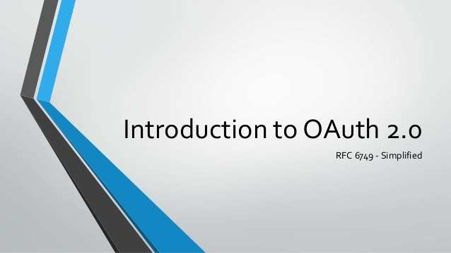
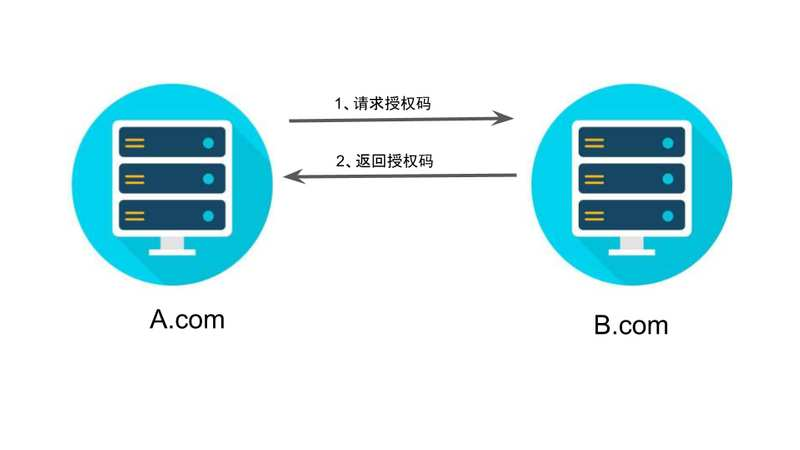
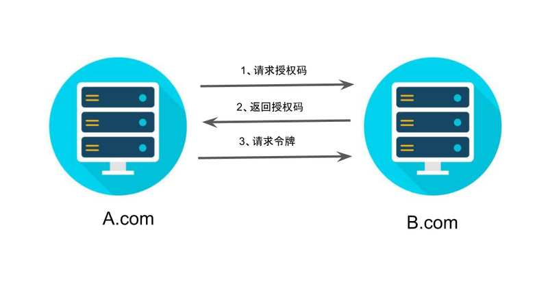
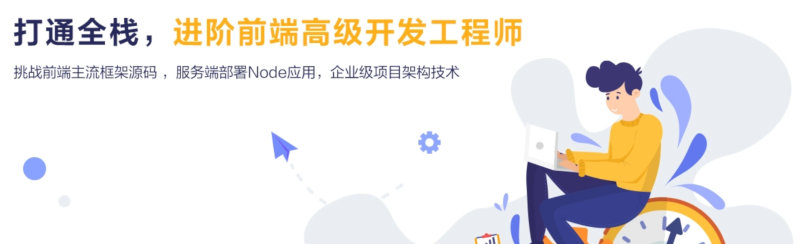
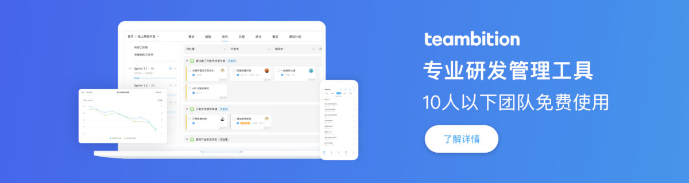
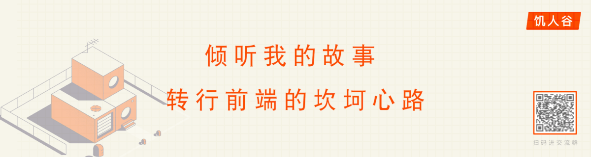
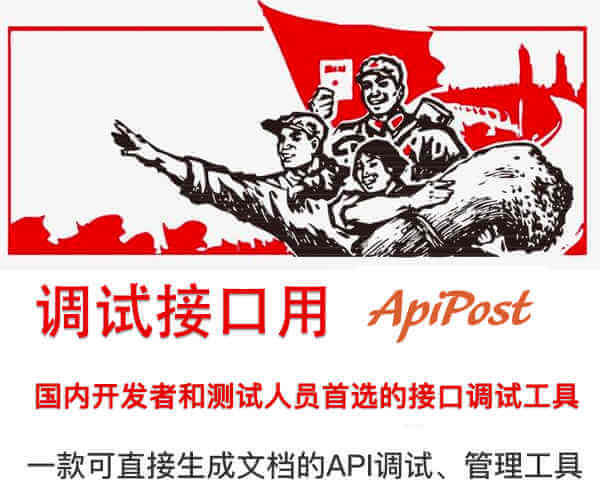

# OAuth 2.0 的四种方式


作者： [阮一峰](http://www.ruanyifeng.com)

日期： [2019年4月 9日](http://www.ruanyifeng.com/blog/2019/04/)

感谢 腾讯课堂NEXT学院 赞助本站，腾讯官方的前端培训 正在招生中。

     

[上一篇文章](http://www.ruanyifeng.com/blog/2019/04/oauth_design.html)介绍了 OAuth 2.0 是一种授权机制，主要用来颁发令牌（token）。本文接着介绍颁发令牌的实务操作。



下面我假定，你已经理解了 OAuth 2.0 的含义和设计思想，否则请先阅读这个系列的[上一篇文章](http://www.ruanyifeng.com/blog/2019/04/oauth_design.html)。

> 进入正文之前，插播一则活动消息。
>
> 4月22日（周一）到4月29日（下周一），每天晚上八点都有两小时的免费直播课，体系化介绍高级前端开发知识，网易云课堂主办。[详细介绍](http://www.ruanyifeng.com/blog/2019/04/oauth-grant-types.html#support)请看本文结尾，欢迎关注。

## RFC 6749

OAuth 2.0 的标准是 [RFC 6749](https://tools.ietf.org/html/rfc6749) 文件。该文件先解释了 OAuth 是什么。

> OAuth 引入了一个授权层，用来分离两种不同的角色：客户端和资源所有者。......资源所有者同意以后，资源服务器可以向客户端颁发令牌。客户端通过令牌，去请求数据。

这段话的意思就是，**OAuth 的核心就是向第三方应用颁发令牌。**然后，RFC 6749 接着写道：

> （由于互联网有多种场景，）本标准定义了获得令牌的四种授权方式（authorization grant ）。

也就是说，**OAuth 2.0 规定了四种获得令牌的流程。你可以选择最适合自己的那一种，向第三方应用颁发令牌。**下面就是这四种授权方式。

> - 授权码（authorization-code）
> - 隐藏式（implicit）
> - 密码式（password）：
> - 客户端凭证（client credentials）

注意，不管哪一种授权方式，第三方应用申请令牌之前，都必须先到系统备案，说明自己的身份，然后会拿到两个身份识别码：客户端 ID（client ID）和客户端密钥（client secret）。这是为了防止令牌被滥用，没有备案过的第三方应用，是不会拿到令牌的。

## 第一种授权方式：授权码

**授权码（authorization code）方式，指的是第三方应用先申请一个授权码，然后再用该码获取令牌。**

这种方式是最常用的流程，安全性也最高，它适用于那些有后端的 Web 应用。授权码通过前端传送，令牌则是储存在后端，而且所有与资源服务器的通信都在后端完成。这样的前后端分离，可以避免令牌泄漏。

第一步，A 网站提供一个链接，用户点击后就会跳转到 B 网站，授权用户数据给 A 网站使用。下面就是 A 网站跳转 B 网站的一个示意链接。

> ```javascript
> https://b.com/oauth/authorize?
>   response_type=code&
>   client_id=CLIENT_ID&
>   redirect_uri=CALLBACK_URL&
>   scope=read
> ```

上面 URL 中，`response_type`参数表示要求返回授权码（`code`），`client_id`参数让 B 知道是谁在请求，`redirect_uri`参数是 B 接受或拒绝请求后的跳转网址，`scope`参数表示要求的授权范围（这里是只读）。


第二步，用户跳转后，B 网站会要求用户登录，然后询问是否同意给予 A 网站授权。用户表示同意，这时 B 网站就会跳回`redirect_uri`参数指定的网址。跳转时，会传回一个授权码，就像下面这样。

> ```javascript
> https://a.com/callback?code=AUTHORIZATION_CODE
> ```

上面 URL 中，`code`参数就是授权码。



第三步，A 网站拿到授权码以后，就可以在后端，向 B 网站请求令牌。

> ```javascript
> https://b.com/oauth/token?
>  client_id=CLIENT_ID&
>  client_secret=CLIENT_SECRET&
>  grant_type=authorization_code&
>  code=AUTHORIZATION_CODE&
>  redirect_uri=CALLBACK_URL
> ```

上面 URL 中，`client_id`参数和`client_secret`参数用来让 B 确认 A 的身份（`client_secret`参数是保密的，因此只能在后端发请求），`grant_type`参数的值是`AUTHORIZATION_CODE`，表示采用的授权方式是授权码，`code`参数是上一步拿到的授权码，`redirect_uri`参数是令牌颁发后的回调网址。



第四步，B 网站收到请求以后，就会颁发令牌。具体做法是向`redirect_uri`指定的网址，发送一段 JSON 数据。

> ```javascript
> {    
>   "access_token":"ACCESS_TOKEN",
>   "token_type":"bearer",
>   "expires_in":2592000,
>   "refresh_token":"REFRESH_TOKEN",
>   "scope":"read",
>   "uid":100101,
>   "info":{...}
> }
> ```

上面 JSON 数据中，`access_token`字段就是令牌，A 网站在后端拿到了。


## 第二种方式：隐藏式

有些 Web 应用是纯前端应用，没有后端。这时就不能用上面的方式了，必须将令牌储存在前端。**RFC 6749 就规定了第二种方式，允许直接向前端颁发令牌。这种方式没有授权码这个中间步骤，所以称为（授权码）"隐藏式"（implicit）。**

第一步，A 网站提供一个链接，要求用户跳转到 B 网站，授权用户数据给 A 网站使用。

> ```javascript
> https://b.com/oauth/authorize?
>   response_type=token&
>   client_id=CLIENT_ID&
>   redirect_uri=CALLBACK_URL&
>   scope=read
> ```

上面 URL 中，`response_type`参数为`token`，表示要求直接返回令牌。

第二步，用户跳转到 B 网站，登录后同意给予 A 网站授权。这时，B 网站就会跳回`redirect_uri`参数指定的跳转网址，并且把令牌作为 URL 参数，传给 A 网站。

> ```javascript
> https://a.com/callback#token=ACCESS_TOKEN
> ```

上面 URL 中，`token`参数就是令牌，A 网站因此直接在前端拿到令牌。

注意，令牌的位置是 URL 锚点（fragment），而不是查询字符串（querystring），这是因为 OAuth 2.0 允许跳转网址是 HTTP 协议，因此存在"中间人攻击"的风险，而浏览器跳转时，锚点不会发到服务器，就减少了泄漏令牌的风险。


这种方式把令牌直接传给前端，是很不安全的。因此，只能用于一些安全要求不高的场景，并且令牌的有效期必须非常短，通常就是会话期间（session）有效，浏览器关掉，令牌就失效了。

## 第三种方式：密码式

**如果你高度信任某个应用，RFC 6749 也允许用户把用户名和密码，直接告诉该应用。该应用就使用你的密码，申请令牌，这种方式称为"密码式"（password）。**

第一步，A 网站要求用户提供 B 网站的用户名和密码。拿到以后，A 就直接向 B 请求令牌。

> ```javascript
> https://oauth.b.com/token?
>   grant_type=password&
>   username=USERNAME&
>   password=PASSWORD&
>   client_id=CLIENT_ID
> ```

上面 URL 中，`grant_type`参数是授权方式，这里的`password`表示"密码式"，`username`和`password`是 B 的用户名和密码。

第二步，B 网站验证身份通过后，直接给出令牌。注意，这时不需要跳转，而是把令牌放在 JSON 数据里面，作为 HTTP 回应，A 因此拿到令牌。

这种方式需要用户给出自己的用户名/密码，显然风险很大，因此只适用于其他授权方式都无法采用的情况，而且必须是用户高度信任的应用。

## 第四种方式：凭证式

**最后一种方式是凭证式（client credentials），适用于没有前端的命令行应用，即在命令行下请求令牌。**

第一步，A 应用在命令行向 B 发出请求。

> ```javascript
> https://oauth.b.com/token?
>   grant_type=client_credentials&
>   client_id=CLIENT_ID&
>   client_secret=CLIENT_SECRET
> ```

上面 URL 中，`grant_type`参数等于`client_credentials`表示采用凭证式，`client_id`和`client_secret`用来让 B 确认 A 的身份。

第二步，B 网站验证通过以后，直接返回令牌。

这种方式给出的令牌，是针对第三方应用的，而不是针对用户的，即有可能多个用户共享同一个令牌。

## 令牌的使用

A 网站拿到令牌以后，就可以向 B 网站的 API 请求数据了。

此时，每个发到 API 的请求，都必须带有令牌。具体做法是在请求的头信息，加上一个`Authorization`字段，令牌就放在这个字段里面。

> ```bash
> curl -H "Authorization: Bearer ACCESS_TOKEN" \
> "https://api.b.com"
> ```

上面命令中，`ACCESS_TOKEN`就是拿到的令牌。

## 更新令牌

令牌的有效期到了，如果让用户重新走一遍上面的流程，再申请一个新的令牌，很可能体验不好，而且也没有必要。OAuth 2.0 允许用户自动更新令牌。

具体方法是，B 网站颁发令牌的时候，一次性颁发两个令牌，一个用于获取数据，另一个用于获取新的令牌（refresh token 字段）。令牌到期前，用户使用 refresh token 发一个请求，去更新令牌。

> ```javascript
> https://b.com/oauth/token?
>   grant_type=refresh_token&
>   client_id=CLIENT_ID&
>   client_secret=CLIENT_SECRET&
>   refresh_token=REFRESH_TOKEN
> ```

上面 URL 中，`grant_type`参数为`refresh_token`表示要求更新令牌，`client_id`参数和`client_secret`参数用于确认身份，`refresh_token`参数就是用于更新令牌的令牌。

B 网站验证通过以后，就会颁发新的令牌。

写到这里，颁发令牌的四种方式就介绍完了。[下一篇文章](http://www.ruanyifeng.com/blog/2019/04/github-oauth.html)会编写一个真实的 Demo，演示如何通过 OAuth 2.0 向 GitHub 的 API 申请令牌，然后再用令牌获取数据。

（正文完）


## 前端高级开发工程师免费直播课

经过多年的发展，前端工程师的地位日益提升，越来越多的人想往前端的方向发展。

但是，市场对前端工程师的要求也越来越高，深入掌握底层技术的高级前端，才能在市场上找到自己立足之地。



为了帮助大家深入了解高级前端的学习要点，4月22日（周一）到4月29日（下周一），网易云课堂推出了[前端进阶免费直播课](https://url.163.com/mYh)。

> - 周一（4月22日）：《前端不会点 node 怎么行，node http 模块详解》
> - 周二（4月23日）：《进阶面试必备的三大技术题》
> - 周三（4月24日）：《前端高级工程师核心装备之柯里化》
> - 周四（4月25日）：《手把手带你实现 Vue 的 MVVM》
> - 周五（4月26日）：《JQuery 原理分析》
> - 周六（4月27日）：《用迭代器模式让你的脱离繁重的数据处理 》
> - 周日（4月28日）：《前端性能--JS的防抖节流实现与案例场景》
> - 周一（4月29日）：《阿里巴巴 P5 面试题讲解》
>
> （更多介绍[点击这里](https://url.163.com/mYh)）

他们邀请了[网易资深前端工程师](https://url.163.com/mYh)，免费直播分享实战中的经验方法。内容涉及网易内部自定组件库工具分享，前端开发相关知识，深度剖析 JavaScript 等。

这个直播面向前端初、中级开发工程师，每天2个小时，都是一些干货分享并且不收费，建议想进阶的同学坚持学习。大家可以微信扫码，添加助教，获取听课地址。


（完）

### 文档信息

- 版权声明：自由转载-非商用-非衍生-保持署名（[创意共享3.0许可证](http://creativecommons.org/licenses/by-nc-nd/3.0/deed.zh)）
- 发表日期： 2019年4月 9日

​     [Teambition：研发管理工具](https://www.teambition.com/tour?utm_source=ruanyifeng&utm_content=tour)     
​     [](https://www.teambition.com/tour?utm_source=ruanyifeng&utm_content=tour)   

​     [饥人谷：专业前端培训机构](http://qr.jirengu.com/api/taskUrl?tid=58)     
​     [](http://qr.jirengu.com/api/taskUrl?tid=50)   

## 相关文章

- 2019.04.21: [GitHub OAuth 第三方登录示例教程](http://www.ruanyifeng.com/blog/2019/04/github-oauth.html)

  ​                               这组 OAuth 系列教程，第一篇介绍了基本概念，第二篇介绍了获取令牌的四种方式，今天演示一个实例，如何通过 OAuth 获取 API 数据。                             

- 2019.04.04: [OAuth 2.0 的一个简单解释](http://www.ruanyifeng.com/blog/2019/04/oauth_design.html)

  ​                               OAuth 2.0 是目前最流行的授权机制，用来授权第三方应用，获取用户数据。                             

- 2019.03.25: [CSS Grid 网格布局教程](http://www.ruanyifeng.com/blog/2019/03/grid-layout-tutorial.html)

  ​                               一、概述  网格布局（Grid）是最强大的 CSS 布局方案。                             

- 2019.03.16: [普通人的网页配色方案](http://www.ruanyifeng.com/blog/2019/03/coloring-scheme.html)

  ​                               网页需要配色。一种好看、易用、符合心意的配色，是很不容易的，尤其在没有设计师时。                             

## 广告[（购买广告位）](http://www.ruanyifeng.com/support.html)

[API 调试和文档生成利器](https://www.apipost.cn/article/1003?fr=ruanyifeng)



[硅谷的机器学习课程](http://t.cn/ESy76dU)


## 留言（13条）

​                                                            [chrisyue](https://chrisyue.com)   说：                  

Implicit Flow 返回 access token 时，不应该用 query (?token=TOKEN-xxx) 而是 fragment (#TOKEN-xxx)

这在 RFC 6749 里是有规定的 <https://tools.ietf.org/html/rfc6749#section-4.2>

在 implicit 中使用 fragment 传递 token 是很巧妙的设计，具体原因可见：https://www.chrisyue.com/?p=3178

​                    2019年4月 9日 11:28  | [#](http://www.ruanyifeng.com/blog/2019/04/oauth-grant-types.html#comment-410448)  | [引用](http://www.ruanyifeng.com/blog/2019/04/oauth-grant-types.html#comment-text) 

​                                                            阮一峰   说：                  

@chrisyue：

谢谢指出，这一点真没注意到，涨知识了。我一会就把原文改掉。

​                    2019年4月 9日 11:49  | [#](http://www.ruanyifeng.com/blog/2019/04/oauth-grant-types.html#comment-410449)  | [引用](http://www.ruanyifeng.com/blog/2019/04/oauth-grant-types.html#comment-text) 

​                                                            [Ceniy](https://gensfit.info)   说：                  

Demo 会使用 vue 和axios吗？ 还是原始的ajax，最近正好碰到这个问题了，token过期后，底层需要能自动去刷新token，还得避免 有多个并发请求的时候，会不会导致这些请求同时都在进行刷新token ？

​                    2019年4月 9日 14:26  | [#](http://www.ruanyifeng.com/blog/2019/04/oauth-grant-types.html#comment-410451)  | [引用](http://www.ruanyifeng.com/blog/2019/04/oauth-grant-types.html#comment-text) 

​                                                            skywalker   说：                  

阮老师写的通俗易懂

​                    2019年4月 9日 15:52  | [#](http://www.ruanyifeng.com/blog/2019/04/oauth-grant-types.html#comment-410455)  | [引用](http://www.ruanyifeng.com/blog/2019/04/oauth-grant-types.html#comment-text) 

​                                                            kergee   说：                  

单点登录一般采用哪种比较多？

​                    2019年4月 9日 19:22  | [#](http://www.ruanyifeng.com/blog/2019/04/oauth-grant-types.html#comment-410460)  | [引用](http://www.ruanyifeng.com/blog/2019/04/oauth-grant-types.html#comment-text) 

​                                                            coderlim   说：                  

授权码方式，前端去后端拿了一个授权码，然后拿着授权码再去后端拿令牌，授权码和令牌都是后端产生的，为什么这种方式比直接拿令牌安全呢？

​                    2019年4月10日 10:07  | [#](http://www.ruanyifeng.com/blog/2019/04/oauth-grant-types.html#comment-410466)  | [引用](http://www.ruanyifeng.com/blog/2019/04/oauth-grant-types.html#comment-text) 

​                                                            LouXudong   说：                  

> ```
> 引用coderlim的发言：
> ```
>
> 授权码方式，前端去后端拿了一个授权码，然后拿着授权码再去后端拿令牌，授权码和令牌都是后端产生的，为什么这种方式比直接拿令牌安全呢？

因为获取授权码的方式是通过浏览器跳页(get请求)，返回的授权码展示在地址栏，安全性不高。而获取令牌可以使用post请求。另外，因为授权码与发起请求的URL是关联的，所以另一个网站使用你的授权码是无法成功得到令牌的。

​                    2019年4月10日 18:41  | [#](http://www.ruanyifeng.com/blog/2019/04/oauth-grant-types.html#comment-410474)  | [引用](http://www.ruanyifeng.com/blog/2019/04/oauth-grant-types.html#comment-text) 

​                                                            [DanielDuan](http://895004881@qq.com)   说：                  

请问一下：A网站拿到B网站颁发的令牌后，是否直接将token返回给访问A网站的浏览器？如果是，当用户再次通过浏览器、携带token访问A网站的时候，A如何校验该令牌是否有效呢？A网站的后端会保存B网站之前返回的token，然后直接比较是否相等，还是A网站携带浏览器发出的token，去B网站校验？

​                    2019年4月17日 21:51  | [#](http://www.ruanyifeng.com/blog/2019/04/oauth-grant-types.html#comment-410599)  | [引用](http://www.ruanyifeng.com/blog/2019/04/oauth-grant-types.html#comment-text) 

​                                                            wangyifei   说：                  

> ```
> 引用DanielDuan的发言：
> ```
>
> 请问一下：A网站拿到B网站颁发的令牌后，是否直接将token返回给访问A网站的浏览器？如果是，当用户再次通过浏览器、携带token访问A网站的时候，A如何校验该令牌是否有效呢？A网站的后端会保存B网站之前返回的token，然后直接比较是否相等，还是A网站携带浏览器发出的token，去B网站校验？

首先作者说的获取令牌有多种方式，如果是通过授权码，令牌是发到A后台的，如果是隐藏式，那么是发到前端的，也就是给浏览器的。这个token是B产生的，当然是在访问B资源的时候在B验证

​                    2019年4月18日 17:09  | [#](http://www.ruanyifeng.com/blog/2019/04/oauth-grant-types.html#comment-410616)  | [引用](http://www.ruanyifeng.com/blog/2019/04/oauth-grant-types.html#comment-text) 

​                                                            wangyifei   说：                  

> ```
> 引用LouXudong的发言：
> ```
>
> 因为获取授权码的方式是通过浏览器跳页(get请求)，返回的授权码展示在地址栏，安全性不高。而获取令牌可以使用post请求。另外，因为授权码与发起请求的URL是关联的，所以另一个网站使用你的授权码是无法成功得到令牌的。

授权码是B应用用来验证A应用的请求是经过用户登陆验证的
 

​                    2019年4月18日 18:08  | [#](http://www.ruanyifeng.com/blog/2019/04/oauth-grant-types.html#comment-410619)  | [引用](http://www.ruanyifeng.com/blog/2019/04/oauth-grant-types.html#comment-text) 

​                                                            Sky、Memory   说：                  

第一种授权方式里面，获取access_token时带上的redirect_uri参数，RFC 6749里面的解释是拿来做验证的，具体可见: <https://tools.ietf.org/html/rfc6749#section-4.1>

​                    2019年4月24日 21:14  | [#](http://www.ruanyifeng.com/blog/2019/04/oauth-grant-types.html#comment-410795)  | [引用](http://www.ruanyifeng.com/blog/2019/04/oauth-grant-types.html#comment-text) 

​                                                            Chenyang   说：                  

是不是意味着A网站持有用户授权过的B网站access token和refresh token的话，自身不需要用户再次授权就可以一直访问B网站上的资源.

​                    2019年5月 1日 20:45  | [#](http://www.ruanyifeng.com/blog/2019/04/oauth-grant-types.html#comment-410971)  | [引用](http://www.ruanyifeng.com/blog/2019/04/oauth-grant-types.html#comment-text) 

​                                                            咔咔咔   说：                  

老师你好  如果要做一个api平台 ,做成两个系统 , 一个是后台系统  给用户授权可用的接口    一个是客户访问的系统  后台系统管理员授权之后   客户可以调用已授权的接口 ,  这种应用场景 适用于哪种授权模式呢? 请老师指教一下

​                    2019年5月 8日 10:28  | [#](http://www.ruanyifeng.com/blog/2019/04/oauth-grant-types.html#comment-411056)  | [引用](http://www.ruanyifeng.com/blog/2019/04/oauth-grant-types.html#comment-text) 