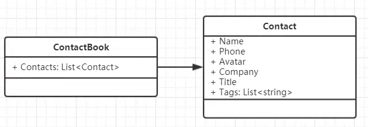
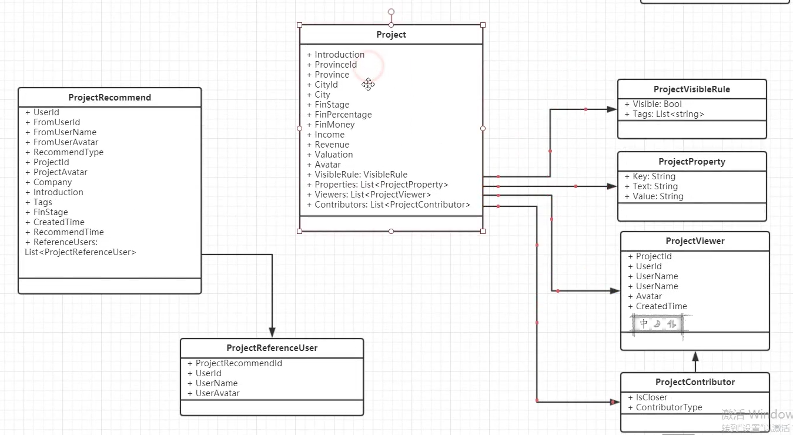

微服务拆分和上下文的确定

项目

身份与访问

项目推荐

通讯录

a 

消息	元数据

查询的时候	跨服务查询，难以管理

或者权衡不频繁的变更【几乎不修改】	来做冗余

​				用户信息变更的时候进行同步

衍生

##	User

- Project
- VisibleRule
- Viewer
- ProjectContributor

业务规模拆开	适合业务则为最好的

## Project

- Project
- VisibleRule
- Viewer
- ProjectContributor
  - 项目类型，投资类型

Key-Value