微服务拆分和上下文的确定

项目

身份与访问

项目推荐

通讯录

a 

消息	元数据

##	原界限上下文

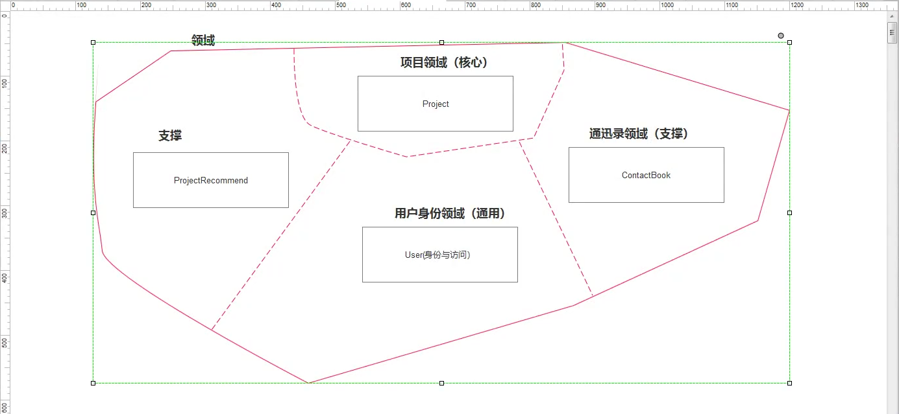

查询的时候	跨服务查询，难以管理

或者权衡不频繁的变更【几乎不修改】	来做冗余

​				用户信息变更的时候进行同步

衍生

##	丰富界限上下文

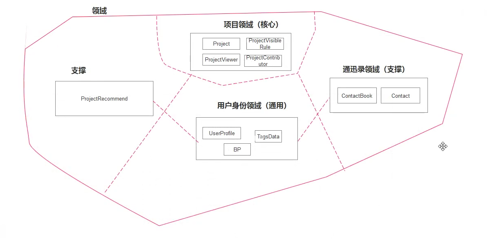

##	User

###	User-Info

- Project
- VisibleRule
- Viewer
- ProjectContributor

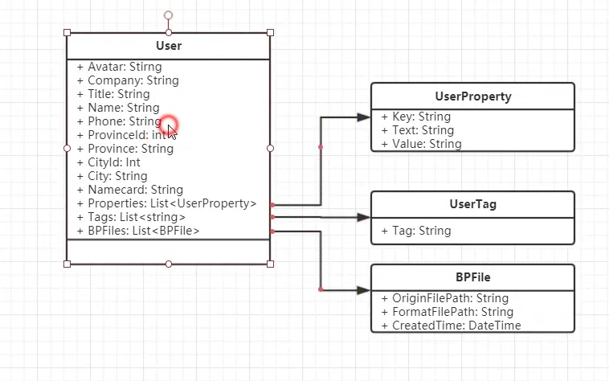

Key-Value

Company

Gender

省市县

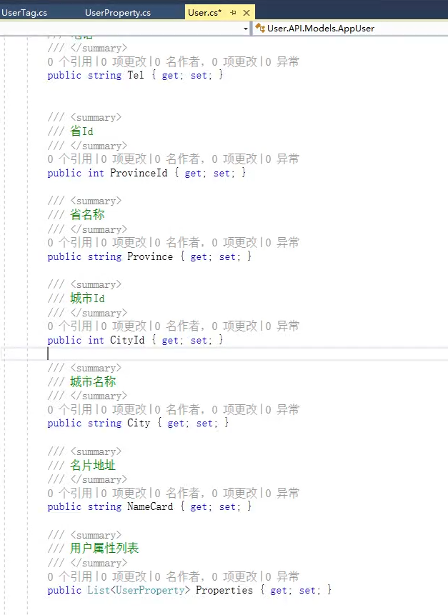

###	**UserProperty**	

userId

key

Text

Value

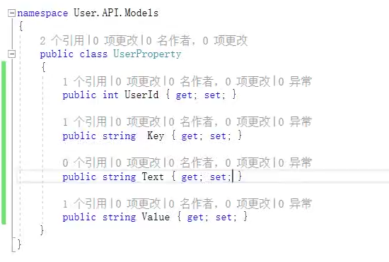

###	**User	TagsData**

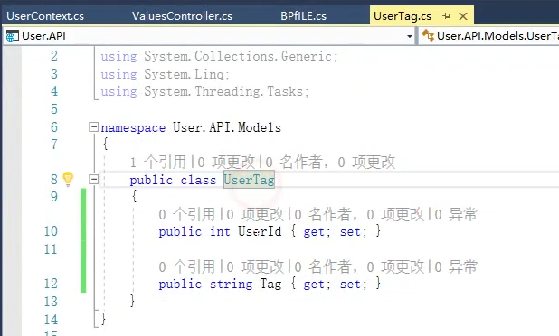

###	BPFile

Id

FileName

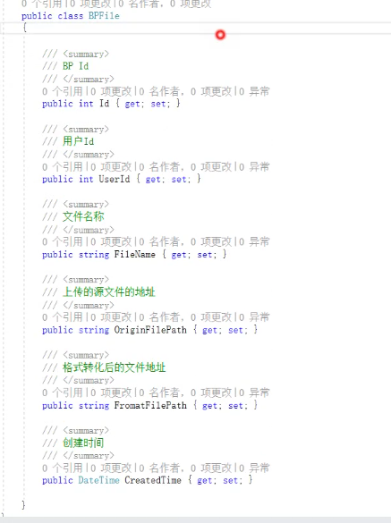

###	UserContext` modelBuilder

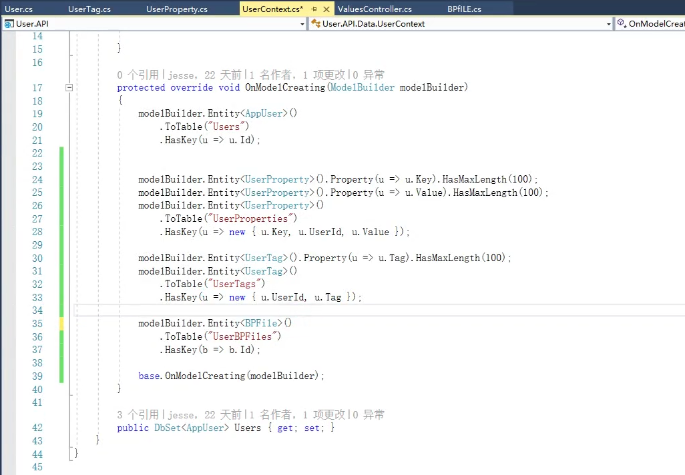

###	Docker -mysql

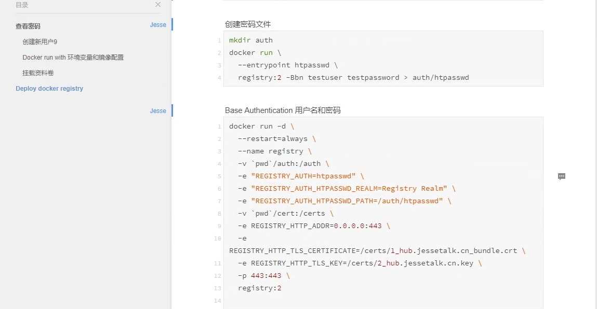

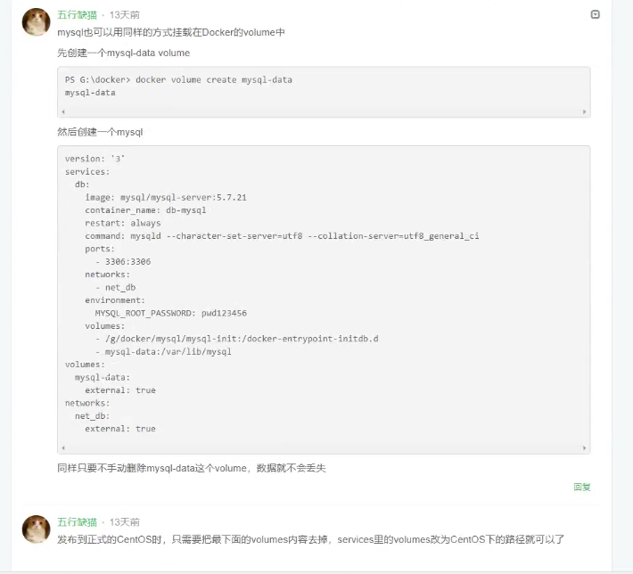

##	User	Contact

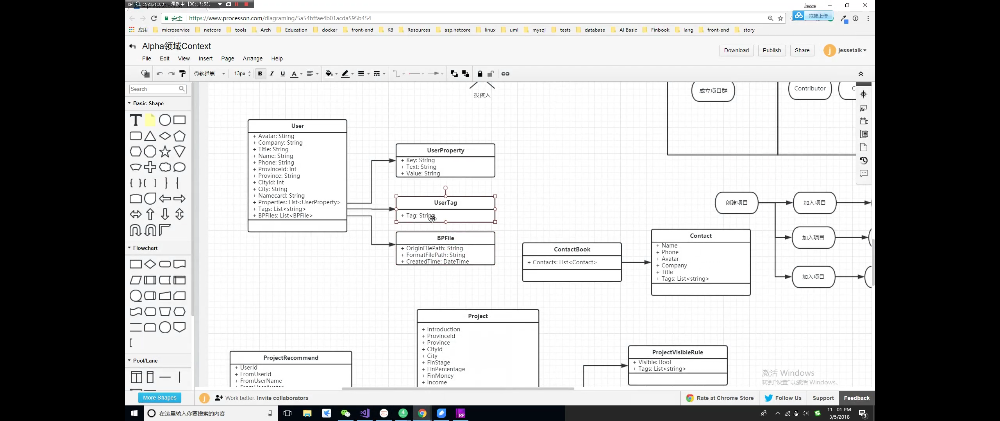

业务规模拆开	适合业务则为最好的

##	Contact

## Project

- Project
- VisibleRule
- Viewer
- ProjectContributor
  - 项目类型，投资类型

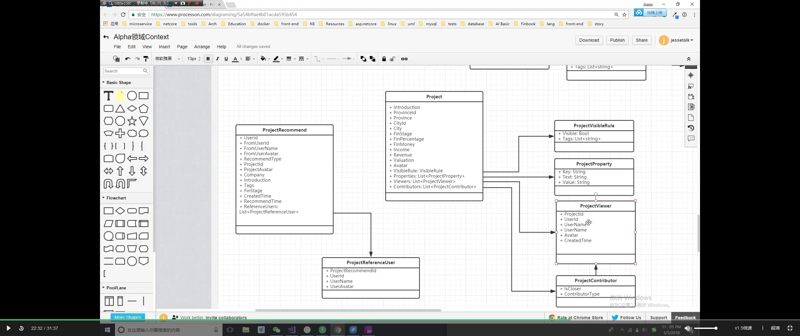

##	Users接口大纲

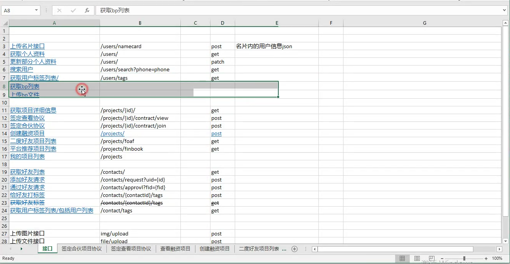

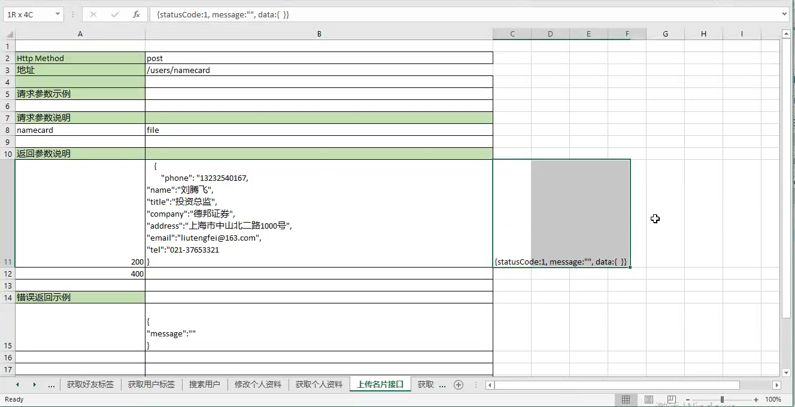

###	Get	Patch

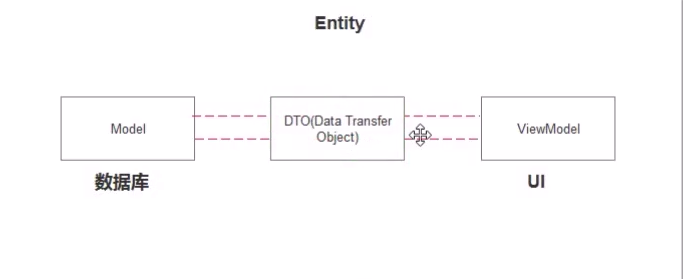

###	AsNoTracking	无需追踪

UserIdentity	用户

【63	用户信息-Dto	Model 】

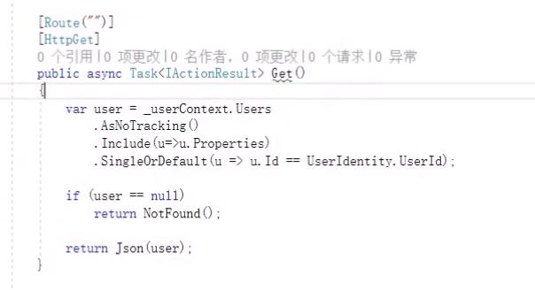

