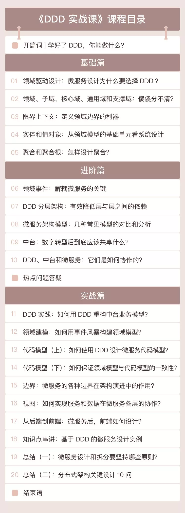

##                                                              DDD 和微服务之间是什么关系？如何实战DDD？

​            欧创新                                                 [                         极客时间                      ](javascript:void(0);)                                                              *2019-10-14*                

众所周知，微服务架构能让系统的开发与运维管理变得简单高效，还能提高系统的可用性。随着微服务的不断流行，我们开始**在自己的业务中落地微服务。**

但是当实际执行时，我们才发现就算采用了微服务架构也不能解决问题，反而带来**很多开发与运维上的负担。**

于是我们试着去找解决方案，最后发现其实是自己划分微服务的方法错了，我们应该**用 DDD（领域驱动设计） 的思想去指导微服务的实践。**

> - 什么是 DDD 呢？
> - DDD 与微服务之间有着什么样的联系？
> - 为什么最近的中台文章也开始大谈 DDD？

**简单来说，DDD 的本质是一种软件设计方法，而微服务架构是具体的实现方式。**微服务架构虽好，但是他并没有给出如何对复杂系统进行分解的具体方法论，而 DDD 正好就是解决方案。

### 设计的一体性

DDD 强调领域模型和微服务设计的一体性，先有领域模型然后才有微服务，而不是脱离领域模型来谈微服务设计。

中台本质是领域模型，微服务是领域模型的系统落地，DDD 是一种设计思想，它可以同时指导中台领域建模型和微服务设计，**这就是 DDD、中台和微服务的铁三角关系。**

**如何学好 DDD 呢？****我认为遵循下面这 3 个步骤就可以了：**

> - 第 1 步：理解 DDD 的核心知识体系和设计思想；
> - 第 2 步：和项目团队一起用事件风暴方法构建领域模型；
> - 第 3 步：根据领域模型和正确的微服务设计方法亲自动手设计几个微服务（实战）。

DDD 看似复杂，学习起来并不困难，所以，我开设了这门《DDD 实战课》，希望可以帮你和你的团队**建立一套完整而系统的基于 DDD 的微服务设计方法。**

优惠口令「 DDD123456 」，立减 ¥5

我是谁？

我是欧创新，人保高级架构师，一名奋斗在架构一线十余年的技术人，很高兴认识你。

我有多年 DDD 研究和实战落地的经验，热衷于采用 DDD 的设计方法实现中台领域建模，专注基于 DDD 的微服务设计和开发。

另外，我还在深入探索传统企业中台数字化转型的技术和方法体系。

我是如何设计这门课的？

我将《DDD 实战课》的内容分为了三大部分：基础篇、进阶篇和实战篇，下面我逐一给大家介绍。

###  **基础篇**

基础篇主要讲解 DDD 的核心知识体系，具体包括：领域、子域、核心域、通用域、支撑域、限界上下文、实体、值对象、聚合和聚合根等概念。我会用浅显易懂的案例带你理解它们以及它们之间的合作、依赖关系。

 **进阶篇**

进阶篇主要讲解领域事件、DDD 分层架构、几种常见的微服务架构模以及中台设计思想等内容，具体来说包括以下内容：：

> 1. 如何通过领域事件实现微服务解耦？
> 2. 怎样进行微服务分层设计？
> 3. 如何实现层与层之间的服务协作？
> 4. 领域模型和微服务分层的作用和价值？
> 5. 如何实现前中后台的协同和融合？
> 6. 如何利用 DDD 进行中台设计？

 **实战篇**

实战篇是我们专栏课程的重点，我准备了 4 个实战案例。

1、中台和领域建模的实战

这部分我会带你了解如何用 DDD 设计思想构建企业级可复用的中台业务模型，了解事件风暴以及用事件风暴构建领域模型的过程。

2、微服务设计实战

这部分我会带你了解如何用 DDD 设计微服务代码模型，如何从领域模型完成微服务设计，建立领域模型与微服务代码模型的映射关系，如何完成微服务的架构演进等。

3、实战用 DDD 完成领域建模和微服务设计全流程

这部分我会用一个典型的案例将 DDD 所有的知识点串联在一起，带你深入了解如何用 DDD 的设计思想，完成领域建模和微服务设计的全流程。

4、前端应用设计

最后一个案例，我还会补充分享一个前端的最新设计思想，带你了解如何用微服务的设计思想来设计前端应用，实现前端应用的解耦。最后，我还为你总结了微服务设计原则以及分布式架构设计的关键注意事项。

下面是本专栏的目录

学完本专栏你将收获什么？

总结一下，我希望这个专栏能带给你这样 4 点收获：

1、DDD 必知必会 10 大核心概念

2、掌握事件风暴与领域建模

3、上手中台业务建模与设计

4、实战设计清晰的微服务架构

学完之后，相信你可以掌握从战略设计到战术设计的微服务标准设计过程，使你的微服务设计思路更清晰，设计过程更规范，让你的中台和微服务落地如虎添翼。

现在订阅有

