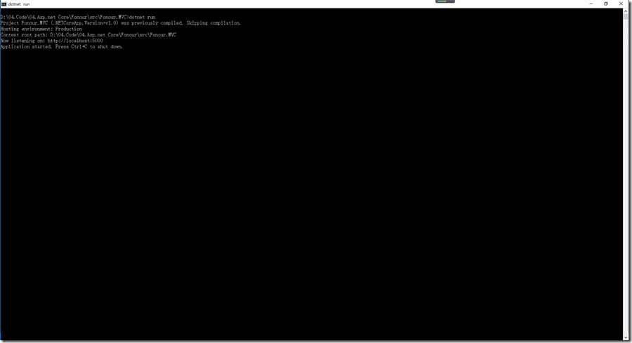

#  			[Asp.Net Core 项目实战之权限管理系统（0） 无中生有](https://www.cnblogs.com/fonour/p/5848933.html) 		


**0 Asp.Net Core 项目实战之权限管理系统（0） 无中生有**

**1 Asp.Net Core 项目实战之权限管理系统（1） 使用AdminLTE搭建前端**

**2 Asp.Net Core 项目实战之权限管理系统（2） 功能及实体设计**

**3 Asp.Net Core 项目实战之权限管理系统（3） 通过EntityFramework Core使用PostgreSQL**

**4 Asp.Net Core 项目实战之权限管理系统（4） 依赖注入、仓储、服务的多项目分层实现**

**5 Asp.Net Core 项目实战之权限管理系统（5） 用户登录**

**6 Asp.Net Core 项目实战之权限管理系统（6） 功能管理**

**7 Asp.Net Core 项目实战之权限管理系统（7） 组织机构、角色、用户权限**

**8 Asp.Net Core 项目实战之权限管理系统（8） 功能菜单的动态加载**

**github源码地址**

# 0 前言

<http://www.cnblogs.com/fonour/p/5848933.html>

学习的最好方法就是动手去做，这里以开发一个普通的权限管理系统的方式来从零体验和学习Asp.net Core。项目的整体规划大致如下：

**技术路线**

- Asp.net Core Mvc
- EntityFrameworkCore
- Bootstrap AdminLTE
- PostgreSQL

**实现功能**

- 组织机构管理
- 角色管理
- 用户管理
- 功能管理
- 权限管理

# 1 开发环境准备

1、安装Visual Studio 2015，我这里安装的是专业版。

2、安装.NET Core SDK相关

需要安装**Visual Studio 2015 update3和NET Core 1.0.0 - VS 2015 Tooling**

# 2 新建项目

打开Visual Studio 2015，选择项目保存路径，输入项目名称及解决方案名称，新建一个Asp.Net Core Web Application (.NET Core)项目。

[](http://images2015.cnblogs.com/blog/816310/201609/816310-20160907121405535-770650688.png)

为了更好的理解Asp.net Core的一些东西，我这里选择了空模板

[](http://images2015.cnblogs.com/blog/816310/201609/816310-20160907121407035-657497278.png)

创建好的项目是长这个样子的

[](http://images2015.cnblogs.com/blog/816310/201609/816310-20160907121407941-1015559173.png)

解决方案中相关文件大致说明

- wwwroot      存放js，css，images等静态资源
- Program.cs   应用程序入口
- Startup.cs    应用程序相关启动项配置，包含ConfigureServices和Configure两个方法，前者负责服务的配置，后者负责http请求管道的配置。
- project.json  项目的基础配置文件

删除示例页面Project_Readme.html，此时我们直接F5运行程序，界面输出HelloWorld，这是因为Stratup.cs中

[](javascript:void(0);)

```
        public void Configure(IApplicationBuilder app, IHostingEnvironment env, ILoggerFactory loggerFactory)
        {
            loggerFactory.AddConsole();

            if (env.IsDevelopment())
            {
                app.UseDeveloperExceptionPage();
            }

            app.Run(async (context) =>
            {
                await context.Response.WriteAsync("Hello World!");
            });
        }
```

[](javascript:void(0);)

# 3 Mvc基本应用

## 3.0 添加MVC依赖项引用

添加MVC引用有两种方法。

**1 通过project.json**

打开project.json文件，在dependencies部门增加Microsoft.AspNetCore.Mvc的引用，当你输入时，Visual Studio会有自动的提示，非常贴心方便。

[](javascript:void(0);)

```
"dependencies": {
    "Microsoft.NETCore.App": {
      "version": "1.0.0",
      "type": "platform"
    },
    "Microsoft.AspNetCore.Diagnostics": "1.0.0",
    
    "Microsoft.AspNetCore.Server.IISIntegration": "1.0.0",
    "Microsoft.AspNetCore.Server.Kestrel": "1.0.0",
    "Microsoft.Extensions.Logging.Console": "1.0.0",
    "Microsoft.AspNetCore.Mvc": "1.0.0"
  },
```

[](javascript:void(0);)

**2 通过NuGet**

通过NuGet管理器搜索Microsoft.AspNetCore.Mvc添加引用，或直接在程序包管理器控制台输入命令*Install*-*Package* *Microsoft*.*AspNetCore*.*Mvc*即可完成Mvc引用的添加。

## 3.1 添加控制器

右键添加项目文件夹，命名为Controllers，右键Controllers文件夹，添加一个名字为HomeController的控制器。

[](http://images2015.cnblogs.com/blog/816310/201609/816310-20160907121409160-850524969.png)

## 3.2 添加视图

右键项目添加Views文件夹，右键Views文件夹添加一个Home文件夹，与HomeController控制器相对应，在Home文件夹下新建一个名称为Index的视图文件。

[](http://images2015.cnblogs.com/blog/816310/201609/816310-20160907121410316-1012533182.png)

将Index.cshtml的内容修改为

```
<h1>Hello,Asp.Net Core MVC</h1>
```

## 3.3 添加MVC服务及Http请求管道处理

**1 添加MVC服务**

修改Startup.cs的ConfigureServices方法如下

```
        public void ConfigureServices(IServiceCollection services)
        {
            services.AddMvc();
        }
```

**2 添加Http请求管道处理**

修改Startup.cs的Configure方法如下

[](javascript:void(0);)

```
        public void Configure(IApplicationBuilder app, IHostingEnvironment env, ILoggerFactory loggerFactory)
        {
            loggerFactory.AddConsole();

            if (env.IsDevelopment())
            {
                app.UseDeveloperExceptionPage();
            }

            app.UseMvcWithDefaultRoute();
            //app.Run(async (context) =>
            //{
            //    await context.Response.WriteAsync("Hello World!");
            //});
        }
```

[](javascript:void(0);)

F5运行程序，可以看到已经可以按照mvc的默认路由机制解析了。

[](http://images2015.cnblogs.com/blog/816310/201609/816310-20160907121411551-772936763.png)

# 4 Asp.Net Core默认的两种寄宿方式

Asp.Net Core应用程序默认提供IIS服务和Kestrel服务两种寄宿方式，意味着Asp.Net Core应用程序可以脱离IIS运行，这也是跨平台的基础。在Program.cs文件中可以看到这种服务的添加。

[](javascript:void(0);)

```
        public static void Main(string[] args)
        {
            var host = new WebHostBuilder()
                .UseKestrel()
                .UseContentRoot(Directory.GetCurrentDirectory())
                .UseIISIntegration()
                .UseStartup<Startup>()
                .Build();

            host.Run();
        }
```

[](javascript:void(0);)

Visual Studio的默认启动选项为IIS Express，即采用IIS服务方式，我们可以通过以下两种方式使用Kestrel服务运行我们的程序

**1 在VS的启动选项中选择我们的项目名称同名的选项，然后F5运行。**

[](http://images2015.cnblogs.com/blog/816310/201609/816310-20160907121412269-1248869702.png)

**2 在项目文件夹根目录，按住Shift键，点击鼠标右键，单击“在此处打开命令窗口”菜单，输入dotnet run命令。**

[](http://images2015.cnblogs.com/blog/816310/201609/816310-20160907121412973-1641942349.png)

会提示应用程序服务已经启动，并且地址为<http://localhost:5000>，我们打开浏览器输入这个地址，可以看到页面输出了我们预期的结果，与使用IIS服务是同样的效果。

可以在Program.cs通过使用UseUrls方法修改应用程序的地址。

[](javascript:void(0);)

```
        public static void Main(string[] args)
        {
            var host = new WebHostBuilder()
                .UseKestrel()
                .UseUrls("http://localhost:8000")
                .UseContentRoot(Directory.GetCurrentDirectory())
                .UseIISIntegration()
                .UseStartup<Startup>()
                .Build();

            host.Run();
        }
```

[](javascript:void(0);)

作者：[Fonour](http://fonour.cnblogs.com/)

出处：<http://fonour.cnblogs.com/>

本文版权归作者和博客园共有，欢迎转载，但未经作者同意必须保留此段声明，且在文章页面明显位置给出原文连接，否则保留追究法律责任的权利。


分类: [Asp.net Core](https://www.cnblogs.com/fonour/category/869398.html)