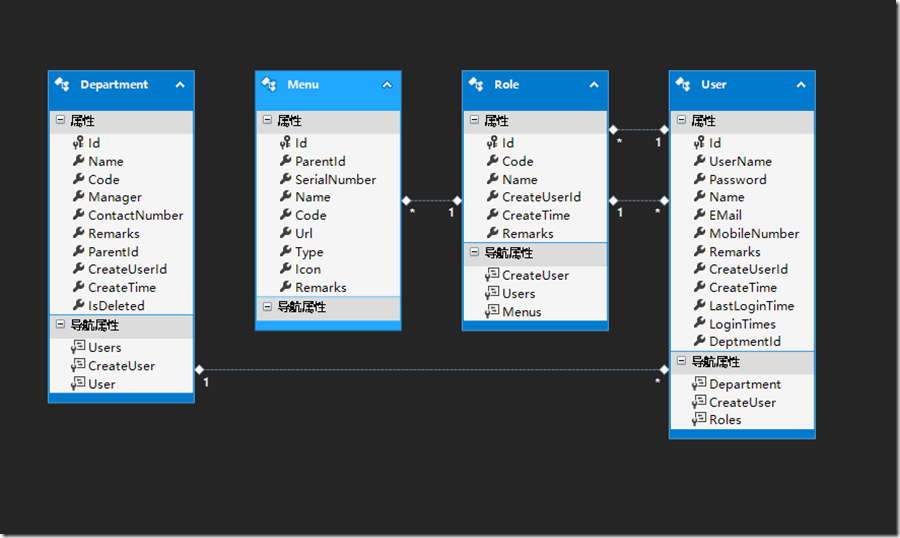
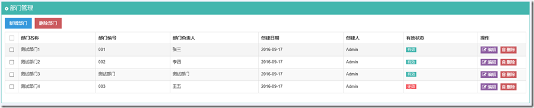
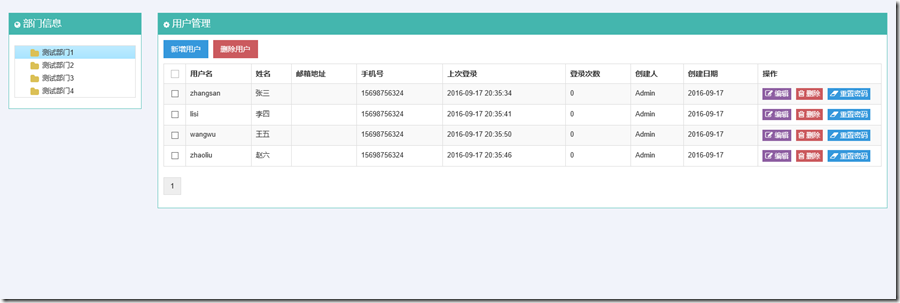
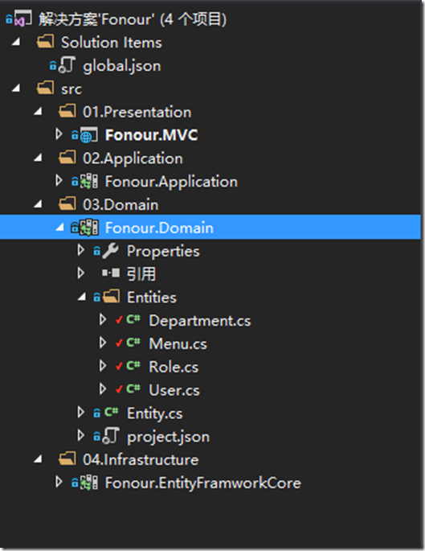

**0 Asp.Net Core 项目实战之权限管理系统（0） 无中生有**

**1 Asp.Net Core 项目实战之权限管理系统（1） 使用AdminLTE搭建前端**

**2 Asp.Net Core 项目实战之权限管理系统（2） 功能及实体设计**

**3 Asp.Net Core 项目实战之权限管理系统（3） 通过EntityFramework Core使用PostgreSQL**

**4 Asp.Net Core 项目实战之权限管理系统（4） 依赖注入、仓储、服务的多项目分层实现**

**5 Asp.Net Core 项目实战之权限管理系统（5） 用户登录**

**6 Asp.Net Core 项目实战之权限管理系统（6） 功能管理**

**7 Asp.Net Core 项目实战之权限管理系统（7） 组织机构、角色、用户权限**

**8 Asp.Net Core 项目实战之权限管理系统（8） 功能菜单的动态加载**

**github源码地址**

# 0 功能设计

实现一个最简单最基本的权限管理系统，主要包括组织机构管理、角色管理、用户管理、功能管理、角色授权。

**1 功能管理包括功能菜单、功能页面按钮两个层次。**

**2 功能授权针对角色进行。**

**3 每个用户可以拥有多个角色，用户的实际权限根据多角色求取并集得到。**

[](http://images2015.cnblogs.com/blog/816310/201609/816310-20160917204253086-1097911353.png)

## 0.0  组织机构管理

实现组织机构（或者叫部门）的相关管理操作，组织机构主要包括部门名称、部门编码、部门负责人、联系电话、备注、上级部门、创建人、创建电话等属性。

组织机构管理包括新增顶级、新增（新增当前选中部门的下级）、编辑、删除等功能。

考虑到组织机构、用户等权限管理相关的基本实体经常会在业务数据中使用，比如要记录业务数据的部门、创建人等信息（以外键形式记录DepartmentId、UserId等），为避免组织机构、用户等信息删除后，业务数据出现找不到相关联的对应实体，即为了保证数据的完整性，对权限管理设计到的实体统一做**软删除**（采用一个删除标记的逻辑删除，非物理删除）处理。

[](http://images2015.cnblogs.com/blog/816310/201609/816310-20160917204256289-127018177.png)

## 0.1 功能管理

系统功能的统一维护，这里进行深一级的控制，管理到各个功能界面业务逻辑操作按钮的级别，以树形格式展示，其中以一个标记属性标识该实体是一个导航菜单，还是菜单下包含的一个操作按钮。以上述组织机构管理为例，功能管理中存在一个名称为组织机构管理的项，其下包括新增组织机构、新增顶级组织机构、编辑组织机构、删除组织机构等子级。

功能管理实体主要包含父级、序号、名称、编码、地址、类型（导航菜单、功能按钮）、图标、备注等属性。

功能管理主要包括，新增顶级、新增、编辑、删除等功能。

## 0.2 角色管理

角色是一组具有相同功能用户的一个抽象，权限管理系统将具体功能的授权赋予角色，实现针对角色的权限管理。

角色实体主要包括角色编码、角色名称、创建人、创建时间、备注等属性。

角色管理主要包括新增角色、编辑角色、删除角色、角色授权等功能。

角色授权是为当前选中的角色授予功能导航菜单及功能页面按钮的相关权限的操作。用户登录后，会根据当前用户获取所属角色，然后取该用户所有角色的功能并集，确定功能菜单及相关功能界面按钮的是否可用状态。

## 0.3 用户管理

用户实体主要包括用户名、密码、用户姓名、邮箱、手机、备注、创建人、创建时间、上次登录时间、登录次数、所属部门等属性。

用户管理主要包括新增用户、编辑用户、删除用户、重置密码等功能。

新增及编辑用户时，需要首先选择用户所属部门，同时必须为当前用户分配对应的角色。

[](http://images2015.cnblogs.com/blog/816310/201609/816310-20160917204257492-1527452503.png)

# 1 实体设计

根据上述功能设计，对实体类进行如下设计。对所有实体建立一个泛型基类Entity<TPrimaryKey>,默认的主键类型为Guid的实体基类Entity，权限管理系统的所有实体都从Entity基类继承，如果想要实现其他类型主键，新建的实体从Entity<TPrimaryKey>泛型基类继承即可。

[](javascript:void(0);)

```
/// <summary>
/// 泛型实体基类
/// </summary>
/// <typeparam name="TPrimaryKey">主键类型</typeparam>
public abstract class Entity<TPrimaryKey>
{
    /// <summary>
    /// 主键
     /// </summary>
    public virtual TPrimaryKey Id { get; set; }
}

/// <summary>
/// 定义默认主键类型为Guid的实体基类
/// </summary>
public abstract class Entity : Entity<Guid>
{

}
```

[](javascript:void(0);)

## 1.0 组织机构实体

[](javascript:void(0);)

```
 /// <summary>
 /// 部门实体
 /// </summary>
 public class Department : Entity
 {
     /// <summary>
     /// 部门名称
      /// </summary>
     public string Name { get; set; }

     /// <summary>
     /// 部门编号
      /// </summary>
     public string Code { get; set; }

     /// <summary>
     /// 部门负责人
      /// </summary>
     public string Manager { get; set; }

     /// <summary>
     /// 联系电话
      /// </summary>
     public string ContactNumber { get; set; }

     /// <summary>
     /// 备注
      /// </summary>
     public string Remarks { get; set; }

     /// <summary>
     /// 父级部门ID
     /// </summary>
     public Guid ParentId { get; set; }

     /// <summary>
     /// 创建人
      /// </summary>
     public Guid CreateUserId { get; set; }

     /// <summary>
     /// 创建时间
      /// </summary>
     public DateTime? CreateTime { get; set; }

     /// <summary>
     /// 是否已删除
      /// </summary>
     public int IsDeleted { get; set; }

     /// <summary>
     /// 包含用户
      /// </summary>
     public virtual ICollection<User> Users { get; set; }

     /// <summary>
     /// 创建人信息
      /// </summary>
     public virtual User CreateUser { get; set; }
 }
```

[](javascript:void(0);)

## 1.1 功能实体

[](javascript:void(0);)

```
 /// <summary>
 /// 功能菜单实体
 /// </summary>
 public class Menu : Entity
 {
     /// <summary>
     /// 父级ID
     /// </summary>
     public Guid ParentId { get; set; }

     /// <summary>
     /// 序号
      /// </summary>
     public int SerialNumber { get; set; }

     /// <summary>
     /// 菜单名称
      /// </summary>
     public string Name { get; set; }

     /// <summary>
     /// 菜单编码
      /// </summary>
     public string Code { get; set; }

     /// <summary>
     /// 菜单地址
      /// </summary>
     public string Url { get; set; }

     /// <summary>
     /// 类型：0导航菜单；1操作按钮。
      /// </summary>
     public int Type { get; set; }

     /// <summary>
     /// 菜单图标
      /// </summary>
     public string Icon { get; set; }

     /// <summary>
     /// 菜单备注
      /// </summary>
     public string Remarks { get; set; }
}
```

[](javascript:void(0);)

## 1.2 角色实体

[](javascript:void(0);)

```
public class Role : Entity
{
     public string Code { get; set; }

     public string Name { get; set; }

     public Guid CreateUserId { get; set; }

     public DateTime? CreateTime { get; set; }

     public string Remarks { get; set; }

     public virtual User CreateUser { get; set; }

     public virtual ICollection<User> Users { get; set; }

     public virtual ICollection<Menu> Menus { get; set; }
}
```

[](javascript:void(0);)

## 1.3 用户实体

[](javascript:void(0);)

```
public class User : Entity
{
     /// <summary>
     /// 用户名
      /// </summary>
     public string UserName { get; set; }

     /// <summary>
     /// 密码
      /// </summary>
     public string Password { get; set; }

     /// <summary>
     /// 用户姓名
      /// </summary>
     public string Name { get; set; }

     /// <summary>
     /// 邮箱地址
      /// </summary>
     public string EMail { get; set; }

     /// <summary>
     /// 手机号
      /// </summary>
     public string MobileNumber { get; set; }

     /// <summary>
     /// 备注
      /// </summary>
     public string Remarks { get; set; }

     /// <summary>
     /// 创建人
      /// </summary>
     public Guid CreateUserId { get; set; }

     /// <summary>
     /// 创建时间
      /// </summary>
     public DateTime? CreateTime { get; set; }

     /// <summary>
     /// 上次登录时间
      /// </summary>
     public DateTime LastLoginTime { get; set; }

     /// <summary>
     /// 登录次数
      /// </summary>
     public int LoginTimes { get; set; }

     /// <summary>
     /// 部门ID
     /// </summary>
     public Guid DeptmentId { get; set; }

     /// <summary>
     /// 是否已删除
      /// </summary>
     public int IsDeleted { get; set; }

     /// <summary>
     /// 所属部门实体
      /// </summary>
     public virtual Department Department { get; set; }

     /// <summary>
     /// 创建人实体
      /// </summary>

     public virtual User CreateUser { get; set; }

     /// <summary>
     /// 角色集合
      /// </summary>

     public virtual ICollection<Role> Roles { get; set; }
}
```

[](javascript:void(0);)

# 2 总结

本次主要针对一个最简单的权限管理系统进行了功能及实体的设计，项目中新增了相关实体类文件，目前解决方案结构如下下所示：

[](http://images2015.cnblogs.com/blog/816310/201609/816310-20160917204258836-181604990.png)

接下来会介绍如何在Asp.Net Core中通过EntityFramework Core使用PostgreSQL数据库。

作者：[Fonour](http://fonour.cnblogs.com/)

出处：<http://fonour.cnblogs.com/>

本文版权归作者和博客园共有，欢迎转载，但未经作者同意必须保留此段声明，且在文章页面明显位置给出原文连接，否则保留追究法律责任的权利。


分类: [Asp.net Core](https://www.cnblogs.com/fonour/category/869398.html)