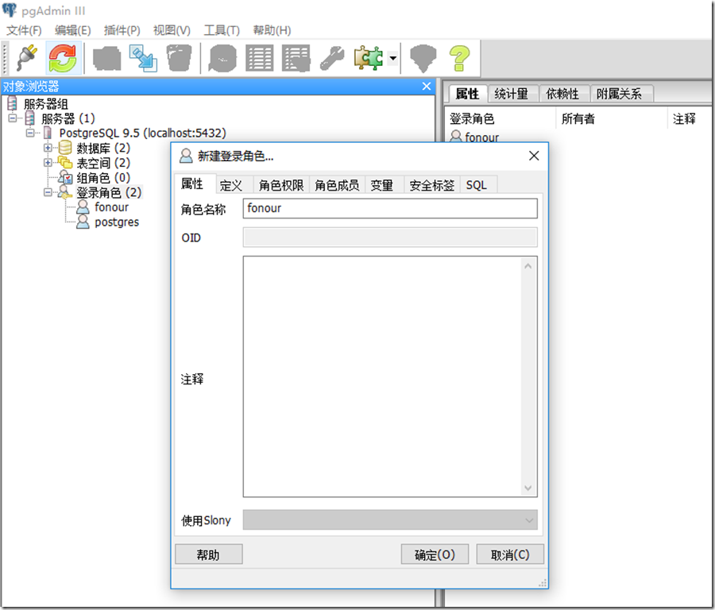
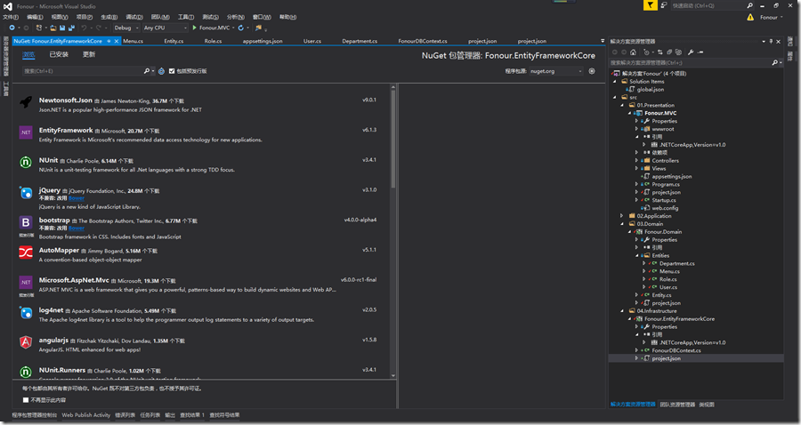
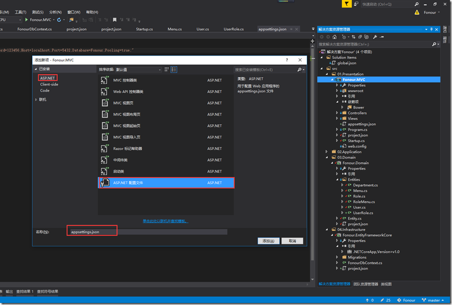
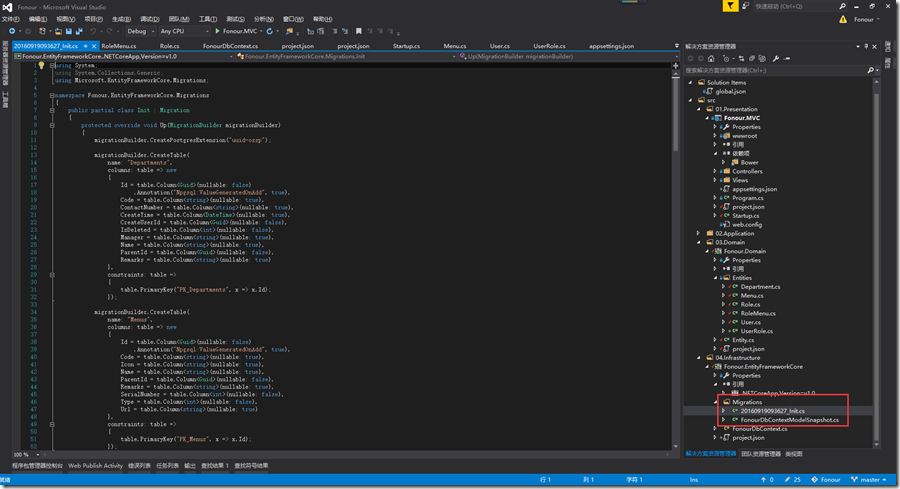
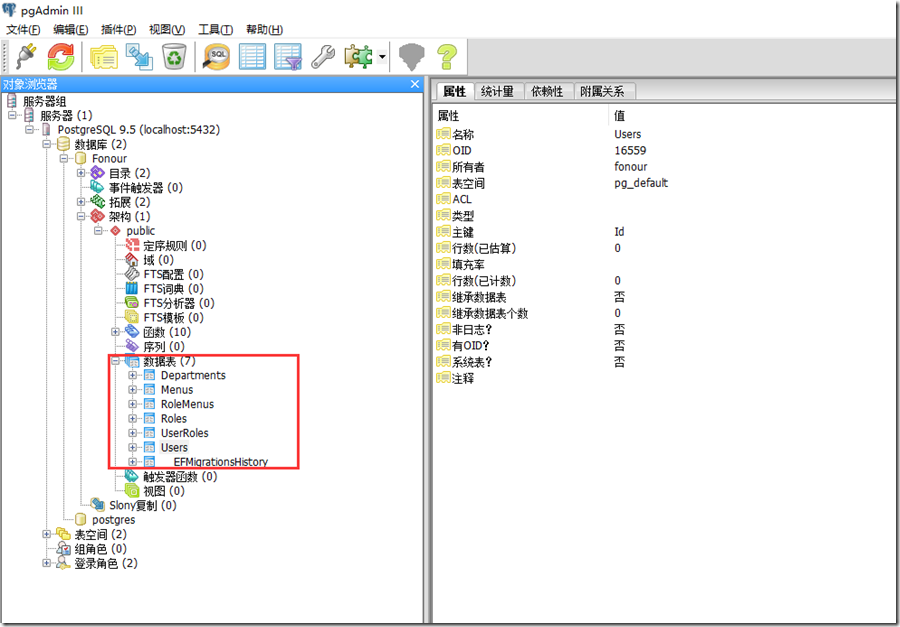
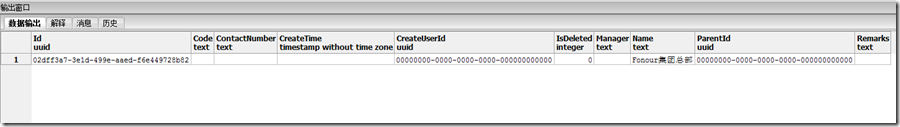
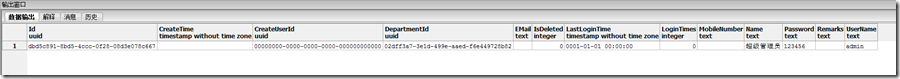
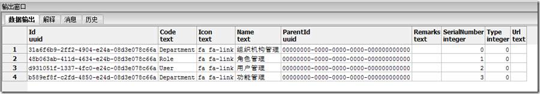

**0 Asp.Net Core 项目实战之权限管理系统（0） 无中生有**

**1 Asp.Net Core 项目实战之权限管理系统（1） 使用AdminLTE搭建前端**

**2 Asp.Net Core 项目实战之权限管理系统（2） 功能及实体设计**

**3 Asp.Net Core 项目实战之权限管理系统（3） 通过EntityFramework Core使用PostgreSQL**

**4 Asp.Net Core 项目实战之权限管理系统（4） 依赖注入、仓储、服务的多项目分层实现**

**5 Asp.Net Core 项目实战之权限管理系统（5） 用户登录**

**6 Asp.Net Core 项目实战之权限管理系统（6） 功能管理**

**7 Asp.Net Core 项目实战之权限管理系统（7） 组织机构、角色、用户权限**

**8 Asp.Net Core 项目实战之权限管理系统（8） 功能菜单的动态加载**

**github源码地址**

# 0 PostgreSQL安装及配置

## 0.0 PostgreSQL简介

既然Asp.Net  Core最大的特性就是跨平台，就搭配使用一个可以跨平台的数据库。PostgreSQL是一个功能强大的开源数据库系统。经过长达15年以上的积极开发和不断改进，PostgreSQL已在可靠性、稳定性、数据一致性等获得了业内极高的声誉。目前PostgreSQL可以运行在所有主流操作系统上，包括Linux、Unix（AIX、BSD、HP-UX、SGI  IRIX、Mac OS  X、Solaris和Tru64）和Windows。PostgreSQL是完全的事务安全性数据库，完整地支持外键、联合、视图、触发器和存储过程（并支持多种语言开发存储过程）。它支持了大多数的SQL:2008标准的数据类型，包括整型、数值值、布尔型、字节型、字符型、日期型、时间间隔型和时间型，它也支持存储二进制的大对像，包括图片、声音和视频。PostgreSQL对很多高级开发语言有原生的编程接口，如C/C++、Java、.Net、Perl、Python、Ruby、Tcl  和ODBC以及其他语言等，也包含各种文档。

## 0.1 PostgreSQL安装及配置

自行去PostgreSQL官网下载符合你自己系统的版本，开始安装，从我自己的安装体验来看，没什么需要特别注意的地方，只需要按照提示一步步安装即可，在最后的时候根据需要选择以下语言，设置超级用户角色postgres的登录密码即可。

**创建一个系统使用的角色**

打开安装好的PostgreSQL数据库，输入密码进入管理界面。右键“登录角色”，创建一个名称为“fonour”的角色，在“角色权限”页签中把所有能能勾选的功能都勾选上。

[](http://images2015.cnblogs.com/blog/816310/201609/816310-20160919190559527-1090480501.png)

右键PostgreSQL服务器，选择断开服务器。接着右键，单击“属性”菜单，在弹出窗口的用户名出输入刚才新建的“fonour”角色，输入密码并勾选记住密码。确定，连接即可。

# 1 使用EntityFrameworkCore的CodeFirst方式创建数据库

## 1.0 在Fonour.EntityFrameworkCore项目中创建DbContext

由于EF Core跟PostgreSQL都需要现学现用，EF Core的使用跟EF6.0还是有很多不同的，在使用的过程中遇到了不少的问题，尤其是针对PostgreSQL使用Guid类型的主键，后面会把这些坑做一个简单的记录。

**0 添加相关依赖项**

需要添加的相关依赖及说明如下：

- Npgsql.EntityFrameworkCore.PostgreSQL

​      PostgreSQL数据提供的支持EF Core的基础类库，是通过EF Core使用PostgreSQL数据库的根本。

- Npgsql.EntityFrameworkCore.PostgreSQL.Design

​      使用Guid（对应Postgre数据的类型为uuid）类型的主键必须，int/long类型的主键不添加也没问题。

- Microsoft.EntityFrameworkCore.Tools

​      EF Core工具，CodeFirst数据库迁移相关操作必须。

- Fonour.Domain

​      我们自己创建的一个类库项目，其中包含了组织机构、功能、角色、用户等实体的定义。

添加相关引用依赖的方式有多种，可以通过NuGet程序包管理器控制台的Install-Packege命令

```
PM> Install-Package Npgsql.EntityFrameworkCore.PostgreSQL
PM> Install-Package Npgsql.EntityFrameworkCore.PostgreSQL.Design
PM> Install-Package Microsoft.EntityFrameworkCore.Tools
```

或者直接在NuGet程序包管理器中搜索相关类库，进行安装

[](http://images2015.cnblogs.com/blog/816310/201609/816310-20160919190641434-101622642.png)

最直接的方法是直接修改project.json配置文件，project.json配置文件最终修改后内容如下。

[](javascript:void(0);)

```
{
  "version": "1.0.0-*",

  "dependencies": {
    "Fonour.Domain": "1.0.0-0",
    "Microsoft.EntityFrameworkCore.Tools": "1.0.0-preview2-final",
    "NETStandard.Library": "1.6.0",
    "Npgsql.EntityFrameworkCore.PostgreSQL": "1.0.1",
    "Npgsql.EntityFrameworkCore.PostgreSQL.Design": "1.0.1"
  },

  "frameworks": {
    "netcoreapp1.0": {
      "imports": [
        "dotnet5.6",
        "portable-net45+win8"
      ]
    }
  },

  "tools": {
    "Microsoft.EntityFrameworkCore.Tools": {
      "version": "1.0.0-preview2-final",
      "imports": [
        "portable-net45+win8+dnxcore50",
        "portable-net45+win8"
      ]
    }
  }
}
```

[](javascript:void(0);)

注意，frameworks部分，如果默认是netstandard1.6框架，必须进行修改，否则会提示不支持相关依赖项。

**1 创建DbContext**

根据EF Core对多对多关联关系的要求，增加了UserRole、RoleMenu两个关联关系实体，同时对原有实体进行了调整。

[](javascript:void(0);)

```
public class UserRole
{
    public Guid UserId { get; set; }
    public User User { get; set; }

    public Guid RoleId { get; set; }
    public Role Role { get; set; }

}
```

[](javascript:void(0);)

[](javascript:void(0);)

```
public class RoleMenu
{
    public Guid RoleId { get; set; }
    public Role Role { get; set; }

    public Guid MenuId { get; set; }
    public Menu Menu { get; set; }
}
```

[](javascript:void(0);)

在Fonour.EntityFrameworkCore项目下新建一个数据上下文操作类，命名为“FonourDBContext”，其中增加权限管理系统相关实体的DbSet的定义。最终代码如下：

[](javascript:void(0);)

```
public class FonourDbContext : DbContext
{
    public FonourDbContext(DbContextOptions<FonourDbContext> options) : base(options)
    {

    }
    public DbSet<Department> Departments { get; set; }
    public DbSet<Menu> Menus { get; set; }
    public DbSet<Role> Roles { get; set; }
    public DbSet<User> Users { get; set; }
    public DbSet<UserRole> UserRoles { get; set; }
    public DbSet<RoleMenu> RoleMenus { get; set; }

    protected override void OnModelCreating(ModelBuilder builder)
    {
        //UserRole关联配置
        builder.Entity<UserRole>()
          .HasKey(ur => new { ur.UserId, ur.RoleId });

        //RoleMenu关联配置
        builder.Entity<RoleMenu>()
          .HasKey(rm => new { rm.RoleId, rm.MenuId });
        builder.Entity<RoleMenu>()
          .HasOne(rm => rm.Role)
          .WithMany(r => r.RoleMenus)
          .HasForeignKey(rm => rm.RoleId).HasForeignKey(rm => rm.MenuId);

        //启用Guid主键类型扩展
        builder.HasPostgresExtension("uuid-ossp");

        base.OnModelCreating(builder);
    }
}
```

[](javascript:void(0);)

## 1.1 在Fonour.MVC项目中进行数据库连接相关配置

**0 添加相关依赖项**

在Asp.Net  Core中，使用json格式的配置文件进行系统相关参数的配置，将相关配置文件通过ConfigurationBuilder进行统一管理，得到IConfigurationRoot的配置实例，获取相关配置文件配置节点的信息。想要使用配置文件相关服务，需要添加一下依赖。

- Microsoft.Extensions.Configuration
- Microsoft.Extensions.Configuration.FileExtensions
- Microsoft.Extensions.Configuration.Json

还需要添加对Fonour.EntityFrameworkCore项目的引用。

最终Fonour.MVC项目的project.json文件配置如下：

[](javascript:void(0);)

```
{
  "dependencies": {
    "Microsoft.NETCore.App": "1.0.1",
    "Microsoft.AspNetCore.Diagnostics": "1.0.0",
    "Microsoft.AspNetCore.Server.IISIntegration": "1.0.0",
    "Microsoft.AspNetCore.Server.Kestrel": "1.0.1",
    "Microsoft.Extensions.Logging.Console": "1.0.0",
    "Microsoft.AspNetCore.Mvc": "1.0.1",
    "Microsoft.AspNetCore.StaticFiles": "1.0.0",
    "Microsoft.Extensions.Configuration": "1.0.0",
    "Microsoft.Extensions.Configuration.FileExtensions": "1.0.0",
    "Microsoft.Extensions.Configuration.Json": "1.0.0",
    "Fonour.EntityFrameworkCore": "1.0.0-*"
  },

  "tools": {
    "Microsoft.AspNetCore.Server.IISIntegration.Tools": "1.0.0-preview2-final"
  },

  "frameworks": {
    "netcoreapp1.0": {
      "imports": [
        "dotnet5.6",
        "portable-net45+win8"
      ]
    }
  },

  "buildOptions": {
    "emitEntryPoint": true,
    "preserveCompilationContext": true
  },

  "runtimeOptions": {
    "configProperties": {
      "System.GC.Server": true
    }
  },

  "publishOptions": {
    "include": [
      "wwwroot",
      "web.config"
    ]
  },

  "scripts": {
    "postpublish": [ "dotnet publish-iis --publish-folder %publish:OutputPath% --framework %publish:FullTargetFramework%" ]
  },
  "runtimes": {
    "win10-x64": {}
  }
}
```

[](javascript:void(0);)

**1 增加appsettings.json配置文件**

右键Fonour.MVC项目，新增一个Asp.Net配置文件类型，名称为appsettings.json的配置文件。

[](http://images2015.cnblogs.com/blog/816310/201609/816310-20160919190731918-1432873704.png)

appsettings.json文件目前主要内容为定义数据库连接字符串，内容如下：

```
{
  "ConnectionStrings": {
    "Default": "User ID=fonour;Password=123456;Host=localhost;Port=5432;Database=Fonour;Pooling=true;"
  }
}
```

**2 启用数据库连接**

首先在Startup.cs中定义一个IConfigurationRoot的属性，然后在系统启动类Startup.cs的构造函数中，对配置文件进行管理。

[](javascript:void(0);)

```
public IConfigurationRoot Configuration { get; }
public Startup(IHostingEnvironment env)
{
    var builder = new ConfigurationBuilder()
        .SetBasePath(env.ContentRootPath)
        .AddJsonFile("appsettings.json", optional: true, reloadOnChange: true)
        .AddJsonFile($"appsettings.{env.EnvironmentName}.json", optional: true);
    builder.AddEnvironmentVariables();
    Configuration = builder.Build();
}
```

[](javascript:void(0);)

在ConfigureServices方法中获取数据库连接字符串，并添加数据库连接服务。

[](javascript:void(0);)

```
public void ConfigureServices(IServiceCollection services)
{
    //获取数据库连接字符串
    var sqlConnectionString = Configuration.GetConnectionString("Default");

    //添加数据上下文
    services.AddDbContext<FonourDbContext>(options =>
        options.UseNpgsql(sqlConnectionString)
    );

    services.AddMvc();
}
```

[](javascript:void(0);)

## 1.2 使用CodeFirst数据库迁移命令创建数据库

在EntityFrameworkCore中数据库迁移有两种方式。

**0 使用命令行工具**

在应用程序根目录按住shift键同时单击鼠标右键，选择“在此处打开命令窗口”，输入数据库迁移的命令

```
dotnet ef migrations add Init

dotnet ef database update
```

**1 使用程序包管理器控制台**

在程序包管理器控制台中默认项目选择Fonour.EntityFrameworkCore，输入以下命令，自动创建数据库迁移文件。

```
Add-Migration Init
```

注意，一定要将Fonour.MVC设置为启动项目。

执行完成后，项目中增加了数据库迁移文件。

[](http://images2015.cnblogs.com/blog/816310/201609/816310-20160919190814074-1676857729.png)

输入以下命令，进行数据库更新操作。

```
Update-Database
```

提示更新完成后，查看我们的数据库，会发现数据库及数据库表已经创建完成。

[](http://images2015.cnblogs.com/blog/816310/201609/816310-20160919190846309-1007217417.png)

# 2 数据初始化

为保证系统正常运行，我们需要对系统进行数据初始化，要初始化的数据包括一下内容：

- 用户表插入一条用户名为admin的超级管理员用户信息
- 功能菜单表增加组织机构管理、角色管理、用户管理、功能管理四条基本数据。
- 组织机构表插入一条组织机构信息（主要是因为用户表存在一个DepartmentId的外键）

在Fonour.EntityFrameworkCore项目中增加一个新的数据初始化类，命名为SeedData.cs，修改内容如下：

[](javascript:void(0);)

```
public static class SeedData
{
    public static void Initialize(IServicePr
    {
        using (var context = new FonourDbCon
        {
            if (context.Users.Any())
            {
                return;   // 已经初始化过数据
              }
            Guid departmentId = Guid.NewGuid
            //增加一个部门
              context.Departments.Add(
               new Department
               {
                   Id = departmentId,
                   Name = "Fonour集团总部",
                   ParentId = Guid.Empty
               }
            );
            //增加一个超级管理员用户
              context.Users.Add(
                 new User
                 {
                     UserName = "admin",
                     Password = "123456", //
                     Name = "超级管理员",
                     DepartmentId = departme
                 }
            );
            //增加四个基本功能菜单
              context.Menus.AddRange(
               new Menu
               {
                   Name = "组织机构管理",
                   Code = "Department",
                   SerialNumber = 0,
                   ParentId = Guid.Empty,
                   Icon = "fa fa-link"
               },
               new Menu
               {
                   Name = "角色管理",
                   Code = "Role",
                   SerialNumber = 1,
                   ParentId = Guid.Empty,
                   Icon = "fa fa-link"
               },
               new Menu
               {
                   Name = "用户管理",
                   Code = "User",
                   SerialNumber = 2,
                   ParentId = Guid.Empty,
                   Icon = "fa fa-link"
               },
               new Menu
               {
                   Name = "功能管理",
                   Code = "Department",
                   SerialNumber = 3,
                   ParentId = Guid.Empty,
                   Icon = "fa fa-link"
               }
            );
            context.SaveChanges();
        }
    }
}
```

[](javascript:void(0);)

在Fonour.MVC项目的Startup.cs中Configure方法最后增加数据初始化的操作。

[](javascript:void(0);)

```
public void Configure(IApplicationBuilder app, IHostingEnvironment env, ILoggerFactory loggerFactory)
{
    loggerFactory.AddConsole();

    if (env.IsDevelopment())
    {
        //开发环境异常处理
        app.UseDeveloperExceptionPage();
    }
    else
    {
        //生产环境异常处理
        app.UseExceptionHandler("/Shared/Error");
    }
    //使用静态文件
    app.UseStaticFiles();
    //使用Mvc，设置默认路由为系统登录
    app.UseMvc(routes =>
    {
        routes.MapRoute(
            name: "default",
            template: "{controller=Login}/{action=Index}/{id?}");
    });

    SeedData.Initialize(app.ApplicationServices); //初始化数据
}
```

[](javascript:void(0);)

运行程序。查看数据库，发现初始化数据已经生成成功。

[](http://images2015.cnblogs.com/blog/816310/201609/816310-20160919190914262-2039013320.png)

[](http://images2015.cnblogs.com/blog/816310/201609/816310-20160919190922402-679188506.png)

[](http://images2015.cnblogs.com/blog/816310/201609/816310-20160919190931684-1161340799.png)

# 3 踩过的一些坑

- 使用Guid类型的主键一定要添加"Npgsql.EntityFrameworkCore.PostgreSQL.Design": "1.0.1"的引用，注意1.0.0版本是不支持的。
- 要想使用Guid类型的主键一定要在DbContext的 OnModelCreating 重写方法中启用uuid的扩展 builder.HasPostgresExtension("uuid-ossp");
- 关于多对关系的实体设计

​       在以前的EntityFramework中，多对多关系的实体，只需要创建两个实体，两个实体分别包含一个对方集合的导航属性即可，是不需要创建关联实体类的。如，User实体中包含一个ICollection<Role>  Roles的导航属性，同时Role实体中包含一个ICollection<User>  Users的导航属性，EF会根据实体间的关系自动创建一个User_Role中间表，若想修改中间表名，进行相关配置即可。

​      EF Core中必须创建关联关系的实体才行。

- EF Core暂不支持LayzingLoad

# 4 总结

本节主要是研究怎样通过EntityFramework Core使用PostgreSQL，通过CodeFirst数据库迁移的方式根据设计好的实体进行数据库的创建，最后我们根据系统需要，进行了一些相关数据的初始化。

接下来要实现用户登录功能。

作者：[Fonour](http://fonour.cnblogs.com/)

出处：<http://fonour.cnblogs.com/>

本文版权归作者和博客园共有，欢迎转载，但未经作者同意必须保留此段声明，且在文章页面明显位置给出原文连接，否则保留追究法律责任的权利。


分类: [Asp.net Core](https://www.cnblogs.com/fonour/category/869398.html)


​         [好文要顶](javascript:void(0);)             [关注我](javascript:void(0);)     [收藏该文](javascript:void(0);)     [](javascript:void(0);)     [](javascript:void(0);) 


​             [Fonour](https://home.cnblogs.com/u/fonour/)
​             [关注 - 26](https://home.cnblogs.com/u/fonour/followees)
​             [粉丝 - 346](https://home.cnblogs.com/u/fonour/followers)         


​                 [+加关注](javascript:void(0);)     

​         28     

​         0     


​     


[« ](https://www.cnblogs.com/fonour/p/5879622.html) 上一篇：[Asp.Net Core 项目实战之权限管理系统（2） 功能及实体设计](https://www.cnblogs.com/fonour/p/5879622.html)