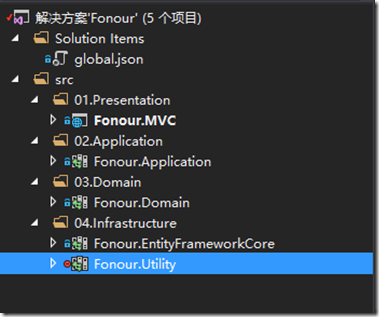
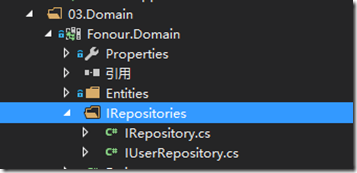
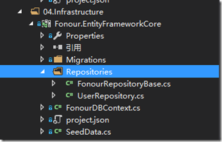
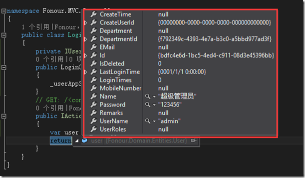

**0 Asp.Net Core 项目实战之权限管理系统（0） 无中生有**

**1 Asp.Net Core 项目实战之权限管理系统（1） 使用AdminLTE搭建前端**

**2 Asp.Net Core 项目实战之权限管理系统（2） 功能及实体设计**

**3 Asp.Net Core 项目实战之权限管理系统（3） 通过EntityFramework Core使用PostgreSQL**

**4 Asp.Net Core 项目实战之权限管理系统（4） 依赖注入、仓储、服务的多项目分层实现**

**5 Asp.Net Core 项目实战之权限管理系统（5） 用户登录**

**6 Asp.Net Core 项目实战之权限管理系统（6） 功能管理**

**7 Asp.Net Core 项目实战之权限管理系统（7） 组织机构、角色、用户权限**

**8 Asp.Net Core 项目实战之权限管理系统（8） 功能菜单的动态加载**

**github源码地址**

# 0 项目结构

写这个系列的最初目的其实只是为了自己能更好的学习Asp.Net  Core，用一个小的系统作为练习，也督促自己。短期内不见得在实际项目中真的会运用，但至少通过学习，大致的对Asp.Net  Core有个了解，也是为以后可能的应用做一下技术储备。起初的设想很简单，就是在一个Web项目中完成所有工作，大致了解Asp.Net  Core的知识体系。

在实践的过程中不自觉的对这个练习的项目进行了一下分层。目前项目整体机构如下：

[](http://images2015.cnblogs.com/blog/816310/201609/816310-20160924234937043-822151427.png)

项目说明：

- **Fonour.MVC**

​      Asp.Net Core MVC网站项目。

- **Fonour.Application**

​      应用服务项目，定义应用服务接口及实现，供Fonour.MVC控制器调用；同时定义接收及返回数据对象（Dto，这里我有可能会省去，直接拿实体往表现层传了……）

- **Fonour.Domain**

​      主要定义实体、仓储接口等。

- **Fonour.EntityFrameworkCore**

​      主要是仓储接口的EF Core具体实现

- **Fonour.Utility**

​      通用项目，定义项目无关的一些公共类库。

# 1 仓储接口定义

## 1.0 基本接口定义

仓储接口定义使用泛型接口，主要定义实体基本的增、删、改、查操作。在Fonour.Domain项目中新建一个名称为“IRepositories”的文件夹，在该文件夹中新建一个名称为“IRepository”的接口文件。暂时定义以下几个基本的接口，日后针对批量插入、删除、分页等操作再做进一步的完善。

[](javascript:void(0);)

```
/// <summary>
/// 仓储接口定义
/// </summary>
public interface IRepository
{

}

/// <summary>
/// 定义泛型仓储接口
/// </summary>
/// <typeparam name="TEntity">实体类型</typeparam>
/// <typeparam name="TPrimaryKey">主键类型</typeparam>
public interface IRepository<TEntity, TPrimaryKey> : IRepository where TEntity : Entity<TPrimaryKey>
{
    /// <summary>
    /// 获取实体集合
     /// </summary>
    /// <returns></returns>
    List<TEntity> GetAllList();

    /// <summary>
    /// 根据lambda表达式条件获取实体集合
     /// </summary>
    /// <param name="predicate">lambda表达式条件</param>
    /// <returns></returns>
    List<TEntity> GetAllList(Expression<Func<TEntity, bool>> predicate);

    /// <summary>
    /// 根据主键获取实体
     /// </summary>
    /// <param name="id">实体主键</param>
    /// <returns></returns>
    TEntity Get(TPrimaryKey id);

    /// <summary>
    /// 根据lambda表达式条件获取单个实体
     /// </summary>
    /// <param name="predicate">lambda表达式条件</param>
    /// <returns></returns>
    TEntity FirstOrDefault(Expression<Func<TEntity, bool>> predicate);

    /// <summary>
    /// 新增实体
     /// </summary>
    /// <param name="entity">实体</param>
    /// <returns></returns>
    TEntity Insert(TEntity entity);

    /// <summary>
    /// 更新实体
     /// </summary>
    /// <param name="entity">实体</param>
    TEntity Update(TEntity entity);

    /// <summary>
    /// 新增或更新实体
     /// </summary>
    /// <param name="entity">实体</param>
    TEntity InsertOrUpdate(TEntity entity);

    /// <summary>
    /// 删除实体
     /// </summary>
    /// <param name="entity">要删除的实体</param>
    bool Delete(TEntity entity);

    /// <summary>
    /// 删除实体
     /// </summary>
    /// <param name="id">实体主键</param>
    bool Delete(TPrimaryKey id);
}
```

[](javascript:void(0);)

这个练习项目使用的是Guid类型的主键，为方便使用，再继承定义一个主键类型为Guid的接口。

[](javascript:void(0);)

```
/// <summary>
/// 默认Guid主键类型仓储
/// </summary>
/// <typeparam name="TEntity"></typeparam>
public interface IRepository<TEntity> : IRepository<TEntity, Guid> where TEntity : Entity
{

}
```

[](javascript:void(0);)

## 1.1 用户管理仓储接口定义

如无特殊操作需要，我们的基础接口基本上能够满足各类实体共性的增删改查操作。对于某种实体特有的操作，就需要单独进行操作接口的定义。比如后面我们要实现用户登录的验证功能，即提供用户名、密码，验证该用户是否存在，以及用户名密码是否正确。对于此类特定需求，我们针对用户实体定义一个用户管理的仓储接口。

在“IRepositories”文件夹下新建一个名称为“IUserRepository”的接口，里面暂时只定义一个检查用户是否存在的方法，做为我们最后的测试接口。

[](javascript:void(0);)

```
/// <summary>
/// 用户管理仓储接口
/// </summary>
public interface IUserRepository : IRepository<User>
{
    /// <summary>
    /// 检查用户是存在
     /// </summary>
    /// <param name="userName">用户名</param>
    /// <param name="password">密码</param>
    /// <returns>存在返回用户实体，否则返回NULL</returns>
    User CheckUser(string userName, string password);
}
```

[](javascript:void(0);)

[](http://images2015.cnblogs.com/blog/816310/201609/816310-20160924234939512-1511826658.png)

# 2 仓储接口实现

仓储接口的实现全部放在Fonour.EntityFrameworkCore项目中，通过EF Core使用PostgresSQL数据库实现。

## 2.0 基本接口实现

在Fonour.EntityFrameworkCore项目中新建一个名称为“Repositories”的文件夹，在文件夹中添加一个名称为“FonourRepositoryBase”的抽象类。

该抽象类除了实现基本仓储接口定义的方法外，还有2个需要注意的地方。、

**1 定义了数据访问上下文对象**

该数据访问上下文对象通过构造函数进行依赖注入，Asp.Net Core已经默认对数据访问上下文对象进行了构造函数依赖注入的实现，具体应用后面会说到。

**2 定义了一个Save操作方法**

目的为了在应用服务层调用多个仓储后，统一进行数据上下文的SaveChanges操作，保证数据存储的事务性。

[](javascript:void(0);)

```
/// <summary>
/// 仓储基类
/// </summary>
/// <typeparam name="TEntity">实体类型</typeparam>
/// <typeparam name="TPrimaryKey">主键类型</typeparam>
public abstract class FonourRepositoryBase<TEntity, TPrimaryKey> : IRepository<TEntity, TPrimaryKey> where TEntity : Entity<TPrimaryKey>
{
    //定义数据访问上下文对象
    protected readonly FonourDbContext _dbContext;

    /// <summary>
    /// 通过构造函数注入得到数据上下文对象实例
     /// </summary>
    /// <param name="dbContext"></param>
    public FonourRepositoryBase(FonourDbContext dbContext)
    {
        _dbContext = dbContext;
    }

    /// <summary>
    /// 获取实体集合
     /// </summary>
    /// <returns></returns>
    public List<TEntity> GetAllList()
    {
        return _dbContext.Set<TEntity>().ToList();
    }

    /// <summary>
    /// 根据lambda表达式条件获取实体集合
     /// </summary>
    /// <param name="predicate">lambda表达式条件</param>
    /// <returns></returns>
    public List<TEntity> GetAllList(Expression<Func<TEntity, bool>> predicate)
    {
        return _dbContext.Set<TEntity>().Where(predicate).ToList();
    }

    /// <summary>
    /// 根据主键获取实体
     /// </summary>
    /// <param name="id">实体主键</param>
    /// <returns></returns>
    public TEntity Get(TPrimaryKey id)
    {
        return _dbContext.Set<TEntity>().FirstOrDefault(CreateEqualityExpressionForId(id));
    }

    /// <summary>
    /// 根据lambda表达式条件获取单个实体
     /// </summary>
    /// <param name="predicate">lambda表达式条件</param>
    /// <returns></returns>
    public TEntity FirstOrDefault(Expression<Func<TEntity, bool>> predicate)
    {
        return _dbContext.Set<TEntity>().FirstOrDefault(predicate);
    }

    /// <summary>
    /// 新增实体
     /// </summary>
    /// <param name="entity">实体</param>
    /// <returns></returns>
    public TEntity Insert(TEntity entity)
    {
        _dbContext.Set<TEntity>().Add(entity);
        return entity;
    }

    /// <summary>
    /// 更新实体
     /// </summary>
    /// <param name="entity">实体</param>
    public TEntity Update(TEntity entity)
    {
        _dbContext.Set<TEntity>().Attach(entity);
        _dbContext.Entry(entity).State = EntityState.Modified;
        return entity;
    }

    /// <summary>
    /// 新增或更新实体
    /// </summary>
    /// <param name="entity">实体</param>
    public TEntity InsertOrUpdate(TEntity entity)
    {
        if (Get(entity.Id) != null)
            return Update(entity);
        return Insert(entity);
    }

    /// <summary>
    /// 删除实体
    /// </summary>
    /// <param name="entity">要删除的实体</param>
    public void Delete(TEntity entity)
    {
        _dbContext.Set<TEntity>().Remove(entity);
    }

    /// <summary>
    /// 删除实体
     /// </summary>
    /// <param name="id">实体主键</param>
    public void Delete(TPrimaryKey id)
    {
        _dbContext.Set<TEntity>().Remove(Get(id));
    }

    /// <summary>
    /// 事务性保存
    /// </summary>
    public void Save()
    {
        _dbContext.SaveChanges();
    }

    /// <summary>
    /// 根据主键构建判断表达式
     /// </summary>
    /// <param name="id">主键</param>
    /// <returns></returns>
    protected static Expression<Func<TEntity, bool>> CreateEqualityExpressionForId(TPrimaryKey id)
    {
        var lambdaParam = Expression.Parameter(typeof(TEntity));
        var lambdaBody = Expression.Equal(
            Expression.PropertyOrField(lambdaParam, "Id"),
            Expression.Constant(id, typeof(TPrimaryKey))
            );

        return Expression.Lambda<Func<TEntity, bool>>(lambdaBody, lambdaParam);
    }
}
```

[](javascript:void(0);)

同样的实现一个主键类型为Guid的仓储操作基类。

[](javascript:void(0);)

```
/// <summary>
 /// 主键为Guid类型的仓储基类
 /// </summary>
 /// <typeparam name="TEntity">实体类型</typeparam>
 public abstract class FonourRepositoryBase<TEntity> : FonourRepositoryBase<TEntity, Guid> where TEntity : Entity
 {
     public FonourRepositoryBase(FonourDbContext dbContext) : base(dbContext)
     {
     }
 }
```

[](javascript:void(0);)

## 2.1 用户管理仓储接口实现

在Fonour.EntityFrameworkCore项目的“Repositories”文件夹中新建一个用户管理仓储接口的实现类“UserRepository”，实现接口中定义的用户检查方法。

[](javascript:void(0);)

```
/// <summary>
/// 用户管理仓储实现
/// </summary>
public class UserRepository : FonourRepositoryBase<User>, IUserRepository
{
    public UserRepository(FonourDbContext dbcontext) : base(dbcontext)
    {
        
    }
    /// <summary>
    /// 检查用户是存在
     /// </summary>
    /// <param name="userName">用户名</param>
    /// <param name="password">密码</param>
    /// <returns>存在返回用户实体，否则返回NULL</returns>
    public User CheckUser(string userName, string password)
    {
        return _dbContext.Set<User>().FirstOrDefault(it => it.UserName == userName && it.Password == password);
    }
}
```

[](javascript:void(0);)

[](http://images2015.cnblogs.com/blog/816310/201609/816310-20160924234941215-679415729.png)

# 3 应用服务层接口定义及实现

在Fonour.Application项目中新建一个名称为“UserApp”的文件夹，文件夹中新建一个名称为“IUserAppService”的服务接口，及服务接口的具体实现“UserAppService”，在服务层中调用对应的仓储方法实现具体相关业务逻辑。

UserAppService中定义一个私有且只读的用户管理仓储接口对象，依然通过构造函数的方式进行依赖注入。

[](javascript:void(0);)

```
/// <summary>
/// 用户管理服务
/// </summary>
public class UserAppService : IUserAppService
{
    //用户管理仓储接口
    private readonly IUserRepository _userReporitory;

    /// <summary>
    /// 构造函数 实现依赖注入
     /// </summary>
    /// <param name="userRepository">仓储对象</param>
    public UserAppService(IUserRepository userRepository)
    {
        _userReporitory = userRepository;
    }

    public User CheckUser(string userName, string password)
    {
        return _userReporitory.CheckUser(userName, password);
    }
}
```

[](javascript:void(0);)

# 4 Asp.Net Core依赖注入实现

在上一节中，我们讲到在Fonour.MVC项目的Startup.cs文件的ConfigureServices方法中通过使用

```
services.AddDbContext<FonourDbContext>(options =>options.UseNpgsql(sqlConnectionString));
```

方法将数据库上上下文添加到系统服务中，正是在此时同时对数据访问上下文进行了依赖注入实现。

通过添加以下代码在ConfigureServices方法中添加对上面创建的仓储及服务进行依赖注入的实现。

```
services.AddScoped<IUserRepository, UserRepository>();
services.AddScoped<IUserAppService, UserAppService>();
```

注意：Asp.Net Core提供的依赖注入拥有三种生命周期模式，由短到长依次为：

- **Transient**      ServiceProvider总是创建一个新的服务实例。
- **Scoped**         ServiceProvider创建的服务实例由自己保存，（同一次请求）所以同一个ServiceProvider对象提供的服务实例均是同一个对象。
- **Singleton**      始终是同一个实例对象

对于数据访问上下文，我们可以通过重载方法的第二个参数，控制数据访问上下文对象的生命周期，默认生命周期为Scoped。

```
services.AddDbContext<FonourDbContext>(options => options.UseNpgsql(sqlConnectionString), ServiceLifetime.Transient);
services.AddDbContext<FonourDbContext>(options => options.UseNpgsql(sqlConnectionString), ServiceLifetime.Scoped);
services.AddDbContext<FonourDbContext>(options => options.UseNpgsql(sqlConnectionString), ServiceLifetime.Singleton);
```

对于要依赖注入的接口和对象提供AddTransient、AddScoped、AddSingleton三个方法控制对象声明周期。

# 5 测试

我们在Fonour.MVC项目的LoginController中增加一个IUserAppService服务对象的定义，同时提供LoginController的构造函数，在构造函数中实现对UserAppService服务的依赖注入。

在Index控制器中增加IUserAppService的用户检查方法的调用代码，增加一个断点，用于测试。

[](javascript:void(0);)

```
public class LoginController : Controller
{
    private IUserAppService _userAppService;
    public LoginController(IUserAppService userAppService)
    {
        _userAppService = userAppService;
    }
    // GET: /<controller>/
    public IActionResult Index()
    {
        var user = _userAppService.CheckUser("admin", "123456");
        return View();
    }
}
```

[](javascript:void(0);)

运行程序，进入断点，发现已经成功根据用户名和密码，把上一节创建的用户数据信息取出，至此，我们项目的分层之间通道已经打通。

[](http://images2015.cnblogs.com/blog/816310/201609/816310-20160924234943449-1197842770.png)

# 6 总结

本节主要涉及到Asp.Net Core的知识点是它的依赖注入机制，我们通过清晰多项目分层结构，采用依赖注入机制，实现了各通之间的连接。

下一节实现用户登录相关，主要有用户登录验证，以及用户对控制器Action路由访问的拦截及判断。

作者：[Fonour](http://fonour.cnblogs.com/)

出处：<http://fonour.cnblogs.com/>

本文版权归作者和博客园共有，欢迎转载，但未经作者同意必须保留此段声明，且在文章页面明显位置给出原文连接，否则保留追究法律责任的权利。


分类: [Asp.net Core](https://www.cnblogs.com/fonour/category/869398.html)


​         [好文要顶](javascript:void(0);)             [关注我](javascript:void(0);)     [收藏该文](javascript:void(0);)     [](javascript:void(0);)     [](javascript:void(0);) 


​             [Fonour](https://home.cnblogs.com/u/fonour/)
​             [关注 - 26](https://home.cnblogs.com/u/fonour/followees)
​             [粉丝 - 346](https://home.cnblogs.com/u/fonour/followers)         


​                 [+加关注](javascript:void(0);)     

​         35     

​         0     


​     


[« ](https://www.cnblogs.com/fonour/p/5886292.html) 上一篇：[Asp.Net Core 项目实战之权限管理系统（3） 通过EntityFramework Core使用PostgreSQL](https://www.cnblogs.com/fonour/p/5886292.html)
[» ](https://www.cnblogs.com/fonour/p/5943401.html) 下一篇：[Asp.Net Core 项目实战之权限管理系统（5） 用户登录](https://www.cnblogs.com/fonour/p/5943401.html)