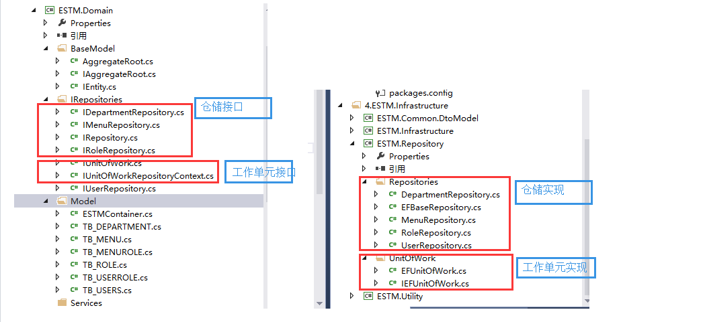
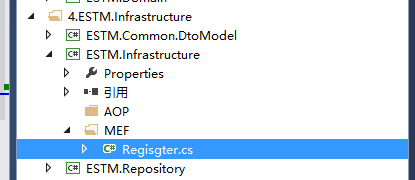
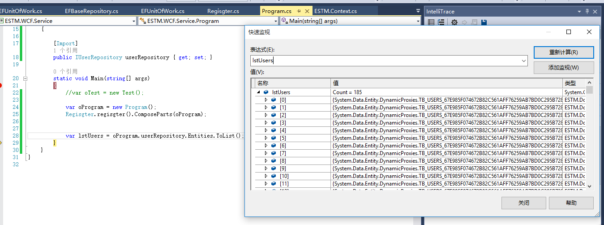

前言：上篇介绍了DDD设计Demo里面的聚合划分以及实体和聚合根的设计，这章继续来说说DDD里面最具争议的话题之一的仓储Repository，为什么Repository会有这么大的争议，博主认为主要原因无非以下两点：一是Repository的真实意图没有理解清楚，导致设计的紊乱，随着项目的横向和纵向扩展，到最后越来越难维护；二是赶时髦的为了“模式”而“模式”，仓储并非适用于所有项目，这就像没有任何一种架构能解决所有的设计难题一样。本篇通过这个设计的Demo来谈谈博主对仓储的理解，有不对的地方还望园友们斧正！

DDD领域驱动设计初探系列文章：

- [C#进阶系列——DDD领域驱动设计初探（一）：聚合](http://www.cnblogs.com/landeanfen/p/4816706.html)
- [C#进阶系列——DDD领域驱动设计初探（二）：仓储Repository（上）](http://www.cnblogs.com/landeanfen/p/4834730.html)
- [C#进阶系列——DDD领域驱动设计初探（三）：仓储Repository（下）](http://www.cnblogs.com/landeanfen/p/4837520.html)
- [C#进阶系列——DDD领域驱动设计初探（四）：WCF搭建](http://www.cnblogs.com/landeanfen/p/4841211.html)
- [C#进阶系列——DDD领域驱动设计初探（五）：AutoMapper使用](http://www.cnblogs.com/landeanfen/p/4842015.html)
- [C#进阶系列——DDD领域驱动设计初探（六）：领域服务](http://www.cnblogs.com/landeanfen/p/4844344.html)
- [C#进阶系列——DDD领域驱动设计初探（七）：Web层的搭建](http://www.cnblogs.com/landeanfen/p/4920577.html)

## 一、仓储的定义

仓储，顾名思义，存储数据的仓库。那么有人就疑惑了，既然我们有了数据库来存取数据，为什么还要弄一个仓储的概念，其实博主觉得这是一个考虑层面不同的问题，数据库主要用于存取数据，而仓储作用之一是用于数据的持久化。从架构层面来说，仓储用于连接领域层和基础结构层，领域层通过仓储访问存储机制，而不用过于关心存储机制的具体细节。按照DDD设计原则，仓储的作用对象的领域模型的聚合根，也就是说每一个聚合都有一个单独的仓储。可能这样说大家未必能理解，相信看了仓储的代码设计，大家能有一个更加透彻的认识。

## 二、使用仓储的意义

**1、站在领域层更过关心领域逻辑的层面，上面说了，仓储作为领域层和基础结构层的连接组件，使得领域层不必过多的关注存储细节。在设计时，将仓储接口放在领域层，而将仓储的具体实现放在基础结构层，领域层通过接口访问数据存储，而不必过多的关注仓储存储数据的细节（也就是说领域层不必关心你用EntityFrameWork还是NHibernate来存储数据），这样使得领域层将更多的关注点放在领域逻辑上面。**

**2、站在架构的层面，仓储解耦了领域层和ORM之间的联系，这一点也就是很多人设计仓储模式的原因，比如我们要更换ORM框架，我们只需要改变仓储的实现即可，对于领域层和仓储的接口基本不需要做任何改变。**

## 三、代码示例

### 1、解决方案结构图

 

 

上面说了，仓储的设计是接口和实现分离的，于是，我们的仓储接口和工作单元接口全部放在领域层，在基础结构层新建了一个仓储的实现类库ESTM.Repository，这个类库需要添加领域层的引用，实现领域层的仓储接口和工作单元接口。所以，通过上图可以看到领域层的IRepositories里面的仓储接口和基础结构层ESTM.Repository项目下的Repositories里面的仓储实现是一一对应的。下面我们来看看具体的代码设计。其实园子里已有很多经典的仓储设计，为了更好地说明仓储的作用，博主还是来班门弄斧下了~~

### 2、仓储接口

[](javascript:void(0);)

```
　　 /// <summary>
    /// 仓储接口，定义公共的泛型GRUD
    /// </summary>
    /// <typeparam name="TEntity">泛型聚合根，因为在DDD里面仓储只能对聚合根做操作</typeparam>
    public interface IRepository<TEntity> where TEntity : AggregateRoot
    {
        #region 属性
        IQueryable<TEntity> Entities { get; }
        #endregion

        #region 公共方法
        int Insert(TEntity entity);

        int Insert(IEnumerable<TEntity> entities);

        int Delete(object id);

        int Delete(TEntity entity);

        int Delete(IEnumerable<TEntity> entities);

        int Update(TEntity entity);

        TEntity GetByKey(object key);
        #endregion
    }
```

[](javascript:void(0);)

[](javascript:void(0);)

```
    /// <summary>
    /// 部门聚合根的仓储接口
    /// </summary>
    public interface IDepartmentRepository:IRepository<TB_DEPARTMENT>
    {

    }
```

[](javascript:void(0);)

[](javascript:void(0);)

```
    /// <summary>
    /// 菜单这个聚合根的仓储接口
    /// </summary>
    public interface IMenuRepository:IRepository<TB_MENU>
    {
        IEnumerable<TB_MENU> GetMenusByRole(TB_ROLE oRole);
    }
```

[](javascript:void(0);)

[](javascript:void(0);)

```
    /// <summary>
    /// 角色这个聚合根的仓储接口
    /// </summary>
    public interface IRoleRepository:IRepository<TB_ROLE>
    {
    }
```

[](javascript:void(0);)

[](javascript:void(0);)

```
    /// <summary>
    /// 用户这个聚合根的仓储接口
    /// </summary>
    public interface IUserRepository:IRepository<TB_USERS>
    {
        IEnumerable<TB_USERS> GetUsersByRole(TB_ROLE oRole);
    }
```

[](javascript:void(0);)

除了IRepository这个泛型接口，其他4个仓储接口都是针对聚合建立的接口， 上章 [C#进阶系列——DDD领域驱动设计初探（一）：聚合](http://www.cnblogs.com/landeanfen/p/4816706.html) 介绍了聚合的划分，这里的仓储接口就是基于此建立。IUserRepository接口实现了IRepository接口，并把对应的聚合根传入泛型，这里正好应征了上章聚合根的设计。

### 3、仓储实现类

[](javascript:void(0);)

```
　　//仓储的泛型实现类
    public class EFBaseRepository<TEntity> : IRepository<TEntity> where TEntity : AggregateRoot
    {
        [Import(typeof(IEFUnitOfWork))]
        private IEFUnitOfWork UnitOfWork { get; set; }

        public EFBaseRepository()
        {
　　　　　　  //注册MEF
            Regisgter.regisgter().ComposeParts(this);
        }

        public IQueryable<TEntity> Entities
        {
            get { return UnitOfWork.context.Set<TEntity>(); }
        }

        public int Insert(TEntity entity)
        {
            UnitOfWork.RegisterNew(entity);
            return UnitOfWork.Commit();
        }

        public int Insert(IEnumerable<TEntity> entities)
        {
            foreach (var obj in entities)
            {
                UnitOfWork.RegisterNew(obj);
            }
            return UnitOfWork.Commit();
        }

        public int Delete(object id)
        {
            var obj = UnitOfWork.context.Set<TEntity>().Find(id);
            if (obj == null)
            {
                return 0;
            }
            UnitOfWork.RegisterDeleted(obj);
            return UnitOfWork.Commit();
        }

        public int Delete(TEntity entity)
        {
            UnitOfWork.RegisterDeleted(entity);
            return UnitOfWork.Commit();
        }

        public int Delete(IEnumerable<TEntity> entities)
        {
            foreach (var entity in entities)
            {
                UnitOfWork.RegisterDeleted(entity);
            }
            return UnitOfWork.Commit();
        }

        public int Update(TEntity entity)
        {
            UnitOfWork.RegisterModified(entity);
            return UnitOfWork.Commit();
        }

        public TEntity GetByKey(object key)
        {
            return UnitOfWork.context.Set<TEntity>().Find(key);
        }
    }
```

[](javascript:void(0);)

仓储的泛型实现类里面通过MEF导入工作单元，工作单元里面拥有连接数据库的上下文对象。

```
　　[Export(typeof(IDepartmentRepository))]
    public class DepartmentRepository : EFBaseRepository<TB_DEPARTMENT>,IDepartmentRepository
    {
    }
```

[](javascript:void(0);)

```
    [Export(typeof(IMenuRepository))]
    public class MenuRepository:EFBaseRepository<TB_MENU>,IMenuRepository
    {
        public IEnumerable<TB_MENU> GetMenusByRole(TB_ROLE oRole)
        {
            throw new Exception();
        }
    }
```

[](javascript:void(0);)

[](javascript:void(0);)

```
    [Export(typeof(IRoleRepository))]
    public class RoleRepository:EFBaseRepository<TB_ROLE>,IRoleRepository
    {

    }
```

[](javascript:void(0);)

[](javascript:void(0);)

```
    [Export(typeof(IUserRepository))]
    public class UserRepository:EFBaseRepository<TB_USERS>,IUserRepository
    {
        public IEnumerable<TB_USERS> GetUsersByRole(TB_ROLE oRole)
        {
            throw new NotImplementedException();
        }
    }
```

[](javascript:void(0);)

仓储是4个具体实现类里面也可以通过基类里面导入的工作单元对象UnitOfWork去操作数据库。

### 4、工作单元接口

[](javascript:void(0);)

```
　　 //工作单元基类接口
    public interface IUnitOfWork
    {
         bool IsCommitted { get; set; } 

        int Commit();

        void Rollback();
    }
```

[](javascript:void(0);)

[](javascript:void(0);)

```
    //仓储上下文工作单元接口，使用这个的一般情况是多个仓储之间存在事务性的操作，用于标记聚合根的增删改状态
    public interface IUnitOfWorkRepositoryContext:IUnitOfWork,IDisposable
    {
        /// <summary>
        /// 将聚合根的状态标记为新建，但EF上下文此时并未提交
        /// </summary>
        /// <typeparam name="TEntity"></typeparam>
        /// <param name="obj"></param>
        void RegisterNew<TEntity>(TEntity obj)
            where TEntity : AggregateRoot;

        /// <summary>
        /// 将聚合根的状态标记为修改，但EF上下文此时并未提交
        /// </summary>
        /// <typeparam name="TEntity"></typeparam>
        /// <param name="obj"></param>
        void RegisterModified<TEntity>(TEntity obj)
            where TEntity : AggregateRoot;

        /// <summary>
        /// 将聚合根的状态标记为删除，但EF上下文此时并未提交
        /// </summary>
        /// <typeparam name="TEntity"></typeparam>
        /// <param name="obj"></param>
        void RegisterDeleted<TEntity>(TEntity obj)
            where TEntity : AggregateRoot;
    }
```

[](javascript:void(0);)

看到这两个接口可能有人就有疑惑了，为什么要设计两个接口，直接合并一个不行么？这个工作单元的设计思路来源dax.net的系列文章，再次表示感谢！的确，刚开始，博主也有这种疑惑，仔细思考才知道，应该是出于事件机制来设计的，实现IUnitOfWorkRepositoryContext这个接口的都是针对仓储设计的工作单元，而实现IUnitOfWork这个接口除了仓储的设计，可能还有其他情况，比如事件机制。

### 5、工作单元实现类

[](javascript:void(0);)

```
    //表示EF的工作单元接口，因为DbContext是EF的对象
    public interface IEFUnitOfWork : IUnitOfWorkRepositoryContext
    {
        DbContext context { get; }
    }
```

[](javascript:void(0);)

**为什么要在这里还设计一层接口？因为博主觉得，工作单元要引入EF的Context对象，同理，如果你用的NH，那么这里应该是引入Session对象**。

[](javascript:void(0);)

```
/// <summary>
    /// 工作单实现类
    /// </summary>
    [Export(typeof(IEFUnitOfWork))]
    public class EFUnitOfWork : IEFUnitOfWork
    {
        #region 属性
        //通过工作单元向外暴露的EF上下文对象
        public DbContext context { get { return EFContext; } }

        [Import(typeof(DbContext))]
        public DbContext EFContext { get; set; } 
        #endregion

        #region 构造函数
        public EFUnitOfWork()
        { 
            //注册MEF
            Regisgter.regisgter().ComposeParts(this);
        }
        #endregion

        #region IUnitOfWorkRepositoryContext接口
        public void RegisterNew<TEntity>(TEntity obj) where TEntity : AggregateRoot
        {
            var state = context.Entry(obj).State;
            if (state == EntityState.Detached)
            {
                context.Entry(obj).State = EntityState.Added;
            }
            IsCommitted = false;
        }

        public void RegisterModified<TEntity>(TEntity obj) where TEntity : AggregateRoot
        {
            if (context.Entry(obj).State == EntityState.Detached)
            {
                context.Set<TEntity>().Attach(obj);
            }
            context.Entry(obj).State = EntityState.Modified;
            IsCommitted = false;
        }

        public void RegisterDeleted<TEntity>(TEntity obj) where TEntity : AggregateRoot
        {
            context.Entry(obj).State = EntityState.Deleted;
            IsCommitted = false;
        } 
        #endregion

        #region IUnitOfWork接口

        public bool IsCommitted { get; set; }

        public int Commit()
        {
            if (IsCommitted)
            {
                return 0;
            }
            try
            {
                int result = context.SaveChanges();
                IsCommitted = true;
                return result;
            }
            catch (DbUpdateException e)
            {

                throw e;
            }
        }

        public void Rollback()
        {
            IsCommitted = false;
        } 
        #endregion

        #region IDisposable接口
        public void Dispose()
        {
            if (!IsCommitted)
            {
                Commit();
            }
            context.Dispose();
        } 
        #endregion
    }
```

[](javascript:void(0);)

**工作单元EFUnitOfWork上面注册了MEF的Export，是为了供仓储的实现基类里面Import，同理，这里有一点需要注意的，这里要想导入DbContext，那么EF的上下文对象就要Export**。

```
    [Export(typeof(DbContext))]
    public partial class ESTMContainer:DbContext
    {
    }
```

这里用了万能的部分类partial，还记得上章说到的领域Model么，也是在edmx的基础上通过部分类在定义的。同样，在edmx的下面肯定有一个EF自动生成的上下文对象，如下：

[](javascript:void(0);)

```
　　public partial class ESTMContainer : DbContext
    {
        public ESTMContainer()
            : base("name=ESTMContainer")
        {
        }
    
        protected override void OnModelCreating(DbModelBuilder modelBuilder)
        {
            throw new UnintentionalCodeFirstException();
        }
    
        public DbSet<TB_DEPARTMENT> TB_DEPARTMENT { get; set; }
        public DbSet<TB_MENU> TB_MENU { get; set; }
        public DbSet<TB_MENUROLE> TB_MENUROLE { get; set; }
        public DbSet<TB_ROLE> TB_ROLE { get; set; }
        public DbSet<TB_USERROLE> TB_USERROLE { get; set; }
        public DbSet<TB_USERS> TB_USERS { get; set; }
    }
```

[](javascript:void(0);)

上文中多个地方用到了注册MEF的方法

```
Regisgter.regisgter().ComposeParts(this);
```

是因为我们在基础结构层里面定义了注册方法



[](javascript:void(0);)

```
namespace ESTM.Infrastructure.MEF
{
    public class Regisgter
    {
        private static object  obj =new object();
        private static CompositionContainer _container;
        public static CompositionContainer regisgter()
        {
            lock (obj)
            {
                try
                {
                    if (_container != null)
                    {
                        return _container;
                    }
                    AggregateCatalog aggregateCatalog = new AggregateCatalog();
                    string path = AppDomain.CurrentDomain.BaseDirectory;
                    var thisAssembly = new DirectoryCatalog(path, "*.dll");
                    if (thisAssembly.Count() == 0)
                    {
                        path = path + "bin\\";
                        thisAssembly = new DirectoryCatalog(path, "*.dll");
                    }
                    aggregateCatalog.Catalogs.Add(thisAssembly);
                    _container = new CompositionContainer(aggregateCatalog);
                    return _container;
                }
                catch (Exception ex)
                {
                    return null;
                }
            }
        }
    }
}
```

[](javascript:void(0);)

### 6、Demo测试

为了测试我们搭的框架能运行通过，我们在应用层里面写一个测试方法。正常情况下，应用层ESTM.WCF.Service项目只需要添加ESTM.Domain项目的引用，那么在应用层里面如何找到仓储的实现呢？**还是我们万能的MEF，通过IOC依赖注入的方式，应用层不必添加仓储实现层的引用，通过MEF将仓储实现注入到应用层里面，但前提是应用层的bin目录下面要有仓储实现层生成的dll，需要设置ESTM.Repository项目的生成目录为ESTM.WCF.Service项目的bin目录。这个问题在C#进阶系列——MEF实现设计上的“松耦合”（终结篇：面向接口编程）这篇里面介绍过**。

还是来看看测试代码

[](javascript:void(0);)

```
namespace ESTM.WCF.Service
{
    class Program
    {

        [Import]
        public IUserRepository userRepository { get; set; }

        static void Main(string[] args)
        {
            var oProgram = new Program();
            Regisgter.regisgter().ComposeParts(oProgram);


            var lstUsers = oProgram.userRepository.Entities.ToList();
        }
    }
}
```

[](javascript:void(0);)

 运行得到结果：



 

### 7、总结

至此，我们框架仓储的大致设计就完了，我们回过头来看看这样设计的优势所在：

（1）仓储接口层和实现层分离，使得领域模型更加纯净，领域模型只关注仓储的接口，而不用关注数据存储的具体细节，使得领域模型将更多的精力放在领域业务上面。

（2）应用层只需要引用领域层，只需要调用领域层里面的仓储接口就能得到想要的数据，而不用添加仓储具体实现的引用，这也正好符合项目解耦的设计。

（3）更换ORM方便。项目现在用的是EF，若日后需要更换成NH，只需要再实现一套仓储和上下文即可。这里需要说明一点，由于整个框架使用EF的model   First，为了直接使用EF的model，我们把edmx定义在了领域层里面，其实这样是不合理的，但是我们为了使用简单，直接用了partial定义领域模型的行为，如果要更好的使用DDD的设计，EF现在的Code   First是最好的方式，领域层里面只定义领域模型和关注领域逻辑，EF的CRUD放在基础结构层，切换ORM就真的只需要重新实现一套仓储即可，这样的设计才是博主真正想要的效果，奈何时间和经历有限，敬请谅解。以后如果有时间博主会分享一个完整设计的DDD。

 

------

欢迎大家关注我的微信号公众号，公众号名称：Bootstrap前端交流。扫下面的二维码或者收藏下面的二维码关注吧（长按下面的二维码图片、并选择识别图中的二维码）


分类: [.Net](https://www.cnblogs.com/landeanfen/category/709200.html),[C#](https://www.cnblogs.com/landeanfen/category/709195.html)

标签: [DDD](https://www.cnblogs.com/landeanfen/tag/DDD/)