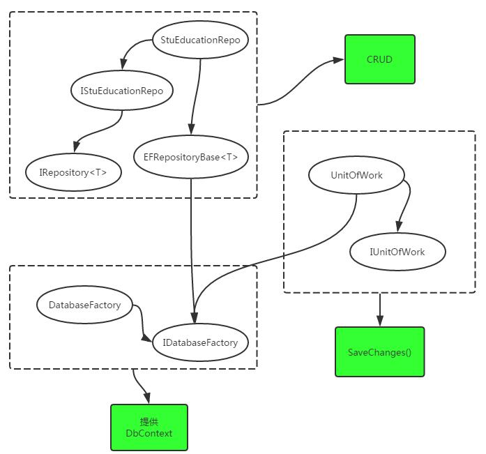
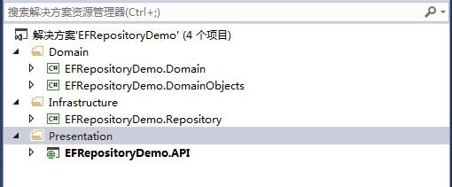
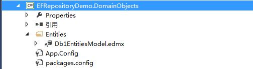

 

# [DDD-EF-数据仓储](https://www.cnblogs.com/frozenzhang/p/5390551.html)

http://www.cnblogs.com/frozenzhang/p/5390551.html

[Frozen.Zhang](https://home.cnblogs.com/u/frozenzhang/)


　　关系图

​     

 

# **一、分层**



 

# **二、DomainObjects构建edmx**



 

# **三、EFRepositoryDemo.Domain定义仓储接口**

[](javascript:void(0);)

```
 1 public interface IRepository<T>
 2         where T : class
 3     {
 4         void Add(T entity);
 5         void AddAll(IEnumerable<T> entities);
 6         void Update(T entity);
 7         void Update(IEnumerable<T> entities);
 8         void Delete(T entity);
 9         void Delete(Expression<Func<T, bool>> where);
10         void DeleteAll(IEnumerable<T> entities);
11 
12         void Clear();
13         T GetById(long Id);
14         T GetById(string Id);
15         T Get(Expression<Func<T, bool>> where);
16         IEnumerable<T> GetAll();
17         IEnumerable<T> GetMany(Expression<Func<T, bool>> where);
18         IEnumerable<T> GetAllLazy();
19     }
```

[](javascript:void(0);)

 

# **四、Infrastructure层 仓储的抽象基类（EF的CRUD）**

**Repository很明显的一个特征 是 内部没有SaveChanges()**

[](javascript:void(0);)

```
  1 public abstract class EFRepositoryBase<T> where T : class
  2     {
  3         private Db1DbContext dataContext;
  4         private readonly DbSet<T> dbset;
  5 
  6         protected IDatabaseFactory DatabaseFactory
  7         {
  8             get;
  9             private set;
 10         }
 11 
 12         protected Db1DbContext DataContext
 13         {
 14             get { return dataContext ?? (dataContext = DatabaseFactory.Get()); }
 15         }
 16 
 17         protected EFRepositoryBase(IDatabaseFactory databaseFactory)
 18         {
 19             DatabaseFactory = databaseFactory;
 20             dbset = DataContext.Set<T>();
 21         }
 22 
 23         public virtual void Add(T entity)
 24         {
 25             dbset.Add(entity);
 26         }
 27 
 28         //新增方法
 29         public virtual void AddAll(IEnumerable<T> entities)
 30         {
 31             dbset.AddRange(entities);
 32         }
 33 
 34         public virtual void Update(T entity)
 35         {
 36             dbset.Attach(entity);
 37             dataContext.Entry(entity).State = EntityState.Modified;
 38         }
 39 
 40         //新增方法
 41         public virtual void Update(IEnumerable<T> entities)
 42         {
 43             foreach (T obj in entities)
 44             {
 45                 dbset.Attach(obj);
 46                 dataContext.Entry(obj).State = EntityState.Modified;
 47             }
 48         }
 49 
 50         public virtual void Delete(T entity)
 51         {
 52             dbset.Remove(entity);
 53         }
 54 
 55         public virtual void Delete(Expression<Func<T, bool>> where)
 56         {
 57             IEnumerable<T> objects = dbset.Where<T>(where).AsEnumerable();
 58             dbset.RemoveRange(objects);
 59         }
 60 
 61         //新增方法
 62         public virtual void DeleteAll(IEnumerable<T> entities)
 63         {
 64             dbset.RemoveRange(entities);
 65         }
 66 
 67         public virtual void Clear()
 68         {
 69             throw new NotImplementedException();
 70         }
 71 
 72         public virtual T GetById(long id)
 73         {
 74             return dbset.Find(id);
 75         }
 76 
 77         public virtual T GetById(string id)
 78         {
 79             return dbset.Find(id);
 80         }
 81 
 82         public virtual IEnumerable<T> GetAll()
 83         {
 84             return dbset.ToList();
 85         }
 86 
 87         public virtual IEnumerable<T> GetMany(Expression<Func<T, bool>> where)
 88         {
 89             return dbset.Where(where).ToList();
 90         }
 91 
 92         public T Get(Expression<Func<T, bool>> where)
 93         {
 94             return dbset.Where(where).FirstOrDefault<T>();
 95         }
 96 
 97         public virtual IEnumerable<T> GetAllLazy()
 98         {
 99             return dbset;
100         }
101 
102     }
```

[](javascript:void(0);)

 

# **五、Repository** 

```
1     public interface IStuEducationRepo : IRepository<TB_Stu_Education>
2     {
3 
4     }
```

[](javascript:void(0);)

```
1     public class StuEducationRepo : RepositoryBase<TB_Stu_Education>, IStuEducationRepo
2     {
3         public StuEducationRepo(IDatabaseFactory databaseFactory)
4             : base(databaseFactory)
5         {
6 
7         }
8 
9     }
```

[](javascript:void(0);)

 

# **六、工作单元**

在进行数据库的CUD操作时，因为Repository内部没有做SaveChanges()操作

所以要增加工作单元，进行包裹

```
1     public interface IUnitOfWork
2     {
3         void Commit();
4         void CommitAsync();
5     }
```

[](javascript:void(0);)

```
 1 public class UnitOfWork : IUnitOfWork
 2     {
 3         private readonly IDatabaseFactory databaseFactory;
 4         private Db1DbContext dataContext;
 5 
 6         public UnitOfWork(IDatabaseFactory databaseFactory)
 7         {
 8             this.databaseFactory = databaseFactory;
 9         }
10 
11         protected Db1DbContext DataContext
12         {
13             get { return dataContext ?? (dataContext = databaseFactory.Get()); }
14         }
15 
16         public void Commit()
17         {
18             DataContext.SaveChanges();
19         }
20 
21         public void CommitAsync()
22         {
23             DataContext.SaveChangesAsync();
24         }
25 
26     }
```

[](javascript:void(0);)

 

# **七、Autofac注册**

[](javascript:void(0);)

```
 1             var builder = new ContainerBuilder();
 2             builder.RegisterApiControllers(Assembly.GetExecutingAssembly());
 3 
 4             
 5             builder.RegisterType<DatabaseFactory>().As<IDatabaseFactory>().InstancePerLifetimeScope();
 6             builder.RegisterType<UnitOfWork>().As<IUnitOfWork>().InstancePerLifetimeScope();
 7 
 8             builder.RegisterAssemblyTypes(typeof(StuEducationRepo).Assembly)
 9                 .Where(t => t.Name.EndsWith("Repo"))
10                 .AsImplementedInterfaces().InstancePerLifetimeScope();
11 
12             builder.RegisterWebApiFilterProvider(GlobalConfiguration.Configuration);
13             IContainer container = builder.Build();
14             var resolver = new AutofacWebApiDependencyResolver(container);
15 
16             // Configure Web API with the dependency resolver.
17             GlobalConfiguration.Configuration.DependencyResolver = resolver;
```

[](javascript:void(0);)

 

# **八、调用示例**

[](javascript:void(0);)

```
 1 // GET api/<controller>/5
 2         public string Get(int id)
 3         {
 4 
 5             var stuAccount = _stuAccountRepo.Get(p => p.UserId == 20987);
 6             if (stuAccount != null)
 7             {
 8                 stuAccount.UserName = "张冬林Test";
 9             }
10 
11             var stuEducation = _stuEducationRepo.GetMany(p => p.UserId == 20987);
12             if (stuEducation != null && stuEducation.Count() > 0)
13             {
14                 foreach (var i in stuEducation)
15                 {
16                     i.ModifyDate = new DateTime(2016, 06, 14);
17                 }
18             }
19 
20             _unitOfWork.Commit();
21 
22             return "value";
23         }
```

[](javascript:void(0);)

 

# **九、总结说明**

　　1、Global Autofac注册，以保证在一次Http请求的生命周期内的DbContext是单例的

```
        builder.RegisterType<DatabaseFactory>().As<IDatabaseFactory>().InstancePerLifetimeScope();
        private Db1DbContext dataContext;

        public Db1DbContext Get()
        {
            return dataContext ?? (dataContext = new Db1DbContext());
        }
```

　　这样Repository和UnitOfWork的DbContext 是一个对象，即同一个数据库上下文。所以 实现了 CRUD 与 数据持久化 两个步骤的分离

```
        public virtual void Update(T entity)
        {
            dbset.Attach(entity);
            dataContext.Entry(entity).State = EntityState.Modified;
        }
```

[](javascript:void(0);)

```
        private readonly IDatabaseFactory databaseFactory;
        private Db1DbContext dataContext;

        public UnitOfWork(IDatabaseFactory databaseFactory)
        {
            this.databaseFactory = databaseFactory;
        }

        protected Db1DbContext DataContext
        {
            get { return dataContext ?? (dataContext = databaseFactory.Get()); }
        }

        public void Commit()
        {
            DataContext.SaveChanges();
        }
```

[](javascript:void(0);)

 　2、Entity Framework本身就是一仓储，但DDD的这种设计并非画蛇添足。接口定义与代码实现的分离，可以不用关心ORM，可以不用关心是何种DB

 

　　附：[源码下载](http://pan.baidu.com/s/1bo0EIjt)

 


分类: [DDD](https://www.cnblogs.com/frozenzhang/category/810768.html)

标签: [DDD](https://www.cnblogs.com/frozenzhang/tag/DDD/), [EF](https://www.cnblogs.com/frozenzhang/tag/EF/), [数据仓储](https://www.cnblogs.com/frozenzhang/tag/数据仓储/)

​         [好文要顶](javascript:void(0);)             [关注我](javascript:void(0);)     [收藏该文](javascript:void(0);)     [](javascript:void(0);)     [](javascript:void(0);) 


​             [Frozen.Zhang](https://home.cnblogs.com/u/frozenzhang/)
​             [关注 - 16](https://home.cnblogs.com/u/frozenzhang/followees)
​             [粉丝 - 32](https://home.cnblogs.com/u/frozenzhang/followers)         


​                 [+加关注](javascript:void(0);)     

​         0     

​         0     


​     


[« ](https://www.cnblogs.com/frozenzhang/p/5355669.html) 上一篇：[领域Command](https://www.cnblogs.com/frozenzhang/p/5355669.html)
[» ](https://www.cnblogs.com/frozenzhang/p/5406773.html) 下一篇：[SignalR实现在线聊天室功能](https://www.cnblogs.com/frozenzhang/p/5406773.html)