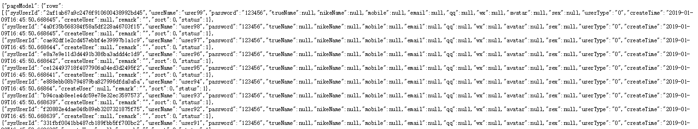

#  			[EFCore+Mysql仓储层建设(分页、多字段排序、部分字段更新)](https://www.cnblogs.com/jomzhang/p/10245077.html) 		


# **前沿**

　　园子里已有挺多博文介绍了EFCore+Mysql/MSSql如何进行使用，但实际开发不会把EF层放在Web层混合起来，需要多个项目配合结构清晰的进行分层工作，本文根据个人实践经验总结将各个项目进行分层，仅供想自己搭建,包含数据仓储以及分页多字段排序。

## 目录结构

### 1.实体层（EF）搭建

#### 1.1添加Nuget包

#### 1.2添加实体

#### 1.3构造DbContext

#### 1.4数据迁移生成数据库

### 2.仓储层搭建

#### 　　2.1添加Nuget包

#### 　　2.2添加必要的支持IEnumerable<T>和IQueryable<T> 的OrderBy字符串支持类LinqExtensions

#### 　　2.3构造RepositoryBase<T>

#### 　　2.4添加Table文件夹，添加SysUserRepository

#### 　　2.5添加工作单元UnitOfWork

### 3.WebApi项目测试

#### 　　3.1注入EF

#### 　　3.2测试

### 4.Github项目地址

 

## 正文

### 1.实体层（EF）搭建

新建.NetCore类库项目Entity,本人使用的是2.0的SDK

#### 1.1添加Nuget包

```
PM> Install-Package Microsoft.AspNetCore.All -version 2.0.9
PM> Install-Package Pomelo.EntityFrameworkCore.MySql -version 2.0.1
```


#### 1.2添加实体

父类EntityBase

[](javascript:void(0);)

```
using System;
using System.Collections.Generic;
using System.ComponentModel.DataAnnotations;
using System.Text;

namespace Entity.Table
{
    public class EntityBase
    {
        /// <summary>
        /// 创建时间
        /// </summary>
        [Display(Name = "创建时间")]
        public DateTime? CreateTime { get; set; } = DateTime.Now;

        /// <summary>
        /// 创建人
        /// </summary>
        [Display(Name = "创建人")]
        [StringLength(32)]
        public string CreateUser { get; set; }

        /// <summary>
        /// 状态0-删除，1-正常，2-禁用，3-待审核
        /// </summary>
        [Display(Name = "状态0-逻辑删除，1-正常，2-禁用,...")]
        public virtual int? Status { get; set; } = 2;

        /// <summary>
        /// 排序
        /// </summary>
        [Display(Name = "排序")]
        public int? Sort { get; set; } = 0;

        /// <summary>
        /// 备注
        /// </summary>
        [Display(Name = "备注")]
        [StringLength(200)]
        public string Remark { get; set; } = "";
    }
}
```

[](javascript:void(0);)

实体类SysUser

[](javascript:void(0);)

```
using System;
using System.Collections.Generic;
using System.ComponentModel.DataAnnotations;
using System.ComponentModel.DataAnnotations.Schema;
using System.Text;

namespace Entity.Table
{
    [Table("Sys_User")]
    public class SysUser : EntityBase
    {
        [Key]
        [StringLength(32)]
        public string SysUserId { get; set; }

        [Display(Name = "用户名")]
        [Required]
        [StringLength(32)]
        public string UserName { get; set; }

        [Display(Name = "密码")]
        [StringLength(255)]
        public string Password { get; set; }

        [Display(Name = "真实姓名")]
        [StringLength(32)]
        public string TrueName { get; set; }

        [Display(Name = "昵称")]
        [StringLength(32)]
        public string NikeName { get; set; }

        [Display(Name = "手机号")]
        [StringLength(20)]
        public string Mobile { get; set; }

        [Display(Name = "邮箱")]
        [EmailAddress]
        [StringLength(100)]
        public string Email { get; set; }

        [Display(Name = "QQOpenid")]
        [StringLength(200)]
        public string QQ { get; set; }

        [Display(Name = "微信openid")]
        [StringLength(200)]
        public string WX { get; set; }

        [Display(Name = "头像")]
        [StringLength(255)]
        public string Avatar { get; set; }

        [Display(Name = "性别")]
        [StringLength(1)]
        public string Sex { get; set; }

        [Display(Name = "用户类型")]
        [StringLength(1)]
        public string UserType { get; set; }//0-前台用户，1-管理用户

    }
}
```

[](javascript:void(0);)

#### 1.3构造DbContext

[](javascript:void(0);)

```
using Entity.Table;
using Microsoft.EntityFrameworkCore;
using Microsoft.Extensions.Configuration;
using System;

namespace Entity
{
    public class AeDbContext : DbContext
    {
        #region 构造方法
        public AeDbContext(DbContextOptions<AeDbContext> options) : base(options) { }
        public AeDbContext() { } //非注入构造方式
        #endregion

        #region 表对象
        public virtual DbSet<SysUser> SysUsers { get; set; }
        #endregion

        protected override void OnConfiguring(DbContextOptionsBuilder optionsBuilder)
        {
            base.OnConfiguring(optionsBuilder);
            if (!optionsBuilder.IsConfigured)
            {
                //重点:数据迁移或者直接New AeDbContext时候用到的链接字符串获取方式
                var builder = new ConfigurationBuilder()
                    .AddJsonFile("appsettings.json", optional: false, reloadOnChange: true);
                var configuration = builder.Build();
                string connectionString = configuration.GetConnectionString("SQLConnection");
                optionsBuilder.UseMySql(connectionString);
            }
        }
    }
}
```

[](javascript:void(0);)

在这有重写OnConfiguring方法，如果没有构造数据库链接字符串的话则到appsettings.json中去取,注意将appsettings.json文件始终复制


 

appsettings.json

[](javascript:void(0);)

```
{
  "ConnectionStrings": {
    "SQLConnection": "server=127.0.0.1;database=eftest;userid=root;pwd=123456;port=3306;sslmode=none;"
  },
  "server.urls": "http://localhost:5001" //监听端口配置，可多个
}
```

[](javascript:void(0);)

#### 1.4数据迁移生成数据库

打开PM选择默认项目Entity


 输入

```
PM> Add-Migration init
```

若提示The configuration file  'appsettings.json' was not found and is not optional. The physical path  is 'E:\VS项目\EFTest\Entity\bin\Debug\netcoreapp2.0\appsettings.json'.

则为没检测到appsettings.json，需要文件更改属性为复制

提示后进行更新数据库，如下为更新成功。

```
PM> update-database
```

 


 最后Entity项目内容如下


 

### 2.仓储层搭建

新建.NetCore类库项目Repository并引用项目Entity

#### 2.1添加Nuget包

```
PM> Install-Package Microsoft.EntityFrameworkCore -version 2.0.3
PM> Install-Package LinqKit.Microsoft.EntityFrameworkCore -version 1.1.15
```

 

#### 2.2添加必要的支持IEnumerable<T>和IQueryable<T> 的OrderBy字符串支持类LinqExtensions

[](javascript:void(0);)

```
using System;
using System.Linq;
using System.Linq.Expressions;
using System.Reflection;
using System.Collections.Generic;

namespace Repository
{
    internal static class LinqExtensions {
        private static PropertyInfo GetPropertyInfo(Type objType, string name) {
            var properties = objType.GetProperties();
            var matchedProperty = properties.FirstOrDefault(p => p.Name == name);
            if (matchedProperty == null) {
                throw new ArgumentException("name");
            }

            return matchedProperty;
        }
        private static LambdaExpression GetOrderExpression(Type objType, PropertyInfo pi) {
            var paramExpr = Expression.Parameter(objType);
            var propAccess = Expression.PropertyOrField(paramExpr, pi.Name);
            var expr = Expression.Lambda(propAccess, paramExpr);
            return expr;
        }
        /// <summary>
        /// 多个OrderBy用逗号隔开,属性前面带-号表示反序排序，exp:"name,-createtime"
        /// </summary>
        /// <typeparam name="T"></typeparam>
        /// <param name="query"></param>
        /// <param name="name"></param>
        /// <returns></returns>
        public static IEnumerable<T> OrderByBatch<T>(this IEnumerable<T> query, string name) {
            var index = 0;
            var a = name.Split(',');
            foreach (var item in a) {
                var m = index++ > 0 ? "ThenBy" : "OrderBy";
                if (item.StartsWith("-")) {
                    m += "Descending";
                    name = item.Substring(1);
                } else {
                    name = item;
                }
                name = name.Trim();

                var propInfo = GetPropertyInfo(typeof(T), name);
                var expr = GetOrderExpression(typeof(T), propInfo);
                var method = typeof(Enumerable).GetMethods().FirstOrDefault(mt => mt.Name == m && mt.GetParameters().Length == 2);
                var genericMethod = method.MakeGenericMethod(typeof(T), propInfo.PropertyType);
                query = (IEnumerable<T>)genericMethod.Invoke(null, new object[] { query, expr.Compile() });
            }
            return query;
        }

        /// <summary>
        /// 多个OrderBy用逗号隔开,属性前面带-号表示反序排序，exp:"name,-createtime"
        /// </summary>
        /// <typeparam name="T"></typeparam>
        /// <param name="query"></param>
        /// <param name="name"></param>
        /// <returns></returns>
        public static IQueryable<T> OrderByBatch<T>(this IQueryable<T> query, string name)
        {
            var index = 0;
            var a = name.Split(',');
            foreach (var item in a)
            {
                var m = index++ > 0 ? "ThenBy" : "OrderBy";
                if (item.StartsWith("-"))
                {
                    m += "Descending";
                    name = item.Substring(1);
                }
                else
                {
                    name = item;
                }
                name = name.Trim();

                var propInfo = GetPropertyInfo(typeof(T), name);
                var expr = GetOrderExpression(typeof(T), propInfo);
                var method = typeof(Queryable).GetMethods().FirstOrDefault(mt => mt.Name == m && mt.GetParameters().Length == 2);
                var genericMethod = method.MakeGenericMethod(typeof(T), propInfo.PropertyType);
                query = (IQueryable<T>)genericMethod.Invoke(null, new object[] { query, expr });
            }
            return query;
        }
        
        /// <summary>
        /// 正序排序单个
        /// </summary>
        /// <typeparam name="T"></typeparam>
        /// <param name="query"></param>
        /// <param name="name"></param>
        /// <returns></returns>
        public static IQueryable<T> OrderBy<T>(this IQueryable<T> query, string name) {
            var propInfo = GetPropertyInfo(typeof(T), name);
            var expr = GetOrderExpression(typeof(T), propInfo);

            var method = typeof(Queryable).GetMethods().FirstOrDefault(m => m.Name == "OrderBy" && m.GetParameters().Length == 2);
            var genericMethod = method.MakeGenericMethod(typeof(T), propInfo.PropertyType);
            return (IQueryable<T>)genericMethod.Invoke(null, new object[] { query, expr });
        }
        /// <summary>
        /// 正序排序单个（非首个）
        /// </summary>
        /// <typeparam name="T"></typeparam>
        /// <param name="query"></param>
        /// <param name="name"></param>
        /// <returns></returns>
        public static IQueryable<T> ThenBy<T>(this IQueryable<T> query, string name)
        {
            var propInfo = GetPropertyInfo(typeof(T), name);
            var expr = GetOrderExpression(typeof(T), propInfo);

            var method = typeof(Queryable).GetMethods().FirstOrDefault(m => m.Name == "ThenBy" && m.GetParameters().Length == 2);
            var genericMethod = method.MakeGenericMethod(typeof(T), propInfo.PropertyType);
            return (IQueryable<T>)genericMethod.Invoke(null, new object[] { query, expr });
        }
        /// <summary>
        /// 反序排序单个
        /// </summary>
        /// <typeparam name="T"></typeparam>
        /// <param name="query"></param>
        /// <param name="name"></param>
        /// <returns></returns>
        public static IQueryable<T> OrderByDescending<T>(this IQueryable<T> query, string name)
        {
            var propInfo = GetPropertyInfo(typeof(T), name);
            var expr = GetOrderExpression(typeof(T), propInfo);
            var metMethods = typeof(Queryable).GetMethods();
            var method = metMethods.FirstOrDefault(m => m.Name == "OrderByDescending" && m.GetParameters().Length == 2);
            var genericMethod = method.MakeGenericMethod(typeof(T), propInfo.PropertyType);
            return (IQueryable<T>)genericMethod.Invoke(null, new object[] { query, expr });
        }
        /// <summary>
        /// 反序排序单个（非首个）
        /// </summary>
        /// <typeparam name="T"></typeparam>
        /// <param name="query"></param>
        /// <param name="name"></param>
        /// <returns></returns>
        public static IQueryable<T> ThenByDescending<T>(this IQueryable<T> query, string name)
        {
            var propInfo = GetPropertyInfo(typeof(T), name);
            var expr = GetOrderExpression(typeof(T), propInfo);
            var metMethods = typeof(Queryable).GetMethods();
            var method = metMethods.FirstOrDefault(m => m.Name == "ThenByDescending" && m.GetParameters().Length == 2);
            var genericMethod = method.MakeGenericMethod(typeof(T), propInfo.PropertyType);
            return (IQueryable<T>)genericMethod.Invoke(null, new object[] { query, expr });
        }
    }
}
```

[](javascript:void(0);)

以及分页支持类PageData<T>

[](javascript:void(0);)

```
using System;
using System.Collections.Generic;
using System.Text;

namespace Repository
{
    public class PageData<T>
    {
        public List<T> Rows { get; set; }
        public long Totals { get; set; }
    }
}
```

[](javascript:void(0);)

#### 2.3构造RepositoryBase<T>

[](javascript:void(0);)

```
using Entity;
using Microsoft.EntityFrameworkCore;
using System;
using System.Collections.Generic;
using System.Linq;
using System.Linq.Expressions;
using System.Text;
using System.Threading.Tasks;
using Microsoft.EntityFrameworkCore.Infrastructure;
using System.IO;
using Entity.Table;

namespace Repository
{
    public class RepositoryBase<T> where T : EntityBase
    {
        private readonly DbSet<T> _dbSet;
        public AeDbContext DbContext { get; } = null;
        public RepositoryBase(AeDbContext context)
        {
            DbContext = context;
            _dbSet = DbContext.Set<T>();
        }
        public DatabaseFacade Database => DbContext.Database;
        public IQueryable<T> Entities => _dbSet.AsQueryable().AsNoTracking();
        public int SaveChanges()
        {
            return DbContext.SaveChanges();
        }
        public async Task<int> SaveChangesAsync()
        {
            return await DbContext.SaveChangesAsync();
        }
        public bool Any(Expression<Func<T, bool>> whereLambd)
        {
            return _dbSet.Where(whereLambd).Any();
        }
        public void Disposed()
        {
            throw new Exception("不允许在这里释放上下文，请在UnitOfWork中操作");
            //DbContext.Dispose();
        }

        #region 插入数据
        public bool Insert(T entity, bool isSaveChange = true)
        {
            _dbSet.Add(entity);
            if (isSaveChange)
            {
                return SaveChanges() > 0;
            }
            return false;
        }
        public async Task<bool> InsertAsync(T entity, bool isSaveChange = true)
        {
            _dbSet.Add(entity);
            if (isSaveChange)
            {
                return await SaveChangesAsync() > 0;
            }
            return false;
        }
        public bool Insert(List<T> entitys, bool isSaveChange = true)
        {
            _dbSet.AddRange(entitys);
            if (isSaveChange)
            {
                return SaveChanges() > 0;
            }
            return false;
        }
        public async Task<bool> InsertAsync(List<T> entitys, bool isSaveChange = true)
        {
            _dbSet.AddRange(entitys);
            if (isSaveChange)
            {
                return await SaveChangesAsync() > 0;
            }
            return false;
        }
        #endregion

        #region 删除
        public bool Delete(T entity, bool isSaveChange = true)
        {
            _dbSet.Attach(entity);
            _dbSet.Remove(entity);
            return isSaveChange ? SaveChanges() > 0 : false;
        }
        public bool Delete(List<T> entitys, bool isSaveChange = true)
        {
            entitys.ForEach(entity =>
            {
                _dbSet.Attach(entity);
                _dbSet.Remove(entity);
            });
            return isSaveChange ? SaveChanges() > 0 : false;
        }

        public virtual async Task<bool> DeleteAsync(T entity, bool isSaveChange = true)
        {

            _dbSet.Attach(entity);
            _dbSet.Remove(entity);
            return isSaveChange ? await SaveChangesAsync() > 0 : false;
        }
        public virtual async Task<bool> DeleteAsync(List<T> entitys, bool isSaveChange = true)
        {
            entitys.ForEach(entity =>
            {
                _dbSet.Attach(entity);
                _dbSet.Remove(entity);
            });
            return isSaveChange ? await SaveChangesAsync() > 0 : false;
        }
        #endregion

        #region 更新数据
        public bool Update(T entity, bool isSaveChange = true, List<string> updatePropertyList = null, bool modified = true)
        {
            if (entity == null)
            {
                return false;
            }
            _dbSet.Attach(entity);
            var entry = DbContext.Entry(entity);
            if (updatePropertyList == null)
            {
                entry.State = EntityState.Modified;//全字段更新
            }
            else
            {
                if (modified)
                {
                    updatePropertyList.ForEach(c => {
                        entry.Property(c).IsModified = true; //部分字段更新的写法
                    });
                }
                else
                {
                    entry.State = EntityState.Modified;//全字段更新
                    updatePropertyList.ForEach(c => {
                        entry.Property(c).IsModified = false; //部分字段不更新的写法
                    });
                }
            }
            if (isSaveChange)
            {
                return SaveChanges() > 0;
            }
            return false;
        }
        public bool Update(List<T> entitys, bool isSaveChange = true)
        {
            if (entitys == null || entitys.Count == 0)
            {
                return false;
            }
            entitys.ForEach(c => {
                Update(c, false);
            });
            if (isSaveChange)
            {
                return SaveChanges() > 0;
            }
            return false;
        }
        public async Task<bool> UpdateAsync(T entity, bool isSaveChange = true, List<string> updatePropertyList = null, bool modified = true)
        {
            if (entity == null)
            {
                return false;
            }
            _dbSet.Attach(entity);
            var entry = DbContext.Entry<T>(entity);
            if (updatePropertyList == null)
            {
                entry.State = EntityState.Modified;//全字段更新
            }
            else
            {
                if (modified)
                {
                    updatePropertyList.ForEach(c => {
                        entry.Property(c).IsModified = true; //部分字段更新的写法
                    });
                }
                else
                {
                    entry.State = EntityState.Modified;//全字段更新
                    updatePropertyList.ForEach(c => {
                        entry.Property(c).IsModified = false; //部分字段不更新的写法
                    });
                }
            }
            if (isSaveChange)
            {
                return await SaveChangesAsync() > 0;
            }
            return false;
        }
        public async Task<bool> UpdateAsync(List<T> entitys, bool isSaveChange = true)
        {
            if (entitys == null || entitys.Count == 0)
            {
                return false;
            }
            entitys.ForEach(c => {
                _dbSet.Attach(c);
                DbContext.Entry<T>(c).State = EntityState.Modified;
            });
            if (isSaveChange)
            {
                return await SaveChangesAsync() > 0;
            }
            return false;
        }
        #endregion

        #region 查找
        public long Count(Expression<Func<T, bool>> predicate = null)
        {
            if (predicate == null)
            {
                predicate = c => true;
            }
            return _dbSet.LongCount(predicate);
        }
        public async Task<long> CountAsync(Expression<Func<T, bool>> predicate = null)
        {
            if (predicate == null)
            {
                predicate = c => true;
            }
            return await _dbSet.LongCountAsync(predicate);
        }
        public T Get(object id)
        {
            if (id == null)
            {
                return default(T);
            }
            return _dbSet.Find(id);
        }
        public T Get(Expression<Func<T, bool>> predicate = null, bool isNoTracking = true)
        {
            var data = isNoTracking ? _dbSet.Where(predicate).AsNoTracking() : _dbSet.Where(predicate);
            return data.FirstOrDefault();
        }
        public async Task<T> GetAsync(object id)
        {
            if (id == null)
            {
                return default(T);
            }
            return await _dbSet.FindAsync(id);
        }
        public async Task<T> GetAsync(Expression<Func<T, bool>> predicate = null, bool isNoTracking = true)
        {
            var data = isNoTracking ? _dbSet.Where(predicate).AsNoTracking() : _dbSet.Where(predicate);
            return await data.FirstOrDefaultAsync();
        }
        public async Task<List<T>> GetListAsync(Expression<Func<T, bool>> predicate = null, string ordering = "", bool isNoTracking = true)
        {
            var data = isNoTracking ? _dbSet.Where(predicate).AsNoTracking() : _dbSet.Where(predicate);
            if (!string.IsNullOrEmpty(ordering))
            {
                data = data.OrderByBatch(ordering);
            }
            return await data.ToListAsync();
        }
        public List<T> GetList(Expression<Func<T, bool>> predicate = null, string ordering = "", bool isNoTracking = true)
        {
            var data = isNoTracking ? _dbSet.Where(predicate).AsNoTracking() : _dbSet.Where(predicate);
            if (!string.IsNullOrEmpty(ordering))
            {
                data = data.OrderByBatch(ordering);
            }
            return data.ToList();
        }
        public async Task<IQueryable<T>> LoadAsync(Expression<Func<T, bool>> predicate = null, bool isNoTracking = true)
        {
            if (predicate == null)
            {
                predicate = c => true;
            }
            return await Task.Run(() => isNoTracking ? _dbSet.Where(predicate).AsNoTracking() : _dbSet.Where(predicate));
        }
        public IQueryable<T> Load(Expression<Func<T, bool>> predicate = null, bool isNoTracking = true)
        {
            if (predicate == null)
            {
                predicate = c => true;
            }
            return isNoTracking ? _dbSet.Where(predicate).AsNoTracking() : _dbSet.Where(predicate);
        }
        #region 分页查找
        /// <summary>
        /// 分页查询异步
        /// </summary>
        /// <param name="whereLambda">查询添加（可有，可无）</param>
        /// <param name="ordering">排序条件（一定要有）</param>
        /// <param name="pageIndex">当前页码</param>
        /// <param name="pageSize">每页大小</param>
        /// <param name="isOrder">排序正反</param>
        /// <returns></returns>
        public async Task<PageData<T>> GetPageAsync<TKey>(Expression<Func<T, bool>> whereLambda, Expression<Func<T, TKey>> orderBy, int pageIndex, int pageSize, bool isOrder = true, bool isNoTracking = true)
        {
            IQueryable<T> data = isOrder ?
                _dbSet.OrderBy(orderBy) :
                _dbSet.OrderByDescending(orderBy);

            if (whereLambda != null)
            {
                data = isNoTracking ? data.Where(whereLambda).AsNoTracking() : data.Where(whereLambda);
            }
            PageData<T> pageData = new PageData<T>
            {
                Totals = await data.CountAsync(),
                Rows = await data.Skip((pageIndex - 1) * pageSize).Take(pageSize).ToListAsync()
            };
            return pageData;
        }

        /// <summary>
        /// 分页查询异步
        /// </summary>
        /// <param name="whereLambda">查询添加（可有，可无）</param>
        /// <param name="ordering">排序条件（一定要有，多个用逗号隔开，倒序开头用-号）</param>
        /// <param name="pageIndex">当前页码</param>
        /// <param name="pageSize">每页大小</param>
        /// <returns></returns>
        public async Task<PageData<T>> GetPageAsync(Expression<Func<T, bool>> whereLambda, string ordering, int pageIndex, int pageSize, bool isNoTracking = true)
        {
            // 分页 一定注意： Skip 之前一定要 OrderBy
            if (string.IsNullOrEmpty(ordering))
            {
                ordering = nameof(T) + "Id";//默认以Id排序
            }
            var data = _dbSet.OrderByBatch(ordering);
            if (whereLambda != null)
            {
                data = isNoTracking ? data.Where(whereLambda).AsNoTracking() : data.Where(whereLambda);
            }
            //查看生成的sql，找到大数据下分页巨慢原因为order by 耗时
            //var sql = data.Skip((pageIndex - 1) * pageSize).Take(pageSize).ToSql();
            //File.WriteAllText(@"D:\sql.txt",sql);
            PageData<T> pageData = new PageData<T>
            {
                Totals = await data.CountAsync(),
                Rows = await data.Skip((pageIndex - 1) * pageSize).Take(pageSize).ToListAsync()
            };
            return pageData;
        }

        /// <summary>
        /// 分页查询
        /// </summary>
        /// <param name="whereLambda">查询添加（可有，可无）</param>
        /// <param name="ordering">排序条件（一定要有，多个用逗号隔开，倒序开头用-号）</param>
        /// <param name="pageIndex">当前页码</param>
        /// <param name="pageSize">每页大小</param>
        /// <returns></returns>
        public PageData<T> GetPage(Expression<Func<T, bool>> whereLambda, string ordering, int pageIndex, int pageSize, bool isNoTracking = true)
        {
            // 分页 一定注意： Skip 之前一定要 OrderBy
            if (string.IsNullOrEmpty(ordering))
            {
                ordering = nameof(T) + "Id";//默认以Id排序
            }
            var data = _dbSet.OrderByBatch(ordering);
            if (whereLambda != null)
            {
                data = isNoTracking ? data.Where(whereLambda).AsNoTracking() : data.Where(whereLambda);
            }
            PageData<T> pageData = new PageData<T>
            {
                Totals = data.Count(),
                Rows = data.Skip((pageIndex - 1) * pageSize).Take(pageSize).ToList()
            };
            return pageData;
        }
        #endregion
        #endregion
    }
}
```

[](javascript:void(0);)

#### 2.4添加Table文件夹，添加SysUserRepository

[](javascript:void(0);)

```
using Entity;
using Entity.Table;
using System;
using System.Collections.Generic;
using System.Text;

namespace Repository.Table
{
    public class SysUserRepository : RepositoryBase<SysUser>
    {
        public SysUserRepository(AeDbContext context) : base(context)
        {
        }
    }
}
```

[](javascript:void(0);)

#### 2.5添加工作单元UnitOfWork

[](javascript:void(0);)

```
using Entity;
using Microsoft.EntityFrameworkCore;
using Microsoft.EntityFrameworkCore.Storage;
using Repository.Table;
using System;
using System.Collections.Generic;
using System.Data;
using System.Linq;
using System.Text;
using System.Threading.Tasks;

namespace Repository
{
    public class UnitOfWork : IDisposable
    {
        public static UnitOfWork Instance = new UnitOfWork(new AeDbContext());
        public AeDbContext DbContext { get; set; } = null;
        public UnitOfWork(AeDbContext dbContext)
        {
            DbContext = dbContext;
        }

        #region 字段
        private SysUserRepository _SysUserRepository = null;
        #endregion

        #region 操作类属性
        public SysUserRepository SysUserRepository => _SysUserRepository ?? (_SysUserRepository = new SysUserRepository(DbContext));
        #endregion

        #region 仓储操作（提交事务保存SaveChanges(),回滚RollBackChanges(),释放资源Dispose()）
        /// <summary>
        /// 保存
        /// </summary>
        public int SaveChanges()
        {
            return DbContext.SaveChanges();
        }
        public async Task<int> SaveChangesAsync()
        {
            return await DbContext.SaveChangesAsync();
        }
        /// <summary>
        /// 回滚
        /// </summary>
        public void RollBackChanges()
        {
            var items = DbContext.ChangeTracker.Entries().ToList();
            items.ForEach(o => o.State = EntityState.Unchanged);
        }
        /// <summary>
        /// 释放资源
        /// </summary>
        private bool disposed = false;

        protected virtual void Dispose(bool disposing)
        {
            if (!this.disposed)
            {
                if (disposing)
                {
                    DbContext.Dispose();//随着工作单元的销毁而销毁
                }
            }
            this.disposed = true;
        }
        public void Dispose()
        {
            Dispose(true);
            GC.SuppressFinalize(this);
        }
        public IDbContextTransaction BeginTransaction()
        {
            var scope = DbContext.Database.BeginTransaction();
            return scope;
        }
        #endregion
    }
}
```

[](javascript:void(0);)

这样仓储层就构造完成了，篇幅已经很长了，Service层就先不介绍了。

### 3.WebApi项目测试

新建.NetCore的项目的Web应用程序ApiTest,选择webapi方式，并引用Entity和Repository项目

#### 3.1注入EF

[](javascript:void(0);)

```
public void ConfigureServices(IServiceCollection services)
        {
            services.AddMvc();
            services.AddDbContext<AeDbContext>(options => options.UseMySql(Configuration.GetConnectionString("SQLConnection")));
　　　　　　　services.AddTransient(typeof(UnitOfWork));//注入工作单元
        }
```

[](javascript:void(0);)

#### 3.2测试

[](javascript:void(0);)

```
using System;
using System.Collections.Generic;
using System.Linq;
using System.Threading.Tasks;
using Microsoft.AspNetCore.Mvc;
using Repository;

namespace ApiTest.Controllers
{
    [Route("api/[controller]")]
    public class ValuesController : Controller
    {
        UnitOfWork _unitOfWork;
        public ValuesController(UnitOfWork unitOfWork)
        {
            _unitOfWork = unitOfWork;
        }
        // GET api/values
        [HttpGet]
        public IEnumerable<string> Get()
        {
            var adminModel = _unitOfWork.SysUserRepository.Get("admin");
            if(adminModel == null)
            {
                adminModel = new Entity.Table.SysUser()
                {
                    SysUserId = "admin",
                    UserName = "admin",
                    Password = "123456",
                    UserType = "1",
                    CreateTime = DateTime.Now,
                    Status = 1,
                    Sort = 0
                };
                _unitOfWork.SysUserRepository.Insert(adminModel);
            }
            return new List<string> { adminModel.UserName , adminModel.Password };
        }

        // GET api/values/5
        [HttpGet("{id}")]
        public string Get(int id)
        {
            return "value";
        }

        // POST api/values
        [HttpPost]
        public void Post([FromBody]string value)
        {
        }

        // PUT api/values/5
        [HttpPut("{id}")]
        public void Put(int id, [FromBody]string value)
        {
        }

        // DELETE api/values/5
        [HttpDelete("{id}")]
        public void Delete(int id)
        {
        }
    }
}
```

[](javascript:void(0);)

测试结果：

 

仓储分页查询 测试

[](javascript:void(0);)

```
using System;
using System.Collections.Generic;
using System.Linq;
using System.Threading.Tasks;
using Entity.Table;
using LinqKit;
using Microsoft.AspNetCore.Http;
using Microsoft.AspNetCore.Mvc;
using Repository;

namespace ApiTest.Controllers
{
    [Produces("application/json")]
    [Route("api/[controller]")]
    public class QueryPageController : Controller
    {
        UnitOfWork _unitOfWork;
        public QueryPageController(UnitOfWork unitOfWork)
        {
            _unitOfWork = unitOfWork;
        }
        /// <summary>
        /// 分页测试
        /// </summary>
        /// <returns></returns>
        [HttpGet]
        public async Task<IActionResult> Get(string userName,int? Status,string NikeName)
        {
            var userCount = _unitOfWork.SysUserRepository.Count();
            if(userCount < 100)
            {
                await CreateUser(100);
            }
            //获取分页数据方式1
            //获取用户名包含user的排序根据Sort正序，CreateTime倒序排序的第1页的20条数据
            var pageModel = await _unitOfWork.SysUserRepository.GetPageAsync(o => o.UserName.Contains("user") && o.Status == 1, "Sort,-CreateTime", 1, 20);

            //获取分页数据方式2
            //使用PredicateBuilder获取分页数据方式支持筛选
            var predicate = PredicateBuilder.New<SysUser>(true);//查询条件,推荐后台使用这种方式灵活筛选
            #region 添加条件查询
            if (!string.IsNullOrEmpty(userName))
            {
                predicate = predicate.And(i => i.UserName.Contains(userName));
            }
            if (Status != null)
            {
                predicate = predicate.And(i => i.Status.Equals(Status));
            }
            if (!string.IsNullOrEmpty(NikeName))
            {
                predicate = predicate.And(i => i.NikeName.Equals(NikeName));
            }
            #endregion
            var pageModel1 = await _unitOfWork.SysUserRepository.GetPageAsync(predicate, "Sort,-CreateTime", 1, 20);
            return Json(new { pageModel, pageModel1 });
        }
        /// <summary>
        /// 构造数据
        /// </summary>
        /// <param name="count"></param>
        /// <returns></returns>
        public async Task<bool> CreateUser(int count = 1)
        {
            List<SysUser> inserUsers = new List<SysUser>();
            for (int i = 0; i < count; i++)
            {
                inserUsers.Add(new SysUser
                {
                    SysUserId = Guid.NewGuid().ToString("N"),
                    UserName = $"user{i}",
                    Password = "123456",
                    UserType = "0",
                    CreateTime = DateTime.Now,
                    Status = 1,
                    Sort = 0
                });
            }
            return await _unitOfWork.SysUserRepository.InsertAsync(inserUsers);
        }

    }
}
```

[](javascript:void(0);)

结果：



 

### 4.Github项目地址

最后附上github源码：https://github.com/atorzhang/EFTest

 注：原创，转载请注明出处，原文地址：<https://www.cnblogs.com/jomzhang/p/10245077.html>

 


分类: [asp.net core ](https://www.cnblogs.com/jomzhang/category/1239663.html)


​         [好文要顶](javascript:void(0);)             [关注我](javascript:void(0);)     [收藏该文](javascript:void(0);)     [](javascript:void(0);)     [](javascript:void(0);) 


​             [jomz](https://home.cnblogs.com/u/jomzhang/)
​             [关注 - 6](https://home.cnblogs.com/u/jomzhang/followees)
​             [粉丝 - 13](https://home.cnblogs.com/u/jomzhang/followers)         


​                 [+加关注](javascript:void(0);)     

​         3     

​         0     


​     


[« ](https://www.cnblogs.com/jomzhang/p/10139798.html) 上一篇：[.Net core2.0+Mysql5.7部署到CentOS7.5完整实践经验](https://www.cnblogs.com/jomzhang/p/10139798.html)

posted @ 2019-01-09 16:17 [jomz](https://www.cnblogs.com/jomzhang/) 阅读(754) 评论(6)  [编辑](https://i.cnblogs.com/EditPosts.aspx?postid=10245077) [收藏](https://www.cnblogs.com/jomzhang/p/10245077.html#)