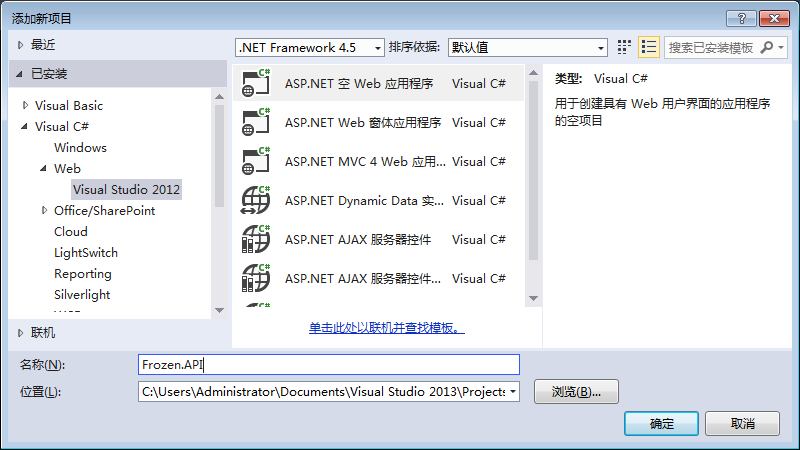
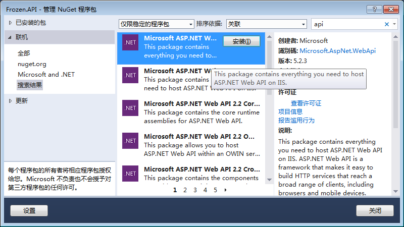
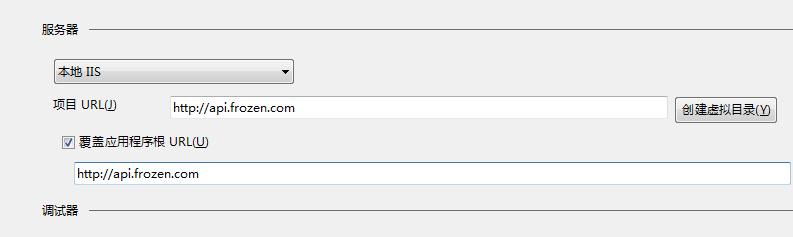
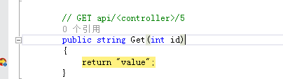
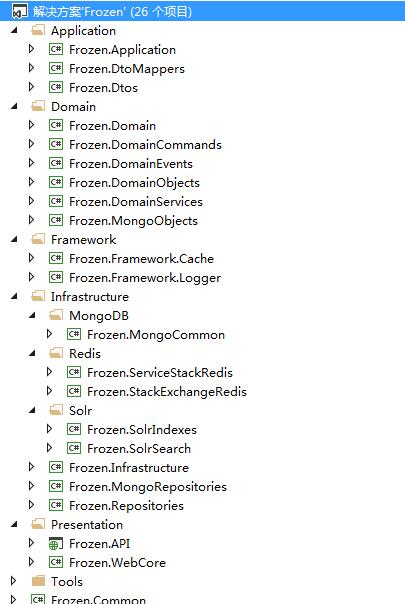
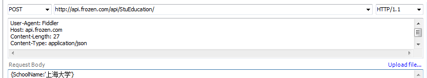

#  [搭建一个Web API项目（DDD）](https://www.cnblogs.com/frozenzhang/p/5315944.html)

[Frozen.Zhang](https://home.cnblogs.com/u/frozenzhang/)

# 一、创建一个能跑的起来的Web API项目

**1、建一个空的 ASP.NET Web应用**

**（为什么不直接添加一个Web API项目呢，那样会有些多余的内容（如js、css、Areas等），项目首先就需要清理一次。这样一步步来也更易于理解API项目）**



 

**2、用NuGet引入Web API**



这时我的packages

[](javascript:void(0);)

```
<?xml version="1.0" encoding="utf-8"?>
<packages>
  <package id="Microsoft.AspNet.Cors" version="5.2.3" targetFramework="net45" />
  <package id="Microsoft.AspNet.WebApi" version="5.2.3" targetFramework="net45" />
  <package id="Microsoft.AspNet.WebApi.Client" version="5.2.3" targetFramework="net45" />
  <package id="Microsoft.AspNet.WebApi.Core" version="5.2.3" targetFramework="net45" />
  <package id="Microsoft.AspNet.WebApi.Cors" version="5.2.3" targetFramework="net45" />
  <package id="Microsoft.AspNet.WebApi.WebHost" version="5.2.3" targetFramework="net45" />
  <package id="Newtonsoft.Json" version="6.0.8" targetFramework="net45" />
</packages>
```

[](javascript:void(0);)

 

**3、App_Start下创建一个WebApiConfig.cs类，作为api启动配置类**

　　代码如下

[](javascript:void(0);)

```
using System.Web.Http;
using System.Web.Http.Cors;

namespace Frozen.API
{
    public class WebApiConfig
    {
        public static void Register(HttpConfiguration config)
        {
            //启用跨域
            var cors = new EnableCorsAttribute("*", "*", "*");
            config.EnableCors(cors);

            // Web API routes
            config.MapHttpAttributeRoutes();

            config.Routes.MapHttpRoute(
                name: "DefaultApi",
                routeTemplate: "api/{controller}/{id}",
                defaults: new { id = RouteParameter.Optional }
            );
        }
    }
}
```

[](javascript:void(0);)

 

**4、添加“全局应用程序类” Global.asax**

 　　Application_Start方法如下

```
        protected void Application_Start(object sender, EventArgs e)
        {
            GlobalConfiguration.Configure(WebApiConfig.Register);
        }
```

 

**5、添加一个Web API控制器类，比如”StudentController“**

　　初始代码如下（常用的还有个Patch方法）

[](javascript:void(0);)

```
using System;
using System.Collections.Generic;
using System.Linq;
using System.Net;
using System.Net.Http;
using System.Web.Http;

namespace Frozen.API.Controllers
{
    public class StudentController : ApiController
    {
        // GET api/<controller>
        public IEnumerable<string> Get()
        {
            return new string[] { "value1", "value2" };
        }

        // GET api/<controller>/5
        public string Get(int id)
        {
            return "value";
        }

        // POST api/<controller>
        public void Post([FromBody]string value)
        {
        }

        // PUT api/<controller>/5
        public void Put(int id, [FromBody]string value)
        {
        }

        // DELETE api/<controller>/5
        public void Delete(int id)
        {
        }
    }
}
```

[](javascript:void(0);)

 

**6、绑定下测试域名**

　　还得在hosts做下指向

　　 

 

**7、感觉可以跑起来了。启动程序**，直接报了500，错误提示是”由于权限不足而无法读取配置文件“

　　权限问题，解决方案文件夹，右键属性，安全选项卡，添加‘Everyone’，将‘修改’权限打开，解决问题

 

**8、提前在‘public string Get(int id)’处加好断点，在浏览器输入‘http://api.frozen.com/api/student/1’**

　　**命中断点**，说明这已经是一个可以跑起来的API项目了



 

# **二、搭建框架**

**1、按ABP，被我搭建成了这样。****这张图后续会根据项目实际情况，或个人现阶段的理论误区，持续更新**

　　**（其实还应该有张架构图，但由于线条交错，看起来效果不怎么样，所以没贴出来）**

　　

 

**2、注册Autofac**

从NuGet安装Autofac，关键代码如下：

[](javascript:void(0);)

```
        public static void SetAutofacContainer()
        {
            var builder = new ContainerBuilder();
            builder.RegisterApiControllers(Assembly.GetExecutingAssembly());
            builder.RegisterType<InMemoryCache>().As<ICache>().InstancePerLifetimeScope();
            builder.RegisterAssemblyTypes(typeof(StuEducationRepo).Assembly)
                .Where(t => t.Name.EndsWith("Repo"))
                .AsImplementedInterfaces().InstancePerLifetimeScope();
            builder.RegisterAssemblyTypes(typeof(StudentRegisterDmnService).Assembly)
                .Where(t => t.Name.EndsWith("DmnService"))
                .AsImplementedInterfaces().InstancePerLifetimeScope();
            builder.RegisterAssemblyTypes(typeof(StuEducationAppService).Assembly)
                .Where(t => t.Name.EndsWith("AppService"))
                .AsImplementedInterfaces().InstancePerLifetimeScope();

            builder.RegisterWebApiFilterProvider(GlobalConfiguration.Configuration);
            IContainer container = builder.Build();
            var resolver = new AutofacWebApiDependencyResolver(container);

            // Configure Web API with the dependency resolver.
            GlobalConfiguration.Configuration.DependencyResolver = resolver;
        }
```

[](javascript:void(0);)

 

**3、注册AutoMapper**

从NuGet安装AutoMapper，关键代码如下：

```
     Mapper.Initialize(x =>
            {
                x.AddProfile<DomainToDtoProfile>();
                x.AddProfile<DtoToDomainProfile>();
            });
```

[](javascript:void(0);)

```
    public class DomainToDtoProfile : Profile
    {
        public override string ProfileName
        {
            get { return "DomainToDtoMappings"; }
        }

        protected override void Configure()
        {
            Mapper.CreateMap<TB_Stu_Education, StuEducationDto>()
                .ForMember(dest => dest.DegreeName, opt => opt.ResolveUsing<DegreeNameResolver>().FromMember(s => s.DegreeId))
                ;

        }

    }
```

[](javascript:void(0);)

 

**4、注册log4net**

从NuGet安装log4net，关键代码如下，添加配置文件“\Config\log4net.config”

```
            log4net.Config.XmlConfigurator.Configure(
              new System.IO.FileInfo(AppDomain.CurrentDomain.BaseDirectory + "\\Config\\log4net.config")
            );
```

[](javascript:void(0);)

```
    public class Log4NetLogger : ILogger
    {
        private static readonly ILog loginfo;
        private static readonly ILog logerror;
        private static readonly ILog logmonitor;

        static Log4NetLogger()
        {
            //不同类型的日志 存放在 不同 的 目录中
            loginfo = LogManager.GetLogger("loginfo");
            logerror = LogManager.GetLogger("logerror");
            logmonitor = LogManager.GetLogger("logmonitor");
        }

        public void Info(string message)
        {
            if (loginfo.IsInfoEnabled)
                loginfo.Info(message);
        }

        public void InfoFormat(string format, params object[] args)
        {
            if (loginfo.IsInfoEnabled)
                loginfo.InfoFormat(format, args);
        }

        public void Warn(string message)
        {
            if (loginfo.IsWarnEnabled)
                loginfo.Warn(message);
        }

        public void Error(string message, Exception ex = null)
        {
            if (logerror.IsErrorEnabled)
            {
                if (ex != null)
                {
                    logerror.Error(message, ex);
                }
                else
                {
                    logerror.Error(message);
                }
            }
        }

        public void Monitor(string message)
        {
            if (logmonitor.IsInfoEnabled)
                logmonitor.Info(message);
        }
    }
```

[](javascript:void(0);)

 

# **三、调试API接口（Fiddler）**

**1、GET 获取**

http://api.frozen.com/api/StuEducation/1

返回：{"DegreeName":"本科","Id":1,"StuId":1,"DegreeId":2,"SchoolName":"安大","MajorName":"计算机科学与技术","StartDate":"2008-09-01  00:00:00","EndDate":"2012-06-01 00:00:00","CreateTime":"2015-01-01  00:00:00","LastModifyTime":null}

代码：

```
        public StuEducationDto Get(int id)
        {
            var dto = _stuEducationAppService.GetDTOById(id);
            return dto;
        }
```

 

**2、POST 新增**



返回

HTTP/1.1 201 Created

代码：

```
        public HttpResponseMessage Post([FromBody]StuEducationDto dto)
        {
            int result = _stuEducationAppService.CreateByDTO(dto);
            return result > 0 ? Request.CreateResponse(HttpStatusCode.Created) : Request.CreateResponse(HttpStatusCode.InternalServerError);
        }
```

 

**3、PUT 新增/修改**

代码：

```
        public HttpResponseMessage Put(int id, [FromBody]StuEducationDto dto)
        {
            var result = _stuEducationAppService.CreateOrUpdateByDTO(id, dto);
            return result > 0 ? Request.CreateResponse(HttpStatusCode.OK) : Request.CreateResponse(HttpStatusCode.InternalServerError);
        }
```

 

**4、Patch 局部更新**

代码（**使用了dynamic参数**）：

[](javascript:void(0);)

```
        public HttpResponseMessage Patch(int id, dynamic dtoUpdate)
        {
            var dto = _stuEducationAppService.GetDTOById(id);
            if (dto == null)
            { 
                return Request.CreateResponse(HttpStatusCode.PaymentRequired);
            }
            foreach (JProperty prop in dtoUpdate)
            {
                switch (prop.Name.ToLower())
                {
                    case "degreeid":
                        dto.DegreeId = prop.Value.ToObject<int>();
                        break;
                    case "schoolname":
                        dto.SchoolName = prop.Value.ToObject<string>();
                        break;
                    case "majormame":
                        dto.SchoolName = prop.Value.ToObject<string>();
                        break;
                    case "startdate":
                        dto.StartDate = prop.Value.ToObject<DateTime>();
                        break;
                    case "enddate":
                        dto.EndDate = prop.Value.ToObject<DateTime>();
                        break;
                    default: 
                        break;
                }
            }
            var result = _stuEducationAppService.UpdateByDTO(id, dto);
            return result > 0 ? Request.CreateResponse(HttpStatusCode.OK) : Request.CreateResponse(HttpStatusCode.NotFound);
        }
```

[](javascript:void(0);)

 

**5、Delete 删**

代码：

```
        public HttpResponseMessage Delete(int id)
        {
            var result = _stuEducationAppService.DeleteById(id);
            return result > 0 ? Request.CreateResponse(HttpStatusCode.OK) : Request.CreateResponse(HttpStatusCode.NotFound);
        }
```

 

# **四、数据仓储**

　　**由于不打算使用EF，但数据仓储又是DDD一个不可绕开的话题，所以单独写了一个DDD EF Repository的Demo**

　　<http://www.cnblogs.com/frozenzhang/p/5390551.html>

 

# **五、MongoDB数据仓储**

　　已单独开篇，

　　<http://www.cnblogs.com/frozenzhang/p/5442314.html> 

 

# **六、领域事件DomainEvents**

 感谢[仓储大叔的分享](http://www.cnblogs.com/lori/p/3476703.html)，这里只贴出大叔没给出的源码：ActionDelegatedEventHandler<TEvent>类

[](javascript:void(0);)

```
    public class ActionDelegatedEventHandler<TEvent> : IEventHandler<TEvent>
        where TEvent : IEvent
    {
        private Action<TEvent> func;
        public ActionDelegatedEventHandler(Action<TEvent> func)
        {
            this.func = func;
        }

        public void Handle(TEvent evt)
        {
            func(evt);
        }

    }
```

[](javascript:void(0);)

 调用示例：

[](javascript:void(0);)

```
        static void Main(string[] args)
        {
            EventBus.Instance.Subscribe(new DeleteStudentHandler_SendEmailToStudent());
            EventBus.Instance.Subscribe(new DeleteStudentHandler_SendEmailToStudent());
            EventBus.Instance.Subscribe(new ActionDelegatedEventHandler<DeleteStudentEvent>(o => { Thread.Sleep(100); Console.WriteLine("学生Id为{0}", o.StuId); }));
            EventBus.Instance.Subscribe(new ActionDelegatedEventHandler<DeleteStudentEvent>(o => { Thread.Sleep(100); Console.WriteLine("学生Id为{0}", o.StuId); }));
            var entity = new DeleteStudentEvent { StuId = 1 };
            Console.WriteLine("事件：删除一个学生，学生Id为{0}", entity.StuId);
            EventBus.Instance.Publish(entity);

            Console.WriteLine("over");

            Console.ReadKey();
        }
```

[](javascript:void(0);)

结果：


 

# **七、领域Command**

 关于Event和Command的解释，<http://www.zhihu.com/question/29129068>

 完整代码请[移步](http://www.cnblogs.com/frozenzhang/p/5355669.html)

 注册

[](javascript:void(0);)

```
            builder.RegisterType<DefaultCommandBus>().As<ICommandBus>().InstancePerLifetimeScope();

            var domainCommands = Assembly.Load("Frozen.DomainCommands");
            builder.RegisterAssemblyTypes(domainCommands)
                .AsClosedTypesOf(typeof(ICommandHandler<>)).InstancePerLifetimeScope();
            builder.RegisterAssemblyTypes(domainCommands)
                .AsClosedTypesOf(typeof(IValidationHandler<>)).InstancePerLifetimeScope();
```

[](javascript:void(0);)

Command

[](javascript:void(0);)

```
    /// <summary>
    /// Command 删除学生
    /// </summary>
    public class DeleteStudentCommand : ICommand
    {
        /// <summary>
        /// 学生Id
        /// </summary>
        public int StuId { get; set; }

    }
```

[](javascript:void(0);)

Handler

[](javascript:void(0);)

```
    public class DeleteStudentHandler : ICommandHandler<DeleteStudentCommand>
    {
        private readonly IStuEducationRepo _iStuEducationRepo;

        public DeleteStudentHandler(IStuEducationRepo iStuEducationRepo)
        {
            this._iStuEducationRepo = iStuEducationRepo;
        }

        public ICommandResult Execute(DeleteStudentCommand command)
        {


            return new CommandResult(true);
        }

    }
```

[](javascript:void(0);)

调用

```
　　　 var command = new DeleteStudentCommand()
      {
　　　　　　StuId = 1
      };
      var result = _commandBus.Submit(command);
```

 结果：


 

# **八、Solr搜索引擎**

 **1、搭建Solr环境**（Windows），见另一篇分享<http://www.cnblogs.com/frozenzhang/p/5333746.html>[
](http://www.cnblogs.com/frozenzhang/p/5333746.html)

 **2、在browser的Solr管理后台添加Core** “Student”

[](javascript:void(0);)

```
  <!-- general -->
  <field name="StuId"  type="int" indexed="true" stored="true" multiValued="false" required="true"/>
  <field name="Name" type="string" indexed="true" stored="true"/>
  <field name="DegreeIdArr" type="int" indexed="true" stored="true" multiValued="true" />
  <field name="SchoolNameArr" type="string" indexed="true" stored="true" multiValued="true" />
  <field name="MajorCodeArr" type="string" indexed="true" stored="true" multiValued="true" />
    
  <uniqueKey>StuId</uniqueKey>
```

[](javascript:void(0);)

 

**3、从NuGet安装SolrNet**

**4、项目中新建索引类‘StudentSolrIndex’**

[](javascript:void(0);)

```
    public class StudentSolrIndex
    {
        [SolrUniqueKey("StuId")]
        public int StuId { get; set; }

        [SolrField("Name")]
        public string Name { get; set; }

        [SolrField("DegreeId")]
        public int DegreeId { get; set; }

        public string SchoolNamesStr { get; set; }

        [SolrField("SchoolNameArr")]
        public ICollection<string> SchoolNameArr
        {
            get
            {
                if (string.IsNullOrEmpty(SchoolNamesStr)) { return new string[] { }; }
                return SchoolNamesStr.Split(new[] { ',' }, StringSplitOptions.RemoveEmptyEntries).Distinct().ToList();
            }
        }

        public string MajorCodesStr { get; set; }

        [SolrField("MajorCodeArr")]
        public ICollection<string> MajorCodeArr
        {
            get
            {
                if (string.IsNullOrEmpty(MajorCodesStr)) { return new string[] { }; }
                return MajorCodesStr.Split(new[] { ',' }, StringSplitOptions.RemoveEmptyEntries).Distinct().ToList();
            }
        }

    }
```

[](javascript:void(0);)

5、.config配置

```
  <appSettings>
    <add key="StudentSolrServiceUrl" value="http://localhost:8080/solr/Student" />
  </appSettings>
```

**6、同步数据**

[](javascript:void(0);)

```
            SolrNet.Startup.Init<StudentSolrIndex>(ConfigurationManager.AppSettings.Get("StudentSolrServiceUrl"));

            var solrOper = ServiceLocator.Current.GetInstance<ISolrOperations<StudentSolrIndex>>();

            solrOper.Add(new StudentSolrIndex()
            {
                StuId = 1,
                Name = "张冬林",
                DegreeId = 3,
                SchoolNamesStr = "安大,上大",
                MajorCodesStr = "080901,080902"
            });

            solrOper.Commit();
```

[](javascript:void(0);)

**7、这时在solr的admin界面，查询，看见数据，说明数据同步成功了**


**8、查询数据**

[](javascript:void(0);)

```
            SolrNet.Startup.Init<StudentSolrResult>(ConfigurationManager.AppSettings.Get("StudentSolrServiceUrl"));

            var solrQuery = ServiceLocator.Current.GetInstance<ISolrOperations<StudentSolrResult>>();

            ISolrQuery mainQuery = SolrQuery.All;

            QueryOptions options = new QueryOptions()
            {
                FilterQueries = new List<ISolrQuery>().ToArray(),
                OrderBy = new SortOrder[] { 
                    SortOrder.Parse("score desc")
                },
                Start = 0,
                Rows = 20,
            };
            var results = solrQuery.Query(mainQuery, options);
```

[](javascript:void(0);)

结果截图：


 

# **九、Redis**

**1、Windows下Redis的环境安装**，感谢[园子里一位博友的分享](http://www.cnblogs.com/caokai520/p/4409712.html)

**2、配置主从服务器**（从服务器作为只读）

　　Redis的默认服务端口是6379，

　　所以这里只修改从服务器的redis.config里的配置

　　port 6380

　　bind 127.0.0.1

　　slaveof 127.0.0.1 6379

　　6379是主服务器，6380作为从服务器


**3、Redis作为缓存服务器**

　　已单独开了一篇，<http://www.cnblogs.com/frozenzhang/p/5439940.html>

 

# **十、SignalR（+Redis）**

**1、SignalR在线聊天室**

　　已单独开了一篇，<http://www.cnblogs.com/frozenzhang/p/5406773.html>

 

# **十一、Memcached**

[](javascript:void(0);)

```
 1   <configSections>
 2     <sectionGroup name="enyim.com">
 3       <section name="memcached" type="Enyim.Caching.Configuration.MemcachedClientSection, Enyim.Caching" />
 4     </sectionGroup>
 5   </configSections>
 6   <enyim.com>
 7     <memcached>
 8       <servers>
 9         <!-- put your own server(s) here-->
10         <add address="127.0.0.1" port="11211" />
11       </servers>
12       <socketPool minPoolSize="10" maxPoolSize="100" connectionTimeout="00:00:10" deadTimeout="00:02:00" />
13     </memcached>
14   </enyim.com>
```

[](javascript:void(0);)

 

[](javascript:void(0);)

```
 1 using Enyim.Caching;
 2 using Enyim.Caching.Memcached;
 3 using Frozen.Framework.Cache;
 4 using System;
 5 using System.Collections.Generic;
 6 
 7 namespace Froen.Memcached.Cached
 8 {
 9     public class MemcachedCache : ICache
10     {
11         private const string REGION_NAME = "$#MemcachedCache#$";
12         private const int _DefaultCacheTime = 30;
13         private readonly static object s_lock = new object();
14 
15         private static readonly MemcachedClient client = new MemcachedClient();
16 
17         public IEnumerable<KeyValuePair<string, object>> Entries
18         {
19             get { throw new NotImplementedException(); }
20         }
21 
22         public T Get<T>(string key, Func<T> baseMethod)
23         {
24             return Get(key, baseMethod, _DefaultCacheTime);
25         }
26 
27         public T Get<T>(string key, Func<T> baseMethod, int cacheTime)
28         {
29             key = BuildKey(key);
30 
31             if (client.Get(key) != null)
32             {
33                 return client.Get<T>(key);
34             }
35             else
36             {
37                 lock (s_lock)
38                 {
39                     if (client.Get(key) == null)
40                     {
41                         var value = baseMethod();
42                         if (value != null) //请区别null与String.Empty
43                         {
44                             client.Store(StoreMode.Set, key, value, TimeSpan.FromMinutes(cacheTime));
45                         }
46                         return value;
47                     }
48                     return client.Get<T>(key);
49                 }
50             }
51         }
52 
53         public bool Contains(string key)
54         {
55             return client.Get(BuildKey(key)) != null;
56         }
57 
58         public void Remove(string key)
59         {
60             client.Remove(BuildKey(key));
61         }
62 
63         private string BuildKey(string key)
64         {
65             return string.IsNullOrEmpty(key) ? null : REGION_NAME + key;
66         }
67 
68     }
69 }
```

[](javascript:void(0);)

 

# **十二、为API自动生成帮助文档**

**1、安装Microsoft.AspNet.WebApi.HelpPage**

 

**2、修改Areas/HelpPag/App_Start/HelpPageConfig的Register方法**

配置xml文件路径："~/App_Data"

```
1             // Uncomment the following to use the documentation from XML documentation file.
2             config.SetDocumentationProvider(new XmlDocumentationProvider(HttpContext.Current.Server.MapPath("~/App_Data")));
```

这时访问/Help应该会报异常


 

**3、修改Areas/HelpPag/XmlDocumentationProvider的构造函数**

[](javascript:void(0);)

```
 1         public XmlDocumentationProvider(string documentPath)
 2         {
 3             //if (documentPath == null)
 4             //{
 5             //    throw new ArgumentNullException("documentPath");
 6             //}
 7             //XPathDocument xpath = new XPathDocument(documentPath);
 8             //_documentNavigator = xpath.CreateNavigator();
 9 
10             XDocument finalDoc = null;
11             foreach (string file in Directory.GetFiles(documentPath, "Frozen.*.xml"))
12             {
13                 using (var fileStream = File.OpenRead(file))
14                 {
15                     if (finalDoc == null)
16                     {
17                         finalDoc = XDocument.Load(fileStream);
18                     }
19                     else
20                     {
21                         XDocument xdocAdditional = XDocument.Load(fileStream);
22 
23                         finalDoc.Root.XPathSelectElement("/doc/members")
24                             .Add(xdocAdditional.Root.XPathSelectElement("/doc/members").Elements());
25                     }
26                 }
27             }
28 
29             // Supply the navigator that rest of the XmlDocumentationProvider code looks for
30             _documentNavigator = finalDoc.CreateNavigator();
31         }
```

[](javascript:void(0);)

 

**4、通过Web页查看接口**


**强烈推荐阅读园友的分享**：[如何使 WebAPI 自动生成漂亮又实用在线API文档-Swashbuckle](http://www.cnblogs.com/Arrays/p/5146194.html)。界面不仅颜值高，还可以代替Fiddler来调试api接口

 

# **写在最后**

　　此篇随笔，如果你粗阅了一下，会发现没有任何理论阐述，这主要是因为博主对相关知识点的理解尚不深刻，至今也没有阅读过源码，不想误导大家。错误的地方也欢迎指正。内容基本是从当前的项目中整理出来的，或来自园子里。博主虽有四年工作经验，会的技能不多也不少，但平时缺乏总结，缺乏review，整理这篇随笔的主要原因一方面是想梳理下自己掌握的技能，另一方面也希望能明确自己在专业技能方面的不足之处

　　两年前我刚来魔都，其实那时候（对于当时的我来说，理想的）工作挺难找的，房总招了我，给的待遇对于那时候的我来说，已经非常满足了。无奈项目后来转java了，dotNET团队解散。不管怎么说，房哥对我有着一份知遇之恩，所以以后如果有机会，希望能再次拜入房哥门下

　　接着就是面试，基本都会被问的一个问题‘在315che做的都是维护工作么’，好吧，现在才知道人家其实是在问‘你是不是团队里最菜的那个’。面试了几家，有人要就入职了，平级跳，平级跳，没错，就是平级跳

　　近期要换雇主了，已拿到一个比较满意的offer，所以没有什么如临大敌的感觉。但一切又好像太平静了

  　　最后也说下为什么选择离开现在的东家。其实只有一句话：情非得已 实属无奈，我已经兑现了当初面试时我说的一句话，‘我不会轻易跳槽’，在我这样Programmer（至少我）的眼里，我已经算是坚持到最后的那个人了

　　本篇也算结束了，虽然还有几个知识点我想整理的，后面有时间再补上吧

　　晚安，上海

　　晚安，所有在大城市打拼的人

 

　　附：[源码下载](http://pan.baidu.com/s/1hsCXrKS)

 


分类: [WebAPI](https://www.cnblogs.com/frozenzhang/category/806850.html)

标签: [DDD](https://www.cnblogs.com/frozenzhang/tag/DDD/), [领域](https://www.cnblogs.com/frozenzhang/tag/领域/), [Web](https://www.cnblogs.com/frozenzhang/tag/Web/), [WebAPI](https://www.cnblogs.com/frozenzhang/tag/WebAPI/), [API](https://www.cnblogs.com/frozenzhang/tag/API/), [ABP](https://www.cnblogs.com/frozenzhang/tag/ABP/), [Domain](https://www.cnblogs.com/frozenzhang/tag/Domain/), [架构](https://www.cnblogs.com/frozenzhang/tag/架构/), [领域驱动事件](https://www.cnblogs.com/frozenzhang/tag/领域驱动事件/)

​         [好文要顶](javascript:void(0);)             [关注我](javascript:void(0);)     [收藏该文](javascript:void(0);)     [](javascript:void(0);)     [](javascript:void(0);) 


​             [Frozen.Zhang](https://home.cnblogs.com/u/frozenzhang/)
​             [关注 - 16](https://home.cnblogs.com/u/frozenzhang/followees)
​             [粉丝 - 32](https://home.cnblogs.com/u/frozenzhang/followers)         


​                 [+加关注](javascript:void(0);)     

​         5     

​         0     


​     


[« ](https://www.cnblogs.com/frozenzhang/p/5238327.html) 上一篇：[CodeFirst（反射+特性）](https://www.cnblogs.com/frozenzhang/p/5238327.html)
[» ](https://www.cnblogs.com/frozenzhang/p/5333746.html) 下一篇：[Solr环境搭建](https://www.cnblogs.com/frozenzhang/p/5333746.html)