#  		[Redis in .NET Core 入门：(1) 安装和主要功能简介](https://www.cnblogs.com/cgzl/p/10294175.html)

https://www.cnblogs.com/cgzl/category/1090036.html

Redis（<https://redis.io/>）, 是一个内存中的数据结构存储系统，它可以用作数据库、缓存和消息中间件。

 

# 安装Redis

我很少在开发机中直接装各种数据库，我一般使用Docker，针对Redis也不例外，我还是使用Docker。

这是Redis在DockerHub里的地址：<https://hub.docker.com/_/redis>，里面有文档。

启动docker，下载redis镜像：**docker pull redis**

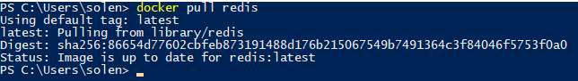

 

然后运行镜像并发布端口6379：

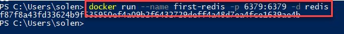

 

然后运行redis-cli（这是Redis的一个命令行管理工具）：

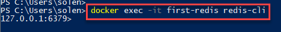

 

进入redis-cli之后，我们可以设置一个key-value来试试：

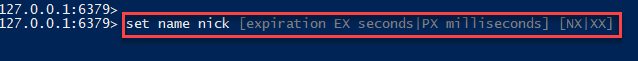

当你输入的时候，它是有提示的。

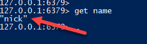

通过get key（key为name），可以获得其对应的值。

 

# 准备.NET Core项目

建立一个.NET Core 控制台项目，并安装Redis的.NET Core客户端。

Redis有很多C#的客户端，这里有个列表：<https://redis.io/clients#c>

我这使用的是 **StackExchange.Redis** (<https://stackexchange.github.io/StackExchange.Redis/>)。

## 安装StackExchange.Redis

 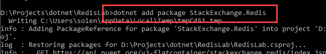

## 使用StackExchange.Redis

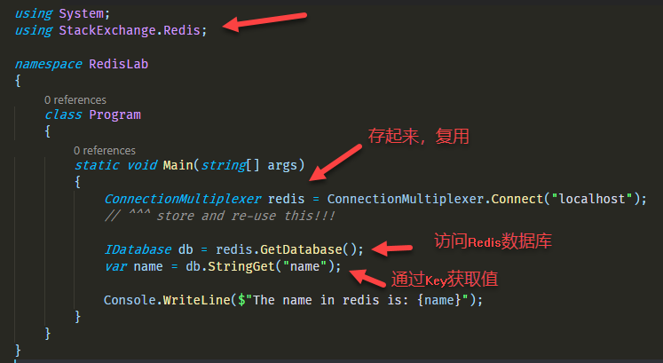

ConnectionMultiplexer已经实现了IDisposable接口，之所以没有使用using表达式，是因为该对象应该重复利用的，具体请看文档。

我之前通过redis-cli设置了key为name的值，这里我通过name这个key把相对应的值找出来，并打印在控制台：

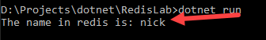

如果所示，连接上了数据库，并把值输出到了控制台，OK。

## 使用C#写入值

这个也没什么特别的，看代码：

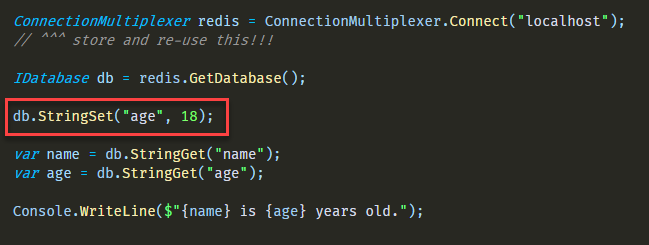

 

运行结果：

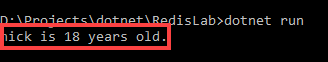

 

# Redis 的数据类型

Redis的主要数据类型有这些：

- **Key**：就是key的意思。。。。
- **String**：字符串
- **List**：有序字符串的集合
- **Hashes**：有点像对象，里面可以有若干个字段，字段都有自己的值，字段和值都是字符串类型的。
- **Set**：无序唯一字符串的集合
- **Sorted-Set**：跟Set很像，但是每一个字符串元素都对应一个浮点数值，该数值叫做分数。它里面的元素通常是按照分数来排序的。

 

# Redis 如何持久化

一共有两种方式：

- **AOF**（Append-only file）
- **RDB**（Redis database file）

首先需要知道Redis的操作都是在内存中完成的，因为这样速度快。

## AOF

然后你可以启用AOF，它会把每个操作都记录到系统文件里。所以如果Redis服务器重启了，它会根据AOF这个文件来重建整个数据集。

这个文件会很快就变得很大，但是Redis很聪明，它会使用里面最新版本的数据，并压缩文件到可控大小。

## RDB

**RDB是Redis的默认模式**，它有点像数据库的快照，创建一些时间点的数据，如果发生灾难，你可以从这些数据里进行恢复。

当达到一些条件的时候，例如数据集里面在某段时间内新添加了一定条目的数据，Redis就会把数据做个快照，并写入一个RDB文件。

 

最佳实践是两者都用，使用AOF因为其速度和可用性，使用RDB做灾难恢复。

 

# Redis的配置文件

<https://raw.githubusercontent.com/antirez/redis/4.0/redis.conf> 这是Redis 4.0 的一个标准配置文件。

## RDB 快照相关

先看快照部分，也就是和RDB有关的部分：

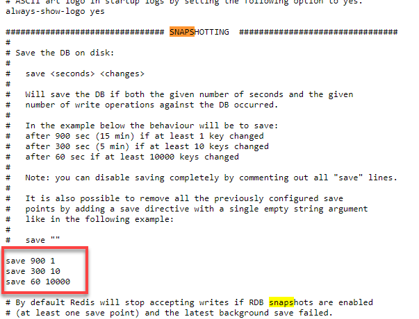

里面的save 900 1.。。。这部分是指，900秒过后，如果至少1个key改变了，那么就做一个快照。

下面的就是300秒过后，如果10个key改变了，那就做一个快照。。。

这些就是进行快照动作的触发条件。

 

## AOF相关

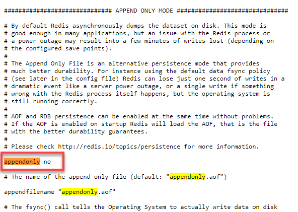

AOF模式默认是不开启的，也就是no。如果想开启，那就改成yes即可。

 

# 使用自定义配置运行Redis容器

## RDB & AOF

把上述文件下载到本地，进行修改：

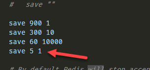

我添加了一个RDB的条件，5秒内1个Key被修改就会触发快照动作。

 

然后我启用了AOF：

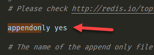

 

首先把之前的容器删除吧，然后再建立一个。

这次建立docker容器的时候需要使用volume：

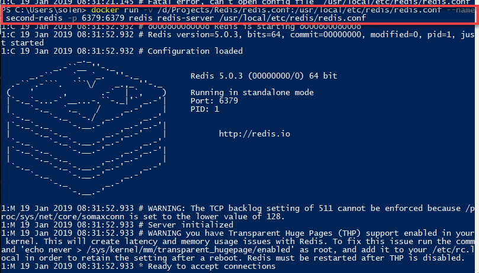

说明一下：

-v这部分是指volume，redis.conf在我电脑里的位置是：D:\Projects\Redis\redis.conf，所以我把该位文件的位置挂载到了容器里的/usr/local/etc/redis/redis.conf这个地方。

然后运行redis这个镜像，同时运行里面的redis-server，而redis-server的配置文件就是/usr/local/etc/redis/redis.conf。

 

现在这个redis-server运行起来了。

 

再打开一个redis-cli，还是使用容器：

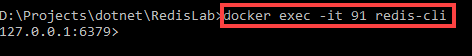

 

然后我设置一个key的值：

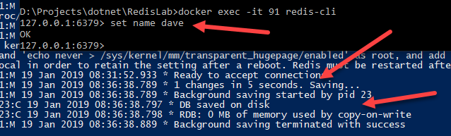

这时就达到了RDB的最后一个条件，所以触发了快照动作。

我就不再实验了。。。

 

我再打开一下redis容器的bash，然后看一下aof文件是否生成：

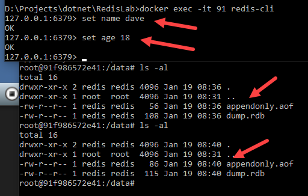

可以看到每次操作后aof文件都会更新（里面可以认为就是事务的log）。

 

## Master-Slave Replication 主从复制

简单讲一下Redis的主从复制，首先把之前的容器都删掉。。。

然后我们先建立docker 网络：

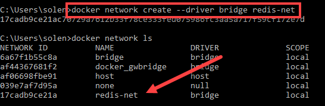

 

然后创建redis master的容器，不过首先修改一下redis.conf里的bind地址，原来是127.0.0.1，改为 bind 0.0.0.0：

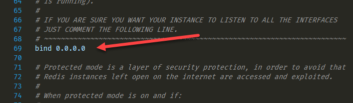

这样的话其它的ip地址也可以连接过来了。

 

然后创建master容器：

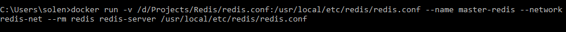

注意里面使用了之前创建的桥接网络。

 

检查一下redis-net这个网络：

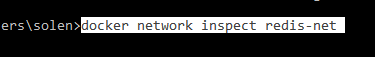

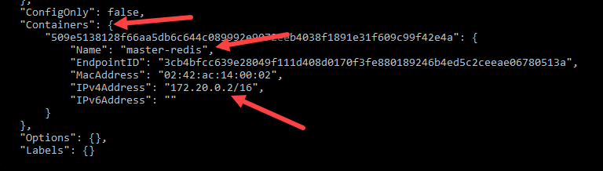

可以看到该网络里有一个容器master-redis，其ip为172.20.0.2。

 

然后把redis.conf再复制一份，名字为redis2.conf。

在redis2.conf的Replication部分里，把下面这部分取消注释，并修改为：

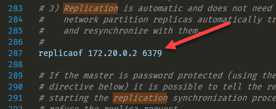

注意这个ip地址和master-redis的ip要一样。

 

现在我们可以运行这个redis的slave容器了：

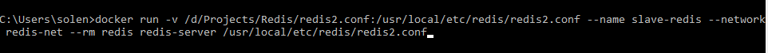

 

然后我们可以看到主从复制成功了：

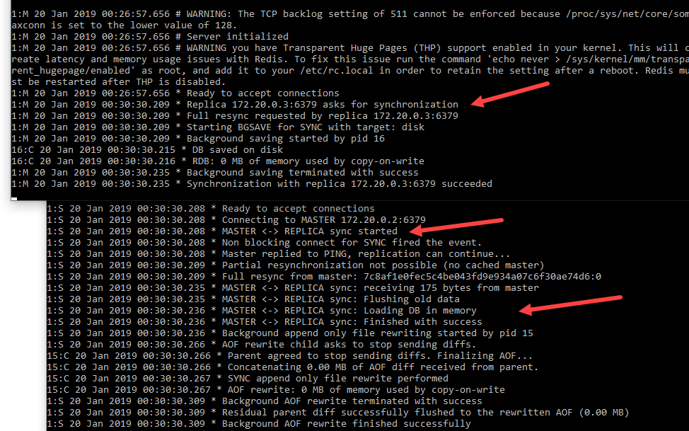

 

打开master的redis-cli：

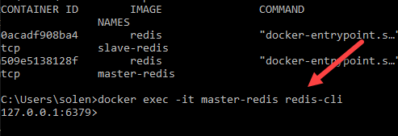

 

操作一些操作，可以看到master和slave都几乎同步的做了一些动作，也就是主从复制：

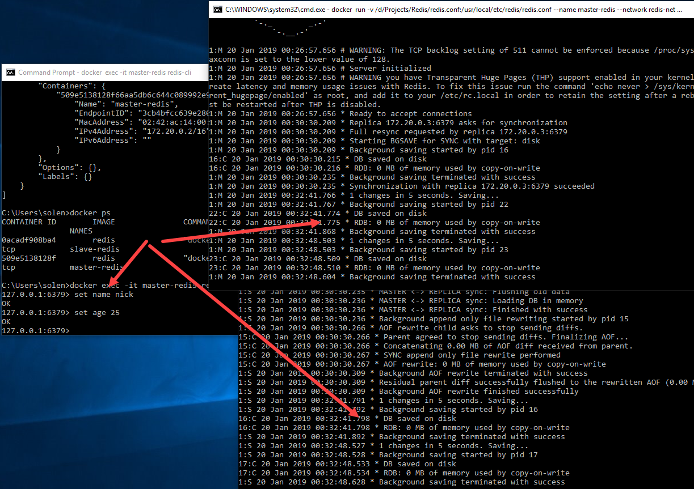

 

## 设置密码

把之前的容器都清理掉。。。

主从复制的master通常需要设置密码，修改redis.conf文件，找到requirepass这部分，取消注释并设置密码：

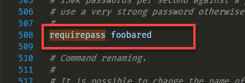

 

在slave的redis2.conf里，找到masterauth这部分，填写master的密码：

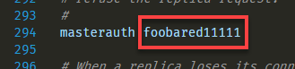

首先我填写一个错误的密码。

然后运行两个容器，看看什么效果：

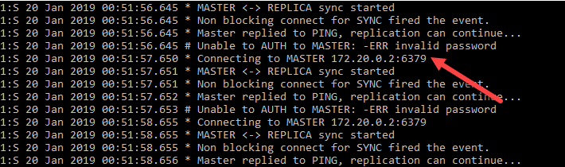

可以看到提示密码不正确，无法进行复制。

 

然后删掉slave容器，再把redis2.conf的密码修正一下： 

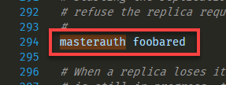

 

然后再运行slave容器：

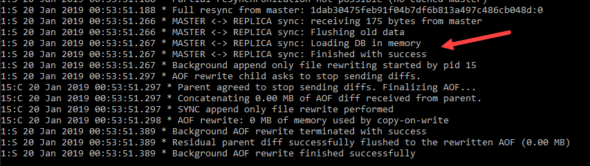

这次可以看到连接成功了。

 

# 其它的配置方式

## redis-server的命令行参数

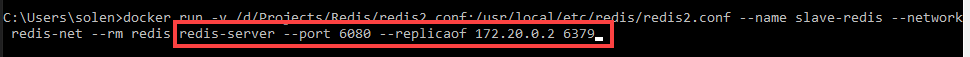

如上图，这就对port和replicaof进行配置，而没有使用redis2.conf（所以该命令前面的-v部分也是没有什么作用的）。

 

## CONFIG SET

前面我们使用了自定义的配置文件来运行Redis，但是这样的话需要重启Redis Server。

而如果使用CONFIG SET（<https://redis.io/commands/config-set>）的话，那就不需要重启redis server直接就可以修改配置，但是这样做不会修改redis.conf等配置文件的。

 

首先需要使用redis-cli，然后进行配置即可，例如：

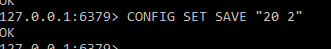

这就是添加了一个快照的设置：每20秒如果有两个变化就做一个快照。

博客文章可以转载，但不可以声明为原创. 

  我的关于ASP.NET Core Web API相关技术的公众号: 

分类: [.Net Core](https://www.cnblogs.com/cgzl/category/1090036.html)

标签: [Redis](https://www.cnblogs.com/cgzl/tag/Redis/), [.Net Core](https://www.cnblogs.com/cgzl/tag/.Net Core/)

​         [好文要顶](javascript:void(0);)             [关注我](javascript:void(0);)     [收藏该文](javascript:void(0);)     ;)     ;) 

​             [solenovex](https://home.cnblogs.com/u/cgzl/)
​             [关注 - 11](https://home.cnblogs.com/u/cgzl/followees)
​             [粉丝 - 785](https://home.cnblogs.com/u/cgzl/followers)         

​                 [+加关注](javascript:void(0);)     

​         66     

​         0     

​     

[« ](https://www.cnblogs.com/cgzl/p/10040590.html) 上一篇：[Docker & ASP.NET Core (5)：Docker Compose](https://www.cnblogs.com/cgzl/p/10040590.html)
[» ](https://www.cnblogs.com/cgzl/p/10297565.html) 下一篇：[Redis in .NET Core 入门：(2) String](https://www.cnblogs.com/cgzl/p/10297565.html)