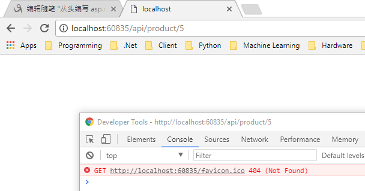

#  			[从头编写 asp.net core 2.0 web api 基础框架 (1)](https://www.cnblogs.com/cgzl/p/7637250.html) 		


**工具:**

1.Visual Studio 2017 V15.3.5+

2.Postman (Chrome的App)

3.Chrome (最好是)

关于.net core或者.net core 2.0的相关知识就不介绍了, 这里主要是从头编写一个asp.net core 2.0 web api的基础框架.

我一直在关注asp.net core 和 angular 2/4, 并在用这对开发了一些比较小的项目.  现在我感觉是时候使用这两个技术去为企业开发大一点的项目了, 由于企业有时候需要SSO(单点登录), 所以我一直在等待Identity  Server4以及相关库的正式版, 现在匹配2.0的RC版已经有了, 所以这个可以开始编写了.

这个系列就是我从头开始建立我自己的基于asp.net core 2.0 web api的后台api基础框架过程, 估计得分几次才能写完. 如果有什么地方错的, 请各位指出!!,谢谢.

 

# 创建项目:

1.选择asp.net core web application.


2.选择.net core, asp.net core 2.0, 然后选择Empty (因为是从头开始):


下面看看项目生成的代码:

# Program.cs

[](javascript:void(0);)

```
namespace CoreBackend.Api
{
    public class Program
    {
        public static void Main(string[] args)
        {
            BuildWebHost(args).Run();
        }

        public static IWebHost BuildWebHost(string[] args) =>
            WebHost.CreateDefaultBuilder(args)
                .UseStartup<Startup>()
                .Build();
    }
}
```

[](javascript:void(0);)

这个Program是程序的入口, 看起来很眼熟, 是因为asp.net core application实际就是控制台程序(console application).

它是一个调用asp.net core 相关库的console application. 

**Main**方法里面的内容主要是用来配置和运行程序的.

因为我们的web程序需要一个宿主, 所以 **BuildWebHost**这个方法就创建了一个**WebHostBuilder**. 而且我们还需要Web Server.

看一下**WebHost.CreateDefaultBuilder(args)**的源码:

[](javascript:void(0);)

```
public static IWebHostBuilder CreateDefaultBuilder(string[] args)
        {
            var builder = new WebHostBuilder()
                .UseKestrel()
                .UseContentRoot(Directory.GetCurrentDirectory())
                .ConfigureAppConfiguration((hostingContext, config) =>
                {
                    var env = hostingContext.HostingEnvironment;

                    config.AddJsonFile("appsettings.json", optional: true, reloadOnChange: true)
                          .AddJsonFile($"appsettings.{env.EnvironmentName}.json", optional: true, reloadOnChange: true);

                    if (env.IsDevelopment())
                    {
                        var appAssembly = Assembly.Load(new AssemblyName(env.ApplicationName));
                        if (appAssembly != null)
                        {
                            config.AddUserSecrets(appAssembly, optional: true);
                        }
                    }

                    config.AddEnvironmentVariables();

                    if (args != null)
                    {
                        config.AddCommandLine(args);
                    }
                })
                .ConfigureLogging((hostingContext, logging) =>
                {
                    logging.AddConfiguration(hostingContext.Configuration.GetSection("Logging"));
                    logging.AddConsole();
                    logging.AddDebug();
                })
                .UseIISIntegration()
                .UseDefaultServiceProvider((context, options) =>
                {
                    options.ValidateScopes = context.HostingEnvironment.IsDevelopment();
                });

            return builder;
        }
```

[](javascript:void(0);)

asp.net core 自带了两种http servers, 一个是**WebListener**, 它只能用于windows系统, 另一个是**kestrel**, 它是跨平台的.

kestrel是默认的web server, 就是通过**UseKestrel()**这个方法来启用的.

但是我们开发的时候使用的是IIS Express, 调用**UseIISIntegration()**这个方法是启用IIS Express, 它作为Kestrel的**Reverse Proxy server**来用.

如果在windows服务器上部署的话, 就应该使用IIS作为Kestrel的反向代理服务器来管理和代理请求.

如果在linux上的话, 可以使用apache, nginx等等的作为kestrel的proxy server.

当然也可以单独使用kestrel作为web 服务器, 但是使用iis作为reverse proxy还是由很多有点的: 例如,IIS可以过滤请求, 管理证书, 程序崩溃时自动重启等.

**UseStartup<Startup>()**, 这句话表示在程序启动的时候, 我们会调用Startup这个类.

**Build()**完之后返回一个实现了IWebHost接口的实例(WebHostBuilder), 然后调用**Run()**就会运行Web程序, 并且阻止这个调用的线程, 直到程序关闭.

**BuildWebHost这个lambda表达式最好不要整合到Main方法里面, 因为Entity Framework 2.0会使用它, 如果把这个lambda表达式去掉之后, Add-Migration这个命令可能就不好用了!!!**

# **Startup.cs**

[](javascript:void(0);)

```
namespace CoreBackend.Api
{
    public class Startup
    {
        // This method gets called by the runtime. Use this method to add services to the container.
        // For more information on how to configure your application, visit https://go.microsoft.com/fwlink/?LinkID=398940
        public void ConfigureServices(IServiceCollection services)
        {
        }

        // This method gets called by the runtime. Use this method to configure the HTTP request pipeline.
        public void Configure(IApplicationBuilder app, IHostingEnvironment env)
        {
            if (env.IsDevelopment())
            {
                app.UseDeveloperExceptionPage();
            }

            app.Run(async (context) =>
            {
                await context.Response.WriteAsync("Hello World!");
            });
        }
    }
}
```

[](javascript:void(0);)

其实Startup算是程序真正的切入点.

**ConfigureServices**方法是用来**把services(各种服务, 例如identity, ef, mvc等等包括第三方的, 或者自己写的)加入(register)到container**(asp.net core的容器)中去, 并配置这些services. 这个container是用来进行**dependency injection**的(依赖注入).  所有注入的services(此外还包括一些框架已经注册好的services) 在以后写代码的时候, 都可以将它们注入(inject)进去.  例如上面的Configure方法的参数, app, env, loggerFactory都是注入进去的services.

**Configure**方法是asp.net core程序用来**具体指定如何处理每个http请求**的, 例如我们可以让这个程序知道我使用mvc来处理http请求, 那就调用app.UseMvc()这个方法就行. 但是目前, 所有的http请求都会导致返回"Hello World!".

这几个方法的调用**顺序: Main -> ConfigureServices -> Configure**

# 请求管道和中间件(Request Pipeline, Middleware)

**请求管道**: 那些处理http requests并返回responses的代码就组成了**request pipeline**(请求管道).

**中间件**: 我们可以做的就是使用一些程序来配置那些请求管道 request pipeline以便处理requests和responses. 比如处理验证(authentication)的程序, 连MVC本身就是个中间件(middleware).


每层中间件接到请求后都可以直接返回或者调用下一个中间件. 一个比较好的例子就是: 在第一层调用authentication验证中间件, 如果验证失败, 那么直接返回一个表示请求未授权的response.

**app.UseDeveloperExceptionPage()**; 就是一个middleware, 当exception发生的时候, 这段程序就会处理它. 而判断**env.isDevelopment()** 表示, 这个middleware只会在**Development环境**下被调用.

可以在项目的属性Debug页看到这个设置: 


需要注意的是这个**环境变量Development和VS里面的Debug Build没有任何关系**.

在正式环境中, 我们遇到exception的时候, 需要捕获并把它记录(log)下来, 这时候我们应该使用这个middleware: Exception Handler Middleware, 我们可以这样调用它:

[](javascript:void(0);)

```
            if (env.IsDevelopment())
            {
                app.UseDeveloperExceptionPage();
            }
            else
            {
                app.UseExceptionHandler();
            }
```

[](javascript:void(0);)

UseExceptionHandler是可以传参数的, 但暂时先这样, 我们在app.Run方法里抛一个异常, 然后运行程序, 在Chrome里按F12就会发现有一个(或若干个, 多少次请求, 就有多少个错误)500错误.

# 用来创建 Web Api的middleware:

 原来的.net使用asp.net web api 和 asp.net mvc 分别来创建 web api和mvc项目. 但是 asp.net core mvc把它们整合到了一起.

# MVC Pattern

model-view-controller 它的定义是: MVC是一种用来实现UI的架构设计模式. 但是网上有很多解释,  有时候有点分不清到底是干什么的. 但是它肯定有这几个有点: 松耦合, Soc(Separation of concerns), 易于测试,  可复用性强等.

但是MVC绝对不是完整的程序架构, 在一个典型的n层架构里面(presentation layer 展示层, business layer  业务层, data access layer数据访问层, 还有服务处), MVC通常是展示层的.  例如angular就是一个客户端的MVC模式.

在Web api里面的View就是指数据或者资源的展示, 通常是json.

# 注册并使用MVC

因为asp.net core 2.0使用了一个大而全的metapackage, 所以这些基本的services和middleware是不需要另外安装的.

首先, 在ConfigureServices里面向Container注册MVC: **services.AddMvc();**

```
        public void ConfigureServices(IServiceCollection services)
        {
            services.AddMvc(); // 注册MVC到Container
        }
```

然后再Configure里面告诉程序使用mvc中间件:

[](javascript:void(0);)

```
        public void Configure(IApplicationBuilder app, IHostingEnvironment env)
        {
            if (env.IsDevelopment())
            {
                app.UseDeveloperExceptionPage();
            }
            else
            {
                app.UseExceptionHandler();
            }

            app.UseMvc();
```

[](javascript:void(0);)

注意顺序, 应该在处理异常的middleware后边调用**app.UseMvc()**, 所以处理异常的middleware可以在把request交给mvc之间就处理异常, 更总要的是它还可以捕获并处理返回MVC相关代码执行中的异常.

然后别忘了把app.Run那部分代码去掉. 然后改回到Develpment环境, 跑一下, 试试效果:

Chrome显示了一个空白页, 按F12, 显示了404 Not Found错误.

这是因为我只添加了MVC middleware, 但是它啥也没做, 也没有找到任何可用于处理请求的代码, 所以我们要添加Controller来返回数据/资源等等.

# Asp.net Core 2 Metapackage 和 Runtime Store

**Asp.net core 2 metapackage**, asp.net core 2.0开始, 所有必须的和常用的库也包括少许第三方库都被整和到了这个大而全的asp.net core 2 metapackage里面, 所以开发者就不必自己挨个库安装也没有版本匹配问题了.

**Runtime Store**,  有点像以前的GAC, 在系统里有一个文件夹里面包含所有asp.net core 2程序需要运行的库(我电脑的是: C:\Program  Files\dotnet\store\x64\netcoreapp2.0), 每个在这台电脑上运行的asp.net core  2应用只需调用这些库即可. 

它的优点是:

1. 部署快速, 不需要部署这里面包含的库;
2. 节省硬盘空间, 多个应用程序都使用同一个store, 而不必每个程序的文件夹里面都部署这些库文件. 
3. 程序启动更快一些. 因为这些库都是预编译好的.

缺点是: 服务器上需要安装.net core 2.0

但是, 也可以不引用Runtime Store的库, 自己在部署的时候挨个添加依赖的库.

# Controller

首先建立一个Controllers目录, 然后建立一个ProductController.cs, 它需要继承Microsoft.AspNetCore.Mvc.Controller

我们先建立一个方法返回一个Json的结果.

先建立一个Dto(Data Transfer Object) Product:

[](javascript:void(0);)

```
namespace CoreBackend.Api.Dtos
{
    public class Product
    {
        public int Id { get; set; }
        public string Name { get; set; }
        public float Price { get; set; }
    }
}
```

[](javascript:void(0);)

然后在Controller里面写这个Get方法:

[](javascript:void(0);)

```
namespace CoreBackend.Api.Controllers
{
    public class ProductController: Controller
    {
        public JsonResult GetProducts()
        {
            return new JsonResult(new List<Product>
            {
                new Product
                {
                    Id = 1,
                    Name = "牛奶",
                    Price = 2.5f
                },
                new Product
                {
                    Id = 2,
                    Name = "面包",
                    Price = 4.5f
                }
            });
        }
    }
}
```

[](javascript:void(0);)

然后运行, 并使用postman来进行请求:


请求的网址返回404 Not Found, 因为还没有配置路由 Routing, 所以MVC不知道如何处理/映射这些URI.

# Routing 路由

路由有两种方式: Convention-based (按约定), attribute-based(基于路由属性配置的). 

其中convention-based (基于约定的) 主要用于MVC (返回View或者Razor Page那种的).

Web api 推荐使用**attribute-based.**

这种基于属性配置的路由可以配置Controller或者Action级别, uri会根据Http method然后被匹配到一个controller里具体的action上.

常用的Http Method有:

- Get, 查询, Attribute: **HttpGet**, 例如: '/api/product', '/api/product/1'
- POST, 创建, **HttpPost**, '/api/product'
- PUT 整体修改更新 **HttpPut**, '/api/product/1'
- PATCH 部分更新, **HttpPatch**, '/api/product/1'
- DELETE 删除, **HttpDelete**, '/api/product/1

还有一个**Route**属性(attribute)也可以用于Controller层, 它可以控制action级的URI前缀.

[](javascript:void(0);)

```
namespace CoreBackend.Api.Controllers
{
    //[Route("api/product")]
    [Route("api/[controller]")]
    public class ProductController: Controller
    {
        [HttpGet]
        public JsonResult GetProducts()
        {
            return new JsonResult(new List<Product>
            {
                new Product
                {
                    Id = 1,
                    Name = "牛奶",
                    Price = 2.5f
                },
                new Product
                {
                    Id = 2,
                    Name = "面包",
                    Price = 4.5f
                }
            });
        }
    }
}
```

[](javascript:void(0);)

使用**[Route("api/[controller]")]**, 它使得整个Controller下面所有action的uri前缀变成了"/api/product", 其中[controller]表示XxxController.cs中的Xxx(其实是小写).

也可以具体指定, **[Route("api/product")]**, 这样做的好处是, 如果ProductController重构以后改名了, 只要不改Route里面的内容, 那么请求的地址不会发生变化.

然后在GetProducts方法上面, 写上HttpGet, 也可以写HttpGet(). 它里面还可以加参数,例如: HttpGet("all"), 那么这个Action的请求的地址就变成了 "/api/product/All".

运行结果:


我们把获取数据的代码整理成一个ProductService, 然后保证程序运行的时候, 操作的是同一批数据:

[](javascript:void(0);)

```
namespace CoreBackend.Api.Services
{
    public class ProductService
    {
        public static ProductService Current { get; } = new ProductService();

        public List<Product> Products { get; }

        private ProductService()
        {
            Products = new List<Product>
            {
                new Product
                {
                    Id = 1,
                    Name = "牛奶",
                    Price = 2.5f
                },
                new Product
                {
                    Id = 2,
                    Name = "面包",
                    Price = 4.5f
                },
                new Product
                {
                    Id = 3,
                    Name = "啤酒",
                    Price = 7.5f
                }
            };
        }
    }
}
```

[](javascript:void(0);)

然后修改一下Controller里面的代码:

[](javascript:void(0);)

```
namespace CoreBackend.Api.Controllers
{
    [Route("api/[controller]")]
    public class ProductController: Controller
    {
        [HttpGet]
        public JsonResult GetProducts()
        {
            return new JsonResult(ProductService.Current.Products);
        }
    }
}
```

[](javascript:void(0);)

也是同样的运行效果.

再写一个**查询单笔数据**的方法:

```
        [Route("{id}")]
        public JsonResult GetProduct(int id)
        {
            return new JsonResult(ProductService.Current.Products.SingleOrDefault(x => x.Id == id));
        }
```

这里Route参数里面的{id}表示该action有一个参数名字是id. 这个action的地址是: "/api/product/{id}"

测试一下:


如果请求一个id不存在的数据:


Status code还是200, 内容是null. 因为框架找到了匹配uri的action, 所以不会返回404, 但是我们如果找不到数据的话, 应该返回404错误才比较好.

# Status code

http status code 是reponse的一部分, 它提供了这些信息: 请求是否成功, 失败的原因. 

web api 能涉及到的status codes主要是这些:

200: OK

201: Created, 创建了新的资源

204: 无内容 No Content, 例如删除成功

400: Bad Request, 指的是客户端的请求错误.

401: 未授权 Unauthorized.

403: 禁止操作 Forbidden. 验证成功, 但是没法访问相应的资源

404: Not Found 

409: 有冲突 Conflict.

500: Internal Server Error, 服务器发生了错误.

# 返回Status Code

目前我们返回的JsonResult继承与ActionResult, ActionResult实现了**IActionResult**接口.

因为web api不一定返回的都是json类型的数据, 也不一定只返回一堆json(可能还要包含其他内容). 所以JsonResult并不合适作为Action的返回结果.

例如: 我们想要返回数据和Status Code, 那么可以这样做:

[](javascript:void(0);)

```
        [HttpGet]
        public JsonResult GetProducts()
        {
            var temp = new JsonResult(ProductService.Current.Products)
            {
                StatusCode = 200
            };
            return temp;
        }
```

[](javascript:void(0);)

但是每个方法都这么写太麻烦了.

asp.net core 内置了很多方法都可以返回IActionResult.

Ok, NotFound, BadRequest等等.

所以改一下方法:

[](javascript:void(0);)

```
namespace CoreBackend.Api.Controllers
{
    [Route("api/[controller]")]
    public class ProductController : Controller
    {
        [HttpGet]
        public IActionResult GetProducts()
        {
            return Ok(ProductService.Current.Products);
        }

        [Route("{id}")]
        public IActionResult GetProduct(int id)
        {
            var product = ProductService.Current.Products.SingleOrDefault(x => x.Id == id);
            if (product == null)
            {
                return NotFound();
            }
            return Ok(product);
        }
    }
}
```

[](javascript:void(0);)

现在, 请求id不存在的数据时, 就返回404了.


如果我们用chrome直接进行这个请求, 它的效果是这样的:



# StatusCode Middleware

asp.net core 有一个 status code middleware, 使用一下这个middleware看看效果:

[](javascript:void(0);)

```
        public void Configure(IApplicationBuilder app, IHostingEnvironment env)
        {
            if (env.IsDevelopment())
            {
                app.UseDeveloperExceptionPage();
            }
            else
            {
                app.UseExceptionHandler();
            }

            app.UseStatusCodePages(); // !!!

            app.UseMvc();
        }
```

[](javascript:void(0);)


现在更友好了一些.

# 子资源 Child Resources

有时候, 两个model之间有主从关系, 会根据主model来查询子model.

先改一下model: 添加一个Material作为Product子model. 并在Product里面添加一个集合导航属性.

[](javascript:void(0);)

```
namespace CoreBackend.Api.Dtos
{
    public class Product
    {
        public int Id { get; set; }
        public string Name { get; set; }
        public float Price { get; set; }
        public ICollection<Material> Materials { get; set; }
    }

    public class Material
    {
        public int Id { get; set; }
        public int Name { get; set; }
    }
}
```

[](javascript:void(0);)

改下ProductService:

  View Code

# 创建子Controller

MaterialController:

[](javascript:void(0);)

```
namespace CoreBackend.Api.Controllers
{
    [Route("api/product")] // 和主Model的Controller前缀一样
    public class MaterialController : Controller
    {
        [HttpGet("{productId}/materials")]
        public IActionResult GetMaterials(int productId)
        {
            var product = ProductService.Current.Products.SingleOrDefault(x => x.Id == productId);
            if (product == null)
            {
                return NotFound();
            }
            return Ok(product.Materials);
        }

        [HttpGet("{productId}/materials/{id}")]
        public IActionResult GetMaterial(int productId, int id)
        {
            var product = ProductService.Current.Products.SingleOrDefault(x => x.Id == productId);
            if (product == null)
            {
                return NotFound();
            }
            var material = product.Materials.SingleOrDefault(x => x.Id == id);
            if (material == null)
            {
                return NotFound();
            }
            return Ok(material);
        }
    }
}
```

[](javascript:void(0);)

测试一下, 很成功:


# 结果的格式

asp.net core 2.0 默认返回的结果格式是Json, 并使用json.net对结果默认做了**camel case的转化**(大概可理解为首字母小写). 

这一点与老.net web api 不一样, 原来的 asp.net web api 默认不适用任何NamingStrategy, 需要手动加上camelcase的转化.

我很喜欢这样, 因为大多数前台框架例如angular等都约定使用camel case.

如果非得把这个规则去掉, 那么就在configureServices里面改一下:

[](javascript:void(0);)

```
        public void ConfigureServices(IServiceCollection services)
        {
            services.AddMvc()
                .AddJsonOptions(options =>
                {
                    if (options.SerializerSettings.ContractResolver is DefaultContractResolver resolver)
                    {
                        resolver.NamingStrategy = null;
                    }
                });
        }
```

[](javascript:void(0);)

现在就是这样的结果了:


但是还是默认的比较好.

# 内容协商 Content Negotiation

如果 web api提供了多种内容格式, 那么可以通过**Accept Header**来选择最好的内容返回格式: 例如:

application/json, application/xml等等

如果设定的格式在web api里面没有, 那么web api就会使用默认的格式.

asp.net core **默认提供的是json格式**, 也可以配置xml等格式.

目前只考虑 Output formatter, 就是返回的内容格式.

试试: json:


xml:


设置header为xml后,返回的还是json, 这是因为asp.net core 默认只实现了json.

可以在ConfigureServices里面修改Mvc的配置来添加xml格式:

[](javascript:void(0);)

```
        public void ConfigureServices(IServiceCollection services)
        {
            services.AddMvc()
                .AddMvcOptions(options =>
                {
                    options.OutputFormatters.Add(new XmlDataContractSerializerOutputFormatter());
                });
        }
```

[](javascript:void(0);)

然后试试:

首先不写Accept Header:


然后试试accept xml :


 

先写这些..............................

博客文章可以转载，但不可以声明为原创. 

  我的关于ASP.NET Core Web API相关技术的公众号: 


分类: [.Net Core](https://www.cnblogs.com/cgzl/category/1090036.html)

标签: [.Net Core](https://www.cnblogs.com/cgzl/tag/.Net Core/), [asp.net core 2.0](https://www.cnblogs.com/cgzl/tag/asp.net core 2.0/)