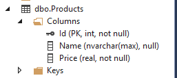
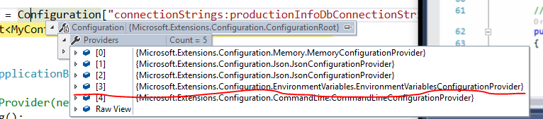

#  			[从头编写 asp.net core 2.0 web api 基础框架 (4) EF配置](https://www.cnblogs.com/cgzl/p/7661805.html) 		


第1部分：[ http://www.cnblogs.com/cgzl/p/7637250.html](http://www.cnblogs.com/cgzl/p/7637250.html)

第2部分：<http://www.cnblogs.com/cgzl/p/7640077.html>

第3部分：<http://www.cnblogs.com/cgzl/p/7652413.html>

Github源码地址：<https://github.com/solenovex/Building-asp.net-core-2-web-api-starter-template-from-scratch>

前三部分弄完，我们已经可以对内存数据进行CRUD的基本操作，并且可以在asp.net core 2中集成Nlog了。

下面继续：

# Entity Framework Core 2.0

Entity Framework 是**ORM（Object-Relational-Mapping）**。ORM是一种让你可以使用面向对象的范式对数据库进行查询和操作。

简单的情况下，ORM可以把数据库中的表和Model对象一一映射起来；也有比较复杂的情况，ORM允许使用OO（面向对象）功能来做映射，例如：Person作为基类，Employee作为Person的派生类，他们俩可以在数据库中映射成一个表；或者在没有继承的情况下，数据库中的一个表可能和多个类有映射关系。

EF Core 不是 EF6的升级版，这个大家应该知道，EF Core是轻量级、具有很好的扩展性的，并且是跨平台的EF版本。

EF Core 目前有很多Providers，所以支持很多种数据库，包括：**MSSQL，SQLite，SQL Compact，Postgres，MySql，DB2**等等。而且还有一个内存的Provider，用于测试和开发。开发UWP应用的时候也可以使用EF Core（用SQLite Provider）。

EF Core支持两种模式：

**Code First**：简单理解为 先写C#（Model），然后生成数据库。

Database First：现在数据库中建立表，然后生成C#的Model。

由于用asp.net core 2.0开发的项目基本都是新项目，所以建议使用Code First。

# 创建 Entity

**Entity**就是普通的C#类，就像Dto一样。Dto是与外界打交道的Model，entity则不一样，有一些Dto的计算属性我们并不像保存在数据库中，所以entity中没有这些属性；而数据从entity传递到Dto后某些属性也会和数据库里面的形式不一样。

首先把我们原来的Product和Material这两个Dto的名字重构一下，改成ProductDto和MaterialDto。

建立一个Entities文件夹，在里面建立Product.cs：

[](javascript:void(0);)

```
namespace CoreBackend.Api.Entities
{
    public class Product
    {
        public int Id { get; set; }
        public string Name { get; set; }
        public float Price { get; set; }
    }
}
```

[](javascript:void(0);)

DbContext

EFCore使用一个**DbContext**和数据库打交道，它代表着和数据库之间的一个Session，可以用来查询和保存我们的entities。

DbContext需要一个Provider，以便能访问数据库（这里我们就用LocalDB吧）。

我们就建立一个DbContext吧（大一点的项目会使用多个DbContext）。建立MyContext并集成DbContext：

[](javascript:void(0);)

```
namespace CoreBackend.Api.Entities
{
    public class MyContext : DbContext
    {
        public DbSet<Product> Products { get; set; }
    }
}
```

[](javascript:void(0);)

这里我们为Product建立了一个类型为DbSet<T>的属性，它可以用来查询和保存实例（针对DbSet的Linq查询语句将会被解释成针对数据库的查询语句）。

因为我们需要使用这个MyContext，所以就需要先在Container中注册它，然后就可以在依赖注入中使用了。

打开Startup.cs，修改ConfigureServices，添加这一句话:

```
services.AddDbContext<MyContext>();
```

使用AddDbContext这个Extension method为MyContext在Container中进行注册，它默认的生命周期使Scoped。

但是它如何连接数据库？这就需要连接字符串，我们需要为DbContext提供连接字符串，这里有两种方式。

第一种是在MyContext中override OnConfiguring这个方法：

[](javascript:void(0);)

```
namespace CoreBackend.Api.Entities
{
    public class MyContext : DbContext
    {
        public DbSet<Product> Products { get; set; }

        protected override void OnConfiguring(DbContextOptionsBuilder optionsBuilder)
        {
            optionsBuilder.UseSqlServer("xxxx connection string");
            base.OnConfiguring(optionsBuilder);
        }
    }
}
```

[](javascript:void(0);)

其中的参数optionsBuilder提供了一个UseSqlServer()这个方法，它告诉Dbcontext将会被用来连接Sql Server数据库，在这里就可以提供连接字符串，这就是第一种方法。

第二种方法：

先大概看一下DbContext的源码的定义：

[](javascript:void(0);)

```
namespace Microsoft.EntityFrameworkCore
{
    public class DbContext : IDisposable, IInfrastructure<IServiceProvider>, IDbContextDependencies, IDbSetCache, IDbContextPoolable
    {
        public DbContext([NotNullAttribute] DbContextOptions options);
```

[](javascript:void(0);)

有一个Constructor带有一个DbContextOptions参数，那我们就在MyContext种建立一个Constructor，并overload这个带有参数的Constructor。

[](javascript:void(0);)

```
namespace CoreBackend.Api.Entities
{
    public class MyContext : DbContext
    {
        public MyContext(DbContextOptions<MyContext> options)
            :base(options)
        {
            
        }

        public DbSet<Product> Products { get; set; }
    }
}
```

[](javascript:void(0);)

这种方法相对第一种的优点是：**它可以在我们注册MyContext的时候就提供options**，显然这样做比第一种override OnConfiguring更合理。

然后返回Startup：

[](javascript:void(0);)

```
        public void ConfigureServices(IServiceCollection services)
        {
            services.AddMvc();
#if DEBUG
            services.AddTransient<IMailService, LocalMailService>();
#else
            services.AddTransient<IMailService, CloudMailService>();
#endif
            var connectionString = @"Server=(localdb)\MSSQLLocalDB;Database=ProductDB;Trusted_Connection=True";
            services.AddDbContext<MyContext>(o => o.UseSqlServer(connectionString));
        }
```

[](javascript:void(0);)

使用AddDbContext的另一个overload的方法，它可以带一个参数，在里面调用UseSqlServer。

关于连接字符串，我是用的是LocalDb，实例名是MSSQLLocalDB。可以在命令行查询本机LocalDb的实例，使用sqllocaldb info：


也可以通过VS的Sql Server Object Explorer查看：


连接字符串中的ProductDb是数据库名；连接字符串的最后一部分表示这是一个受信任的连接，也就是说使用了集成验证，在windows系统就是指windows凭证。

## 生成数据库

因为我们使用的是Code First，所以如果还没有数据库的话，它应该会自动建立一个数据库。

打开MyContext：

```
        public MyContext(DbContextOptions<MyContext> options)
            :base(options)
        {
            Database.EnsureCreated();
        }
```

这个Constructor在被依赖注入的时候会被调用，在里面写Database.**EnsureCreated**()。其中Database是DbContext的一个属性对象。

EnsureCreated()的作用是，如果有数据库存在，那么什么也不会发生。但是如果没有，那么就会创建一个数据库。

但是现在就运行的话，并不会创建数据库，因为没有创建MyContext的实例，也就不会调用Constructor里面的内容。

那我们就建立一个临时的Controller，然后注入MyContext，此时就调用了MyContext的Constructor：

[](javascript:void(0);)

```
namespace CoreBackend.Api.Controllers
{
    [Route("api/[controller]")]
    public class TestController: Controller
    {
        private MyContext _context;

        public TestController(MyContext context)
        {
            _context = context;
        }

        [HttpGet]
        public IActionResult Get()
        {
            return Ok();
        }
    }
}
```

[](javascript:void(0);)

使用Postman访问Get这个Action后，我们可以从Debug窗口看见一些创建数据库和表的Sql语句：


然后我们查看一下Sql Server Object Explorer:


我们可以看到数据库建立好了，里面还有dbo.Products这个表。

Database.EnsureCreated()确实可以保证创建数据库，但是随着代码不断被编写，我们的Model不断再改变，数据库应该也随之改变，而EnsureCreated()就不够了，这就需要**迁移（Migration）**。

不过迁移之前，我们先看看Product这个表的具体字段属性：



Product的Id作为了主键，而Name这个字符串的长度是max，而Price没有精度限制，这样不行。我们需要对Model生成的表的字段进行限制！

解释一下：Product这个entity中的Id，根据约定（Id或者ProductId）会被视为映射表的主键，并且该主键是自增的。

如果不使用Id或者ProductId这两个名字作为主键的话，我们可以通过两种方式把该属性设置成为主键：Data  Annotation注解和Fluet Api。我只在早期使用Data Annotation，后来一直使用Fluent  Api，所以我这里只介绍Fluent Api吧。

# Fluet Api

针对Product这个entity，我们要把它映射成一个数据库的表，所以针对每个属性，可能需要设定一些限制，例如最大长度，是否必填等等。

针对Product，我们可以在MyContext里面**override OnModelCreating**这个方法，然后这样写：

[](javascript:void(0);)

```
        protected override void OnModelCreating(ModelBuilder modelBuilder)
        {
            modelBuilder.Entity<Product>().HasKey(x => x.Id);
            modelBuilder.Entity<Product>().Property(x => x.Name).IsRequired().HasMaxLength(50);
            modelBuilder.Entity<Product>().Property(x => x.Price).HasColumnType("decimal(8,2)");
        }
```

[](javascript:void(0);)

第一行表示设置Id为主键（其实我们并不需要这么做）。然后Name属性是必填的，而且最大长度是50。最后Price的精度是8，2，数据库里的类型为decimal。

fluent api有很多方法，具体请查看文档：<https://docs.microsoft.com/en-us/ef/core/modeling/>

然后，我们就会发现一个严重的问题。如果项目里面有很多entity，那么所有的fluent api配置都需要写在OnModelCreating这个方法里，那太多了。

所以我们改进一下，使用**IEntityTypeConfiguration<T>**。建立一个叫ProductConfiguration的类：

[](javascript:void(0);)

```
    public class ProductConfiguration : IEntityTypeConfiguration<Product>
    {
        public void Configure(EntityTypeBuilder<Product> builder)
        {
            builder.HasKey(x => x.Id);
            builder.Property(x => x.Name).IsRequired().HasMaxLength(50);
            builder.Property(x => x.Price).HasColumnType("decimal(8,2)");
        }
    }
```

[](javascript:void(0);)

把刚才在MyContext里写的配置都移动到这里，然后修改一些MyContext的OnModelCreating方法：

```
        protected override void OnModelCreating(ModelBuilder modelBuilder)
        {
            modelBuilder.ApplyConfiguration(new ProductConfiguration());
        }
```

就是把ProductConfiguration里面写的配置加载进来，和之前的效果是一样的。

但是项目中如果有很多entities的话也需要写很多行代码，更好的做法是写一个方法，可以加载所有实现了IEntityTypeConfiguration<T>的实现类。在老版的asp.net  web api  2.2里面有一个方法可以从某个Assembly加载所有继承于EntityTypeConfiguration的类，但是entity  framework core并没有提供类似的方法，以后我们自己写一个吧，现在先这样。

然后把数据库删掉，重新生成一下数据库：


很好！

# 迁移 Migration

随着代码的更改，数据库也会跟着变，所有EnsureCreated()不满足要求。migration就允许我们把数据库从一个版本升级到另一个版本。那我们就研究一下，首先把数据库删了，然后创建第一个迁移版本。

打开Package Manager Console，做个迁移 **Add-Migration** xxx：


Add-Migration 然后接着是一个你起的名字。

然后看一下VS的Solution Explorer 会发现生成了一个Migrations目录：


里面有两个文件，一个是Snapshot，它是目前entity的状态：

[](javascript:void(0);)

```
namespace CoreBackend.Api.Migrations
{
    [DbContext(typeof(MyContext))]
    partial class MyContextModelSnapshot : ModelSnapshot
    {
        protected override void BuildModel(ModelBuilder modelBuilder)
        {
#pragma warning disable 612, 618
            modelBuilder
                .HasAnnotation("ProductVersion", "2.0.0-rtm-26452")
                .HasAnnotation("SqlServer:ValueGenerationStrategy", SqlServerValueGenerationStrategy.IdentityColumn);

            modelBuilder.Entity("CoreBackend.Api.Entities.Product", b =>
                {
                    b.Property<int>("Id")
                        .ValueGeneratedOnAdd();

                    b.Property<string>("Name")
                        .IsRequired()
                        .HasMaxLength(50);

                    b.Property<float>("Price")
                        .HasColumnType("decimal(8,2)");

                    b.HasKey("Id");

                    b.ToTable("Products");
                });
#pragma warning restore 612, 618
        }
    }
}
```

[](javascript:void(0);)

这就是当前Product这个Model的状态细节，包括我们通过Fluent Api为其添加的映射限制等。

另一个文件是xxxx_ProductInfoDbInitialMigration，下划线后边的部分就是刚才Add-Migration命令后边跟着的名字参数。

[](javascript:void(0);)

```
namespace CoreBackend.Api.Migrations
{
    public partial class ProductInfoDbInitialMigration : Migration
    {
        protected override void Up(MigrationBuilder migrationBuilder)
        {
            migrationBuilder.CreateTable(
                name: "Products",
                columns: table => new
                {
                    Id = table.Column<int>(type: "int", nullable: false)
                        .Annotation("SqlServer:ValueGenerationStrategy", SqlServerValueGenerationStrategy.IdentityColumn),
                    Name = table.Column<string>(type: "nvarchar(50)", maxLength: 50, nullable: false),
                    Price = table.Column<float>(type: "decimal(8,2)", nullable: false)
                },
                constraints: table =>
                {
                    table.PrimaryKey("PK_Products", x => x.Id);
                });
        }

        protected override void Down(MigrationBuilder migrationBuilder)
        {
            migrationBuilder.DropTable(
                name: "Products");
        }
    }
}
```

[](javascript:void(0);)

这里面包含着migration builder需要的代码，用来迁移这个版本的数据库。里面有Up方法，就是从当前版本升级到下一个版本；还有Down方法，就是从下一个版本再退回到当前版本。

我们也可以不使用 Add-Migration命令，手写上面这些代码也行，我感觉还是算了吧。

另外还有一件事，那就是要保证迁移migration都有效的应用于数据库了，那就是另一个命令 **Update-Database**。

先等一下，我们也可以使用代码来达到同样的目的，打开MyContext：

```
        public MyContext(DbContextOptions<MyContext> options)
            : base(options)
        {
            Database.Migrate();
        }
```

把之前的EnsureCreated改成Database.Migrate(); 如果数据库还没删除，那就最后删除一次。

运行，并除法TestController：


然后会看见Product表，除此之外还有一个__EFMigrationHistory表，看看有啥：


这个表里面保存了哪些迁移已经被应用于这个数据库了。这也保证了Database.Migrate()或者Update-database命令不会执行重复的迁移migration。

我们再弄个迁移，为Product添加一个属性：

[](javascript:void(0);)

```
namespace CoreBackend.Api.Entities
{
    public class Product
    {
        public int Id { get; set; }
        public string Name { get; set; }
        public float Price { get; set; }
        public string Description { get; set; }
    }

    public class ProductConfiguration : IEntityTypeConfiguration<Product>
    {
        public void Configure(EntityTypeBuilder<Product> builder)
        {
            builder.HasKey(x => x.Id);
            builder.Property(x => x.Name).IsRequired().HasMaxLength(50);
            builder.Property(x => x.Price).HasColumnType("decimal(8,2)");
            builder.Property(x => x.Description).HasMaxLength(200);
        }
    }
}
```

[](javascript:void(0);)


执行Add-Migration后，会在Migrations目录生成了一个新的文件：

[](javascript:void(0);)

```
namespace CoreBackend.Api.Migrations
{
    public partial class AddDescriptionToProduct : Migration
    {
        protected override void Up(MigrationBuilder migrationBuilder)
        {
            migrationBuilder.AddColumn<string>(
                name: "Description",
                table: "Products",
                type: "nvarchar(200)",
                maxLength: 200,
                nullable: true);
        }

        protected override void Down(MigrationBuilder migrationBuilder)
        {
            migrationBuilder.DropColumn(
                name: "Description",
                table: "Products");
        }
    }
}
```

[](javascript:void(0);)

然后这次执行Update-Database命令：


加上verbose参数就是显示执行过程的明细而已。

不用运行，看看数据库：


Description被添加上了，然后看看迁移表：


目前差不太多了，但还有一个安全隐患。它是：

# 如何安全的保存敏感的配置数据，例如：连接字符串

保存连接字符串，你可能会想到appSettings.json，但这不是一个好的想法。在本地开发的时候还没有什么问题（使用的是集成验证），但是你要部署到服务器的时候，数据库连接字符串可能包括用户名和密码（Sql   Server的另一种验证方式）。加入你不小心把appSettings.json或写到C#里面的连接字符串代码提交到了Git或TFS，那么这个用户名和密码包括服务器的名称可能就被暴露了，这样做很不安全。

我们可以这样做，首先针对开发环境（development  environment）把C#代码中的连接字符串拿掉，把它放到appSettings.json里面。然后针对正式生产环境（production  environment），我们使用环境变量来保存这些敏感数据。

**开发环境：**

appSettings.json:

[](javascript:void(0);)

```
{
  "mailSettings": {
    "mailToAddress": "admin__json@qq.com",
    "mailFromAddress": "noreply__json@qq.com"
  },
  "connectionStrings": {
    "productionInfoDbConnectionString": "Server=(localdb)\\MSSQLLocalDB;Database=ProductDB;Trusted_Connection=True"
  } 
}
```

[](javascript:void(0);)

Startup.cs:

[](javascript:void(0);)

```
        public void ConfigureServices(IServiceCollection services)
        {
            services.AddMvc();
#if DEBUG
            services.AddTransient<IMailService, LocalMailService>();
#else
            services.AddTransient<IMailService, CloudMailService>();
#endif
            var connectionString = Configuration["connectionStrings:productionInfoDbConnectionString"];
            services.AddDbContext<MyContext>(o => o.UseSqlServer(connectionString));
        }
```

[](javascript:void(0);)

然后你可以设断点看看connectionString的值。目前项目的环境变量是Production，先改成Development：


然后断点调试：


可以看到这两个JsonConfigurationProvider就是appSettings的两个文件的配置。


这个就是appSettings.json，里面包含着我们刚才添加的连接字符串。

由于当前是Development环境，所以如果你查看另外一个JsonConfigurationProvider的话，会发现它里面的值是空的（Data数是0）.

所以没有问题。

**生产环境：**

在项目的属性--Debug里面，我们看到了环境变量：


而这个环境变量，我们可以在程序中读取出来，所以可以在这里添加连接字符串：


注意它的key，要和appSettings.json里面的整体结构一致；Value呢应该是给一个服务器的数据库的字符串，这里就随便弄个假的吧。别忘了把Development改成Production。

然后调试一下：


没错。如果你仔细调试一下看看的话：就会从EnvironmentVariablesConfigurationProvider的第64个找到我们刚才写到连接字符串：


但是还没完。

打开项目的launchSettings.json：


你会发现：

[](javascript:void(0);)

```
{
  "iisSettings": {
    "windowsAuthentication": false,
    "anonymousAuthentication": true,
    "iisExpress": {
      "applicationUrl": "http://localhost:60835/",
      "sslPort": 0
    }
  },
  "profiles": {
    "IIS Express": {
      "commandName": "IISExpress",
      "launchBrowser": true,
      "environmentVariables": {
        "connectionStrings:productionInfoDbConnectionString": "Server=.;Database=ProductDB;UserId=sa;Password=pass;",
        "ASPNETCORE_ENVIRONMENT": "Production"
      }
    },
    "CoreBackend.Api": {
      "commandName": "Project",
      "launchBrowser": true,
      "environmentVariables": {
        "ASPNETCORE_ENVIRONMENT": "Development"
      },
      "applicationUrl": "http://localhost:60836/"
    }
  }
}
```

[](javascript:void(0);)

连接字符串在这里。这个文件一般都会源码控制给忽略，也不会在发布的时候发布到服务器。那么服务器怎么读取到这个连接字符串呢？？？

看上面调试EnvironmentVariablesConfigurationProvider的值，会发现里面有几十个变量，这些基本都不是来自launchSettings.json，它们是从系统层面上定义的！！

这回我们这样操作：

把launchSettings里面的连接字符串去掉：

[](javascript:void(0);)

```
{
  "iisSettings": {
    "windowsAuthentication": false,
    "anonymousAuthentication": true,
    "iisExpress": {
      "applicationUrl": "http://localhost:60835/",
      "sslPort": 0
    }
  },
  "profiles": {
    "IIS Express": {
      "commandName": "IISExpress",
      "launchBrowser": true,
      "environmentVariables": {"ASPNETCORE_ENVIRONMENT": "Production"
      }
    },
    "CoreBackend.Api": {
      "commandName": "Project",
      "launchBrowser": true,
      "environmentVariables": {
        "ASPNETCORE_ENVIRONMENT": "Development"
      },
      "applicationUrl": "http://localhost:60836/"
    }
  }
}
```

[](javascript:void(0);)

然后这里自然也就没有了：


现在任何json文件都没有敏感信息了。

现在我们要把连接字符串添加到系统变量中。

在win10搜索框输入 envi：


然后点击上面的结果：


点击环境变量：


这里面上边是用户的变量，下面是系统的变量，这就是刚才EnvironmentVariableConfigurationProvider里面调试出来的那一堆环境变量。

而这个地方就是在你应该服务器上添加连接字符串的地方。再看一下调试：



Environment的Provider在第4个位置，appSettings.production.json的在第3个位置。也就是说如果appSettings.Product.json和系统环境变量都有一样Key的连接字符串，那么程序会选择系统环境变量的值，因为它是后边的配置会覆盖前边的配置。

在系统环境变量中添加：


然后调试运行（需要重启VS，以便新添加的系统环境变量生效）：


嗯，没问题！

# 种子数据 Seed Data

目前EF Core还没有内置的方法来做种子数据。那么自己写：

建立一个MyContextExtensions.cs:

[](javascript:void(0);)

```
namespace CoreBackend.Api.Entities
{
    public static class MyContextExtensions
    {
        public static void EnsureSeedDataForContext(this MyContext context)
        {
            if (context.Products.Any())
            {
                return;
            }
            var products = new List<Product>
            {
                new Product
                {
                    Name = "牛奶",
                    Price = 2.5f,
                    Description = "这是牛奶啊"
                },
                new Product
                {
                    Name = "面包",
                    Price = 4.5f,
                    Description = "这是面包啊"
                },
                new Product
                {
                    Name = "啤酒",
                    Price = 7.5f,
                    Description = "这是啤酒啊"
                }
            };
            context.Products.AddRange(products);
            context.SaveChanges();
        }
    }
}
```

[](javascript:void(0);)

这是个Extension method，如果数据库没有数据，那就弄点种子数据，AddRange可以添加批量数据到Context（被Context追踪），但是到这还没有插入到数据库。使用SaveChanges会把数据保存到数据库。

然后再Startup的Configure方法中调用这个method：

[](javascript:void(0);)

```
public void Configure(IApplicationBuilder app, IHostingEnvironment env, ILoggerFactory loggerFactory,
            MyContext myContext)
        {
            // loggerFactory.AddProvider(new NLogLoggerProvider());
            loggerFactory.AddNLog();

            if (env.IsDevelopment())
            {
                app.UseDeveloperExceptionPage();
            }
            else
            {
                app.UseExceptionHandler();
            }

            myContext.EnsureSeedDataForContext();

            app.UseStatusCodePages();

            app.UseMvc();
        }
```

[](javascript:void(0);)

首先注入MyContext，然后调用这个extension method。

然后把系统环境变量中的连接字符串删了把，并且把项目属性Debug中改成Development，这时候需要重启VS，因为一般环境变量是在软件启动的时候附加到其内存的，软件没关的情况下如果把系统环境变量给删了，在软件的内存中应该还是能找到该环境变量，所以软件得重启才能获取最新的环境变量们。重启VS，并运行：


种子数据进去了！

 

先写到这吧!!!!

博客文章可以转载，但不可以声明为原创. 

  我的关于ASP.NET Core Web API相关技术的公众号: 


分类: [.Net Core](https://www.cnblogs.com/cgzl/category/1090036.html)

标签: [asp.net core 2.0](https://www.cnblogs.com/cgzl/tag/asp.net core 2.0/), [asp.net core 2.0 web api](https://www.cnblogs.com/cgzl/tag/asp.net core 2.0 web api/), [.net core 2.0](https://www.cnblogs.com/cgzl/tag/.net core 2.0/)

​         [好文要顶](javascript:void(0);)             [关注我](javascript:void(0);)     [收藏该文](javascript:void(0);)     [](javascript:void(0);)     [](javascript:void(0);) 


​             [solenovex](https://home.cnblogs.com/u/cgzl/)
​             [关注 - 11](https://home.cnblogs.com/u/cgzl/followees)
​             [粉丝 - 785](https://home.cnblogs.com/u/cgzl/followers)         


​                 [+加关注](javascript:void(0);)     

​         24     

​         0     


​     


[« ](https://www.cnblogs.com/cgzl/p/7652413.html) 上一篇：[从头编写 asp.net core 2.0 web api 基础框架 (3)](https://www.cnblogs.com/cgzl/p/7652413.html)
[» ](https://www.cnblogs.com/cgzl/p/7675485.html) 下一篇：[从头编写 asp.net core 2.0 web api 基础框架 (5) EF CRUD](https://www.cnblogs.com/cgzl/p/7675485.html)

posted @ 2017-10-13 21:54 [solenovex](https://www.cnblogs.com/cgzl/) 阅读(6064) 评论(16)  [编辑](https://i.cnblogs.com/EditPosts.aspx?postid=7661805) [收藏](https://www.cnblogs.com/cgzl/p/7661805.html#)