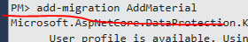
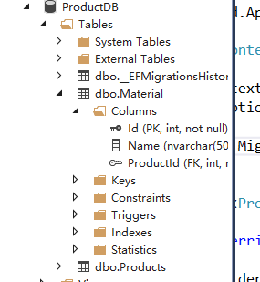

#  			[从头编写 asp.net core 2.0 web api 基础框架 (5) EF CRUD](https://www.cnblogs.com/cgzl/p/7675485.html) 		


第1部分：<http://www.cnblogs.com/cgzl/p/7637250.html>

第2部分：<http://www.cnblogs.com/cgzl/p/7640077.html>

第3部分：<http://www.cnblogs.com/cgzl/p/7652413.html>

第4部分：<http://www.cnblogs.com/cgzl/p/7661805.html>[
](http://www.cnblogs.com/cgzl/p/7652413.html)

Github源码地址：<https://github.com/solenovex/Building-asp.net-core-2-web-api-starter-template-from-scratch>

这是第一大部分的最后一小部分。要完成CRUD的操作。

# Repository Pattern

我们可以直接在Controller访问DbContext，但是可能会有一些问题:

1.相关的一些代码到处重复，有可能在程序中很多地方我都会更新Product，那样的话我可能就会在多个Action里面写同样的代码，而比较好的做法是只在一个地方写更新Product的代码。

2.到处写重复代码还会导致另外一个问题，那就是容易出错。

3.还有就是难以测试，如果想对Controller的Action进行单元测试，但是这些Action还包含着持久化相关的逻辑，这就很难的精确的找出到底是逻辑出错还是持久化部分出错了。

所以如果能有一种方法可以mock持久化相关的代码，然后再测试，就会知道错误不是发生在持久化部分了，这就可以用Repository Pattern了。

Repository Pattern是一种抽象，它减少了复杂性，目标是使代码对repository的实现更安全，并且与**持久化要无关**。

其中**持久化无关**这点我要明确一下，有时候是指可以随意切换持久化的技术，但这实际上并不是repository   pattern的目的，其真正的目的是可以为repository挑选一个最好的持久化技术。例如：创建一个Product最好的方式可能是使用entity   framework，而查询product最好的方式可能是使用dapper，也有可能会调用外部服务，而对调用repository的消费者来说，它不关心这些具体的实现细节。

首先再建立一个Material entity，然后和Product做成多对一的关系：

[](javascript:void(0);)

```
namespace CoreBackend.Api.Entities
{
    public class Material
    {
        public int Id { get; set; }
        public int ProductId { get; set; }
        public string Name { get; set; }
        public Product Product { get; set; }
    }

    public class MaterialConfiguration : IEntityTypeConfiguration<Material>
    {
        public void Configure(EntityTypeBuilder<Material> builder)
        {
            builder.HasKey(x => x.Id);
            builder.Property(x => x.Name).IsRequired().HasMaxLength(50);
            builder.HasOne(x => x.Product).WithMany(x => x.Materials).HasForeignKey(x => x.ProductId)
                .OnDelete(DeleteBehavior.Cascade);
        }
    }
}
```

[](javascript:void(0);)

修改Product.cs:

[](javascript:void(0);)

```
namespace CoreBackend.Api.Entities
{
    public class Product
    {
        public int Id { get; set; }
        public string Name { get; set; }
        public float Price { get; set; }
        public string Description { get; set; }
        public ICollection<Material> Materials { get; set; }
    }

    public class ProductConfiguration : IEntityTypeConfiguration<Product>
    {
        public void Configure(EntityTypeBuilder<Product> builder)
        {
            builder.HasKey(x => x.Id);
            builder.Property(x => x.Name).IsRequired().HasMaxLength(50);
            builder.Property(x => x.Price).HasColumnType("decimal(8,2)");
            builder.Property(x => x.Description).HasMaxLength(200);
        }
    }
}
```

[](javascript:void(0);)

然后别忘了在Context里面注册Material的Configuration并添加DbSet属性：

[](javascript:void(0);)

```
namespace CoreBackend.Api.Entities
{
    public class MyContext : DbContext
    {
        public MyContext(DbContextOptions<MyContext> options)
            : base(options)
        {
            Database.Migrate();
        }

        public DbSet<Product> Products { get; set; }
        public DbSet<Material> Materials { get; set; }

        protected override void OnModelCreating(ModelBuilder modelBuilder)
        {
            modelBuilder.ApplyConfiguration(new ProductConfiguration());
            modelBuilder.ApplyConfiguration(new MaterialConfiguration());
        }
    }
}
```

[](javascript:void(0);)

 

然后添加一个迁移 Add-Migration AddMaterial：



然后数据库直接进行迁移操作了，无需再做update-database。



 

建立一个Repositories文件夹，添加一个IProductRepository：

[](javascript:void(0);)

```
namespace CoreBackend.Api.Repositories
{
    public interface IProductRepository
    {
        IEnumerable<Product> GetProducts();
        Product GetProduct(int productId, bool includeMaterials);
        IEnumerable<Material> GetMaterialsForProduct(int productId);
        Material GetMaterialForProduct(int productId, int materialId);
    }
}
```

[](javascript:void(0);)

这个是ProductRepository将要实现的接口，里面定义了一些必要的方法：查询Products，查询单个Product，查询Product的Materials和查询Product下的一个Material。

其中类似GetProducts()这样的方法返回类型还是有争议的，IQueryable<T>还是IEnumerable<T>。

如果返回的是IQueryable，那么调用repository的地方还可以继续构建IQueryable，例如在真正的查询执行之前附加一个OrderBy或者Where方法。但是这样做的话，也意味着你把持久化相关的代码给泄露出去了，这看起来是违反了repository  pattern的目的。

如果是IEnumerable，为了返回各种各样情况的查询结果，需要编写几十个上百个查询方法，那也是相当繁琐的，几乎是不可能的。

目前看来，两种返回方式都有人在用，所以根据情况定吧。我们的程序需求比较简单，所以使用IEnumerable。

然后建立具体的实现类 ProductRepository:

[](javascript:void(0);)

```
namespace CoreBackend.Api.Repositories
{
    public class ProductRepository : IProductRepository
    {
        private readonly MyContext _myContext;

        public ProductRepository(MyContext myContext)
        {
            _myContext = myContext;
        }

        public IEnumerable<Product> GetProducts()
        {
            return _myContext.Products.OrderBy(x => x.Name).ToList();
        }

        public Product GetProduct(int productId, bool includeMaterials)
        {
            if (includeMaterials)
            {
                return _myContext.Products
                    .Include(x => x.Materials).FirstOrDefault(x => x.Id == productId);
            }
            return _myContext.Products.Find(productId);
        }

        public IEnumerable<Material> GetMaterialsForProduct(int productId)
        {
            return _myContext.Materials.Where(x => x.ProductId == productId).ToList();
        }

        public Material GetMaterialForProduct(int productId, int materialId)
        {
            return _myContext.Materials.FirstOrDefault(x => x.ProductId == productId && x.Id == materialId);
        }
    }
}
```

[](javascript:void(0);)

这里面要包含吃就会的逻辑，所以我们需要MyContext（也有可能需要其他的Service）那就在Constructor里面注入一个。重要的是调用的程序不关心这些细节。

这里也是编写额外的持久化逻辑的地方，比如说查询之后做个排序之类的。

（具体的Entity Framework Core的方法请查阅EF Core官方文档：<https://docs.microsoft.com/en-us/ef/core/>）

GetProducts，查询所有的产品并按照名称排序并返回查询结果。这里注意一定要加上ToList()，它保证了对数据库的查询就在此时此刻发生。

GetProduct，查询单个产品，判断一下是否需要把产品下面的原料都一起查询出来，如果需要的话就使用Include这个extension method。查询条件可以放在FirstOrDefault()方法里面。

GetMaterialsForProduct，查询某个产品下所有的原料。

GetMaterialForProduct，查询某个产品下的某种原料。

建立好Repository之后，需要在Startup里面进行注册：

[](javascript:void(0);)

```
        public void ConfigureServices(IServiceCollection services)
        {
            services.AddMvc();
#if DEBUG
            services.AddTransient<IMailService, LocalMailService>();
#else
            services.AddTransient<IMailService, CloudMailService>();
#endif
            var connectionString = Configuration["connectionStrings:productionInfoDbConnectionString"];
            services.AddDbContext<MyContext>(o => o.UseSqlServer(connectionString));

            services.AddScoped<IProductRepository, ProductRepository>();
        }
```

[](javascript:void(0);)

针对Repository，最好的生命周期是Scoped（每个请求生成一个实例）。<>里面前边是它的合约接口，后边是具体实现。

# 使用Repository

先为ProductDto添加一个属性：

[](javascript:void(0);)

```
namespace CoreBackend.Api.Dtos
{
    public class ProductDto
    {
        public ProductDto()
        {
            Materials = new List<MaterialDto>();
        }

        public int Id { get; set; }
        public string Name { get; set; }
        public float Price { get; set; }
        public string Description { get; set; }
        public ICollection<MaterialDto> Materials { get; set; }

        public int MaterialCount => Materials.Count;
    }
}
```

[](javascript:void(0);)

就是返回该产品所用的原料个数。

再建立一个ProductWithoutMaterialDto：

[](javascript:void(0);)

```
namespace CoreBackend.Api.Dtos
{
    public class ProductWithoutMaterialDto
    {
        public int Id { get; set; }
        public string Name { get; set; }
        public float Price { get; set; }
        public string Description { get; set; }
    }
}
```

[](javascript:void(0);)

这个Dto不带原料相关的导航属性。

然后修改controller。

现在我们可以使用ProductRepository替代原来的内存数据了，首先在ProductController里面注入ProductRepository:

[](javascript:void(0);)

```
   public class ProductController : Controller
    {
        private readonly ILogger<ProductController> _logger;
        private readonly IMailService _mailService;
        private readonly IProductRepository _productRepository;

        public ProductController(
            ILogger<ProductController> logger,
            IMailService mailService,
            IProductRepository productRepository)
        {
            _logger = logger;
            _mailService = mailService;
            _productRepository = productRepository;
        }
```

[](javascript:void(0);)

1.修改GetProducts这个Action：

[](javascript:void(0);)

```
        [HttpGet]
        public IActionResult GetProducts()
        {
            var products = _productRepository.GetProducts();
            var results = new List<ProductWithoutMaterialDto>();
            foreach (var product in products)
            {
                results.Add(new ProductWithoutMaterialDto
                {
                    Id = product.Id,
                    Name = product.Name,
                    Price = product.Price,
                    Description = product.Description
                });
            }
            return Ok(results);
        }
```

[](javascript:void(0);)

注意，其中的Product类型是DbContext和repository操作的类型，而不是Action应该返回的类型，而且我们的查询结果是不带Material的，所以需要把Product的list映射成ProductWithoutMaterialDto的list。

然后试试：

查询的时候报错，是因为Product的属性Price，在fluentapi里面设置的类型是decimal(8, 2)，而Price的类型是float，那么我们把所有的Price的类型都改成decimal：

[](javascript:void(0);)

```
    public class Product
    {
        public int Id { get; set; }
        public string Name { get; set; }
        public decimal Price { get; set; }
        public string Description { get; set; }
        public ICollection<Material> Materials { get; set; }
    }

    public class ProductCreation
    {
        [Display(Name = "产品名称")]
        [Required(ErrorMessage = "{0}是必填项")]
        [StringLength(10, MinimumLength = 2, ErrorMessage = "{0}的长度应该不小于{2}, 不大于{1}")]
        public string Name { get; set; }

        [Display(Name = "价格")]
        [Range(0, Double.MaxValue, ErrorMessage = "{0}的值必须大于{1}")]
        public decimal Price { get; set; }

        [Display(Name = "描述")]
        [MaxLength(100, ErrorMessage = "{0}的长度不可以超过{1}")]
        public string Description { get; set; }
    }

public class ProductDto
    {
        public ProductDto()
        {
            Materials = new List<MaterialDto>();
        }

        public int Id { get; set; }
        public string Name { get; set; }
        public decimal Price { get; set; }
        public string Description { get; set; }
        public ICollection<MaterialDto> Materials { get; set; }

        public int MaterialCount => Materials.Count;
    }

public class ProductModification
    {
        [Display(Name = "产品名称")]
        [Required(ErrorMessage = "{0}是必填项")]
        [StringLength(10, MinimumLength = 2, ErrorMessage = "{0}的长度应该不小于{2}, 不大于{1}")]
        public string Name { get; set; }

        [Display(Name = "价格")]
        [Range(0, Double.MaxValue, ErrorMessage = "{0}的值必须大于{1}")]
        public decimal Price { get; set; }

        [Display(Name = "描述")]
        [MaxLength(100, ErrorMessage = "{0}的长度不可以超过{1}")]
        public string Description { get; set; }
    }

public class ProductWithoutMaterialDto
    {
        public int Id { get; set; }
        public string Name { get; set; }
        public decimal Price { get; set; }
        public string Description { get; set; }
    }
```

[](javascript:void(0);)

还有SeedData里面和即将废弃的ProductService:

  View Code

然后在运行试试：


结果正确。

然后修改GetProduct:

[](javascript:void(0);)

```
[Route("{id}", Name = "GetProduct")]
        public IActionResult GetProduct(int id, bool includeMaterial = false)
        {
            var product = _productRepository.GetProduct(id, includeMaterial);
            if (product == null)
            {
                return NotFound();
            }
            if (includeMaterial)
            {
                var productWithMaterialResult = new ProductDto
                {
                    Id = product.Id,
                    Name = product.Name,
                    Price = product.Price,
                    Description = product.Description
                };
                foreach (var material in product.Materials)
                {
                    productWithMaterialResult.Materials.Add(new MaterialDto
                    {
                        Id = material.Id,
                        Name = material.Name
                    });
                }
                return Ok(productWithMaterialResult);
            }

            var onlyProductResult = new ProductDto
            {
                Id = product.Id,
                Name = product.Name,
                Price = product.Price,
                Description = product.Description
            };
            return Ok(onlyProductResult);
        }
```

[](javascript:void(0);)

首先再添加一个参数includeMaterial表示是否带着Material表的数据一起查询出来，该参数有一个默认值是false，就是请求的时候如果不带这个参数，那么这个参数的值就是false。

通过repository查询之后把Product和Material分别映射成ProductDto和MaterialDot。

试试，首先不包含Material：


目前数据库的Material表没有数据，可以手动添加几个，也可以把数据库的Product数据删了，改一下种子数据那部分代码：

  View Code

然后再试试GetProduct带有material的查询：


其中inludeMaterail这个参数需要使用query string的方式，也就是在uri后边加一个问号，问号后边跟着参数名，然后是等号，然后是它的值。如果有多个query string的参数，那么每组参数之间用&分开。

然后再修改一下MaterialController：

[](javascript:void(0);)

```
namespace CoreBackend.Api.Controllers
{
    [Route("api/product")] // 和主Model的Controller前缀一样
    public class MaterialController : Controller
    {
        private readonly IProductRepository _productRepository;
        public MaterialController(IProductRepository productRepository)
        {
            _productRepository = productRepository;
        }

        [HttpGet("{productId}/materials")]
        public IActionResult GetMaterials(int productId)
        {
            var materials = _productRepository.GetMaterialsForProduct(productId);
            var results = materials.Select(material => new MaterialDto
                {
                    Id = material.Id,
                    Name = material.Name
                })
                .ToList();
            return Ok(results);
        }

        [HttpGet("{productId}/materials/{id}")]
        public IActionResult GetMaterial(int productId, int id)
        {
            var material = _productRepository.GetMaterialForProduct(productId, id);
            if (material == null)
            {
                return NotFound();
            }
            var result = new MaterialDto
            {
                Id = material.Id,
                Name = material.Name
            };
            return Ok(result);
        }
    }
}
```

[](javascript:void(0);)

注意GetMaterials方法内，我们往productRepository的GetMaterialsForProduct传进去一个productId，如果repository返回的是空list可能会有两种情况：1  product不存在，2 product存在，而它没有下属的material。如果是第一种情况，那么应该返回的是404  NotFound，而第二种action应该返回一个空list。所以我们需要一个方法判断product是否存在，所以打开ProductRepository，添加方法：

```
        public bool ProductExist(int productId)
        {
            return _myContext.Products.Any(x => x.Id == productId);
        }
```

并在pull up member（右键点击方法代码--重构里面有）到接口里面：

[](javascript:void(0);)

```
namespace CoreBackend.Api.Repositories
{
    public interface IProductRepository
    {
        IEnumerable<Product> GetProducts();
        Product GetProduct(int productId, bool includeMaterials);
        IEnumerable<Material> GetMaterialsForProduct(int productId);
        Material GetMaterialForProduct(int productId, int materialId);
        bool ProductExist(int productId);
    }
}
```

[](javascript:void(0);)

然后再改一下Controller：

[](javascript:void(0);)

```
namespace CoreBackend.Api.Controllers
{
    [Route("api/product")] // 和主Model的Controller前缀一样
    public class MaterialController : Controller
    {
        private readonly IProductRepository _productRepository;
        public MaterialController(IProductRepository productRepository)
        {
            _productRepository = productRepository;
        }

        [HttpGet("{productId}/materials")]
        public IActionResult GetMaterials(int productId)
        {
            var product = _productRepository.ProductExist(productId);
            if (!product)
            {
                return NotFound();
            }
            var materials = _productRepository.GetMaterialsForProduct(productId);
            var results = materials.Select(material => new MaterialDto
                {
                    Id = material.Id,
                    Name = material.Name
                })
                .ToList();
            return Ok(results);
        }

        [HttpGet("{productId}/materials/{id}")]
        public IActionResult GetMaterial(int productId, int id)
        {
            var product = _productRepository.ProductExist(productId);
            if (!product)
            {
                return NotFound();
            }
            var material = _productRepository.GetMaterialForProduct(productId, id);
            if (material == null)
            {
                return NotFound();
            }
            var result = new MaterialDto
            {
                Id = material.Id,
                Name = material.Name
            };
            return Ok(result);
        }
    }
}
```

[](javascript:void(0);)

试试：


结果都没有问题!!!

但是看看上面controller里面的代码，到处都是映射，这种手写的映射很容易出错，如果entity有几十个属性，然后在多个地方需要进行映射，那么这么写实在太糟糕了。

所以需要使用一个映射的库：

# [AutoMapper](https://github.com/AutoMapper/AutoMapper)

 autoMapper是最主流的.net映射库，所以我们用它。

通过nuget安装automapper：


安装完之后，首先要配置automapper。我们要告诉automapper哪些entity和dto之间有映射关系。这个配置应该只创建一次，并且在startup的时候进行初始化。

在Startup的Configure方法添加：

[](javascript:void(0);)

```
public void Configure(IApplicationBuilder app, IHostingEnvironment env, ILoggerFactory loggerFactory,
            MyContext myContext)
        {
            loggerFactory.AddNLog();
            if (env.IsDevelopment())
            {
                app.UseDeveloperExceptionPage();
            }
            else
            {
                app.UseExceptionHandler();
            }
            myContext.EnsureSeedDataForContext();
            app.UseStatusCodePages();

            AutoMapper.Mapper.Initialize(cfg =>
            {
                cfg.CreateMap<Product, ProductWithoutMaterialDto>();
            });

            app.UseMvc();
        }
```

[](javascript:void(0);)

创建映射关系，我们需要使用AutoMapper.Mapper.Initialize方法，其参数是一个Action，这个Action的参数是一个Mapping Configuration。

cfg.CreateMap<Product, ProductWithoutMaterialDto>()，意思就是创建一个从Product到ProductWIthoutMaterialDto的映射关系。

AutoMapper是基于约定的，原对象的属性值会被映射到目标对象相同属性名的属性上。如果属性不存在，那么就忽略它。

偶尔我们可能需要对AutoMapper的映射进行一些微调，但是对于大多数情况来说，上面这一句话就够用了。

现在可以在controller里面使用这个映射了。

打开controller首先改一下GetProducts:

[](javascript:void(0);)

```
        [HttpGet]
        public IActionResult GetProducts()
        {
            var products = _productRepository.GetProducts();
            var results = Mapper.Map<IEnumerable<ProductWithoutMaterialDto>>(products);
            return Ok(results);
        }
```

[](javascript:void(0);)

使用Mapper.Map进行映射，<T>其中T是目标类型，可以是一个model也可以是一个集合，括号里面的参数是原对象们。

运行试试：


没问题，结果和之前是一样的。

然后针对GetProduct，首先再建立一对映射：

```
            AutoMapper.Mapper.Initialize(cfg =>
            {
                cfg.CreateMap<Product, ProductWithoutMaterialDto>();
                cfg.CreateMap<Product, ProductDto>();
            });
```

然后GetProduct：

[](javascript:void(0);)

```
[Route("{id}", Name = "GetProduct")]
        public IActionResult GetProduct(int id, bool includeMaterial = false)
        {
            var product = _productRepository.GetProduct(id, includeMaterial);
            if (product == null)
            {
                return NotFound();
            }
            if (includeMaterial)
            {
                var productWithMaterialResult = Mapper.Map<ProductDto>(product);
                return Ok(productWithMaterialResult);
            }
            var onlyProductResult = Mapper.Map<ProductWithoutMaterialDto>(product);
            return Ok(onlyProductResult);
        }
```

[](javascript:void(0);)

运行，查询包含Material，报错：


这是因为ProductDto里面有一个属性 ICollection<Material> Materials，automapper不知道应该怎么去映射它，所以我们需要再添加一对Material到MaterialDto的映射关系。

[](javascript:void(0);)

```
            AutoMapper.Mapper.Initialize(cfg =>
            {
                cfg.CreateMap<Product, ProductWithoutMaterialDto>();
                cfg.CreateMap<Product, ProductDto>();
                cfg.CreateMap<Material, MaterialDto>();
            });
```

[](javascript:void(0);)

运行：


没问题。

然后把MaterailController里面也改一下：

  View Code

运行一下都应该没有什么问题。

上面都是查询的Actions。

下面开始做CUD的映射更改。

## 添加：

修改ProductRepository，添加以下方法：

[](javascript:void(0);)

```
        public void AddProduct(Product product)
        {
            _myContext.Products.Add(product);
        }

        public bool Save()
        {
            return _myContext.SaveChanges() >= 0;
        }
```

[](javascript:void(0);)

AddProduct会把传进来的product添加到context的内存中（姑且这么说），但是还没有更新到数据库。

Save方法里面是把context所追踪的实体变化（CUD）更新到数据库。

然后把这两个方法提取到IProductRepository接口里：

[](javascript:void(0);)

```
    public interface IProductRepository
    {
        IEnumerable<Product> GetProducts();
        Product GetProduct(int productId, bool includeMaterials);
        IEnumerable<Material> GetMaterialsForProduct(int productId);
        Material GetMaterialForProduct(int productId, int materialId);
        bool ProductExist(int productId);
        void AddProduct(Product product);
        bool Save();
    }
```

[](javascript:void(0);)

修改Controller的Post：

[](javascript:void(0);)

```
[HttpPost]
        public IActionResult Post([FromBody] ProductCreation product)
        {
            if (product == null)
            {
                return BadRequest();
            }

            if (product.Name == "产品")
            {
                ModelState.AddModelError("Name", "产品的名称不可以是'产品'二字");
            }

            if (!ModelState.IsValid)
            {
                return BadRequest(ModelState);
            }

            var newProduct = Mapper.Map<Product>(product);
            _productRepository.AddProduct(newProduct);
            if (!_productRepository.Save())
            {
                return StatusCode(500, "保存产品的时候出错");
            }

            var dto = Mapper.Map<ProductWithoutMaterialDto>(newProduct);

            return CreatedAtRoute("GetProduct", new { id = dto.Id }, dto);
        }
```

[](javascript:void(0);)

注意别忘了要返回的是Dto。

运行：


没问题。

# Put

```
                cfg.CreateMap<ProductModification, Product>();
```

[](javascript:void(0);)

```
[HttpPut("{id}")]
        public IActionResult Put(int id, [FromBody] ProductModification productModificationDto)
        {
            if (productModificationDto == null)
            {
                return BadRequest();
            }

            if (productModificationDto.Name == "产品")
            {
                ModelState.AddModelError("Name", "产品的名称不可以是'产品'二字");
            }

            if (!ModelState.IsValid)
            {
                return BadRequest(ModelState);
            }
            var product = _productRepository.GetProduct(id);
            if (product == null)
            {
                return NotFound();
            }
            Mapper.Map(productModificationDto, product);
            if (!_productRepository.Save())
            {
                return StatusCode(500, "保存产品的时候出错");
            }

            return NoContent();
        }
```

[](javascript:void(0);)

这里我们使用了Mapper.Map的另一个overload的方法，它有两个参数。这个方法会把第一个对象相应的值赋给第二个对象上。这时候product的state就变成了modified了。

然后保存即可。

试试：


## Partial Update

```
cfg.CreateMap<Product, ProductModification>();
```

[](javascript:void(0);)

```
[HttpPatch("{id}")]
        public IActionResult Patch(int id, [FromBody] JsonPatchDocument<ProductModification> patchDoc)
        {
            if (patchDoc == null)
            {
                return BadRequest();
            }
            var productEntity = _productRepository.GetProduct(id);
            if (productEntity == null)
            {
                return NotFound();
            }
            var toPatch = Mapper.Map<ProductModification>(productEntity);
            patchDoc.ApplyTo(toPatch, ModelState);

            if (!ModelState.IsValid)
            {
                return BadRequest(ModelState);
            }

            if (toPatch.Name == "产品")
            {
                ModelState.AddModelError("Name", "产品的名称不可以是'产品'二字");
            }
            TryValidateModel(toPatch);
            if (!ModelState.IsValid)
            {
                return BadRequest(ModelState);
            }

            Mapper.Map(toPatch, productEntity);

            if (!_productRepository.Save())
            {
                return StatusCode(500, "更新的时候出错");
            }

            return NoContent();
        }
```

[](javascript:void(0);)

试试：


没问题。

## Delete

只是替换成repository，不涉及mapping。

在Repository添加一个Delete方法：

```
        public void DeleteProduct(Product product)
        {
            _myContext.Products.Remove(product);
        }
```

提取到IProductRepository：

```
void DeleteProduct(Product product);
```

然后Controller：

[](javascript:void(0);)

```
[HttpDelete("{id}")]
        public IActionResult Delete(int id)
        {
            var model = _productRepository.GetProduct(id);
            if (model == null)
            {
                return NotFound();
            }
            _productRepository.DeleteProduct(model);
            if (!_productRepository.Save())
            {
                return StatusCode(500, "删除的时候出错");
            }
            _mailService.Send("Product Deleted",$"Id为{id}的产品被删除了");
            return NoContent();
        }
```

[](javascript:void(0);)

运行：


Ok。

第一大部分先写到这。。。。。。。。。。。。

接下来几天比较忙，然后我再编写第二大部分。我会直接弄一个已经重构好的模板，简单讲一下，然后重点是Identity Server 4.

到目前为止可以进行CRUD操作了，接下来需要把项目重构一下，然后再简单用一下Identity Server4。

博客文章可以转载，但不可以声明为原创. 

  我的关于ASP.NET Core Web API相关技术的公众号: 


分类: [.Net Core](https://www.cnblogs.com/cgzl/category/1090036.html)