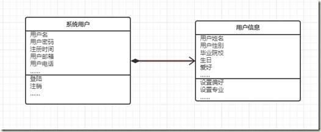
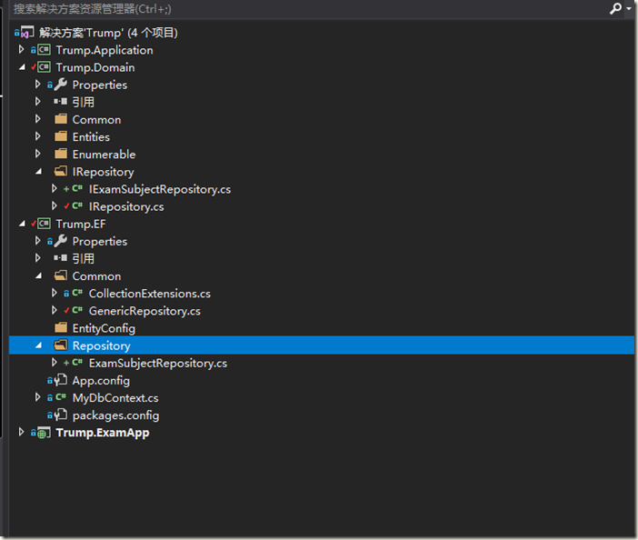

## 前言

年底工作比较忙，年度总结还没写，项目要上线，回老家过年各种准备。尤其是给长辈给侄子侄女准备礼物头都大了。

原来想年前先出一版能用的，我看有点悬了，尽量先把大体功能弄出来，扔掉一些，保证能考试，然后再搞点扩展的东西。

本节主要是做一下EF的封装，在DDD设计中，有两个概念不得不提，工作单元模式和仓储模式。纯属个人理解，不对的地方大家交流。

下面是一张图来自Microsoft 文档站点


 

## 仓储模式

### 定义

> Repository模式用于通过抽象接口来管理CRUD操作，该接口公开领域实体并隐藏数据库访问代码的实现细节。

### 为什么

其实定义已经很明确了，就是封装了一下，让上一层不知道数据访问是怎么实现的，为什么要这么做呢？那就又回到了DDD的概念中了，充血模型下更关注业务功能而不是数据持久层怎么实现，以前三层的时候，DAL实际上关注的就是数据怎么取出来，怎么存进去。为了避免重回三层架构的窠臼，DDD中专门把持久化分出去作为一层，这一层与业务之间的分隔就是通过仓储模式。

一般讲，在领域中提供仓储的接口，即要做什么。具体实现交给持久层，至于持久层是用ADO.NET   还是用ORM框架，数据放在RDBMS、XML、JSON、Cache或者Nosql中，这些都与领域模型无关，领域模型只关心接口，有没有实现，这样就保证了领域模型的与数据持久化之间的独立。

### 优点

1. 隔离业务与数据持久化，实现关注点分离。  
2. 便于自动化的单元测试或者测试驱动的开发  
3. 代码更加规整，可读性高

参考资料：[Why the Repository Pattern](https://www.codeproject.com/Articles/600097/Why-the-Repository-Pattern)

 

## 工作单元模式

### 定义

> Maintains  a list of objects affected by a business transaction and coordinates  the writing out of changes and the resolution of concurrency problems.    --[P of EAA – Martin Fowler](https://martinfowler.com/eaaCatalog/unitOfWork.html)

“工作单元”模式用于将一个或多个操作（通常是数据库操作）分组到单个事务或“工作单元”中，以便所有操作都可以通过或失败。 --网友意译。

###  

### 为什么

工作单元的工作是为了保证业务操作的原子性，也就是一个连贯的业务在提交操作的时候，要么全部成功，要么全部失败，比如用户下单操作，要生成订单，要消减库存，要派送物流，业务上分析的话，这三个操作是同时完成的，不能分离，要么都成功，要么都失败。

Entity Framework本身具有这一特性，在一个操作里面，只有调用 **db.SaveChanges()**时 ,操作才会进行保存，并且是同时成功或者同时失败，既然EF本身以及有这一功能，为什么还要搞一个工作单元呢？  

已经有了存储模式，当单个实体操作进行增删改查是没有问题的，但是当涉及多个实体模型的操作时，就会出现有多个DbContext，大量重复代码，跨实体操作的代码无处安放等。  

比如一个创建用户的操作，如下两个表（这个例子不是很恰当，一般理解下就行）：

[](http://images2017.cnblogs.com/blog/171569/201801/171569-20180130143536031-9458879.png)

注册用户的时候，有可能分布填写信息，最后要添加两条实体，一条账号记录一条用户信息记录。

在账户仓储类中，我可以添加一条记录，在用户信息仓储中也可以添加一条记录。最后无法保证两条记录同时成功或者失败。

### 实现

[](javascript:void(0);)

```
public interface IUnitOfWork
    {
        /// <summary>
        /// 命令
        /// </summary>
        /// <param name="commandText"></param>
        /// <param name="parameters"></param>
        /// <returns></returns>
        int Command(string commandText, IDictionary<string, object> parameters);

        /// <summary>
        /// 事务的提交状态
        /// </summary>
        bool IsCommited { get; set; }

        /// <summary>
        /// 提交事务
        /// </summary>
        /// <returns></returns>
        void Commit();

        /// <summary>
        /// 回滚事务
        /// </summary>
        void RollBack();
    }
```

[](javascript:void(0);)

 

## 本节正文-通用仓储类实现

发现每次整理来整理去都墨迹的不行，前面介绍仓储模式和工作单元花了一大堆精力，其实我项目中根本没用工作单元，原因是项目比较小，如果需要工作单元的地方，在仓储中自定义一个借口就给解决了。还有就是以前用工作单元+Ioc的模式，除了问题不好调试，为了保证项目进度，先实现功能，然后在重构吧。

 

首先仓储模式是一个接口和接口的实现，我们在Domain项目中添加IRepository接口，定义内容如下：

[](javascript:void(0);)

```
public interface IRepository<TEntity> where TEntity : class
    {
        IQueryable<TEntity> All();

        TEntity Single(long id);

        TEntity Single(Expression<Func<TEntity, bool>> predicate);

        TEntity Single(long id, params Expression<Func<TEntity, object>>[] propertySelectors);

        IQueryable<TEntity> Find(Expression<Func<TEntity, bool>> predicate);

        IQueryable<TEntity> Find(Expression<Func<TEntity, bool>> predicate, params Expression<Func<TEntity, object>>[] propertySelectors);

        int Count();

        int Count(Expression<Func<TEntity, bool>> criteria);

        IEnumerable<TEntity> Get<TOrderBy>(Expression<Func<TEntity, bool>> criteria, Expression<Func<TEntity, TOrderBy>> orderBy, int pageIndex, int pageSize, SortOrder sortOrder = SortOrder.Ascending);

        TEntity Delete(long id);

        bool Add(TEntity entity);

        bool Update(TEntity entity);

        int Save(TEntity entity);
    }
```

[](javascript:void(0);)

接口中定义了增删改查各种操作，所有的实现都在持久化层，我们这里封装一下，提供一个通用仓储类如下：

[](javascript:void(0);)

```
public class GenericRepository<TEntity> : IRepository<TEntity> where TEntity : EneityOfLongPrimarykey
    {
        private MyDbContext context;

        public GenericRepository()
        {
            context = new MyDbContext();
            // Load navigation properties explicitly (avoid serialization trouble)
            context.Configuration.LazyLoadingEnabled = false;

            // Do NOT enable proxied entities, else serialization fails.
            context.Configuration.ProxyCreationEnabled = false;

            // Because Web API will perform validation, we don't need/want EF to do so
            context.Configuration.ValidateOnSaveEnabled = false;
        }

        public virtual IQueryable<TEntity> All()
        {
            return context.Set<TEntity>().AsQueryable();
        }

        public TEntity Single(long id)
        {
            return All().Single(t => t.Id == id);
        }

        public TEntity Single(long id, params Expression<Func<TEntity, object>>[] propertySelectors)
        {
            return Find(s => s.Id == id, propertySelectors).FirstOrDefault();
        }

        public TEntity Single(Expression<Func<TEntity, bool>> predicate)
        {
            return All().Single(predicate);
        }

        public IQueryable<TEntity> Find(Expression<Func<TEntity, bool>> predicate)
        {
            if (predicate != null)
            {
                return All().Where(predicate).AsNoTracking();
            }
            else
            {
                return All();
            }
        }

        /// <summary>
        /// 取过滤数据，启用延迟查询
        /// </summary>
        /// <param name="predicate">过滤条件</param>
        /// <param name="propertySelectors">需要Left Join 的表</param>
        /// <returns></returns>
        public IQueryable<TEntity> Find(Expression<Func<TEntity, bool>> predicate, params Expression<Func<TEntity, object>>[] propertySelectors)
        {
            if (propertySelectors.IsNullOrEmpty())
            {
                return Find(predicate);
            }

            var query = Find(predicate);

            foreach (var propertySelector in propertySelectors)
            {
                query = query.Include(propertySelector);
            }

            return query;
        }

        public int Count()
        {
            return All().Count();
        }

        public int Count(Expression<Func<TEntity, bool>> criteria)
        {
            return All().Count(criteria);
        }

        public IEnumerable<TEntity> Get<TOrderBy>(Expression<Func<TEntity, bool>> criteria, Expression<Func<TEntity, TOrderBy>> orderBy, int pageIndex, int pageSize, SortOrder sortOrder = SortOrder.Ascending)
        {
            if (sortOrder == SortOrder.Ascending)
            {
                return All().OrderBy(orderBy).Skip((pageIndex - 1) * pageSize).Take(pageSize).AsEnumerable();
            }
            return All().OrderByDescending(orderBy).Skip((pageIndex - 1) * pageSize).Take(pageSize).AsEnumerable();
        }

        public TEntity Delete(long id)
        {
            var entity = Single(id);
            context.Set<TEntity>().Remove(entity);
            context.SaveChanges();
            return entity;
        }

        public bool Add(TEntity entity)
        {
            if (context.Entry<TEntity>(entity).State != EntityState.Detached)
            {
                context.Entry<TEntity>(entity).State = EntityState.Added;
            }
            context.Set<TEntity>().Add(entity);
            return context.SaveChanges() > 0;
        }

        public bool Update(TEntity entity)
        {
            if (context.Entry<TEntity>(entity).State != EntityState.Detached)
            {
                context.Set<TEntity>().Attach(entity);
            }
            context.Entry<TEntity>(entity).State = EntityState.Modified;
            return context.SaveChanges() > 0;
        }

        public int Save(TEntity entity)
        {
            return context.SaveChanges();
        }

    }
```

[](javascript:void(0);)

 

使用方法：

考试科目的仓储接口

[](javascript:void(0);)

```
/// <summary>
    ///   仓储层接口——ExamSubject
    /// </summary>
    public partial interface IExamSubjectRepository : IRepository<ExamSubject>
    { }
```

[](javascript:void(0);)

 

考试科目的仓储接口实现：

[](javascript:void(0);)

```
using Trump.Domain.Entities;
using Trump.EF.Common;

namespace Trump.EF.Repository
{
    /// <summary>
    ///   仓储实现——ExamQuestionBizType
    /// </summary>
    public partial class ExamSubjectRepository : GenericRepository<ExamSubject>, IExamSubjectRepository
    { }
}
```

[](javascript:void(0);)

如果在这个实体模型中，除了CRUD没有其他操作的话，那么这样两个类就完成了。

最后项目截图：

[](http://images2017.cnblogs.com/blog/171569/201801/171569-20180130143536578-338224621.png)

 

在不断的整理，有空就整理一点功能，整个功能实现后会提供源码。


标签: [MVC5+EF6考试系统](https://www.cnblogs.com/buyixiaohan/tag/MVC5%2BEF6考试系统/)

​         [好文要顶](javascript:void(0);)             [关注我](javascript:void(0);)     [收藏该文](javascript:void(0);)     [](javascript:void(0);)     [](javascript:void(0);) 


​             [天北涯](https://home.cnblogs.com/u/buyixiaohan/)
​             [关注 - 38](https://home.cnblogs.com/u/buyixiaohan/followees)
​             [粉丝 - 24](https://home.cnblogs.com/u/buyixiaohan/followers)         


​                 [+加关注](javascript:void(0);)     

 


[« ](https://www.cnblogs.com/buyixiaohan/p/8377724.html) 上一篇：[MVC中使用Hangfire执行定时任务](https://www.cnblogs.com/buyixiaohan/p/8377724.html)
[» ](https://www.cnblogs.com/buyixiaohan/p/8716920.html) 下一篇：[Entity Framework 6 多对多增改操作指南](https://www.cnblogs.com/buyixiaohan/p/8716920.html)

