#	分合

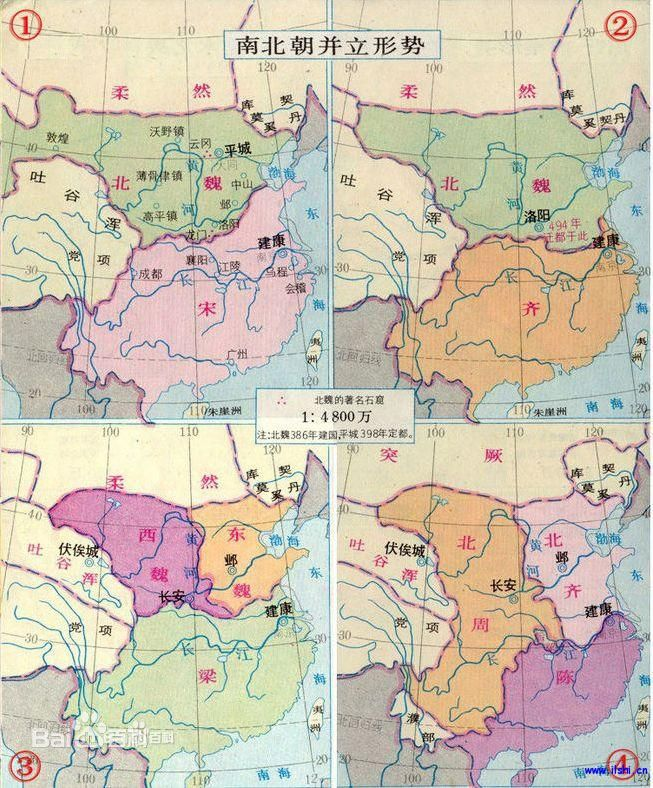

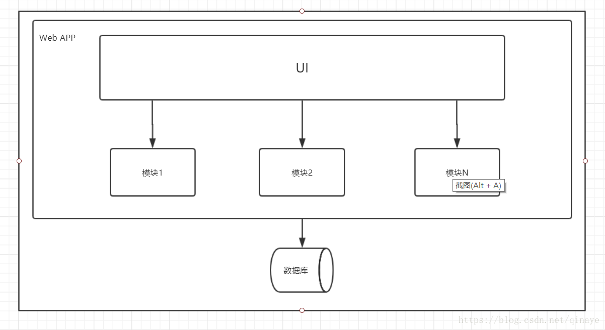

## 微服务

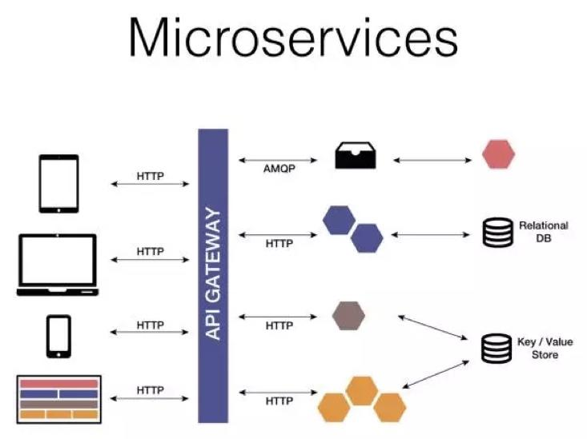

###	对比

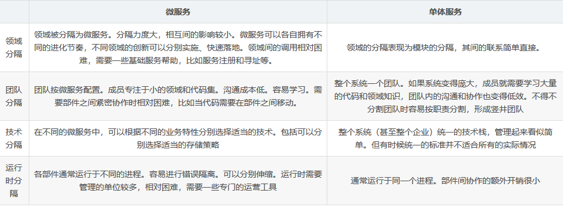

> 当然，微服务也不是万能的，相对于单体服务，微服务也是有很多缺点的：
> - 运维层面上，运维需要维护的服务更多了
> - 问题难定位，单体项目日志集中在一起，出现问题好定位，而微服务通过日志去定位问题比较困难
> - 微服务的雪崩问题，由于网络的不稳定性，不可能保证每个服务100%可用，如果某个服务发生问题，可能会导致依赖服务阻塞，最终引发雪崩效应
> - 分布式的复杂性，由于服务都独立部署，事物问题、网络延迟等问题会增大业务的复杂性
>

虽然使用微服务会遇到上面的这些问题，但是针对问题也同样产生了对应的解决方案：
> - 运维层面上可以写自启动脚本
> - 定位问题方面可以将日志文件写到一起
> - 雪崩问题可以添加服务可用性监控
> - 分布式复杂性问题，可以使用分布式事务解决事物问题 
> 虽然使用为服务会带来一些问题，但是每当遇到问题，都会产生解决方案。相对于微服务带来的好处，微服务在一些大型服务上的使用前景还是很乐观的。 
>
> 作者：Lebron_Chen  		来源：CSDN 
> 原文：https://blog.csdn.net/Leon_cx/article/details/81487547 
> 版权声明：本文为博主原创文章，转载请附上博文链接！

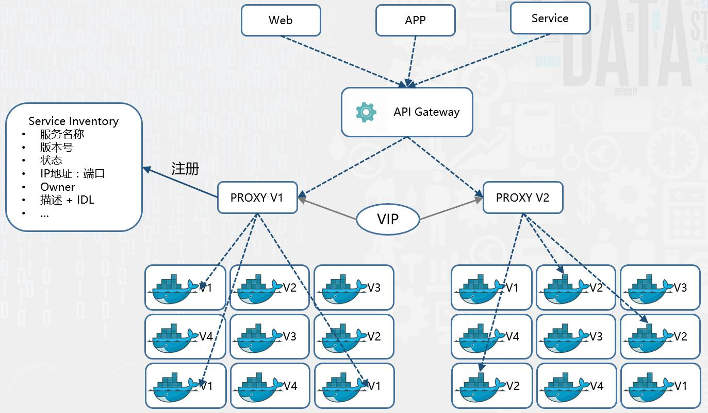

##	分治

###	分离	为了更好的相遇

## 降维 

# 变化

## 二元

### 波粒二象性

1924年，法国理论物理学家，波动力学的创始人，物质波理论的创立者，量子力学的奠基人之一的德布罗意提出了“物质波”假说，认为和光一样，一切物质都具有波粒二象性。人是物质构成的，那么人是否也具有波粒二象性呢？

> 人的一生，从很大的尺度上来讲是很短暂的。古人就曾说：天上一日，地上一年。在很大的尺度上人就是一个粒子，男人带正电荷，女人带负电荷。人的波粒二象性就是指人的生死轮回，可以理解为生为粒子、死为波。根据物质不灭，能量守恒定律，人之死其实就是从物质态转化为能量态，人之生其实就是从能量态转化为物质态。从这个意义上来讲，人的生死其实是一种假象。
>
> https://baijiahao.baidu.com/s?id=1606946805816769312&wfr=spider&for=pc

### 声带

### 进退

寸拳是中国传统武术中的一种技击方式，又称为[寸劲拳](https://baike.baidu.com/item/寸劲拳/3884919)，它讲究短距离迅速出拳打出自己的有力的一拳要爆发出自己的所有爆发力打倒敌人。即最短的距离内，爆发出最大的威力。

寸拳以本能反应为主导与潜能最大发挥为主体，至简、至灵、至威、至猛。

“寸劲拳”十分讲求内意的运用。而所谓的内意，就是隐于人的思维系统中的意念、意识，它无形、无象、无声地深藏于灵魂之中，是决定一个人行动的关键因素。

也就是说，你的每一个打击动作都脱离不开意念、意识对肢体的指挥与调动作用。例如，当你想用拳打击对手时，首先是心想，即通过心之发动而产生了打的意念和意识，而且这种意念与意识对对手来讲，是毫无觉察的。当打的念头一旦成为意志，即下了打的决心之后，则会眼、心、手结合而以意领气，以气催力，在外形肢体上形成打击的动作。在“寸劲拳”的训练与运用上，内气亦是一个十分重要的因素。气衰则劲力不充，且难以在最短的时间、最短的距离之内，爆发出巨大的杀伤力来。所以你在打击时，若能使内气贯注于攻击点上，就能够在一刹那间，由内气的急剧转动和聚集，而发出强大的震荡力与穿透力来。衡量一个内家高手内功深浅的重要标志之一，就是看他能否在最短的时间与距离内爆发出最大的劲力来。

### 盈冲

自然的法则,是损减有余来补充不足.因此虚的要胜过实的,不足的要胜过有余的.
其实后来[张三丰](https://www.baidu.com/s?wd=张三丰&tn=SE_PcZhidaonwhc_ngpagmjz&rsv_dl=gh_pc_zhidao)的太极拳就是这个原理.就是俗话说的[刚柔并济](https://www.baidu.com/s?wd=刚柔并济&tn=SE_PcZhidaonwhc_ngpagmjz&rsv_dl=gh_pc_zhidao),以柔克刚,四两拨千斤的道理.

剑道很注重“盈冲”。所谓“盈冲”，就是吸气满腹之时，丹田感到充实有力。此时若发动攻击，则力量充沛，攻势凌厉;若处于防守，则沉养自若。这在战术上也称为“实”。反之，吐尽气息时，体内即感到空虚，此时攻击无势，防守无力，是最脆弱的时刻，在战术上称为“虚”。剑道技术发挥时，要把虚实作为施展动作的依据，对手气息盈冲，则要避其锋芒，对手若虚弱，则加速打击。攻防虚实变化是无常的，但有一定的规律性，“实”之所尽则变“虚”，“虚”之所尽则移“实”。此外还有表面为实，内在为虚，以及表面为虚，内在为实等等。只有及时识别个中虚实，才能正确地避实击虚，一举致胜。识别虚实，以气息是否盈冲为主要方法，故此在剑道训练中，常把调息和识别虚实联系起来，作为一个主要的目标进行训练。

##	选择

先后，

##	面向结构 对象 服务

类的成员包括：字段，属性，方法

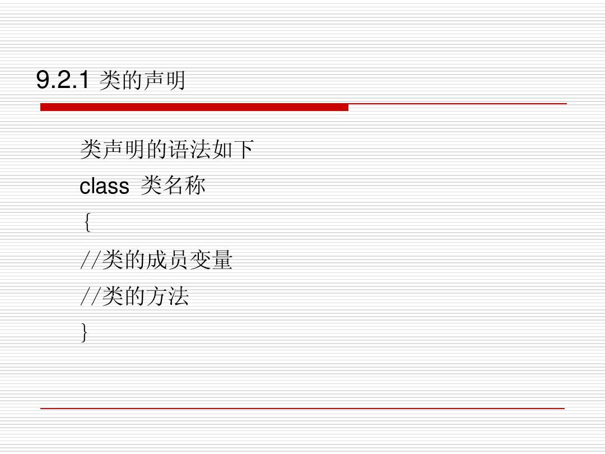

字段	类 的变量，

属性	则是对字段的封装，它使用get和set访问器来控制如何设置或返回字段值。

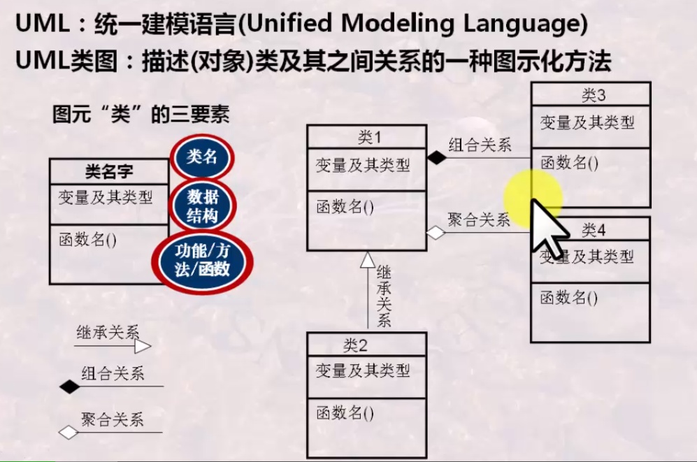

##	意识	存在

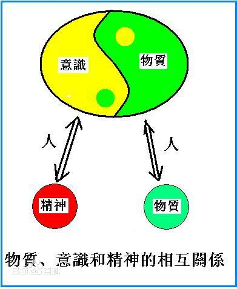

# 	工程师

##	面向变化

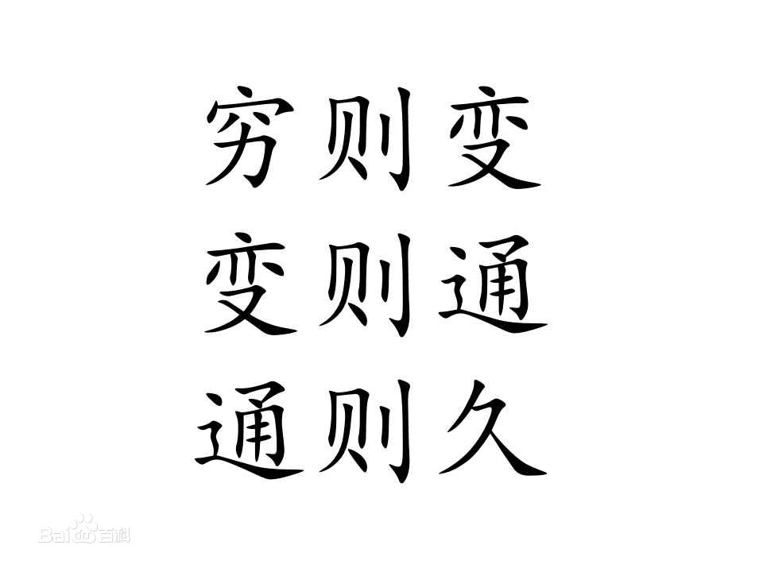

【出处】《[周易](https://baike.baidu.com/item/周易/6219)·系辞下》

【释义】事物发展到了极点，就要发生变化，发生变化，才会使事物的发展不受阻塞，事物才能不断的发展。 说明在面临不断发展的局面时，必须要改变现状，进行变革和革命。

## 分析决策

###	决策树

###	数据支持

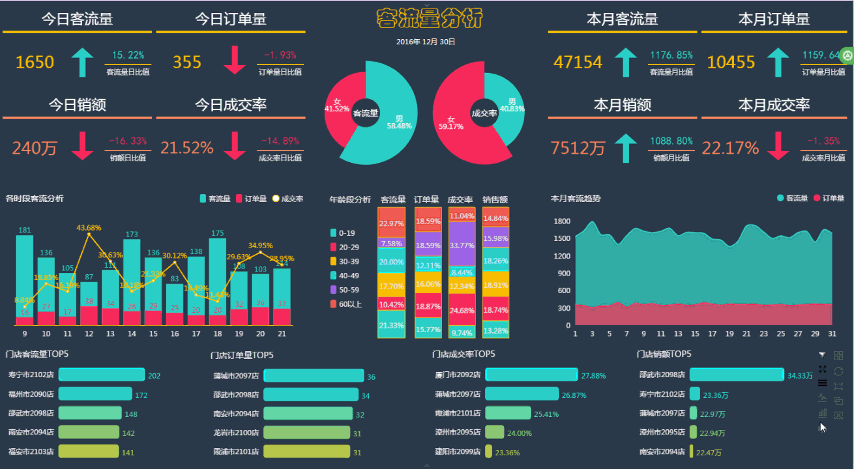	

世界观	方法论

 

###	复杂度

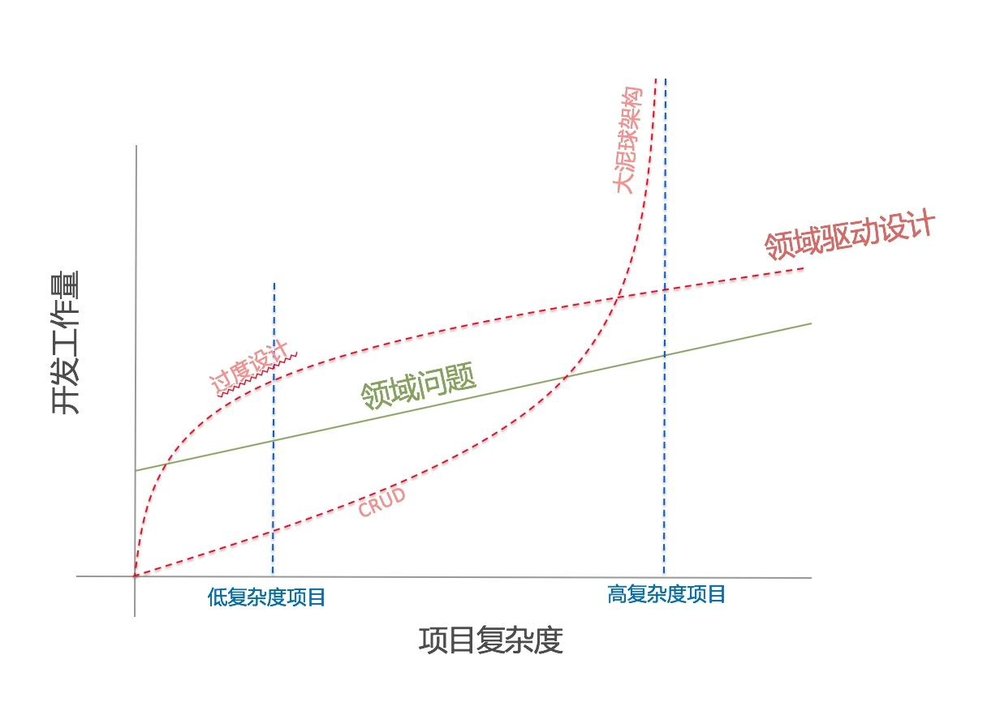

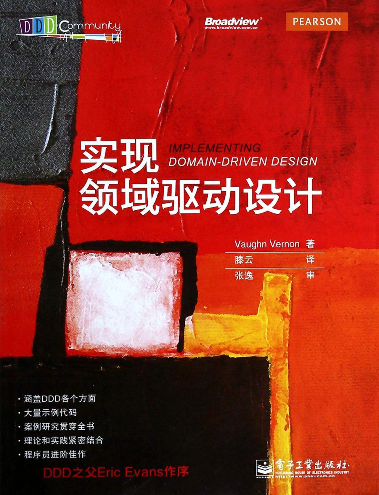

###	终结者

##	轮转

###	历史进步

###	重复

###	螺旋上升

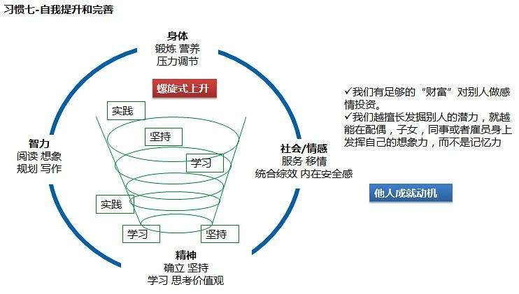

##	 https://github.com/PowerDG/DgBook.architect-awesome

## END