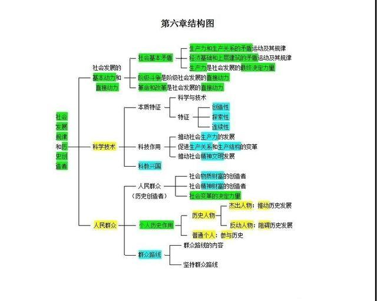

                                           

####                      [考研分享汇](https://mp.sohu.com/profile?xpt=ODE1NDI1MzEyQHFxLmNvbQ==&_f=index_pagemp_1&spm=smpc.content.author.2.1562772957760hUB1ljs)             

​                                                                                                                       

#     2018考研政治马哲理论结构图 条理清晰备考省力

​         2017-08-12 19:12                       

马原是考研政治五个部分中相对比较难的一部分，说马原难是因为它更加需要理解和思考，在此基础上才能真正掌握它。通过研究历年考研政治真题，我们也会发现真题注重考查学生对马原的理解和运用能力，不理解何谈运用，只是记下来做题时都不知道该用哪个知识点。所以考研分享汇特地把对教材、考试大纲的理解以图表知识结构的形式与同学们分享，我们整理了2018年考研政治马克思哲学理论结构图，相信能对同学们在理清考研政治马原部分的知识逻辑结构和理解记忆上提供帮助。http://www.sohu.com/a/164098641_615592

马克思哲学理论结构图——整体结构图

# 2018考研政治复习：马哲知识结构总结（一）

http://www.sohu.com/a/142815368_758830

https://jz.docin.com/p-1637364016.html

https://max.book118.com/html/2017/0611/113834921.shtm

