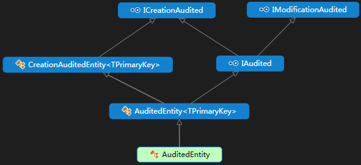
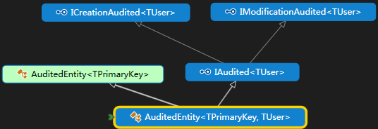

#	[ABP源码分析十四：Entity的设计](https://www.cnblogs.com/1zhk/p/5329393.html)

https://www.cnblogs.com/1zhk/p/5329393.html

IEntity<TPrimaryKey>: 封装了PrimaryKey：Id,这是一个泛型类型

IEntity: 封装了PrimaryKey：Id,这是一个int类型

Entity<TPrimaryKey> ：支持主键是泛型类型的Entity

Entity：支持主键是int类型的Entity

 

IHasCreationTime: 封装了CreationTime

ICreationAudited： 封装了CreatorUserId，这个是long类型

CreationAuditedEntity<TPrimaryKey> : 支持主键是泛型类型的Entity,并且封装了CreationTime 和 CreatorUserId

CreationAuditedEntity： 只支持主键是int类型的Entity,并且封装了CreationTime 和 CreatorUserId

ICreationAudited<TUser> :封装了泛型类型的creator

CreationAuditedEntity<TPrimaryKey, TUser> ：  支持主键是泛型类型，并且封装了泛型类型的creator的Entity

 

ISoftDelete：封装了软删除的标志IsDeleted

IHasDeletionTime：封装了DeletionTime

IDeletionAudited：封装了DeleterUserId，这个是long类型

IDeletionAudited： 封装了泛型类型的DeleterUser

 

 

IHasModificationTime：封装了LastModificationTime

IModificationAudited： 封装了LastModifierUserId，这个是long类型

IModificationAudited<TUser> ：  封装了泛型类型的LastModifierUser

 

 

IAudited：从其父类接口那继承了Creation 和 Modification 的时间和UserID，这个是long类型

AuditedEntity<TPrimaryKey> ：支持主键是泛型类型的Entity,并且从其父类接口那继承了Creation 和 Modification 的时间和UserID，这个是long类型

AuditedEntity： 与AuditedEntity<TPrimaryKey>的区别就是其只支持主键是int类型的Entity。

 

 

AuditedEntity<TPrimaryKey, TUser> ：与AuditedEntity<TPrimaryKey>的区别就是其支持泛型类型的LastModifierUser和CreatorUser。

 

 

IAudited：从其父类接口那继承了Creation，Modification和delete 的时间和UserID，这个是long类型

FullAuditedEntity<TPrimaryKey> ：支持主键是泛型类型的Entity,并且从其父类接口那继承了Creation，Modification和delete 的时间和UserID，这个是long类型

FullAuditedEntity：与FullAuditedEntity<TPrimaryKey>的区别就是其只支持主键是int类型的Entity

 

 

FullAuditedEntity<TPrimaryKey, TUser> ：与FullAuditedEntity<TPrimaryKey>的区别就是其支持泛型类型的LastModifierUser,CreatorUser 和 deleteuser。

 

以下是最终的类层次结构。

 

返回[ABP源码分析系列文章目录](http://www.cnblogs.com/1zhk/p/5268054.html)

分类: [ABP](https://www.cnblogs.com/1zhk/category/798531.html)

标签: [ABP](https://www.cnblogs.com/1zhk/tag/ABP/)