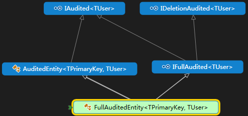
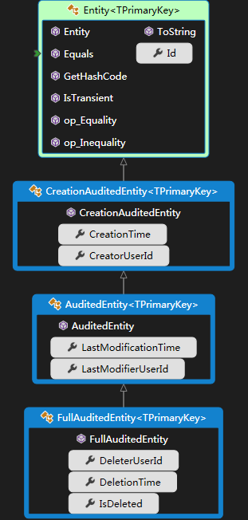

###  IEntity 接口

事实上 Entity 实现了 IEntity 接口（Entity<TPrimaryKey> 实现了 IEntity<TPrimaryKey>接口）。如果你不想从 Entity 类派生，你能直接的实现这些接口。 其他实体类也可以实现相应的接口。但是不建议你用这种方式。除非你有一个很好的理由不从 Entity 类派生。


### 接口约定


在定义实体类时，还可以为实体类添加以下常用接口用来实现一些常用功能：


|                  | 接口名               |                                                              | 继承了                                                 |        |      |
| ---------------- | -------------------- | ------------------------------------------------------------ | ------------------------------------------------------ | ------ | ---- |
| Creation         |                      |                                                              |                                                        |        |      |
|                  | IHasCreationTime     | CreationTime                                                 |                                                        |        |      |
|                  | ICreationAudited     | CreationTime，CreatorUserId                                  | IHasCreationTime                                       |        |      |
| Modification     |                      |                                                              |                                                        |        |      |
|                  | IHasModificationTime | LastModificationTime                                         |                                                        |        |      |
|                  | IModificationAudited | LastModificationTime，LastModifierUserId                     | IHasModificationTime                                   |        |      |
| Delete           | (软)删除场景下       | 逻辑删除(Soft delete)                                        |                                                        |        |      |
|                  | ISoftDelete          | IsDeleted                                                    |                                                        |        |      |
|                  | IHasDeletionTime     | IsDeleted,DeletionTime                                       | ISoftDelete                                            |        |      |
|                  | IDeletionAudited     | IsDeleted,     DeletionTime,DeleterUserId                    | IHasDeletionTime                                       |        |      |
| IAudited         | IAudited             | CreationTime，CreatorUserId    LastModificationTime，LastModifierUserId | ICreationAudited和IModificationAudited                 | 非软删 |      |
| IFullAudited     | IFullAudited         | CreationTime，CreatorUserId    LastModificationTime，LastModifierUserId ;     IsDeleted, DeletionTime,DeleterUserId | IAudited和IDeletionAudited的合体，主要用于软删除的情景 | 软删   |      |
|                  |                      |                                                              |                                                        |        |      |
| Tenant           | 多租户判别           |                                                              |                                                        |        |      |
|                  | IMayHaveTenant       | TenantId                                                     | 该属性允许值为null，也就是可以指定租户                 |        |      |
|                  | IMustHaveTenant      |                                                              | 必须指定租户                                           |        |      |
| Active/Passive   | 激活状态/闲置状态    |                                                              |                                                        |        |      |
|                  | IPassivable          | IsActive                                                     | 判断实体是否处于活跃状态                               |        |      |
| ExtendableObject | 扩展K-V数据          | 用来存储 **JSON** 的 **name-value** 对象                     |                                                        |        |      |
|                  | IExtendableObject    | **ExtensionData**                                            |                                                        |        |      |
|                  |                      |                                                              |                                                        |        |      |

FullAuditedEntity<TPrimaryKey, TUser> ：与FullAuditedEntity<TPrimaryKey>的区别就是其支持泛型类型的LastModifierUser,CreatorUser 和 deleteuser。


# [ABP源码分析十四：Entity的设计](https://www.cnblogs.com/1zhk/p/5329393.html)


  




```
IHasCreationTime：为实体添加CreationTime属性，用来记录实体的创建时间
IHasDeletionTime：为实体添加DeletionTime属性，用来记录实体的删除时间，这个只有在使用软删除的时候才有效。如果不是使用软删除，记录都删除了，这个字段没有任何意义。
IHasModificationTime：为实体添加LastModificationTime属性，用来记录实体的最后修改时间

ICreationAudited ：在IHasCreationTime的基础上添加CreatorUserId属性，用来记录创建实体的用户的Id
IDeletionAudited：在IHasDeletionTime的基础上添加DeleterUserId属性，用来记录删除实体的用户的Id
IModificationAudited：在IHasModificationTime的基础上添加LastModifierUserId属性，用来记录最后修改实体的用户的Id

IAudited：ICreationAudited和IModificationAudited的合体，主要用于非软删除的情景
IFullAudited：IAudited和IDeletionAudited的合体，主要用于软删除的情景
ISoftDelete：为实体添加IsDeleted属性，用于判断实体是否已经被删除，主要用于软删除的情景

IPassivable：为实体添加IsActive属性，用于判断实体是否处于活跃状态
IMayHaveTenant：为实体添加TenantId属性，用于指定实体所属的租户。该属性允许值为null，也就是可以指定租户，也可以不指定
IMustHaveTenant：该接口与IMayHaveTenant接口的主要区别是，必须指定租户
IExtendableObject：为实体添加ExtensionData属性，用于存储JSON格式的数据。在实体中可通过SetData方法来设置存储的数据，通过GetData来获取存储的数据
```

------

作者：上将军 
来源：CSDN 
原文：https://blog.csdn.net/tianxiaode/article/details/78880387 