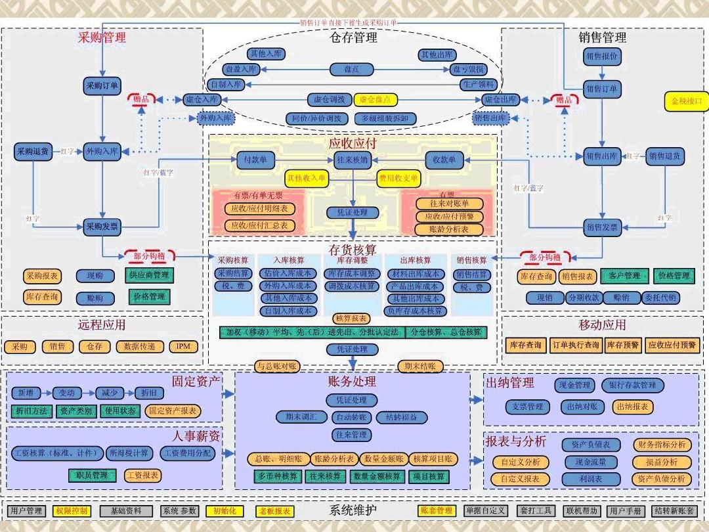
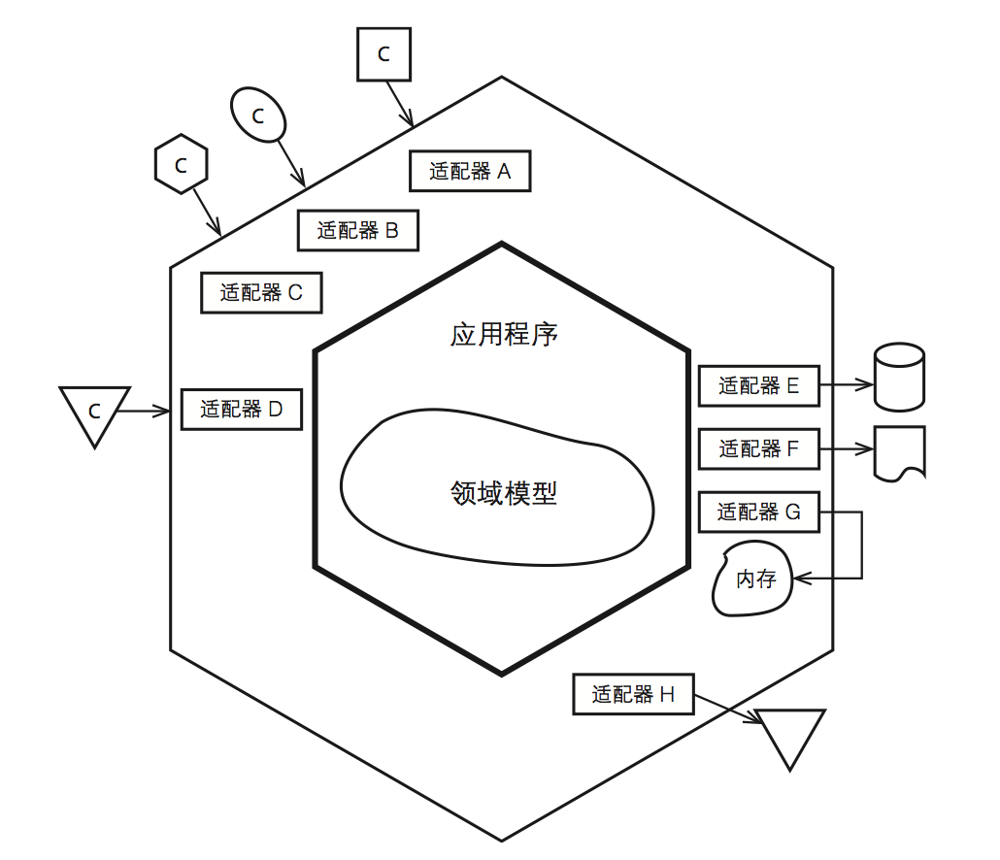

#	DDD领域驱动设计	&&	ABP框架

##	生物与编程

###	细胞生物

OO-

代码块

代码块-组价-模块-系统

消息-通信-神经反馈

动植物

人类社会

## 领域原型/数据模型

##### [型与模型的视图](https://www.jdon.com/51189)

旧型C/S结构带来最大问题是：非常难于维护，修改起来，迁一动百。

数据库已经从过去的中心位置降为一种纯技术实现，数据库只是状态持久化的一种手段

OOL不再做SQL的运输工，不再是跑龙套的了，而是主角，那么如何让Java成为主角呢？那必须依赖[对象](http://www.jdon.com/query/searchThreadAction.shtml?query=面向对象&useGBK=on)这个概念，对象是生活在中间件服务器内存中，它又是数据库数据的业务封装，它和数据库有着
千丝万缕的关系，但是它又和[关系数据库存在天然矛盾](http://www.jdon.com/query/searchThreadAction.shtml?query=阻抗&useGBK=on)，两者水火不容。

尽早抛弃过去的两种影响：过程语言编程习惯和以数据库为中心的设计习惯，从全新的面向[对象](http://www.jdon.com/query/searchThreadAction.shtml?query=面向对象&useGBK=on)角度

> ### 数据库时代的[终结](https://www.jdon.com/artichect/dbover.htm)

###	四色原型分析

四色原型分析模式

领域建模，也就是在UML中画出类图，然后标记上类图四种关系（关联、依赖、继承和实现

这个类图是怎么出来的？为什么选用关联而不是依赖，这些实际都属于分析领域的知识，而[四色图](https://www.jdon.com/mda/archetypes.html)可以说为我们这种分析提炼提供了一种模板或分析框架，这样我们可以按图索骥去分析每个陌生的系统，我们拥有强大的分析方法工具。

#####	术语解释

|      | **moment-interval**                                          | **role archetype**                                           | **party, place, or thing archetype**                         | **description archetype**                                    |
| ---- | ------------------------------------------------------------ | ------------------------------------------------------------ | ------------------------------------------------------------ | ------------------------------------------------------------ |
| 颜色 | 粉红                                                         | 黄色                                                         | 绿色                                                         | 蓝色                                                         |
|      | 行为                                                         | 角色                                                         | 主语                                                         | 成员描述                                                     |
| 解释 | **时刻-时间段原型**                                          | **角色原型**                                                 | **参与方-地点-物品原型**                                     | **描述原型**                                                 |
|      | 重要在于时间概念上：某个时刻(moment)或一段很短时间(interval)内.意味在**某个时刻发生的事情**因为业务要求或合法性原因需要跟踪；或者过一段时间以后，应该是很短的时间，可以帮助我们寻找到它。 | 任何一个系统都需要人或某个组织介入运行，某个角色被**授权**登录后，与此角色相关的业务特点就应用在他身上。 | Party表示有自己正常的状态并且能够自主控制自己的一些行为，通常情况下，人或组织是一种Party，但象护照，身份证等**注册性标志**等都可以作为Party。**【实体】** | 在设计模式这个实现级别，我们通常使用[组合模式](http://www.jdon.com/designpatterns/composite.htm)来实现种类原型。 |
|      |                                                              |                                                              |                                                              |                                                              |

四色原型好像是这样一个场景抽象：某人参与某活动对某事情操作，基本上我们人类的所有活动都可以用这段抽象来表达，这说明四色原型帮助我们更快地分析分辨事物。

数据库建模不能完全反应系统的全部特性和需求，使用同样一套数据库，完全由两套优差不同的设计方案和代码

　过去，我们是将业务逻辑写成SQL送往数据库执行，导致数据库成为业务逻辑主要运行瓶颈，那么，如果我们将
业务逻辑用对象概念表达，而不是SQL，那么我们的业务逻辑就围绕内存中的对象反复计算，这样，负载不是集中在
对象运行的中间件服务器上而对象/中间件都是用OOL语言表达的，无疑，这样的架构，OOL才成为主角。

类图其实是动态的，是一种隐形动态，使用[四色图表达的类图则是一种包含顺序图的完全动态图](https://www.jdon.com/mda/archetypes2.html)，可以说类图是立体多维的，而数据库模型图则是完全静态的。                  

可以将一个复杂的系统划分成一块一块，从而有助于设计实现，当我们一个系统有好几百个类图时，如果不采取四色原型进行归类，那么无疑很混乱，甚至类图提取不正确，概念重复，甚至只有在系统代码实现时才会发现如此严重问题，这对于分析设计来说无疑时重大打击。

### 独立于领域的组件

**Domain-Neutral Component(DNC)**

　　一个业务系统是由多个四色图反复拼装而成，我们称为这种现象是**Domain-Neutral Component**模式

#####	[一个普通电商系统的商品中心的领域模型图](https://www.cnblogs.com/netfocus/p/5548025.html)

#####	进化的究极体—-big ball of mud

当产品的复杂度不断增加，而我们有没有去控制控制这种复杂的话，我们的系统会成为ddd中称作big ball of mud（大泥球）的东西。

##	DDD领域驱动设计

###	[领域模型概念](https://www.jdon.com/ddd.html)

> 统一了分析和设计编程，使得软件能够更灵活快速跟随需求变化。见下面DDD与传统CRUD或过程脚本或者面向数据表等在开发效率上比较：

### [架构对比](https://www.jdon.com/46117)

#####	mvc

 

#####	**[传统分层架构](https://www.cnblogs.com/wangiqngpei557/p/3163985.html)**

#####	[Clean架构](http://blog.8thlight.com/uncle-bob/2012/08/13/the-clean-architecture.html)

 

######	清晰架构Clean Architecture，
又称干净架构、清晰架构、整洁架构、清洁架构，是著名软件工程大师Robert C Martin提出的一种[架构整洁之道](https://www.jdon.com/artichect/the-clean-architecture.html)。

 

##### 	Trinity Architecture

> 这里提出的Trinity Architecture是后端企业应用程序的架构模式。它源于采用依赖性倒置原理（DIP）的典型4层架构。它非常适合（但不限于）领域驱动设计（DDD）应用程序。

Trinity强调[平衡不受控制的灵活性和一致性](https://www.jdon.com/52191)。它提供了八个顶级模块的具体实施指南。 

 

#####	【单体】DDD

[领域驱动设计的经典分层架构](https://www.cnblogs.com/netfocus/archive/2011/10/10/2204949.html)

######	[领域驱动架构与N层架构设计](https://www.cnblogs.com/jevo/p/3408522.html)

   Eric  Evans的“领域驱动设计- 应对软件的复杂性“一书中描述和解释了建议的N层架构高层次的图：

######	**[DDD充血型架构](https://www.cnblogs.com/wangiqngpei557/p/3163985.html)**

##### [六边形架构](http://alistair.cockburn.us/Hexagonal+architecture)

 

###### 综合六边形

>  我们可能还想区分“内部”和“外部”层之间的交互，其中内部我指的是两个层完全在我们的系统（或BC）内的交互，而外部交互跨越BC。

（例如，RESTful用于开放主机交互，或来自ESB适配器的调用用于已发布的语言交互）命中外部客户端端口。对于后端基础架构层，我们可以看到用于替代对象存储实现的持久性端口，此外，领域层中的对象可以通过[外部服务端口调用其他BC](https://www.jdon.com/51189)。 

#####	[适配DDD的六边形架构](https://www.cnblogs.com/Leo_wl/p/3866629.html)

### 	CQRS读写分离

#####	CQRS分离了读写职责
使用[CQRS分离了读写职责]()之后，可以对数据进行读写分离操作来改进性能，可扩展性和安全。如下图：

[

#####	[CQRS的简单实现](https://www.cnblogs.com/yangecnu/p/Introduction-CQRS.html)

](https://images0.cnblogs.com/blog/94031/201408/261851421105570.png)

###	DDD框架

我们有了[Vaughn Vernon](http://vaughnvernon.co/)的[《实现领域驱动设计》](http://book.douban.com/subject/25844633/)

#####	 领域层：	[DataContext <- Entity <-RootEntity <- Repository]()

完全可以不参考UI设计，不参考原型设计，只按照需求说明书设计领域结构，设计完成之后的领域模型居然很神奇的符合UI和原型的需求。这样的开发流程似乎也很符合TDD的理念，接口先行、之后是测试、再后来是功能、最后才是UI。

 DDD应对软件设计的复杂性不是作弊,。它将专注于问题域。然而,DDD却是很容易被做错，从而带来显著的成本。普遍认为,虽然可以使用DDD带来明显的好处,但是却难以解释为什么需要实现这些好处。事实是，在过去的十年中,许多项目使用DDD有许多成功与失败。那些最终成功仍然经历了相当多的困难。为什么?我的理解是,对DDD有一些误解，最重要的是,DDD往往减少到仅仅是建设项目中的一个领域模型。但也有一些其他的误解,比如将领域模型看成需要包含所有可能的行动，还有，将领域模型的构件(如通用语言)作为直接实现细节(抽象和具象不分)。

DDD的起点是它为设计服务的，然后才可能为落地实现细节的目的服务。所以,事实上,实现细节在哪里?

[DDD有助于发现高层架构，发现软件需要复制的领域中的机制和动态](https://www.jdon.com/46744)。具体地说，它意味着一个好DDD分析会最小化减轻领域专家和软件架构师之间的误解，并且减少了后续昂贵的需求变化的数量。

理解领域模型如何准确地映射到编程实现是至关重要的，这一步往往决定了项目的成败。

### UOW单元工作

【[阳光铭睿](https://home.cnblogs.com/u/mienreal/) 】[Fami中，我选择了.NET技术平台](https://www.cnblogs.com/mienreal/p/4358806.html)

###	[领域驱动设计过程中使用的模式](https://www.cnblogs.com/netfocus/archive/2011/10/10/2204949.html)

##### 全图

##### [战略战术划分](http://mini.eastday.com/mobile/180317004319284.html)

#####	简图--**战术模式**

#####	

#####	简图--**战略模式**

 

#####  AutoMapper

[通过一张图来表达就是这样的效果：](https://www.cnblogs.com/farb/p/4981387.html)

###	领域驱动的【核心-领域】

##### 系统领域-模块化【酒店模型】

##### 系统领域-模块化【电商模型】

##### 抽象领域模型

 

##### ERP周边

#####	清晰子域

##### ER领域模型

#####	上下文管理【*Conntext*】 

IRepositoryDb **Conntext**

##### 敏捷项目 上下文管理

##### 分离领域

##	ABP框架

> ABP 官方的介绍是：ASP.NET Boilerplate 是一个用最佳实践和流行技术开发现代 WEB 应用程序的新起点，它旨在成为一个通用的
> WEB 应用程序基础框架和项目模板。基于 DDD 的经典分层架构思想，实现了众多 DDD 的概念（但没有实现所有 DDD 的概念）。

从技术投资层面，你可以学习到新的思维模式和了解.net core 和目前世界上最流行的技术体系和架构，他们有不少的内容都在 ABP 中进行了落地。

从看看自己瓶颈的角度上，目前 ABP 已经是一个较为完整的生态，我们在国内看到一些公司招聘的时候，已经有提到有了解或者 ABP 框架的优先，说明了 ABP 在国内已经有很多公司在进行使用了。而学会使用 ABP 框架后，你会忍不住的去用前端的东西，很容易把自己培养为全栈开发，在前端配合 Angular 开发，基本上没有太多的难度。

> ABP 的官方网站：<http://www.aspnetboilerplate.com> 
>
> ABP 在 Github 上的开源项目：<https://github.com/aspnetboilerplate> 
>
> 52ABP 的官方网站：<https://www.52abp.com> 
>
> 52ABP 在 Github 上的开源项目：<https://github.com/52abp>
>
> 作者：角落的白板笔
>
> 链接：https://www.jianshu.com/p/10a44fae07fc

##### 

##### 组织-人员-角色-权限

###### [ASP.NET Identity 使用 RoleManager](https://www.cnblogs.com/lyosaki88/p/3497478.html)

##### 组织单元

### DDD模型

###### 传统DDD

##### 支持API的六边形

### 聚合

****

### 界面

### 应用-调用领域

##### 微服务 -分而必合

### DDD模型

###### 传统DDD

### DDD 汉堡--Me

##### 理念

###### 仓储

###### Dto

###### AutoMapper

### ABP--现有机制

###### 现成的机制

##### 其他

##### 登录日志

##### 多国语

##### 审计日志

##### 理念

### 生产力

###	DDD--设计微服务的最佳实践 
> [《为什么DDD是设计微服务的最佳实践》](https://www.jianshu.com/p/e1b32a5ee91c) 
> [《当DDD遇上微服务 》](http://www.sohu.com/a/212007407_609518)        
> 《不用DDD?那你的微服务可能都做错了!》    
> 《不要把微服务做成小单体》
##### 支持SOA的六边形

##### CQRS

##### 事件驱动六边形

#####	为什么是六边形

力量在起作用 ︰ 蜜蜂似乎已经进化出使用分泌的软蜡去构筑完美六角形巢室的能力。然而，一些研究人员认为，软蜡表面的均匀张力促使其收缩为面积最小的形状，就像泡筏上面裂变出的气泡。Grafissimo / Getty

那么，为什么又是六边形呢，这是一个简单的几何问题。如果你想要把大小形状完全相同的单元摊平在一个平面内，只有三种常见形状可行（等边等角）︰  等边三角形、  方形和六角形。其中，与正方形和三角形相比，六角形对边长的要求最低。由此，在面积相同的情况下，六边形比三角形或正方形的总边长都小。所以，蜜蜂会选择六边形是有道理的，因为这种形状具有力学上的合理性和材料的节省原理—  —就像建筑工人会控制砖的用量以节省成本。这个事实在 18 世纪时被发现，达尔文称六边形的蜂巢「最大限度地节省了劳力和蜂蜡的使用。」

----

达尔文认为自然选择赋予了蜜蜂泌蜡筑巢的天赋，并且六边形比其他形状更加省时省力。然而，即使蜜蜂在处理蜂房角度和巢壁厚度时看似有些特殊能力，但人们对蜜蜂到底是否有意的在使用这些能力却莫衷一是。毕竟，制作六角形阵列的巢室本来也是大自然会插手的事儿。

六角泡泡：肥皂泡层主要包括六角型气泡，尽管并不都是完美的六角形。也有一些五角或七角的气泡。尽管如此，所有气泡的边线交点都分出三条边，每两条边的夹角都接近 120 度。Shebeko / Shutterstock

如果你在水面上吹一层气泡——即所谓的泡筏——这些气泡会变成六边形，或者近乎六边形。你永远不会找到四边形的泡筏，如果四面气泡壁碰到一起，它们会立即重新排列成三面的连接，夹角近乎120度，就像奔驰标志的中心那样。

----

因为雪花的基本组织是冰胚，每一个冰胚是由5个水分子组成。其中4个水分子分别在1个四面体的顶角上，另有1个水分子位于四面体中心。许多冰胚互相连接，就组成了冰晶，许多冰晶结合，就形成了雪花。因此雪花之所以呈六角形，是与一些水分子怎样结合成为冰胚，以及冰胚怎样结合成冰晶等有关。

如果冰胚平排地结合，不单可以使我们看出最初的六边形结晶，而且还可以看出由于水分子一个一个结合上去，新的六边形结晶是怎样从原有六边形雪花中增长起来的。

光是六边形的结合，并不一定能组成很对称的六边形雪花。根据研究，雪花在空中飘浮时本身还会振动，这种振动，是环绕对称点而进行的。这样，就保证了在增长过程中的雪花，始终保持六边形。至于六边形的千姿百态，则与雪花在空中飘浮时，空中的温度和湿度条件不同有关。

---

正六边形蜂巢，密合度最高、所需材料最少、可使用的空间最大。

科学家们研究发现，如果蜂巢呈圆形或八角形，会出现空陈，如果是三角形或四角形，面积会减小，而这种可容纳高达上万只蜜蜂居住的正六边形蜂巢，密合度最高、所需材料最少、可使用的空间最大。蜂巢的构造非常精巧，由无数个大小相同的正六边形房孔组成，每个房孔都被其他房孔包围，两个房孔之间隔一堵蜡制的墙。

房孔的底既不是平的，也不是圆的，而是尖的，由三个完全相同的菱形组成。有人测量过菱形的角度，两个钝角都是110度而两个锐角都是70度。世界上所有的蜂巢都是按照这个统一的角度和模式建造的。

六角形是**最坚固**的形状，而且建造起来**最省时省力**。和四角形还有三角形相比，六角形更加稳固，能够让蜂巢**不会轻易坍塌**，而且还能**节省空间**。

#####	微服务设计

##### 领域事件调度

##	微服务

### 蜂巢

##### 初

##### 中

##### 最终

