#                   [领域驱动设计学习之路—DDD的原则与实践](https://www.cnblogs.com/edisonchou/p/edc_ddd_foundation_study_part1.html)

本文是我学习Scott Millett & Nick Tune编著的《领域驱动设计模式、原理与实践》一书的学习笔记，一共会分为4个部分如下，此文为第1部分：

> ① 领域驱动设计的原则与实践
>
> ② 战略模式：在有界上下文之间通信
>
> ③ 战术模式：创建有效的领域模型
>
> ④ 有效应用程序的设计模式

# 一、什么是领域驱动设计

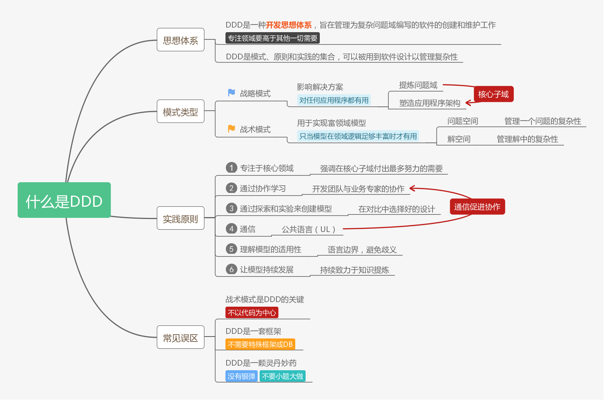

　　脑图浏览：<https://www.processon.com/view/5cb49b14e4b0a13c9de1042d#map>

　　这一章主要介绍了DDD是什么，强调DDD是一种开发思想体系，**它是模式（战略模式、战术模式）、原则和实践的集合**，可以被应用到软件设计中以**管理复杂性**。

　　DDD并非一种模式语言，它是专注于交付的一种协作思想体系，其中**通信起核心作用**，而要高效通信，就需要使用公共语言。

　　DDD会将侧重点放在以下几个方面：

- 核心领域
- 协作
- 与领域专家探讨
- 实验研究以生成更有用的模型
- 对各种上下文的理解

　　更为重要的是，不要认为DDD是一套框架，DDD也不是银弹或灵丹妙药，不可在项目中小题大做！

　　下图展示了一个演进的领域驱动设计过程：

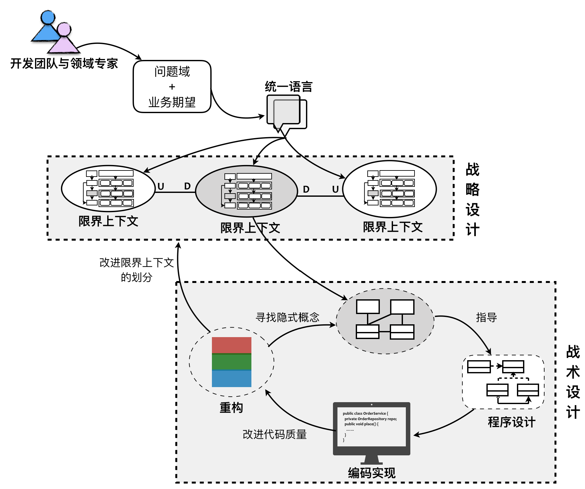

*From：张逸《领域驱动战略设计实践》课程*

　　这里摘抄一段张逸老师在《领域驱动战略设计实践》课程中的话：

　　面对客户的业务需求，由领域专家与开发团队展开充分的交流，经过需求分析与知识提炼，以获得清晰的问题域。通过对问题域进行分析和建模，识别限界上下文，利用它划分相对独立的领域，再通过上下文映射建立它们之间的关系，辅以分层架构与六边形架构划分系统的逻辑边界与物理边界，界定领域与技术之间的界限。之后，进入战术设计阶段，深入到限界上下文内对领域进行建模，并以领域模型指导程序设计与编码实现。若在实现过程中，发现领域模型存在重复、错位或缺失时，再进而对已有模型进行重构，甚至重新划分限界上下文。

　　两个不同阶段的设计目标是保持一致的，它们是一个连贯的过程，彼此之间又相互指导与规范，并最终保证一个有效的领域模型和一个富有表达力的实现同时演进。

# 二、提炼问题域

　　脑图地址：<https://www.processon.com/view/5cb5e474e4b0841b84327187#map>

　　这一章主要介绍了什么是知识提炼，知识提炼是一个持续协作达成共识以创建有用模型的过程，而如何实践好这个过程，介绍了一些最佳实践：比如专注于最有意思的对话、从用例开始、提出有力的问题等等。

　　而对于不需要构建新模型的人来说，研究现有模型也是有技巧的，个人感触最深的就是要**真正理解意图**，也就是不要盲从于客户的需求，因为这个需求很可能并不能真正地解决问题和创造价值，往往需要更深层次地理解隐含的愿景并且能够认识到业务到底试图达到什么。影响地图和业务模型是两个经典的实践方法，书中的例子在线运动装备运营商的业务模型图也比较经典。

# 三、专注于核心领域

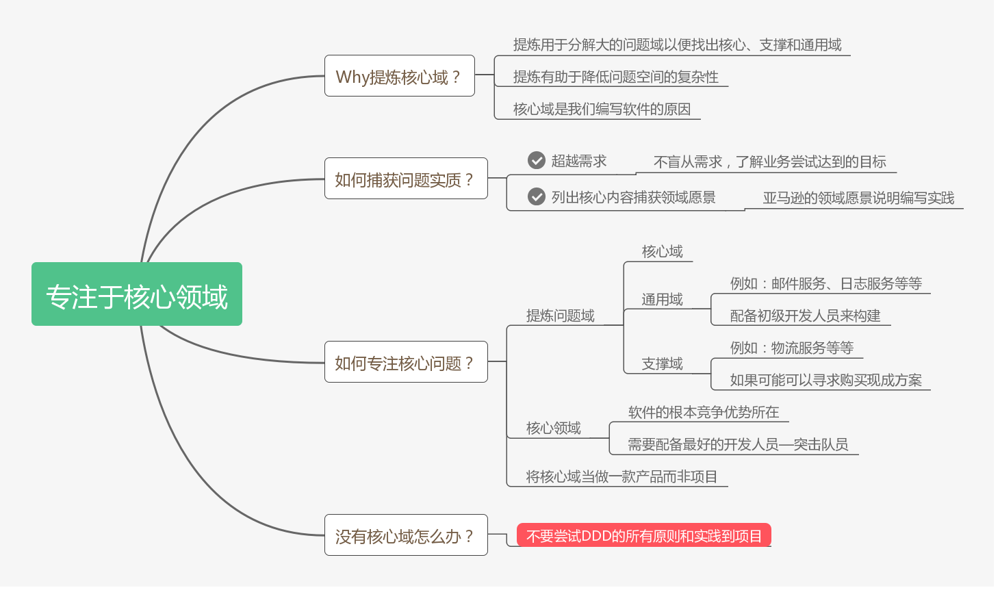

　　脑图浏览地址：<https://www.processon.com/view/5cba8957e4b059e20a0068c8#map>

　　这一章主要介绍了核心领域，在一个大的问题空间中会同时存在很多的小问题域，而这些小问题域往往只有少部分是核心领域，其他的可能都是通用域和支撑域。核心域是我们软件的根本竞争力所在，因此也可以说是我们编写软件的原因。拿一个在线拍卖网站来说，可以见下图所示划分了核心域、支撑域和通用域：

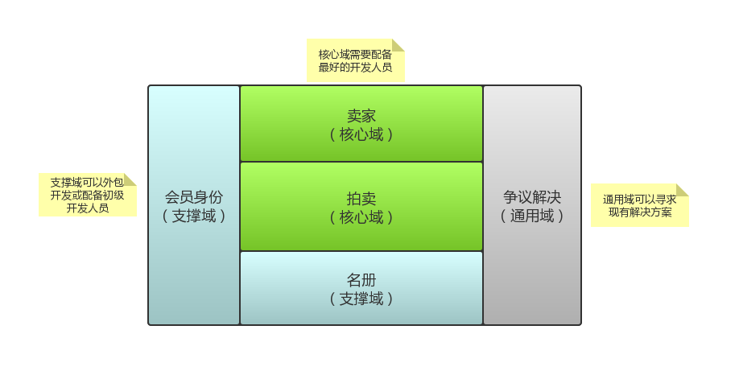

　　对于核心域，我们需要配备最好的开发人员专注于此。对于支撑域，我们可以外包开发或者配备初级开发人员，但是要确保支撑域中的模型足够好。而对于通用域，如果可以，我们可以寻求购买现成解决方案。

# 四、模型驱动设计

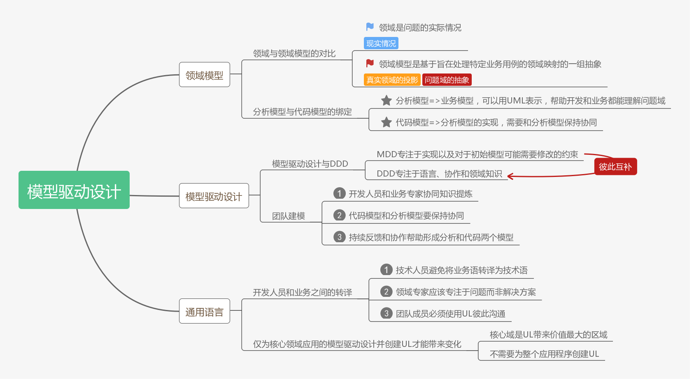

　　脑图浏览地址：<https://www.processon.com/view/5cbaa844e4b01941c8b441d2>

　　这一章主要介绍了模型驱动设计和通用语言的重要性，模型驱动设计是将分析模型（业务模型）绑定到代码实现模型并确保这两个模型保持协同并可用的过程。

　　模型驱动设计专注于实现以及对于初始模型可能需要修改的约束，领域驱动设计则专注于语言、协作和领域知识，他们是一个彼此互补的关系。而要实现协作，就需要使用通用语言，借助通用语言可以将分析模型和代码模型绑定在一起，并最终实现团队建模。实践UL是一个持续的过程，多个迭代后会不断对UL进行验证和改进，以便实现更好的协作。

　　由于时间和精力都有限，只有仅仅为核心域应用模型驱动设计和创建UL才能带来最大的价值，而不需要将这些实践应用到整个应用程序之中。

# 五、领域模型实现模式

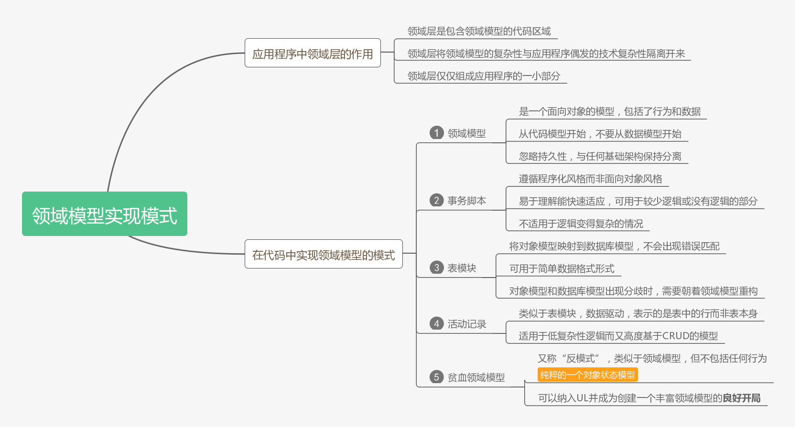

　　脑图浏览地址：<https://www.processon.com/view/5cbab6c5e4b06bcc13844497>

　　这一章主要介绍了领域层的概念及作用，下图展示领域层在在整个应用程序代码中的位置，领域层的最大作用就在于隔离领域模型的复杂性和应用程序的技术复杂性。

　　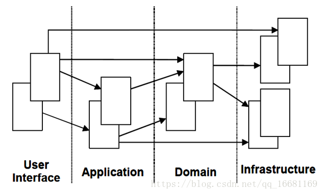

　　在领域建模时可以遵循的设计模式，Martin Fowler在《企业应用架构模式》一书中提出了以下几种：

- 领域模型模式：适用于复杂问题域，领域中的概念被封装为数据和行为的对象
- 事务脚本模式：组织所有的领域逻辑来满足业务事务或用例
- 表模块模式：代表着以对象形式建模的数据，数据驱动
- 活动记录模式：类似表模块，数据驱动，关注表中的行而非表本身
- 贫血模式：类似领域模型，不包含任何行为，纯粹的一个对象状态模型，需要一个单独的服务类来实现行为

# 六、使用有界上下文维护领域模型的完整性

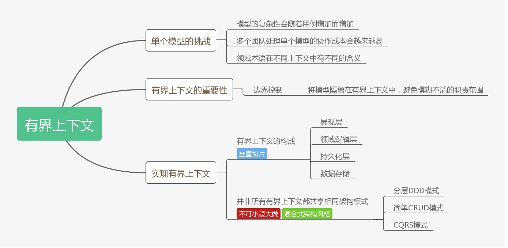

　　脑图浏览地址：<https://www.processon.com/view/5cbad3dee4b09a3e45a3fbc6>

　　通常情况下，尝试将单个模型用于复杂问题域通常会导致代码变成大泥球，而且会增加团队之间的协作成本并降低交付业务价值的效率。有界上下文就是划分和破除这种大模型的有效方式，一个有界上下文就是一个语言边界，它可以隔离模型以避免领域术语在不同上下文中的歧义。而我们常常提到的微服务，个人感觉更像是有界上下文的一种技术实现途径之一，有界上下文中具有较高的自主性，拥有从展现层、领域逻辑层再到持久化层的完整代码堆栈，正应对了我们的每一个微服务的应用程序，也具有较高的独立性，拥有自己的数据库和一套完成的垂直切片的架构模式。

　　书中还提到一个重要的观点，那就是“**并非所有有界上下文都共享相同的架构模式”**，换句话说就是可以将不同的架构模式应用到不同的有界上下文中。想想这年来的企业应用架构模式的发展，已经从单一的架构风格发展为了混合式的架构风格了，就微软的大DEMO项目eShopOnContainers而言，也具有多种架构风格（简单的数据驱动CRUD+简化的分层DDD等），如下图所示：

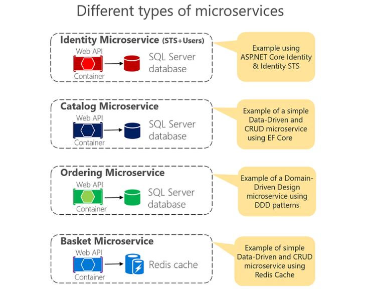

　　因此，我们也不应该局限在某一种或者两种架构模式上，而是应该量身应用，没有复杂性业务逻辑的微服务，那就应该KISS（Keep It Simple & Stupid），否则就可以考虑DDD。

# 七、上下文映射

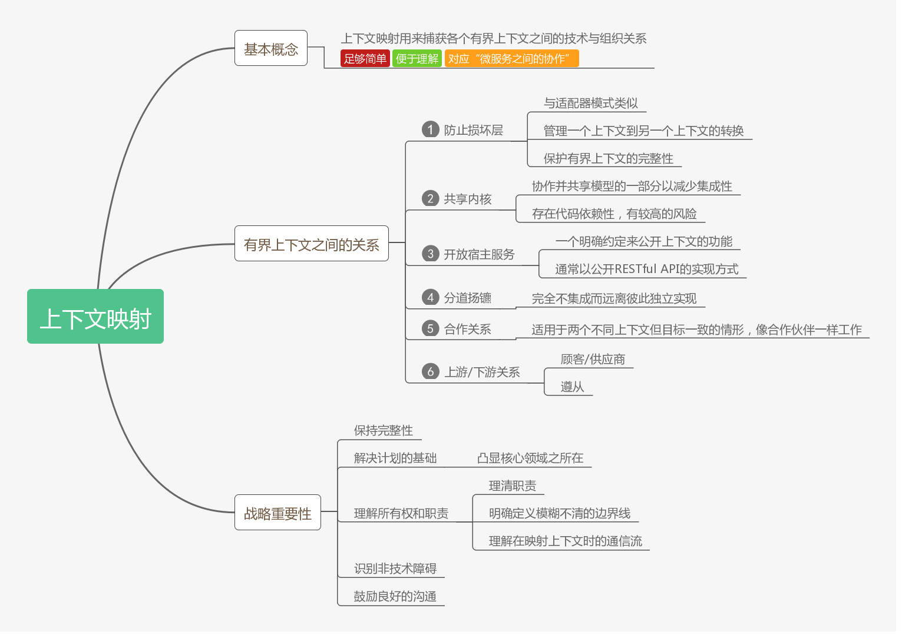

　　脑图浏览地址：<https://www.processon.com/view/5cbc3240e4b0bab909613768>

　　上下文映射用来捕获各个有界上下文之间的技术与组织关系，它最大的作用就是保持模型的完整性。张逸老师在《领域驱动战略设计实践》课程中提到，在战略设计阶段，针对问题域，通过引入限界上下文和上下文映射可以对问题域进行合理的分解，识别出核心领域和子领域，并确定领域的边界以及他们之间的关系，从而维持模型的完整性。

　　限界上下文不仅局限于对领域模型的控制，而在于分离关注点之后，使得整个上下文可以成为独立部署的设计单元，这就是我们非常熟悉的“微服务”的概念；而上下文映射的诸多模式则对应了微服务之间的协作。　　

# 八、应用程序架构

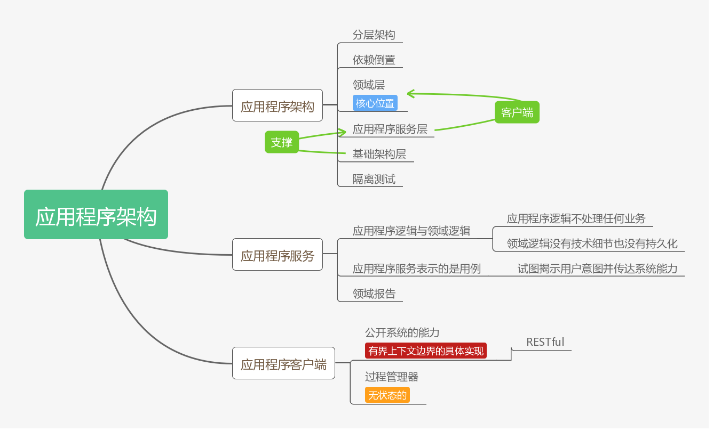

　　脑图浏览地址：<https://www.processon.com/view/5cc1cbe4e4b0841b84400fc9>

　　这一章讨论了应用程序架构、服务和客户端，唯一记住的只有一句：“DDD不需要特殊的架构，只要是能将技术问题与业务问题分离的架构即可”。

# 九、团队开始应用DDD通常会遇到的问题

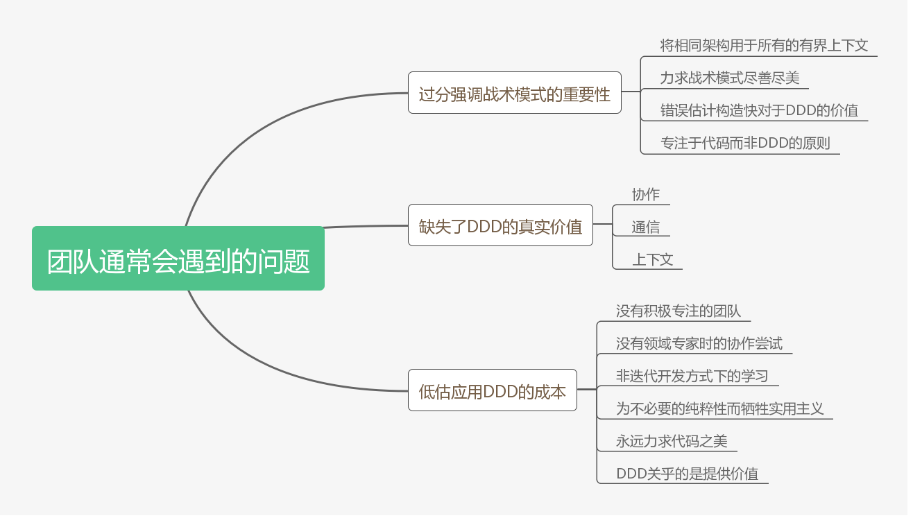

　　脑图浏览地址：<https://www.processon.com/view/5cc46afbe4b08b66b9bd9513>

　　DDD的战术模式虽然可以指导我们创建有效领域模型，但这并非DDD的真正价值所在。因为，DDD其实并非编码这么简单，与领域专家的协作以进行知识提炼，以及在通用语言中表述的问题域达成共识才是DDD的支柱。

　　在现实中，团队在应用DDD时通常会低估应用DDD的成本，应用DDD需要一个愿意学习该领域的聪明专注的团队，还需要领域专家的参与，没有他们，团队就无法揭示更深层的见解。

# 十、应用DDD的原则、实践与模式

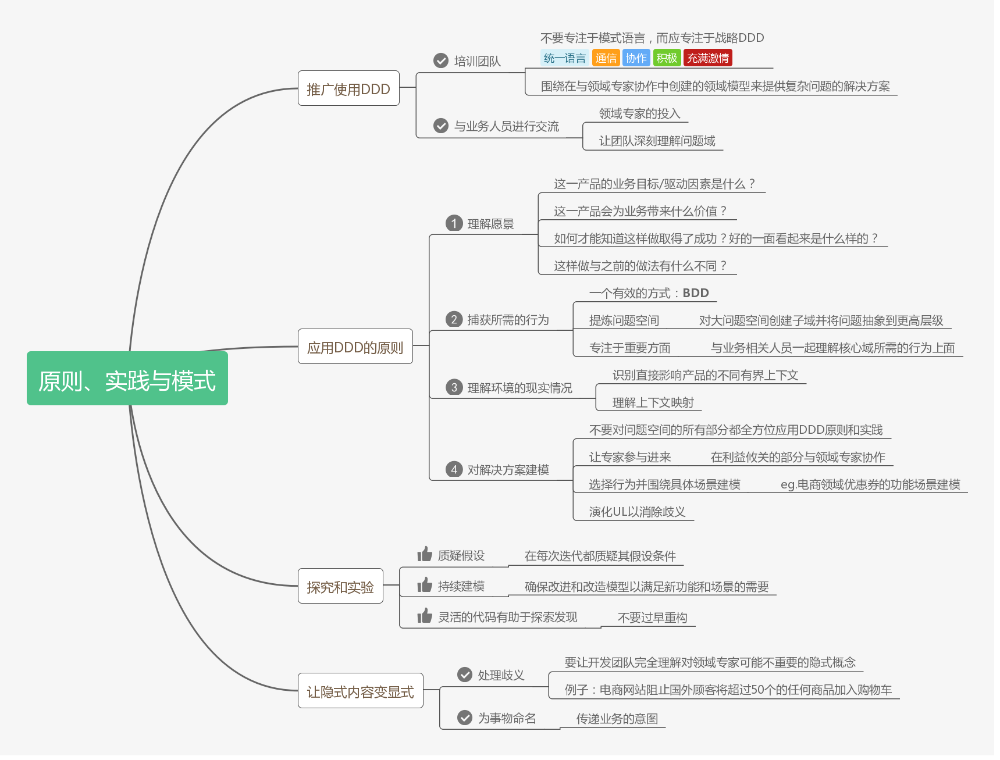

　　脑图浏览地址：<https://www.processon.com/view/5cc5568be4b059e20a0bc1e1>

　　DDD不是灵丹妙药，更不是“银弹”，张逸老师说道：请事先降低对领域驱动设计的不合现实的期望，要学会运用设计原则去解决问题，而非所谓的“设计规范”。更为重要的是，仅仅在需要时应用DDD原则，不要将其用作解决所有问题的工具。

　　总体来说，这一章比较高屋建瓴，总结性的内容偏多，但对于没有多少实战经验的人来说，阅读完不会有太深刻的印象。不过，这并不影响，后续就是战略设计和战术设计的部分了，相信会随着学习的深入，再反过来看这些原则和实践会有更多的认识。

# 参考资料

Scott Millett & Nick Tune，《领域驱动设计模式、原理与实践》

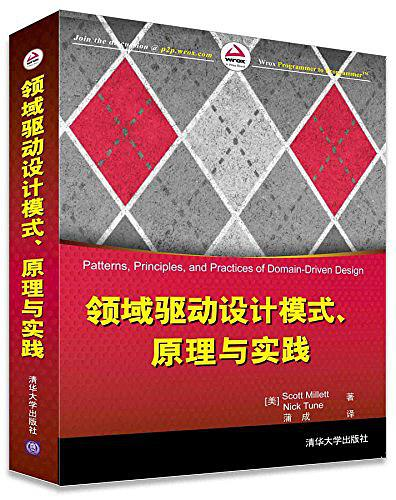

在同事的推荐下，开始学习张逸老师的《领域驱动战略设计实践》课程，配合《领域驱动设计模式、原理与实践》一书共同学习DDD，感觉会比单看书好很多，也在此推荐一下张逸老师的这门课，五月份马上会出《领域驱动战术设计实践》，值得期待。

 

作者：[周旭龙](http://www.edisonchou.cn)

出处：<http://edisonchou.cnblogs.com>

本文版权归作者和博客园共有，欢迎转载，但未经作者同意必须保留此段声明，且在文章页面明显位置给出原文链接。