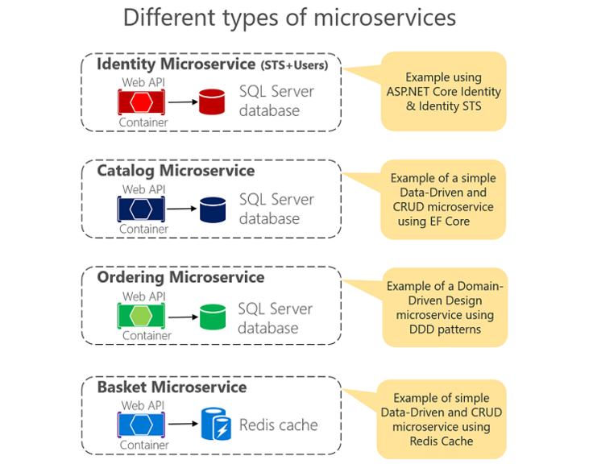
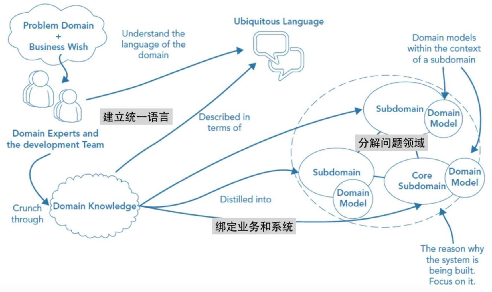
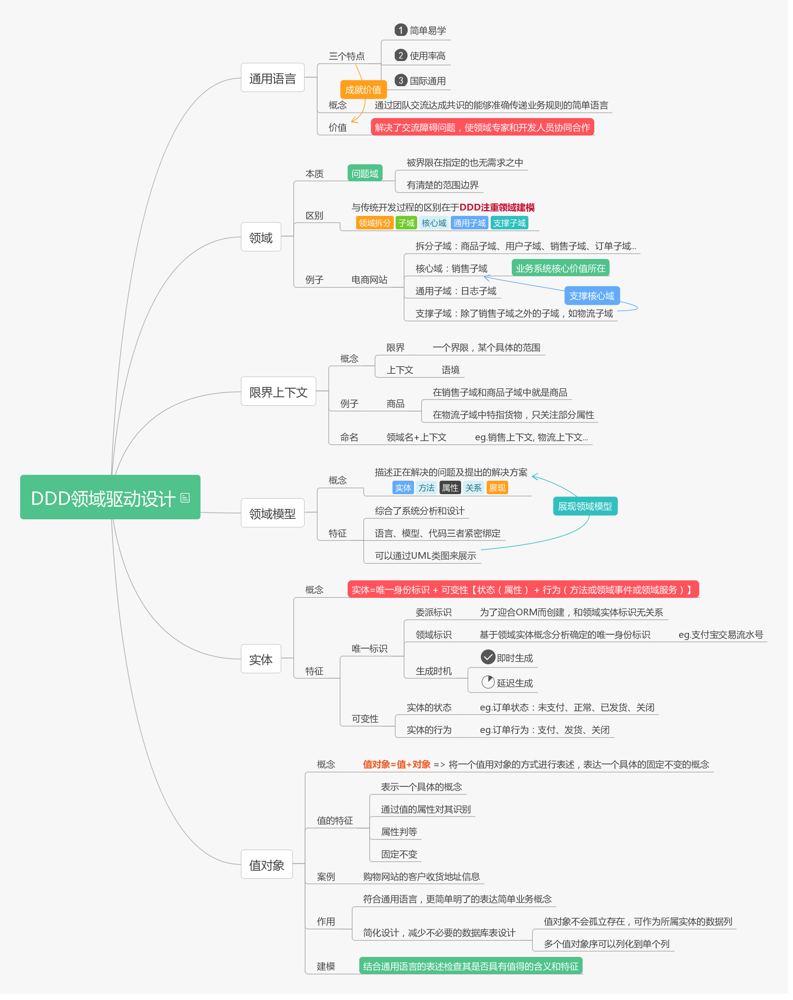
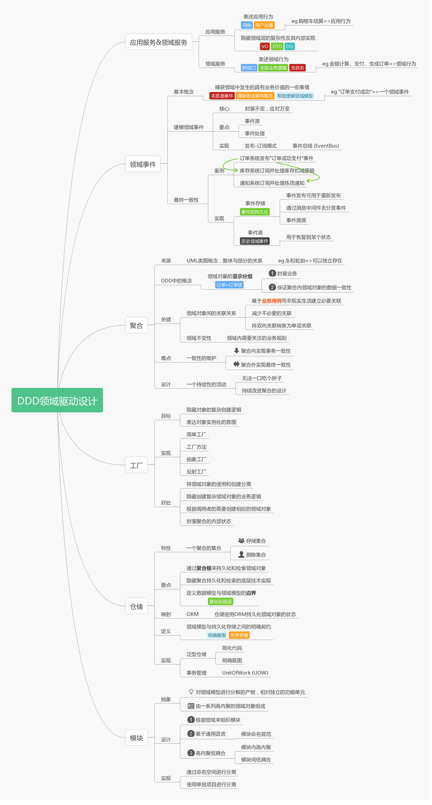
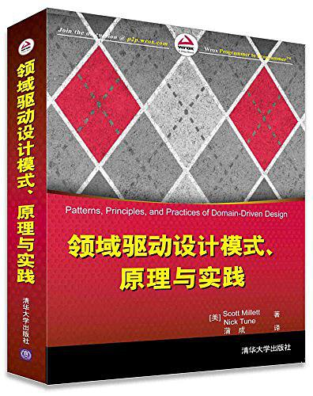

#  [Edison Zhou](https://www.cnblogs.com/edisonchou/)

#                   [DDD领域驱动设计理论篇 - 学习笔记](https://www.cnblogs.com/edisonchou/p/edc_ddd_foundation_study_notes.html)              

# 一、Why DDD？

　　在加入X公司后，开始了ASP.NET Core+Docker+Linux的技术实践，也开始了微服务架构的实践。在微服务的学习中，有一本微软官方出品的《[.NET微服务：容器化.NET应用架构指南](https://docs.microsoft.com/zh-cn/dotnet/standard/microservices-architecture/)》是我们学习的葵花宝典，纵观微软官方放出来的Demo项目的演变历史（可以参见杨晓东《[我眼中的ASP.NET Core微服务](https://www.cnblogs.com/savorboard/p/aspnetcore-microservice.html)》一文）：

### 　　（1）PetShop：WebForm 的示例程序。典型的三层架构风格的应用程序。

### 　　（2）MusicStore: 针对于 MVC3~5 框架和 EF 的一个示例程序。无明显架构风格。

### 　　（3）eShop: 针对于 ASP.NET Core 的示例程序，它是一个 REST架构风格的应用程序。

　　分析其架构风格的转变可以看出，现代应用程序架构已经从单一的传统风格架构（N-Layered）转向了多种混合风格架构（Mixed-Style），像最新的eShopOnWeb/Container项目就包含了以下多种架构风格：

## 　两种架构风格

　我们可以看到，其中主要包括了以下两种架构风格（虽然看起来好像有四种）：

1. ### 基于数据驱动的CRUD微服务 （比如上图中Catalog Microservice和Basket Microservice）

2. ### 基于DDD的微服务（比如上图中的Ordering Microservice 订单微服务）

　　目前，我所在的开发团队仍然在使用第一种-基于数据驱动的CRUD微服务，而要面对的业务却逐步变得复杂，已经强烈感到**数据驱动的复杂度**、不好维护度以及沟通成本，因此需要了解一下为复杂业务而生的DDD。不可否认，很多人是**因为微服务才来了解 DDD** 的（*没错，说的就是我*）。

> 【数据只是事实，事实**对象抽象的一部分**，对于属性状态与变化与事物关联仍需解决，去分析】

　　来自ThoughtWorks的咨询师王威说道：在听说了微服务架构之后，人们觉得采用微服务架构会**让系统开发与运维管理变得简单高效**，同时**实现的系统会更加合理，更加高可用、高性能**，但是当他们实际去做微服务架构的时候，有不少人会发现自己做得并不好，没法取得人们“吹捧”的那些效果，“就算用了微服务架构也不能解决他们的问题，反而带来很多开发与运维上的负担”。于是他们去咨询、去找方法，最后发现其实是自己**划分微服务的方法**出错了，这个时候才知道人们在谈论微服务的时候，其实都没有讲到一个点：**应该用 DDD 的思想去指导微服务的实践**。

## 【庖丁解牛-方法论】

　　那么，DDD又是什么呢？

### 合适的**模型**

### 协作**，使参与者达成**<u>统一认知*</u>*

### 实际所服务的**业务领域

> DDD 是一种在面向高度复杂的软件系统时，关于如何去建模的**方法论**，“它的关键点是根据系统的复杂程度，建立合适的**模型**”。在一个系统中，没有一个人能完全掌握系统的全貌，在多人参与的系统中，DDD 正是可以通过在不同角色之间进行**协作**，使参与者达成**统一认知**，对齐系统设计与程序实际所服务的**业务领域**。
>
> 摘自 ThoughtWorks资深咨询师 Alberto Brandolini

　　从上图中来看DDD  的一个生命周期大概是这样的：在设计和实现一个系统的时候，这个系统所要处理问题的领域专家和开发人员以一套统一语言进行协作，共同完成该领域模型的构建，在这个过程中，业务架构和系统架构等问题都得到了解决，之后将领域模型中关于系统架构的主体映射为实现代码，完成系统的实现落地。而用什么方式去做领域模型的构建，方法是多样的，看具体选择了。

　　这里有3个要点，借助专家之眼来看看：

　　首先，在 DDD 中，使用一个**统一语言**，可以直接将业务架构与系统架构绑定，不需要进一步去翻译，从而增强系统对业务的响应速度。

## 【买鞋的绳子/秦皇一统】

　　其次，DDD 关注的是要构建的系统中，关于所要**解决的问题的业务**、**流程**和**数据等内容是如何工作的**，在这些东西理清之后，DDD 去构建出一个**模型**，接着再去选择具体的实现技术。DDD 强调的是**解耦具体实现技术**，所以它可以迅速梳理核心业务逻辑。

　　最后，DDD 并不是直接给你建议某一个系统架构，它的执行结果是呈现一个方案，可以从这个构建出的模型中决定你去用什么技术来实现什么样的架构，进而来完成一个系统的设计。备选的各种技术只是像一个列表一样摆在眼前，它要根据你的领域需求来选择，比如“**选择采用微服务架构**”。

# 二、精华笔记

*--下面考虑到阅读体验，将其分为两个Part的导图。*

## 2.1 Part 1

## 2.2 Part 2

*完整版思维导图浏览地址：点此浏览ProcessOn大图*

# 三、后续学习

　　本次学习只是一个简单的DDD的相关基础理论学习，后续会阅读Scott Millett和Nick  Tune编著的《领域驱动设计模式、原理与实践》一书进行深入学习，然后会研究经典DDD分层架构与eShopOnContainers示例项目中的简化DDD微服务架构，最后也会总结一下要点分享出来。

　　

　　最后感谢一下圣杰的文章，总结的太好啦！

# 参考资料

颜圣杰，《[DDD理论学习系列文章](https://www.cnblogs.com/sheng-jie/p/6931646.html)》

Alberto Brandolini、王威，《[不用DDD，那你的微服务可能都做错了](https://www.sohu.com/a/212137511_467759)》