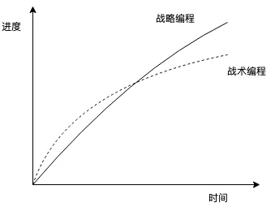
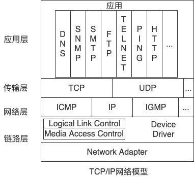
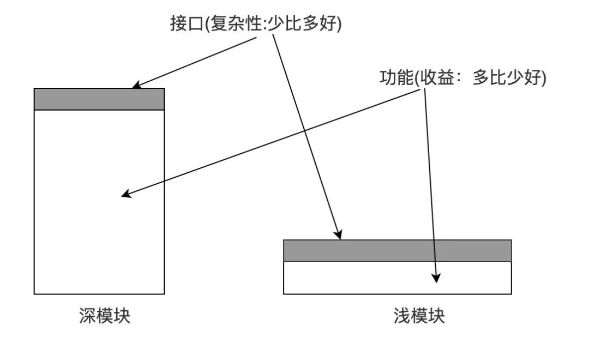

## 降低软件复杂性的一般原则和方法

​                                                            原创：                                                                                                                                                                政华                                                                                                                                                                                          [                         美团技术团队                      ](javascript:void(0);)                                                               *9月19日*                   


追求卓越、学习成长是美团的基因，因此工作之余，多读书、读好书蔚然成风——我们有专门的P2P图书馆、不时的好书推荐、图书打卡交流群和各种丰富读书活动……

本文是作者阅读John Ousterhout的《A Philosophy of Software Design》之后，结合自己的工作经验，对“降低复杂性”做了详细总结，希望给读者朋友们带来不一样的思路。

### **一、前言**

斯坦福教授、Tcl语言发明者John Ousterhout 的著作《A Philosophy of Software  Design》[1]，自出版以来，好评如潮。按照IT图书出版的惯例，如果冠名为“实践”，书中内容关注的是某项技术的细节和技巧；冠名为“艺术”，内容可能是记录优秀作品的设计过程和经验；而冠名为“哲学”，则是一些通用的原则和方法论，这些原则方法论串起来，能够形成一个体系。正如“知行合一”、“世界是由原子构成的”、“我思故我在”，这些耳熟能详的句子能够一定程度上代表背后的人物和思想。用一句话概括《A Philosophy of Software Design》，软件设计的核心在于降低复杂性。

本篇文章是围绕着“降低复杂性”这个主题展开的，很多重要的结论来源于John Ousterhout，笔者觉得很有共鸣，就做了一些相关话题的延伸、补充了一些实例。虽说是“一般原则”，也不意味着是绝对的真理，整理出来，只是为了引发大家对软件设计的思考。

### **二、如何定义复杂性**

关于复杂性，尚无统一的定义，从不同的角度可以给出不同的答案。可以用数量来度量，比如芯片集成的电子器件越多越复杂（不一定对）；按层次性[2]度量，复杂度在于层次的递归性和不可分解性。在信息论中，使用熵来度量信息的不确定性。

John Ousterhout选择从认知的负担和开发工作量的角度来定义软件的复杂性，并且给出了一个复杂度量公式：


子模块的复杂度Cp乘以该模块对应的开发时间权重值tp，累加后得到系统的整体复杂度C。系统整体的复杂度并不简单等于所有子模块复杂度的累加，还要考虑开发维护该模块所花费的时间在整体时间中的占比（对应权重值tp）。也就是说，即使某个模块非常复杂，如果很少使用或修改，也不会对系统的整体复杂度造成大的影响。

子模块的复杂度Cp是一个经验值，它关注几个现象：

- **修改扩散**，修改时有连锁反应。
- **认知负担**，开发人员需要多长时间来理解功能模块。
- **不可知**（Unknown Unknowns），开发人员在接到任务时，不知道从哪里入手。

造成复杂的原因一般是代码依赖和晦涩（Obscurity）。其中，依赖是指某部分代码不能被独立地修改和理解，必定会牵涉到其他代码。代码晦涩，是指从代码中难以找到重要信息。

### **三、解决复杂性的一般原则**

首先，互联网行业的软件系统，很难一开始就做出完美的设计，通过一个个功能模块衍生迭代，系统才会逐步成型。对于现存的系统，也很难通过一个大动作，一劳永逸地解决所有问题。系统设计是需要持续投入的工作，通过细节的积累，最终得到一个完善的系统。因此，好的设计是日拱一卒的结果，在日常工作中要重视设计和细节的改进。

其次，专业化分工和代码复用促成了软件生产率的提升。比如硬件工程师、软件工程师（底层、应用、不同编程语言）可以在无需了解对方技术背景的情况下进行合作开发；同一领域服务可以支撑不同的上层应用逻辑等等。其背后的思想，无非是通过将系统分成若干个水平层、明确每一层的角色和分工，来降低单个层次的复杂性。同时，每个层次只要给相邻层提供一致的接口，可以用不同的方法实现，这就为软件重用提供了支持。分层是解决复杂性问题的重要原则。

第三，与分层类似，分模块是从垂直方向来分解系统。分模块最常见的应用场景，是如今广泛流行的微服务。分模块降低了单模块的复杂性，但是也会引入新的复杂性，例如模块与模块的交互，后面的章节会讨论这个问题。这里，我们将第三个原则确定为分模块。

最后，代码能够描述程序的工作流程和结果，却很难描述开发人员的思路，而注释和文档可以。此外，通过注释和文档，开发人员在不阅读实现代码的情况下，就可以理解程序的功能，注释间接促成了代码抽象。好的注释能够帮助解决软件复杂性问题，尤其是认知负担和不可知问题（Unknown Unknowns）。

**四、解决复杂性之日拱一卒**

#### **4.1 拒绝战术编程**

战术编程致力于完成任务，新增加特性或者修改Bug时，能解决问题就好。这种工作方式，会逐渐增加系统的复杂性。如果系统复杂到难以维护时，再去重构会花费大量的时间，很可能会影响新功能的迭代。

战略编程，是指重视设计并愿意投入时间，短时间内可能会降低工作效率，但是长期看，会增加系统的可维护性和迭代效率。



设计系统时，很难在开始阶段就面面俱到。好的设计应该体现在一个个小的模块上，修改Bug时，也应该抱着设计新系统的心态，完工后让人感觉不到“修补”的痕迹。经过累积，最终形成一个完善的系统。从长期看，对于中大型的系统，将日常开发时间的10%-15%用于设计是值得的。有一种观点认为，创业公司需要追求业务迭代速度和节省成本，可以容忍糟糕的设计，这是用错误的方法去追求正确的目标。降低开发成本最有效的方式是雇佣优秀的工程师，而不是在设计上做妥协。

#### **4.2 设计两次**

为一个类、模块或者系统的设计提供两套或更多方案，有利于我们找到最佳设计。以我们日常的技术方案设计为例，技术方案本质上需要回答两个问题，其一，为什么该方案可行？其二，在已有资源限制下，为什么该方案是最优的？为了回答第一个问题，我们需要在技术方案里补充架构图、接口设计和时间人力估算。而要回答第二个问题，需要我们在关键点或争议处提供二到三种方案，并给出建议方案，这样才有说服力。

通常情况下，我们会花费很多的时间准备第一个问题，而忽略第二个问题。其实，回答好第二个问题很重要，大型软件的设计已经复杂到没人能够一次就想到最佳方案，一个仅仅“可行”的方案，可能会给系统增加额外的复杂性。对聪明人来说，接受这点更困难，因为他们习惯于“一次搞定问题”。但是聪明人迟早也会碰到自己的瓶颈，在低水平问题上徘徊，不如花费更多时间思考，去解决真正有挑战性的问题。

### **五、解决复杂性之分层**

#### **5.1 层次和抽象**

软件系统由不同的层次组成，层次之间通过接口来交互。在严格分层的系统里，内部的层只对相邻的层次可见，这样就可以将一个复杂问题分解成增量步骤序列。由于每一层最多影响两层，也给维护带来了很大的便利。分层系统最有名的实例是TCP/IP网络模型。



在分层系统里，每一层应该具有不同的抽象。TCP/IP模型中，应用层的抽象是用户接口和交互；传输层的抽象是端口和应用之间的数据传输；网络层的抽象是基于IP的寻址和数据传输；链路层的抽象是适配和虚拟硬件设备。如果不同的层具有相同的抽象，可能存在层次边界不清晰的问题。

#### **5.2 复杂性下沉**

不应该让用户直面系统的复杂性，即便有额外的工作量，开发人员也应当尽量让用户使用起来更简单。如果一定要在某个层次处理复杂性，这个层次越低越好。举个例子，Thrift接口调用时，数据传输失败需要引入自动重试机制，重试的策略显然在Thrift内部封装更合适，开放给用户（下游开发人员）会增加额外的使用负担。与之类似的是系统里随处可见的配置参数（通常写在XML文件里），在编程中应当尽量避免这种情况，用户（下游开发人员）一般很难决定哪个参数是最优的，如果一定要开放参数配置，最好给定一个默认值。

复杂性下沉，并不是说把所有功能下移到一个层次，过犹不及。如果复杂性跟下层的功能相关，或者下移后，能大大下降其他层次或整体的复杂性，则下移。

#### **5.3 异常处理**

异常和错误处理是造成软件复杂的罪魁祸首之一。有些开发人员错误的认为处理和上报的错误越多越好，这会导致过度防御性的编程。如果开发人员捕获了异常并不知道如何处理，直接往上层扔，这就违背了封装原则。

降低复杂度的一个原则就是尽可能减少需要处理异常的可能性。而最佳实践就是确保错误终结，例如删除一个并不存在的文件，与其上报文件不存在的异常，不如什么都不做。确保文件不存在就好了，上层逻辑不但不会被影响，还会因为不需要处理额外的异常而变得简单。

### **六、解决复杂性之分模块**

分模块是解决复杂性的重要方法。理想情况下，模块之间应该是相互隔离的，开发人员面对具体的任务，只需要接触和了解整个系统的一小部分，而无需了解或改动其他模块。

#### **6.1 深模块和浅模块**

深模块（Deep Module）指的是拥有强大功能和简单接口的模块。深模块是抽象的最佳实践，通过排除模块内部不重要的信息，让用户更容易理解和使用。



Unix操作系统文件I/O是典型的深模块，以Open函数为例，接口接受文件名为参数，返回文件描述符。但是这个接口的背后，是几百行的实现代码，用来处理文件存储、权限控制、并发控制、存储介质等等，这些对用户是不可见的。

```
int open(const char* path, int flags, mode_t permissions);
```

与深模块相对的是浅模块（Shallow Module），功能简单，接口复杂。通常情况下，浅模块无助于解决复杂性。因为他们提供的收益（功能）被学习和使用成本抵消了。以Java  I/O为例，从I/O中读取对象时，需要同时创建三个对象FileInputStream、BufferedInputStream、ObjectInputStream，其中前两个创建后不会被直接使用，这就给开发人员造成了额外的负担。默认情况下，开发人员无需感知到BufferedInputStream，缓冲功能有助于改善文件I/O性能，是个很有用的特性，可以合并到文件I/O对象里。假如我们想放弃缓冲功能，文件I/O也可以设计成提供对应的定制选项。

```
FileInputStream fileStream = new FileInputStream(fileName);BufferedInputStream bufferedStream = new BufferedInputStream(fileStream);ObjectInputStream objectStream = new ObjectInputStream(bufferedStream);
```

关于浅模块有一些争议，大多数情况是因为浅模块是不得不接受的既定事实，而不见得是因为合理性。当然也有例外，比如领域驱动设计里的防腐层，系统在与外部系统对接时，会单独建立一个服务或模块去适配，用来保证原有系统技术栈的统一和稳定性。

#### **6.2 通用和专用**

设计新模块时，应该设计成通用模块还是专用模块？一种观点认为通用模块满足多种场景，在未来遇到预期外的需求时，可以节省时间。另外一种观点则认为，未来的需求很难预测，没必要引入用不到的特性，专用模块可以快速满足当前的需求，等有后续需求时再重构成通用的模块也不迟。

以上两种思路都有道理，实际操作的时候可以采用两种方式各自的优点，即在功能实现上满足当前的需求，便于快速实现；接口设计通用化，为未来留下余量。举个例子。

```
void backspace(Cursor cursor);void delete(Cursor cursor);void deleteSelection(Selection selection);//以上三个函数可以合并为一个更通用的函数void delete(Position start, Position end);

```

设计通用性接口需要权衡，既要满足当前的需求，同时在通用性方面不要过度设计。一些可供参考的标准：

- 满足当前需求最简单的接口是什么？在不减少功能的前提下，减少方法的数量，意味着接口的通用性提升了。
- 接口使用的场景有多少？如果接口只有一个特定的场景，可以将多个这样的接口合并成通用接口。
- 满足当前需求情况下，接口的易用性如何？如果接口很难使用，意味着我们可能过度设计了，需要拆分。

#### **6.3 信息隐藏**

信息隐藏是指，程序的设计思路以及内部逻辑应当包含在模块内部，对其他模块不可见。如果一个模块隐藏了很多信息，说明这个模块在提供很多功能的同时又简化了接口，符合前面提到的深模块理念。软件设计领域有个技巧，定义一个“大”类有助于实现信息隐藏。这里的“大”类指的是，如果要实现某功能，将该功能相关的信息都封装进一个类里面。

信息隐藏在降低复杂性方面主要有两个作用：一是简化模块接口，将模块功能以更简单、更抽象的方式表现出来，降低开发人员的认知负担；二是减少模块间的依赖，使得系统迭代更轻量。举个例子，如何从B+树中存取信息是一些数据库索引的核心功能，但是数据库开发人员将这些信息隐藏了起来，同时提供简单的对外交互接口，也就是SQL脚本，使得产品和运营同学也能很快地上手。并且，因为有足够的抽象，数据库可以在保持外部兼容的情况下，将索引切换到散列或其他数据结构。

与信息隐藏相对的是信息暴露，表现为：设计决策体现在多个模块，造成不同模块间的依赖。举个例子，两个类能处理同类型的文件。这种情况下，可以合并这两个类，或者提炼出一个新类（参考《重构》[3]一书）。工程师应当尽量减少外部模块需要的信息量。

#### **6.4 拆分和合并**

两个功能，应该放在一起还是分开？“不管黑猫白猫”，能降低复杂性就好。这里有一些可以借鉴的设计思路：

- 共享信息的模块应当合并，比如两个模块都依赖某个配置项。
- 可以简化接口时合并，这样可以避免客户同时调用多个模块来完成某个功能。
- 可以消除重复时合并，比如抽离重复的代码到一个单独的方法中。
- 通用代码和专用代码分离，如果模块的部分功能可以通用，建议和专用部分分离。举个例子，在实际的系统设计中，我们会将专用模块放在上层，通用模块放在下层以供复用。

### **七、解决复杂性之注释**

注释可以记录开发人员的设计思路和程序功能，降低开发人员的认知负担和解决不可知（Unkown Unkowns）问题，让代码更容易维护。通常情况下，在程序的整个生命周期里，编码只占了少部分，大量时间花在了后续的维护上。有经验的工程师懂得这个道理，通常也会产出更高质量的注释和文档。

注释也可以作为系统设计的工具，如果只需要简单的注释就可以描述模块的设计思路和功能，说明这个模块的设计是良好的。另一方面，如果模块很难注释，说明模块没有好的抽象。

#### **7.1 注释的误区**

关于注释，很多开发者存在一些认识上的误区，也是造成大家不愿意写注释的原因。比如“好代码是自注释的”、“没有时间”、“现有的注释都没有用，为什么还要浪费时间”等等。这些观点是站不住脚的。“好代码是自注释的”只在某些场景下是合理的，比如为变量和方法选择合适的名称，可以不用单独注释。但是更多的情况，代码很难体现开发人员的设计思路。此外，如果用户只能通过读代码来理解模块的使用，说明代码里没有抽象。好的注释可以极大地提升系统的可维护性，获取长期的效率，不存在“没有时间”一说。注释也是一种可以习得的技能，一旦习得，就可以在后续的工作中应用，这就解决了“注释没有用”的问题。

#### **7.2 使用注释提升系统可维护性**

注释应当能提供代码之外额外的信息，重视What和Why，而不是代码是如何实现的（How），最好不要简单地使用代码中出现过的单词。

根据抽象程度，注释可以分为低层注释和高层注释，低层次的注释用来增加精确度，补充完善程序的信息，比如变量的单位、控制条件的边界、值是否允许为空、是否需要释放资源等。高层次注释抛弃细节，只从整体上帮助读者理解代码的功能和结构。这种类型的注释更好维护，如果代码修改不影响整体的功能，注释就无需更新。在实际工作中，需要兼顾细节和抽象。低层注释拆散与对应的实现代码放在一起，高层注释一般用于描述接口。

注释先行，注释应该作为设计过程的一部分，写注释最好的时机是在开发的开始环节，这不仅会产生更好的文档，也会帮助产生好的设计，同时减少写文档带来的痛苦。开发人员推迟写注释的理由通常是：代码还在修改中，提前写注释到时候还得再改一遍。这样的话就会衍生两个问题：

- 首先，推迟注释通常意味着根本就没有注释。一旦决定推迟，很容易引发连锁反应，等到代码稳定后，也不会有注释这回事。这时候再想添加注释，就得专门抽出时间，客观条件可能不会允许这么做。
- 其次，就算我们足够自律抽出专门时间去写注释，注释的质量也不会很好。我们潜意识中觉得代码已经写完了，急于开展下一个项目，只是象征性地添加一些注释，无法准确复现当时的设计思路。

避免重复的注释。如果有重复注释，开发人员很难找到所有的注释去更新。解决方法是，可以找到醒目的地方存放注释文档，然后在代码处注明去查阅对应文档的地址。如果程序已经在外部文档中注释过了，不要在程序内部再注释了，添加注释的引用就可以了。

注释属于代码，而不是提交记录。一种错误的做法是将功能注释放在提交记录里，而不是放在对应代码文件里。因为开发人员通常不会去代码提交记录里去查看程序的功能描述，很不方便。

#### **7.3 使用注释改善系统设计**

良好的设计基础是提供好的抽象。在开始编码前编写注释，可以帮助我们提炼模块的核心要素：模块或对象中最重要的功能和属性。这个过程促进我们去思考，而不是简单地堆砌代码。另一方面，注释也能够帮助我们检查自己的模块设计是否合理，正如前文中提到，深模块提供简单的接口和强大的功能，如果接口注释冗长复杂，通常意味着接口也很复杂；注释简单，意味着接口也很简单。在设计的早期注意和解决这些问题，会为我们带来长期的收益。

### **八、后记**

John Ousterhout累计写过25万行代码，是3个操作系统的重要贡献者，这些原则可以视为作者编程经验的总结。有经验的工程师看到这些观点会有共鸣，一些著作如《代码大全》、《领域驱动设计》也会有类似的观点。所以本文中提到的原则和方法具有一定实操和指导价值。对于很难有定论的问题，也可以在实践中去探索。

关于原则和方法论，既不必刻意拔高，也不要嗤之以鼻。指导实践的不是更多的实践，而是实践后的总结和思考。应用原则和方法论实质是借鉴已有的经验，可以减少我们自行摸索的时间。探索新的方法可以帮助我们适应新的场景，但是新方法本身需要经过时间检验。

### **九、参考文档**

[1] John Ousterhout. *A philosophy of software design*. Yaknyam Press, 2018.

[2] 梅拉尼·米歇尔. 复杂. 湖南科学技术出版社, 2016.

[3] Martin Fowler. *Refactoring: Improving the Design of Existing Code (2nd Edition)* . Addison-Wesley Signature Series, 2018.

### **作者介绍**

**政华，顺谱，陶鑫**，美团打车调度系统工程团队工程师。

---------- END ----------

**招聘信息**


美团打车调度系统工程团队诚招高级工程师/技术专家，我们的目标，是与算法、数据团队密切协作，建设高性能、高可用、可配置的打车调度引擎, 为用户提供更好的出行体验。欢迎有兴趣的同学发送简历到tech@meituan.com（邮件标题注明：打车调度系统工程团队）。