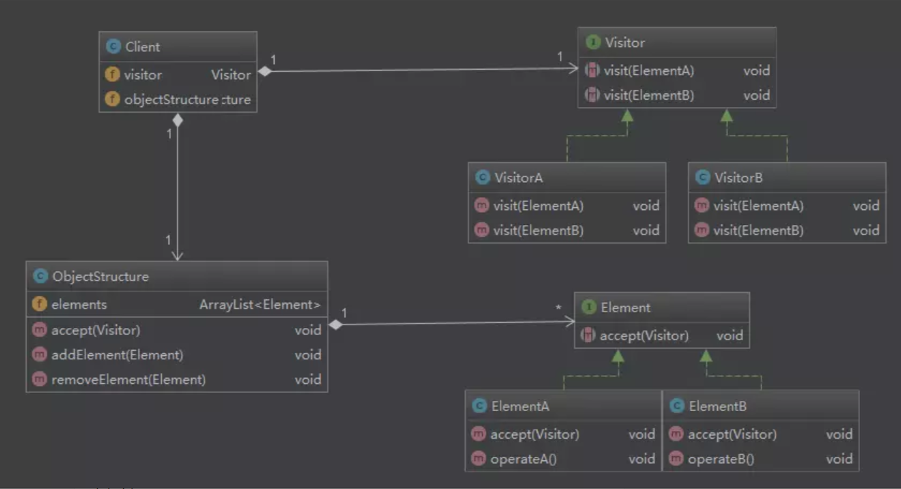

#                  [设计模式-行为型-访问者模式](https://www.cnblogs.com/az4215/p/11645587.html)             

## 访问者模式（Vistor）：

　　访问者模式的官方定义是这样的：表示一个作用于某对象结构中的各元素的操作，它使你可以在不改变各元素类的前提下定义作用于这些元素的新操作。官方的东西总是晦涩难懂的，那么我们现在就来拆解一下：首先"一个作用于某对象结构中的各元素的操作"，提到了三个东西：对象结构、元素、操作。我们都学习过数据结构，数据结构中大家对数据的访问一般都是直接访问其地址。在面向对象的设计中，我们一般也是将数据的访问操作放在类的内部，便于访问。这种设计看似没有什么问题，但当我们想要采用不同方式访问数据或对象结构时就必须要对类进行修改，这样就违反了[OCP原则](https://www.cnblogs.com/az4215/p/11489712.html)。于是大家会想到将数据结构与操作分离开来，当问们需要添加访问操作的时候直接添加新的类，原来的代码不需要做任何改变，这也是后半句提到的"可以在不改变各元素类的前提下定义作用于这些元素的新操作"。

## 访问者模式的角色：

　　

　　1）Visitor：接口或抽象类，定义了对每个Element访问的行为，它的参数就是被访问的元素，它的方法个数理论上与元素的个数是一样的，因此，访问者模式要求元素的类型要稳定，如果经常添加、移除元素类，必然会导致频繁地修改visitor接口，如果出现这种情况，则说明不适合使用该模式。

　　2）ConcreteVisitor：具体的访问者，它需要给出对每一个元素类访问时所产生的具体行为。

　　3）Element：元素接口或抽象类，它定义了一个接受访问者的方法（accept），其意思就是说每一个元素都可以被访问者访问。

　　4）ConcreteElement：具体的元素类，它提供接受访问的具体实现，而这个具体实现通常情况下是使用访问者提供的访问该元素类的方法。

　　5）ObjectStructure：定义当中所提到的对象结构，对象结构是一个抽象表述，它内部管理了元素集合，并且可以迭代这些元素提供访问者访问。

示例：

### 　　一个目录下面有文件夹和文件，文件夹和文件是具体的元素类。 

[](javascript:void(0);)

```csharp
 1 /// <summary>
 2 /// 抽象访问者
 3 /// </summary>
 4 public abstract class Visitor
 5 {
 6     public abstract void visit(File file);
 7 
 8     public abstract void visit(Directory directory);
 9 }
10 
11 /// <summary>
12 /// 具体的访问者
13 /// </summary>
14 public class ListVisitor : Visitor
15 {
16     public override void visit(File file)
17     {
18         Console.WriteLine($"文件名称{file.GetName()}");
19     }
20 
21     public override void visit(Directory directory)
22     {
23         Console.WriteLine($"文件夹名称{directory.GetName()}");
24     }
25 }
26 
27 /// <summary>
28 /// 元素抽象类
29 /// </summary>
30 public abstract class Element
31 {
32     public abstract void accept(Visitor visitor);
33 }
34 
35 public class Entry : Element
36 {
37     private string name;
38 
39     public Entry(string name)
40     {
41         this.name = name;
42     }
43 
44     public string GetName()
45     {
46         return this.name;
47     }
48 
49     public override void accept(Visitor visitor)
50     {
51         throw new NotImplementedException();
52     }
53 }
54 
55 /// <summary>
56 /// 具体的元素类：文件夹
57 /// </summary>
58 public class Directory : Entry
59 {
60     public Directory(string name)
61         : base(name)
62     {
63     }
64 
65     public override void accept(Visitor visitor)
66     {
67         visitor.visit(this);
68     }
69 }
70 
71 /// <summary>
72 /// 具体的元素类：文件
73 /// </summary>
74 public class File : Entry
75 {
76     public File(string name)
77         : base(name)
78     {
79     }
80 
81     public override void accept(Visitor visitor)
82     {
83         visitor.visit(this);
84     }
85 }
```

[](javascript:void(0);)

　　定义好了，数据操作，接下来我们定义数据结构的核心类ObjectStructure。

[](javascript:void(0);)

```csharp
 1 public class ObjectStructure
 2 {
 3     private readonly Visitor visitor;
 4     private List<Element> list = new List<Element>();
 5 
 6     public ObjectStructure(Visitor visitor)
 7     {
 8         this.visitor = visitor;
 9     }
10 
11     public void Add(Element element)
12     {
13         list.Add(element);
14     }
15 
16     public void Show()
17     {
18         foreach (Element element in list)
19         {
20             element.accept(visitor);
21         }
22     }
23 }
```

[](javascript:void(0);)

### 　　客户端调用。

[](javascript:void(0);)

```csharp
 1 private static void Main(string[] args)
 2 {
 3     ObjectStructure objectStructure = new ObjectStructure(new ListVisitor());
 4     objectStructure.Add(new Directory("我的文件夹"));
 5     objectStructure.Add(new File("C#高级编程.pdf"));
 6     objectStructure.Add(new File("设计模式.pdf"));
 7     objectStructure.Add(new File("算法.txt"));
 8     objectStructure.Add(new File("mm.png"));
 9     objectStructure.Show();
10 }
```

[](javascript:void(0);)

## 访问者模式的优缺点：

　　优点：

　　　　1）各角色职责分离，符合[单一职责原则](https://www.cnblogs.com/az4215/p/11462818.html)。

　　　　2）具有优秀的扩展性，使得数据结构和作用于结构上的操作解耦，使得操作集合可以独立变化。

　　　　3）灵活性

　　缺点：

　　　　1）具体元素对访问者公布细节，违反了[迪米特原则](https://www.cnblogs.com/az4215/p/11489748.html)。

　　　　2）具体元素变更比较困难。 

　　　　3）违反了[依赖倒置原则](https://www.cnblogs.com/az4215/p/11462878.html)，依赖了具体类，没有依赖抽象。

访问者模式的使用场景：

　　1）对象结构中对象对应的类很少改变，但经常需要在此对象结构上定义新的操作。

　　2）需要对一个对象结构中的对象进行很多不同的并且不相关的操作，而需要避免让这些操作"污染"这些对象的类，也不希望在增加新操作时修改这些类。　　

参考：https://www.cnblogs.com/zyrblog/p/9244754.html