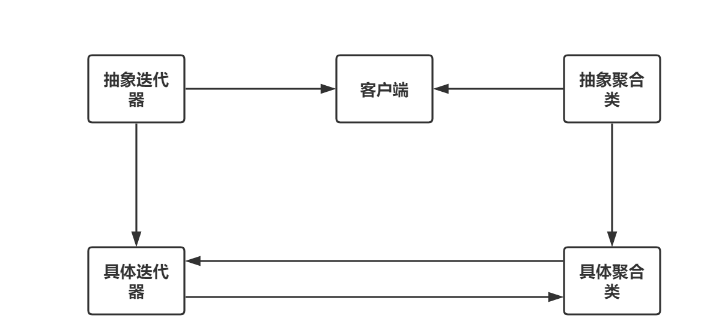

#                  [通俗易懂设计模式解析——迭代器模式](https://www.cnblogs.com/hulizhong/p/11641998.html)             


**目录**

- [前言](https://www.cnblogs.com/hulizhong/p/11641998.html#_label0)
- 迭代器模式介绍
  - [一、来由](https://www.cnblogs.com/hulizhong/p/11641998.html#_label1_0)
  - [二、意图](https://www.cnblogs.com/hulizhong/p/11641998.html#_label1_1)
  - [三、案例图](https://www.cnblogs.com/hulizhong/p/11641998.html#_label1_2)
  - [四、迭代器模式代码示例](https://www.cnblogs.com/hulizhong/p/11641998.html#_label1_3)
- 使用场景及优缺点
  - [一、使用场景](https://www.cnblogs.com/hulizhong/p/11641998.html#_label2_0)
  - [二、优点](https://www.cnblogs.com/hulizhong/p/11641998.html#_label2_1)
  - [三、缺点](https://www.cnblogs.com/hulizhong/p/11641998.html#_label2_2)
- [总结](https://www.cnblogs.com/hulizhong/p/11641998.html#_label3)

 

------

[回到顶部](https://www.cnblogs.com/hulizhong/p/11641998.html#_labelTop)

## **前言**

　　今天我们一起看看行为模式中的迭代器模式，迭代是重复反馈过程的活动，其目的通常是为了接近并到达所需的目标或结果。在系统开发中简单说可以理解成遍历。这种模式用于顺序访问集合对象的元素，不需要知道集合对象的底层或者内部表示。

[回到顶部](https://www.cnblogs.com/hulizhong/p/11641998.html#_labelTop)

## **迭代器模式介绍**


### 一、**来由**

　　在系统开发中，集合对象内部表示各不相同。底层构造也尽不相同。对于这些对象，我们希望在不暴露其底层和内部表示的同时，可以使外部客户访问其中元素。迭代器模式就为这一需求提供了极其优雅的实现。


### 二、**意图**

　　**提供一种方法顺序访问一个聚合对象中各个元素, 而又无须暴露该对象的内部表示。**


### 三、**案例图**

 


### 四、**迭代器模式代码示例**

我们从上面的案例图可见，迭代器模式主要包含以下四个部分：

**抽象迭代器：****定义了访问和遍历元素的接口，然后在其子类中实现这些方法。**

**具体迭代器：****实现抽象迭代器接口，完成对集合对象的遍历。同时对遍历时的位置进行跟踪。**

**抽象聚合类：****主要用于储存对象，创建相应的迭代器对象的接口。带有一个createIterator()方法用于创建迭代器对象。**

**具体聚合类：****实现创建相应的迭代器对象的接口，实现createIterator()方法，并且返回与该具体聚合相对应的具体迭代器ConcreteIterator实例。**

介绍完迭代器模式之后，接下来我们具体来看看迭代器模式的具体实现吧。具体如下：

 

```
namespace Iterator_Pattern
{
    class IteratorPattern
    {
    }

    /// <summary>
    /// 抽象聚合类、包含一个创建迭代器对象的方法
    /// </summary>
    public interface IListAggregate
    {
        Iterator GetIterator();
    }

    /// <summary>
    /// 抽象迭代器、包含访问和遍历元素的方法
    /// </summary>
    public interface Iterator
    {
        /// <summary>
        /// 是否有下一个元素
        /// </summary>
        /// <returns></returns>
        bool IsNext();
        /// <summary>
        /// 获取当前元素位置
        /// </summary>
        /// <returns></returns>
        object GetCurrentIndex();
        /// <summary>
        /// 获取下一个元素
        /// </summary>
        void Next();
        /// <summary>
        /// 获取第一个元素、相当于重置
        /// </summary>
        void Start();
    }

    /// <summary>
    /// 具体聚合类
    /// </summary>
    public class ConcreteListAggregate : IListAggregate
    { 
        string[] list;
        public ConcreteListAggregate()
        {
            list = new string[] { "张三", "李四", "王五", "赵六" };
        }

        /// <summary>
        /// 创建迭代器对象
        /// </summary>
        /// <returns></returns>
        public Iterator GetIterator()
        {
            return new ConcreteIterator(this);
        }

        /// <summary>
        /// 获取对象长度
        /// </summary>
        public int Length
        {
            get { return list.Length; }
        }

        /// <summary>
        /// 获取指定位置元素
        /// </summary>
        /// <param name="index"></param>
        /// <returns></returns>
        public object GetItem(int index)
        {
            return list[index];
        } 
    }

    public class ConcreteIterator : Iterator
    {
        private ConcreteListAggregate _list;
        private int _index;

        public ConcreteIterator(ConcreteListAggregate list)
        {
            _list = list;
            _index = 0;

        }

        public object GetCurrentIndex()
        {
            return _list.GetItem(_index);
        }

        public bool IsNext()
        {
            if (_index<_list.Length)
            {
                return true;
            }
            return false;
        }

        public void Next()
        {
            if (_index<_list.Length)
            {
                _index++;
            }
        }

        public void Start()
        {
            _index = 0;
        }
    }
}
```

 

```
namespace Iterator_Pattern
{
    class Program
    {
        static void Main(string[] args)
        {
            //获取迭代器对象

            IListAggregate listAggregate = new ConcreteListAggregate();
            Iterator iterator = listAggregate.GetIterator(); 
            while (iterator.IsNext())
            {
                var result = iterator.GetCurrentIndex();
                Console.WriteLine(result);
                iterator.Next();

            }
        }
    }
}
```

 

[回到顶部](https://www.cnblogs.com/hulizhong/p/11641998.html#_labelTop)

## **使用场景及优缺点**


### 一、**使用场景**

1、**访问聚合对象的内容不需要暴露其内部表示。**

2、**需要为聚合对象提供多种遍历方式。**

3、**为了遍历不同的聚合结构对象提供统一的接口**


### 二、**优点**

1、**访问聚合对象内容时无需暴露其内部表示。**

2、**迭代器模式为不同的聚合结构对象提供了统一的接口。**

3、**在同一个聚合对象上可以实现多种遍历。**

4、**增加新的聚合类和迭代类较为方便，无需修改之前的代码**


### 三、**缺点**

**1、****迭代器模式将存储数据和遍历数据的责任进行了分离。增加新的聚合类型的时候需要增加新的迭代器类。存在成对增加的。增加了系统的复杂性。**

[回到顶部](https://www.cnblogs.com/hulizhong/p/11641998.html#_labelTop)

## **总结**

　　迭代器模式到这里就介绍完了。迭代器模式就是通过迭代器类将集合对象的遍历行为进行区分开来。这样一来就可以不暴露集合对象的内部表示了。又可以使外部能正常的使用访问其元素。这个模式并不复杂。把握好其中每个角色的职责，进行连贯就好了。在.Net中我们也可以发现一个现成的迭代器模式。这也是最好的教程案例。**I****Enumerable作为了一个抽象聚合类、IEnumerator作为一个抽象迭代器。在System.Collections命名空间之下。有兴趣深究的可以去研究下。**

 

------

 　　**一个人如若不能使自己的人生辉煌，但也没有理由使它黯淡;人生可以平凡，但不可以庸俗、堕落;人生不在乎掠取多少，而在于追求过程的完美与卓越!**

 　 ***\*[C#设计模式系列目录](https://www.cnblogs.com/hulizhong/p/11394686.html)\****

　　  **欢迎大家扫描下方二维码，\**和我一起踏上设计模式的闯关之路吧!\****

　　