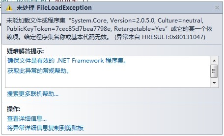

、

Autofac是一个轻量级的依赖注入的框架，同类型的框架还有Spring.NET，Unity，Castle等。

　　Autofac的使用有一个非常让人郁闷的地方，就是服务器要求安装有Microsoft .NET Framework 4  KB2468871。该补丁的地址是：http://www.microsoft.com/zh-cn/download/confirmation.aspx?id=3556 如果不安装，则运行程序会报如下错误：

　　

　　具体信息可以到这里去查看：https://code.google.com/p/autofac/wiki/FrequentlyAskedQuestions

　　这篇文章以一个最简单的例子，开始Autofac的学习：

[](javascript:void(0);)

```
namespace ConsoleApplication3
{
    class Program
    {
        static void Main(string[] args)
        {
            ContainerBuilder builder = new ContainerBuilder();
            builder.RegisterType<AutoFacManager>();
            builder.RegisterType<Worker>().As<IPerson>();
            using (IContainer container = builder.Build())
            {
                AutoFacManager manager = container.Resolve<AutoFacManager>();
                manager.Say();
            } 

            Console.ReadKey();
        }
    }

    public interface IPerson
    {
        void Say();
    }

    public class Worker : IPerson
    {
        public void Say()
        {
            Console.WriteLine("我是一个工人！");
        }
    }

    public class Student : IPerson
    {
        public void Say()
        {
            Console.WriteLine("我是一个学生！");
        }
    }

    public class AutoFacManager
    {
        IPerson person;

        public AutoFacManager(IPerson MyPerson)
        {
            person = MyPerson;
        }

        public void Say()
        {
            person.Say();
        }
    }
}
```

[](javascript:void(0);)

　　以上例子，是一个最简单的例子，输出如下：

　　

　　简单解释：

　　1、ContainerBuilder类型的作用

　　　　组件通过ContainerBuilder的对象注册。  

　　2、组件

　　　　对象需要从组件中来获取，比如例子中的Worker类的实例就需要从组件中获取。

　　3、哪些实例可以作为组件

- Lambda表达式
- 一个类型
- 一个预编译的实例
- 实例类型所在的程序集

　　4、容器

　　　　ContainerBuilder的Build()方法可以创建容易，从容器的Resolve()方法能够获得对象。

　　5、为了指定组件服务是某一接口

　　　　As()方法将用于注册时之指定：builder.RegisterTye<TaskController>().As<TController>(); 
　　6、组件的依赖关系

　　　　组件的依赖关系主要通过接口实现，如Worker:IPerson

 

作者：[Cat Qi](http://qixuejia.cnblogs.com)
 出处：[http://qixuejia.cnblogs.com/](http://qixuejia.cnblogs.com)
 本文版权归作者和博客园共有，欢迎转载，但未经作者同意必须保留此段声明，且在文章页面明显位置给出原文连接，否则保留追究法律责任的权利。

​    分类:             [框架设计：IoC/DI](https://www.cnblogs.com/qixuejia/category/658230.html)