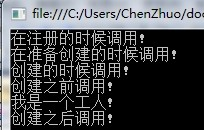

# [Autofac 组件、服务、自动装配 《第二篇》](https://www.cnblogs.com/qixuejia/p/5009837.html)


https://www.cnblogs.com/qixuejia/p/5009837.html

# 一、组件

　　创建出来的对象需要从组件中来获取，组件的创建有如下4种(延续第一篇的Demo，仅仅变动所贴出的代码)方式：

### 　　**1、类型创建RegisterType**

　　AutoFac能够通过反射检查一个类型,选择一个合适的构造函数,创造这个对象的实例。主要通过RegisterType<T>() 和 RegisterType(Type) 两个方法以这种方式建立。

　　ContainerBuilder使用 As() 方法将Component封装成了服务使用。

```
    builder.RegisterType<AutoFacManager>();
    builder.RegisterType<Worker>().As<IPerson>();
```

### 　　**2、实例创建**

```
　　builder.RegisterInstance<AutoFacManager>(new AutoFacManager(new Worker()));
```

### 　　**单例**

　　提供示例的方式，还有一个功能，就是不影响系统中原有的单例：

```
　　builder.RegisterInstance(MySingleton.GetInstance()).ExternallyOwned();　　//将自己系统中原有的单例注册为容器托管的单例
```

　　这种方法会确保系统中的单例实例最终转化为由容器托管的单例实例。

### 　　**3、Lambda表达式创建**

　　Lambda的方式也是Autofac通过反射的方式实现

```
    builder.Register(c => new AutoFacManager(c.Resolve<IPerson>()));
    builder.RegisterType<Worker>().As<IPerson>();
```

### 　　**4、程序集创建**

　　程序集的创建主要通过RegisterAssemblyTypes()方法实现，Autofac会自动在程序集中查找匹配的类型用于创建实例。

```
    builder.RegisterAssemblyTypes(Assembly.GetExecutingAssembly()); //在当前正在运行的程序集中找
    builder.RegisterType<Worker>().As<IPerson>();
```

### 　　**5、泛型注册**

　　泛型注册通过RegisterGeneric() 这个方法实现，在容易中可以创建出泛型的具体对象。

[](javascript:void(0);)

```
    //泛型注册,可以通过容器返回List<T> 如:List<string>,List<int>等等
    builder.RegisterGeneric(typeof(List<>)).As(typeof(IList<>)).InstancePerLifetimeScope();
    using (IContainer container = builder.Build())
    {
        IList<string> ListString = container.Resolve<IList<string>>();
    } 
```

[](javascript:void(0);)

### 　　**6、默认的注册**

　　如果一个类型被多次注册,以最后注册的为准。通过使用PreserveExistingDefaults() 修饰符，可以指定某个注册为非默认值。

[](javascript:void(0);)

```
    ContainerBuilder builder = new ContainerBuilder();
    builder.RegisterType<AutoFacManager>();
    builder.RegisterType<Worker>().As<IPerson>();
    builder.RegisterType<Student>().As<IPerson>().PreserveExistingDefaults();   //指定Student为非默认值
    using (IContainer container = builder.Build())
    {
        AutoFacManager manager = container.Resolve<AutoFacManager>();
        manager.Say();  //输出我是一个工人
    } 
```

[](javascript:void(0);)

　　如果不使用PreserveExistingDefaults()，那么将输出“我是一个学生”。

# 二、服务

　　Autofac有三种典型的方式区分服务，同一个服务的不同实现可以由类型，名称和键区分。

### 　　**1、类型**

　　类型是描述服务的基本方法

```
　　builder.RegisterType<Worker>().As<IPerson>();   //IPerson类型的服务和Worker的组件连接起来，这个服务可以创建Worker类的实例
```

　　并且上面的服务在自动装备中也有效

```
　　AutoFacManager manager = container.Resolve<AutoFacManager>();
```

### 　　**2、名字**

　　服务可以进一步按名字识别。使用这种方式时，用 Named()注册方法代替As()以指定名字:

```
　　builder.RegisterType<Worker>().Named<IPerson>("worker");
```

　　使用Name可以检索服务创建实例：

```
　　IPerson p = container.ResolveNamed<IPerson>("worker");
```

　　ResolveNamed()只是Resolve()的简单重载，指定名字的服务其实是指定键的服务的简单版本。

### 　　**3、键**

　　有Name的方式很方便，但是值支持字符串，但有时候我们可能需要通过其他类型作键。

　　例如，使用枚举作为key：

```
　　public enum DeviceState { Worker, Student }
```

　　使用key注册服务，通过Keyed<T>()方法：

```
　　builder.RegisterType<Student>().Keyed<IPerson>(DeviceState.Student);
```

### 　　**显式检索**

　　使用key检索服务以创建实例，通过ResolveKeyd()方法：

```
　　IPerson p = container.ResolveKeyed<IPerson>(DeviceState.Student);
```

 　ResolveKeyd()会导致容器被当做 Service Locator使用，这是不被推荐的。应该使用IIndex type替代。

###  　**IIndex索引**

　　Autofac.Features.Indexed.IIndex<K,V>是Autofac自动实现的一个关联类型。component可以使用IIndex<K,V>作为参数的构造函数从基于键的服务中选择需要的实现。

[](javascript:void(0);)

```
    builder.RegisterType<Student>().Keyed<IPerson>(DeviceState.Student);
    using (IContainer container = builder.Build())
    {
        IIndex<DeviceState, IPerson> IIndex = container.Resolve<IIndex<DeviceState, IPerson>>();
        IPerson p = IIndex[DeviceState.Student];
        p.Say();  //输出我是一个学生
    } 
```

[](javascript:void(0);)

　　IIndex中第一个泛型参数要跟注册时一致，在例子中是DeviceState枚举。其他两种注册方法没有这样的索引查找功能，这也是为什么设计者推荐Keyed注册的原因之一。

# 三、自动装配

　　从容器中的可用服务中选择一个构造函数来创造对象，这个过程叫做自动装配。这个过程是通过反射实现的，所以实际上容器创造对象的行为比较适合用在配置环境中。

### 　　**1、选择构造函数**

　　Autofac**默认从容器中选择参数最多的构造函数**。如果想要选择一个不同的构造函数，就需要在注册的时候就指定它。

```
　　builder.RegisterType(typeof(Worker)).UsingConstructor(typeof(int));
```

　　这种写法将指定调用Worker(int)构造函数，如该构造函数不存在则报错。

### 　　**2、额外的构造函数参数**

　　有两种方式可以添加额外的构造函数参数，在注册的时候和在检索的时候。在使用自动装配实例的时候这两种都会用到。

### 　　**注册时添加参数**

　　使用WithParameters()方法在每一次创建对象的时候将组件和参数关联起来。

```
    List<NamedParameter> ListNamedParameter = new List<NamedParameter>() { new NamedParameter("Id", 1), new NamedParameter("Name", "张三") };
    builder.RegisterType<Worker>().WithParameters(ListNamedParameter).As<IPerson>();
```

### 　　**在检索阶段添加参数**

　　在Resolve()的时候提供的参数会覆盖所有名字相同的参数，在注册阶段提供的参数会覆盖容器中所有可能的服务。

### 　　**3、自动装配**

　　至今为止，自动装配最大的作用就是减少重复配置。许多相似的component无论在哪里注册，都可以通过扫描使用自动装配。

```
　　builder.RegisterAssemblyTypes(Assembly.GetExecutingAssembly()).As<IPerson>();
```

　　在需要的时候，依然可以创建指定的构造函数创建指定的类。

```
　　builder.Register(c => new Worker(2,"关羽"));
```

# 四、程序集扫描

###  　**1、扫描**

　　Autofac可以使用约定在程序集中注册或者寻找组件。

　　Autofac可以根据用户指定的规则在程序集中注册一系列的类型，这种方法叫做convention-driven registration或者扫描。

```
　　builder.RegisterAssemblyTypes(Assembly.GetExecutingAssembly()).Where(t => t.Name.EndsWith("Manager"));
```

　　每个RegisterAssemblyTypes方法只能应用一套规则。如果有多套不同的集合要注册，那就有必要多次调用RegisterAssemblyTypes。

### 　　**2、选择类型**

　　RegisterAssemblyTypes接受程序集的集合。默认情况下，程序集中所有公共具体的类都会被注册。

　　如果想要过滤注册的类型，可以使用Where.向下面这样：

```
　　Where(t => t.Name.EndsWith("Manager"))
```

　　如果想要排除某些类型，使用Except()：

```
　　Except<AutoFacManager)>()
```

　　或者，自定义那些已经排除的类型的注册：

```
　　Except<Worker>(ct =>ct.As<IPerson>().SingleInstance())
```

　　多个过滤器可以同时使用，这时他们之间是AND的关系。

### 　　**3、指定服务**

　　RegisterAssemblyTypes这个注册方法是注册单个方法的超集，所以类似As的方法也可以用在程序集中，例如

```
　　As<IPerson>();
```

　　As和Named这两个方法额外的重载方法接受lambda表达式来决定服务会提供什么样的类型。

# 五、事件[生命 周期]

## 　　**1、激活事件**

　　在component生命周期的不同阶段使用事件。

　　Autofac暴露五个事件接口供实例的按如下顺序调用

1. ### OnRegistered

2. ### OnPreparing

3. ### OnActivated

4. ### OnActivating

5. ### OnRelease

　　这些事件会在注册的时候被订阅，或者被附加到IComponentRegistration 的时候。

[](javascript:void(0);)

```
    builder.RegisterType<Worker>().As<IPerson>()
        .OnRegistered(e => Console.WriteLine("在注册的时候调用!"))
        .OnPreparing(e => Console.WriteLine("在准备创建的时候调用!"))
        .OnActivating(e => Console.WriteLine("在创建之前调用!"))
        .OnActivated(e => Console.WriteLine("创建之后调用!"))
        .OnRelease(e => Console.WriteLine("在释放占用的资源之前调用!"));
```

[](javascript:void(0);)

　　以上示例输出如下：

　　

### 　　**OnActivating**

　　组件被创建之前调用，在这里你可以：

1. ##### 将实例转向另外一个或者使用代理封装它

2. ##### 进行属性注入

3. ##### 执行其他初始化工作

### 　　**OnActivated**

　　在component被完全创建的时候调用一次。在这个时候你可以执行程序级别的一些工作（这些工作依赖于对象被完全创建）-这种情况很罕见。

### 　　**OnRelease**

　　替代component的标准清理方法。实现了IDisposable 接口的标准清理方法（没有标记为ExternallyOwned）  通过调用Dispose  方法。没有实现IDisposable或者被标记为ExternallyOwned的清理方法是一个空函数-不执行任何操作。OnRelease  就是用来覆盖默认的清理行为的。

# 六、属性注入

### 　　属性注入使用可写属性而不是构造函数参数实现注入。

　　示例：

```csharp
    builder.Register(c => new AutoFacManager { person = c.Resolve<IPerson>() });
    builder.RegisterType<Worker>().As<IPerson>();
```

　　为了提供循环依赖（就是当A使用B的时候B已经初始化），需要使用OnActivated事件接口：

```csharp
    builder.Register(c => new AutoFacManager()).OnActivated(e => e.Instance.person = e.Context.Resolve<IPerson>());
    builder.RegisterType<Worker>().As<IPerson>();
```

### 　　通过反射，使用PropertiesAutowired()修饰符注入属性:

```csharp
    builder.RegisterType<AutoFacManager>().PropertiesAutowired();
    builder.RegisterType<Worker>().As<IPerson>();
```

　　如果你预先知道属性的名字和值，你可以使用:

```csharp
    builder.RegisterType<AutoFacManager>().WithProperty("person", new Worker());
    builder.RegisterType<Worker>().As<IPerson>();
```

# 七、方法注入

　　可以实现方法注入的方式有两种。

### 　　**1、使用Activator**

　　如果你使用委托来激活，只要调用这个方法在激活中

[](javascript:void(0);)

```
    builder.Register(c =>
    {
        var result = new AutoFacManager();
        result.SetDependency(c.Resolve<IPerson>());
        return result;
    });
```

[](javascript:void(0);)

　　注意，使用这种方法，AutoFacManager类里必须要有这个方法：

```csharp
    public void SetDependency(IPerson MyPerson)
    {
        person = MyPerson;
    }
```

### 　　**2、使用Activating Handler**

　　如果你使用另外一种激活，比如反射激活，创建激活的事件接口OnActivating，这种方式仅需一行代码：

```csharp
　　builder.Register<AutoFacManager>(c => new AutoFacManager()).OnActivating(e => e.Instance.SetDependency(new Worker()));
```

# 八、Resolve的参数

　　当注册或者检索component的时候可以使用参数。

　　**1、传递参数给Resolve**

　　Resolve接受可变参数或IEnumerable<T>传入多个值

[](javascript:void(0);)

```csharp
    using (IContainer container = builder.Build())
    {
        AutoFacManager manager = container.Resolve<AutoFacManager>(new NamedParameter("name", "刘备"));
        Console.WriteLine(manager.Name);    //输出 刘备
        manager.Say();
    }
```

[](javascript:void(0);)

　　此时，AutoFacManager下必须添加如下构造函数

```csharp
    public AutoFacManager(string name,IPerson MyPerson)
    {
        Name = name;
        person = MyPerson;
    }
```

　　**2、可用的参数类型**

　　Autofac提供几种不同的参数对应策略：

1. NamedParameter ：像上面那样对应的参数名字
2. TypedParameter：对应到参数的类型（必须是具体的类型）
3. ResolvedParameter：灵活的参数匹配
4. NamedParameter 和TypedParameter：只能提供常量参数

　　**3、从表达式中使用参数**

　　如果使用表达式注册的方式，可以使用第二个可用的委托参数来获得参数。

[](javascript:void(0);)

```
    builder.Register((c, p) => new AutoFacManager(p.Named<string>("name"), c.Resolve<IPerson>()));
    builder.RegisterType<Worker>().As<IPerson>();
    using (IContainer container = builder.Build())
    {
        AutoFacManager manager = container.Resolve<AutoFacManager>(new NamedParameter("name", "刘备"));
        Console.WriteLine(manager.Name);    //输出刘备
        manager.Say();
    }
```

[](javascript:void(0);)

# 九、元数据

　　Autofac提供一些机制去创建和使用component的元数据。元数据是存储component中的关于这个component的信息，不需要创建实例也能访问。

　　**1、在注册的时候添加元数据**

　　值描述的元数据在注册阶段和component联系起来，每个元数据都是一个键值对：

```
    builder.RegisterType<AutoFacManager>();
    builder.Register(c => new Worker()).As<IPerson>().WithMetadata("大将", "赵云");
```

　　用XML文件可以表示为:

[](javascript:void(0);)

```
　　<component
    　　type="ConsoleApplication3.Program.Worker, ConsoleApplication3"
    　　service="ConsoleApplication3.Program.IPerson, ConsoleApplication3" >
    　　<metadata>
        　　<item name="大将" value="赵云" type="System.String" />
     　　</metadata>
　　</component>
```

[](javascript:void(0);)

　　**2、使用元数据**

　　不用于一般的属性，元数据和component本身是相互独立额度。

　　这使得在运行条件下从很多component中选择一个时非常有用，或者元数据不是component实例的固有属性时。元数据可以表述ITask 执行的时间，或者实现了ICommand的按钮标题。

　　另外一些component可以通过Meta 使用元数据。

# 十、循环依赖

　　循环依赖是指运行期间对象之间的相互依赖

　　目前，Autofac仅仅由处理构造函数/属性依赖的方法。

　　**1、构造函数/属性依赖**

 　使用含有属性依赖的类时,使用Activated事件的InjectUnsetProperties。

[](javascript:void(0);)

```
　　public class Student
　　{
    　　public Student(Worker worker) { }
　　}
 
　　public class Worker
　　{
    　　public Student Student { get; set; }
　　}
 
　　ContainerBuilder cb = new ContainerBuilder();
　　cb.Register<Student>();
　　cb.Register<Worker>().OnActivated(ActivatedHandler.InjectUnsetProperties);
```

[](javascript:void(0);)

# 十一、泛型

　　给定一个开放的泛型，Autofac会提供一个具体的实现。

　　开放的泛型类型使用泛型服务注册需要给定一个服务类型和一个实现类型。

[](javascript:void(0);)

```
    builder.RegisterGeneric(typeof(List<>)).As(typeof(IList<>));
    using (IContainer container = builder.Build())
    {
        var tt = container.Resolve<IList<int>>();
        Console.WriteLine(tt.GetType().FullName);
    }
```

[](javascript:void(0);)

　　Autofac关心泛型约束。如果一个有约束的实现类型对服务不可用，那么这个实现类型将被忽略。

# 十二、适配器和装饰器

　　Autofac提供一些机制来实现适配器模式和装饰器模式。

　　**1、适配器**

　　一个适配器使用一个服务并且适配另外一个。
　　如果一个适配器在Autofac中被注册，Autofac会为每一个适配服务的实现创建单独的适配器。
　　这个介绍性的文章描述了适配器在Autofac中是如何实现的。

　　**2、装饰器**

　　装饰器像适配器一样，在其中封装了一个具体的服务的实现，但是和适配器相比，装饰器暴露出的服务和它封装的一样。

# 十三、实例生命周期

　　实例生命周期决定在同一个服务的每个请求的实例是如何共享的。

　　当请求一个服务的时候，Autofac会返回一个单例 (single instance作用域), 一个新的对象 (per lifetime作用域) 或者在某种上下文环境中的单例。比如 一个线程 或者一个HTTP请求 (per lifetime 作用域)。

　　这条规则适用于显式调用Resolve从容器中检索对象或者满足依赖而隐式实现的对象。

### 　　**1、Per Dependency**

　　在其他容器中也称作瞬态或者工厂，使用Per Dependency作用域，服务对于每次请求都会返回互补影响实例。

　　在没有指定其他参数的情况下，这是默认是作用域。

```
　　builder.RegisterType<Worker>();
 
　　// or
 
　　builder.RegisterType<Worker>().InstancePerDependency();
```

### 　　**2、Single Instance**

　　使用Single Instance作用域，所有对父容器或者嵌套容器的请求都会返回同一个实例。

```
　　builder.RegisterType<Worker>().SingleInstance();
```

### 　　**3、Per Lifetime Scope**

　　这个作用域适用于嵌套的生命周期。一个使用Per Lifetime 作用域的component在一个 nested lifetime scope内最多有一个实例。

　　当对象特定于一个工作单元时，这个非常有用。比如，一个HTTP请求，每一个工作单元都会创建一个nested  lifetime，如果在每一次HTTP请求中创建一个nested lifetime，那么其他使用 per-lifetime  的component在每次HTTP请求中只会拥有一个实例。

　　这种配置模型在其他容器中等价于per-HTTP-request, per-thread等。

```
　　builder.RegisterType<Worker>().InstancePerLifetimeScope();
```

　　ASP.NET和WCF集成中，每一次web请求或者方法调用，InstancePerLifetimeScope会被默认附加到component上。

###  　**4、上下文**

　　上下文作用域和per-lifetime作用域类似，但是对可见性提供更多显示的控制。

　　在大多数程序中，同一层次的容器嵌套代表一个工作单元，如果需要多层嵌套（例如global->request->transation），可以使用标签确保component在多层结构中的某一层共享。

```
　　builder.RegisterType<XWorker>().InstancePerMatchingLifetimeScope(MyContextHierarchy.UserSession);
```

　　提供的标签和生命周期作用域是对应的

```
　　var userSessionLifetime = container.BeginLifetimeScope();
　　userSessionLifetime.Tag = MyContextHierarchy.UserSession;
```

 

作者：[Cat Qi](http://qixuejia.cnblogs.com)
 出处：[http://qixuejia.cnblogs.com/](http://qixuejia.cnblogs.com)
 本文版权归作者和博客园共有，欢迎转载，但未经作者同意必须保留此段声明，且在文章页面明显位置给出原文连接，否则保留追究法律责任的权利。

​    分类:             [框架设计：IoC/DI](https://www.cnblogs.com/qixuejia/category/658230.html)