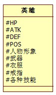
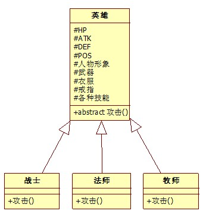
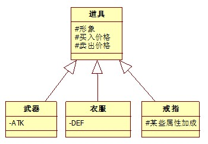
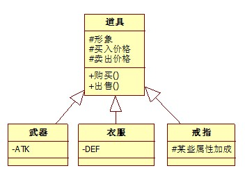
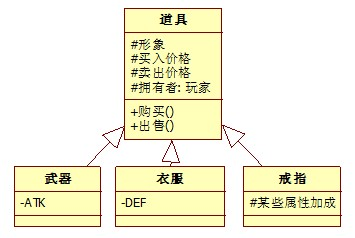
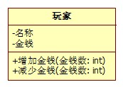
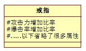
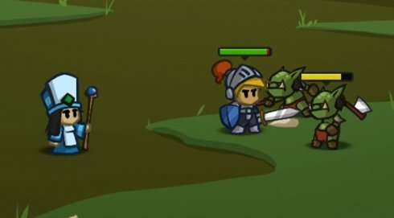
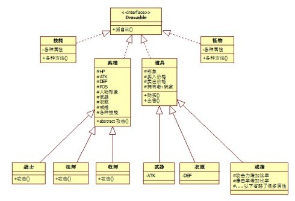
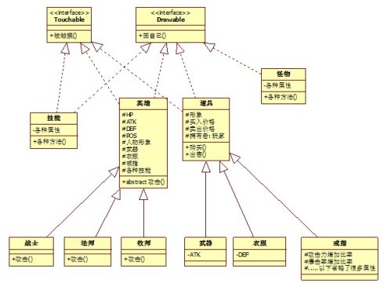

#  			[面向对象设计与分析实例](https://www.cnblogs.com/zknublx/p/6093875.html)

#  			[面向对象设计与分析实例](https://www.cnblogs.com/zknublx/p/6093875.html) 		

**面向对象程序设计有5条基本设计原则，分别是：单一职责原则、开放封闭原则、依赖倒置原则、接口隔离原则和Liskov替换原则，但对于初学者来说，这5条基本设计原则可能有点难以理解。**

  下面我以BattleHeart（战争之心）这款角色扮演类的手机游戏（已从IOS移植到Android了）为背景，分析一下其中的类的设计（注：以下为个人的设计想法，因此可能与这款游戏真实的设计有所不同）。

  这款游戏中可以操作4个英雄，英雄种类分别有：战士、法师、牧师、刺客等。每个英雄都拥有自己的技能、都能够装备武器、衣服、戒指等。

  其中，无论是战士、法师或者其他种类的英雄，他们都有一些共同的属性，如：HP、ATK（攻击力）、DEF（防御力）、POS（位置）、人物形象、各种装备、各种技能等

  因此，我们可以设计出一个公共的英雄类，如下图所示：

 

  注：这里只列出部分属性，可根据需要增加或减少。

  注：#代表为protected –代表private +代表public

  而每种英雄，则又都有各自不同的地方。如：攻击方式不同，其中战士是近身攻击、法师是远程攻击、牧师是加血等。因此，不同种类的英雄，攻击方式的实现也就不一样。所以，我们可以给英雄增加一个抽象方法——攻击，然后由不同的子类来作对应的实现，如下图所示：

 

​    游戏中，每个英雄都可以装备一些武器之类的道具，而道具又分很多种类，一类是可以被装备的，一类是可以使用的消耗品。由于本游戏中只有可以被装备的道具种类，因此道具的设计比较简单。道具的属性有：形象（即我们看到的样子）、买入价格、卖出价格等。又因为武器是加攻击力这类伤害属性的，而衣服则是加防御力这类减伤属性的，戒指是加一些特殊属性的。所以如果把这些属性都放在道具类中，道具类的属性就会显得很庞大。再者当道具为武器时，衣服相关的属性相对来说是没有意义的。因而我们可以把武器、衣服、戒指等作为道具的子类，再加入自己需要的属性。设计如下图所示：

 

 其中，所有道具都应有购买和出售功能，因而，可在道具类中加入购买和出售方法，如下图所示：

 

  这里，可能有些人会觉得很奇怪，我们玩游戏时，购买道具和出售道具不是由我们来操作的么？那不是应该把购买和出售功能放到玩家类中？（注：玩家类是对我们游戏中玩家的一个抽象，这里我就不做设计了）

​         在前面的所有类图中，我们可以看到，每个类中的属性都不是public的，如果是父类中，使用protected，这样子类才能访问，而如果是在子类中，则使用的是private，意思为这属性是我特有的，且其他类不能直接访问。这是类设计的一个基本原则：每个对象的数据只能由自己来访问和处理，如果其他对象想修改某个对象里的状态（数据），则只能调用其提供的public方法。

​       而我们需要出售道具时，需要把卖出价格增加到玩家的钱包中。而玩家是不应该可以访问道具的卖出价格的，因而，出售功能应由道具来提供，因为只能道具才知道自己能卖出多少钱！同样，购买功能也是如此，应由道具来提供。

​         仔细的人可能会发现一个问题——出售道具时，玩家的金钱应该是会增加的，而购买道具时，玩家的钱应该会减少。而在上面的设计中，道具在出售时，只知道卖出价格，但却不知道玩家是谁，因而无法给玩家增加金钱！所以应修改上面的设计，使得道具能知道自己的拥有者是谁！如下图所示：

 

  而由于金钱的属性是属于玩家类的，道具不应该能直接访问，所以玩家应该有一个方法提供给道具来增加金钱！这里我给出一个简单的玩家类设计（这个玩家类只满足道具类可以使用，真正的设计会更加复杂），如下图所示：

 

​          大家可能有注意到，上面的戒指类的设计有点问题。在这款游戏中，戒指的作用是属性的加成。但由于属性种类有很多（如命中率、爆击率等），而每款戒指的加成所针对的属性不一致。因而，我们可以使用一种设计——每款戒指都继承于戒指类。但这种设计有很大的缺陷，由于加成方式有很多，如一款戒指的功能为【攻击力加30%，每秒加3点血】，而另一款戒指的功能为【增加100%的爆击率】。这两款戒指的属性的数量都不相同，功能也不一样，因而每款戒指都应为一个子类。那假如我有很多不同功能的戒指，岂不是需要很多子类？这样的话，就会引起类的膨胀！这种设计显然是不合理的。

​        那我们应该如何设计呢？我们知道，每个英雄的属性值是有限的，而每个戒指可能拥有的【加成属性方式】有多种，但这些戒指的【加成属性方式】却是有限的。既然这样，那我们是不是可以直接让戒指类包含全部【加成属性方式】，然后如果没有这种【加成属性方式】的话，就把该【加成属性方式】置为空。这样，我们只有需要增加【加成属性方式】时，才需要修改戒指类，而不是说每增加一款新的戒指时，就需要增加一个子类！因而，新的设计应该如下所示：

 

​        现在感觉好多了吧？但这样的设计是不是就是可以的呢？如果是【每3秒自动回复10%的HP】、【每5秒自动回复10%的HP】这些功能呢？是不是发现这种设计也无法完成这些功能呢？

​        接下来戒指的设计我就不深谈了，这里我给一个思路：抽象出一个功能类，然后戒指类拥有一个功能类的集合。至于功能类应该有什么属性，提供什么方法，大家可以深入思考一下！

  

​        到了这里，其实类的设计有很多地方没考虑和设计（如英雄使用技能，英雄装备武器等），也有很多类也没设计出来（如技能类、怪物类等），但类的设计思想是一样的，所以我就不深入设计了，留给大家进行思考！

  

  **下面，我们考虑一下接口的设计问题。**

  开发过游戏的都知道（没开发过的也不要紧），**游戏其实和电影一样，都是一帧一帧快速地切换显示（其中一帧可以理解为一幅画）**，以达到动态的效果。而BattleHeart这款游戏，是属于一款2D的角色扮演游戏，因此，我们在画每一帧时，可以使用一种简单的方式——出现在最下面东西（如背景）的先画，出现在最上面的最后画（如英雄），如此按顺序地画，那么画出来的效果就是：最后画的，会覆盖前面画的。如果背景是一条路，这样看上去英雄就站在路上了！

 

​       我们看下这款游戏的截图，可以看到，那个英雄和怪物是站在地面（背景）上的，因而是背景先画。而英雄和怪物则是谁在下面，谁就应该显示出来，所以应该把英雄和怪物按Y轴方向从上往下按依次画出来，这样就会有一种立体感。

​         根据上面类的设计，我们知道，谁拥有数据，谁才能直接操作数据。而这里我们要把这游戏的每一帧画面画出来，显然只有英雄才知道自己长什么样的，只能装备（道具）才知道自己长什么样的，只有怪物才知道自己长什么样的，只有技能才知道自己长什么样的。因而，我们要把一帧画面画出来，就需要去让英雄、怪物、装备及技能等按一定的顺序把自己画出来。

​       既然它们都能把自己画出来，就应该拥有一个画自己的方法！由于有很多不同的类，都需要有一个画的方法，那么，我们是不是可以把这个方法抽象出来了呢？这里，我设计一个Drawable接口，意为可画，然后里面有一个画自己的方法。设计如下图所示：

 

  

​       接下来，我们在看一下这款游戏的操作。这款游戏是属于IOS下的游戏，且已经移植到Android平台上。由于这两个平台都是触屏的，因而这款游戏的玩法是使用触屏的方式，去操作英雄移动、攻击、使用技能等。

 在这里，为了更好地说明下面的设计，我简单地说一下这款游戏的玩法：玩家点击英雄，英雄对应的技能会显示到左上角中，如果这时候再点某个技能，那么该英雄就会去释放出对应的技能。而如果玩家点击了英雄后：

 1、 拖动到怪物上，该英雄就会对怪物进行攻击。

 2、 拖动到地面上，该英雄就会移动到那里。

 3、 拖动到英雄上（前提是该英雄是牧师，否则当作拖动到了英雄那里的地面上），该英雄就会给对应的英雄进行加血。

 其他的操作，我就不一一说明了。

​       

 显然，在这款游戏中，英雄、技能、道具等都能被触摸，作为输入事件，并引起对应输出（如英雄被选中，英雄移动，技能释放等）。而怪物被触摸后，是不会产生任何效果的。因而我们可以定义一个Touchable（可触摸）的接口，接口中定义一个被触摸的方法。如下图所示：

 

  

 在上面的设计中，有很多方面比较细节上的设计是没有做的，如怪物是智能攻击的，因而怪物应该有自动选择目标进行攻击的方法。同时，可以设计一个专门管理怪物的Factory（工厂）来控制怪物的自动产生等等。

  

 或许会有人问，这样面向对象的设计有什么好处呢？下面我来以上图的设计，写一段半伪代码，给大家感受一下这样设计的好处。

 由于每个平台画图的函数思想类似，但写法不同，所以下面不会出现平台相关的写法。

​       

 由于Java是一门面向对象的程序设计语言，下面我使用Java代码来写。

 

public class GameView {

​       //可以被触摸的东西的集合，如英雄、技能、道具等

​       List<Touchable>  touchable;

​        //可以被画的出来东西的集合，如英雄、怪物、技能等，都应该这里

​       List<Drawable>  drawables;        

​      

​        …其他属性和方法的实现等

​      

​       public void  画界面(Graphics g) {

​              for(Drawable d : drawables) {

​                     d.画自己();

​              }

​       }

 

​       public boolean  界面被触摸() {

​              for(Touchable t : touchables) {

​                     boolean isDeal = t.被触摸();

​                     if(isDeal) {

​                            return isDeal;

​                     }

​              }

​              return false;

​       }

}

 英雄画自己和被触摸的功能都可以直接放到英雄类中实现，而不需要放到其子类（战士、法师等）中实现。

 英雄的伪代码如下：

public abstract class  英雄 implements Touchable, Drawable {

 

​       …这里是各种各样的属性和方法

 

​       public abstract void  攻击();

​       public abstract boolean  识别触摸事件是否为攻击();

 

​       public boolean  被触摸() {

​              if(识别触摸事件是否为攻击()) {

​                      攻击();

​                     return true;

​              }

​       }

 

​       public void  画自己() {

​              //把自己画出来

​       }

}

 文章写到这里，差不多已经要结束了。上面的设计并不完整，且已经设计的部分可能还有一些没考虑周到的地方，欢迎大家讨论并指正。

 在结束之前，我对本文做个总结：

 **1、 谁拥有数据，则由谁来处理数据，并对外提供处理的方法。如只有道具才知道它自己的售价，因而出售的方法应由道具来提供。**

 **2、 设计应能进行扩展，如我需要增加一个英雄种类，我只需要继承英雄类。**

 **3、 应使用多个专门的接口，与可画和可被触摸没什么关联性，因而应把它们分开成两个接口来设计。**

 **4、 设计应能防止出现类的膨胀，可适当地使用组合来代替继承。**

  

 最后，回到一开始所说的5条基本设计原则，具体的大家可以百度一下，会有很多说明的。大家可以对照这个实例，理解一下这5条基本设计原则的含义！

其实生活很美好，指示你想的太多了。没有，不会，有差距很正常，因为我不会

分类: [数据库设计思想](https://www.cnblogs.com/zknublx/category/907493.html)

​         [好文要顶](javascript:void(0);)             [关注我](javascript:void(0);)     [收藏该文](javascript:void(0);)     ;)     ;) 

​             [朝阳的向日葵](https://home.cnblogs.com/u/zknublx/)
​             [关注 - 10](https://home.cnblogs.com/u/zknublx/followees)
​             [粉丝 - 77](https://home.cnblogs.com/u/zknublx/followers)         

​                 [+加关注](javascript:void(0);)     

​         1     

​         0     

​     

[« ](https://www.cnblogs.com/zknublx/p/6090441.html) 上一篇：[PostgreSQL新手入门](https://www.cnblogs.com/zknublx/p/6090441.html)
[» ](https://www.cnblogs.com/zknublx/p/6106343.html) 下一篇：[Python命令行解析argparse常用语法使用简介](https://www.cnblogs.com/zknublx/p/6106343.html)

posted @ 2016-11-23 15:33 [朝阳的向日葵](https://www.cnblogs.com/zknublx/) 阅读(3100) 评论(1)  [编辑](https://i.cnblogs.com/EditPosts.aspx?postid=6093875) [收藏](https://www.cnblogs.com/zknublx/p/6093875.html#)