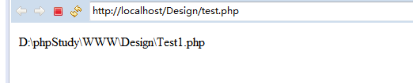
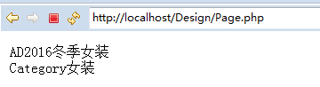
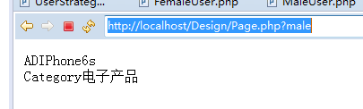
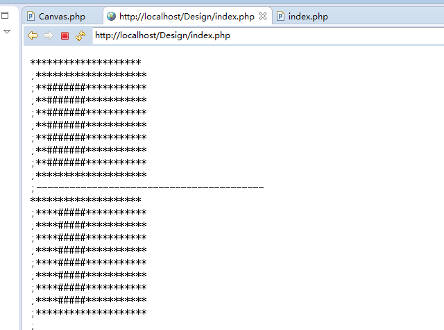

#  			[八大设计模式](https://www.cnblogs.com/lauhp/p/8778756.html) 		


**八大设计模式：**

​     **单例模式、工厂模式、注册模式、适配器模式、策略模式、观察者模式、原型模式、装饰器模式**

单例模式解决的是如何在整个项目中创建唯一对象实例的问题，工厂模式解决的是如何不通过new建立实例对象的方法。

**单例模式**

1. $_instance必须声明为静态的私有变量
2. 构造函数和析构函数必须声明为私有,防止外部程序new 类从而失去单例模式的意义
3. getInstance()方法必须设置为公有的,必须调用此方法 以返回实例的一个引用
4. ::操作符只能访问静态变量和静态函数
5. new对象都会消耗内存
6. 使用场景:最常用的地方是数据库连接。
7. 使用单例模式生成一个对象后， 该对象可以被其它众多对象所使用。
8. 私有的__clone()方法防止克隆对象

单例模式，使某个类的对象仅允许创建一个。构造函数private修饰， 
 申明一个static getInstance方法，在该方法里创建该对象的实例。如果该实例已经存在，则不创建。比如只需要创建一个数据库连接。

**工厂模式**

工厂模式，工厂方法或者类生成对象，而不是在代码中直接new。 
 使用工厂模式，可以避免当改变某个类的名字或者方法之后，在调用这个类的所有的代码中都修改它的名字或者参数。

[](javascript:void(0);)

```
Test1.php
<?php
class Test1{
    static function test(){
        echo __FILE__;
    }
}

Factory.php
<?php
class Factory{
    /*
     * 如果某个类在很多的文件中都new ClassName()，那么万一这个类的名字
     * 发生变更或者参数发生变化，如果不使用工厂模式，就需要修改每一个PHP
     * 代码，使用了工厂模式之后，只需要修改工厂类或者方法就可以了。
     */
    static function createDatabase(){
        $test = new Test1();
        return $test;
    }
}

Test.php
<?php
spl_autoload_register('autoload1');

$test = Factory::createDatabase();
$test->test();
function autoload1($class){
    $dir  = __DIR__;
    $requireFile = $dir."\\".$class.".php";
    require $requireFile;
}
```

[](javascript:void(0);)



#### 注册模式

注册模式，解决全局共享和交换对象。已经创建好的对象，挂在到某个全局可以使用的数组上，在需要使用的时候，直接从该数组上获取即可。将对象注册到全局的树上。任何地方直接去访问。

[](javascript:void(0);)

```
<?php

class Register
{
    protected static  $objects;
    function set($alias,$object)//将对象注册到全局的树上
    {
        self::$objects[$alias]=$object;//将对象放到树上
    }
    static function get($name){
        return self::$objects[$name];//获取某个注册到树上的对象
    }
    function _unset($alias)
    {
        unset(self::$objects[$alias]);//移除某个注册到树上的对象。
    }
}
```

[](javascript:void(0);)

#### 适配器模式

将各种截然不同的函数接口封装成统一的API。 
PHP中的数据库操作有MySQL,MySQLi,PDO三种，可以用适配器模式统一成一致，使不同的数据库操作，统一成一样的API。类似的场景还有cache适配器，可以将memcache,redis,file,apc等不同的缓存函数，统一成一致。 
首先定义一个接口(有几个方法，以及相应的参数)。然后，有几种不同的情况，就写几个类实现该接口。将完成相似功能的函数，统一成一致的方法。

[](javascript:void(0);)

```
接口 IDatabase
<?php
namespace IMooc;
interface IDatabase
{
    function connect($host, $user, $passwd, $dbname);
    function query($sql);
    function close();
}
```

[](javascript:void(0);)

[](javascript:void(0);)

```
MySQL
<?php
namespace IMooc\Database;
use IMooc\IDatabase;
class MySQL implements IDatabase
{
    protected $conn;
    function connect($host, $user, $passwd, $dbname)
    {
        $conn = mysql_connect($host, $user, $passwd);
        mysql_select_db($dbname, $conn);
        $this->conn = $conn;
    }

    function query($sql)
    {
        $res = mysql_query($sql, $this->conn);
        return $res;
    }

    function close()
    {
        mysql_close($this->conn);
    }
}
```

[](javascript:void(0);)

[](javascript:void(0);)

```
MySQLi
<?php
namespace IMooc\Database;
use IMooc\IDatabase;
class MySQLi implements IDatabase
{
    protected $conn;

    function connect($host, $user, $passwd, $dbname)
    {
        $conn = mysqli_connect($host, $user, $passwd, $dbname);
        $this->conn = $conn;
    }

    function query($sql)
    {
        return mysqli_query($this->conn, $sql);
    }

    function close()
    {
        mysqli_close($this->conn);
    }
}
```

[](javascript:void(0);)

[](javascript:void(0);)

```
PDO
<?php
namespace IMooc\Database;
use IMooc\IDatabase;
class PDO implements IDatabase
{
    protected $conn;
    function connect($host, $user, $passwd, $dbname)
    {
        $conn = new \PDO("mysql:host=$host;dbname=$dbname", $user, $passwd);
        $this->conn = $conn;
    }
function query($sql)
    {
        return $this->conn->query($sql);
    }

    function close()
    {
        unset($this->conn);
    }
}
```

[](javascript:void(0);)

通过以上案例，PHP与MySQL的数据库交互有三套API，在不同的场景下可能使用不同的API，那么开发好的代码，换一个环境，可能就要改变它的数据库API，那么就要改写所有的代码，使用适配器模式之后，就可以使用统一的API去屏蔽底层的API差异带来的环境改变之后需要改写代码的问题。

#### 策略模式

策略模式，将一组特定的行为和算法封装成类，以适应某些特定的上下文环境。 
eg：假如有一个电商网站系统，针对男性女性用户要各自跳转到不同的商品类目，并且所有的广告位展示不同的广告。在传统的代码中，都是在系统中加入各种if   else的判断，硬编码的方式。如果有一天增加了一种用户，就需要改写代码。使用策略模式，如果新增加一种用户类型，只需要增加一种策略就可以。其他所有的地方只需要使用不同的策略就可以。 
首先声明策略的接口文件，约定了策略的包含的行为。然后，定义各个具体的策略实现类。

[](javascript:void(0);)

```
UserStrategy.php
<?php
/*
 * 声明策略文件的接口，约定策略包含的行为。
 */
interface UserStrategy
{
    function showAd();
    function showCategory();
}
```

[](javascript:void(0);)

[](javascript:void(0);)

```
FemaleUser.php
<?php
require_once 'Loader.php';
class FemaleUser implements UserStrategy
{
    function showAd(){
        echo "2016冬季女装";
    }
    function showCategory(){
        echo "女装";
    }
}
```

[](javascript:void(0);)

[](javascript:void(0);)

```
MaleUser.php
<?php
require_once 'Loader.php';
class MaleUser implements UserStrategy
{
    function showAd(){
        echo "IPhone6s";
    }
    function showCategory(){
        echo "电子产品";
    }
}
```

[](javascript:void(0);)

[](javascript:void(0);)

```
Page.php//执行文件
<?php
require_once 'Loader.php';
class Page
{
    protected $strategy;
    function index(){
        echo "AD";
        $this->strategy->showAd();
        echo "<br>";
        echo "Category";
        $this->strategy->showCategory();
        echo "<br>";
    }
    function setStrategy(UserStrategy $strategy){
        $this->strategy=$strategy;
    }
}

$page = new Page();
if(isset($_GET['male'])){
    $strategy = new MaleUser();
}else {
    $strategy = new FemaleUser();
}
$page->setStrategy($strategy);
$page->index();
```

[](javascript:void(0);)

执行结果图： 


 
总结： 
通过以上方式，可以发现，在不同用户登录时显示不同的内容，但是解决了在显示时的硬编码的问题。如果要增加一种策略，只需要增加一种策略实现类，然后在入口文件中执行判断，传入这个类即可。实现了解耦。 
实现依赖倒置和控制反转 *（有待理解）* 
通过接口的方式，使得类和类之间不直接依赖。在使用该类的时候，才动态的传入该接口的一个实现类。如果要替换某个类，只需要提供一个实现了该接口的实现类，通过修改一行代码即可完成替换。

#### 观察者模式

1：观察者模式(Observer)，当一个对象状态发生变化时，依赖它的对象全部会收到通知，并自动更新。 
2：场景:一个事件发生后，要执行一连串更新操作。传统的编程方式，就是在事件的代码之后直接加入处理的逻辑。当更新的逻辑增多之后，代码会变得难以维护。这种方式是耦合的，侵入式的，增加新的逻辑需要修改事件的主体代码。 
3：观察者模式实现了低耦合，非侵入式的通知与更新机制。 
定义一个事件触发抽象类。

[](javascript:void(0);)

```
EventGenerator.php
<?php
require_once 'Loader.php';
abstract class EventGenerator{
    private $observers = array();
    function addObserver(Observer $observer){
        $this->observers[]=$observer;
    }
    function notify(){
        foreach ($this->observers as $observer){
            $observer->update();
        }
    }
}
```

[](javascript:void(0);)

定义一个观察者接口

[](javascript:void(0);)

```
Observer.php
<?php
require_once 'Loader.php';
interface Observer{
    function update();//这里就是在事件发生后要执行的逻辑
}
```

[](javascript:void(0);)

[](javascript:void(0);)

```
<?php
//一个实现了EventGenerator抽象类的类，用于具体定义某个发生的事件
require 'Loader.php';
class Event extends EventGenerator{
    function triger(){
        echo "Event<br>";
    }
}
class Observer1 implements Observer{
    function update(){
        echo "逻辑1<br>";
    }
}
class Observer2 implements Observer{
    function update(){
        echo "逻辑2<br>";
    }
}
$event = new Event();
$event->addObserver(new Observer1());
$event->addObserver(new Observer2());
$event->triger();
$event->notify();
```

[](javascript:void(0);)

当某个事件发生后，需要执行的逻辑增多时，可以以松耦合的方式去增删逻辑。也就是代码中的红色部分，只需要定义一个实现了观察者接口的类，实现复杂的逻辑，然后在红色的部分加上一行代码即可。这样实现了低耦合。

#### 原型模式

原型模式（对象克隆以避免创建对象时的消耗） 
1：与工厂模式类似，都是用来创建对象。 
2：与工厂模式的实现不同，原型模式是先创建好一个原型对象，然后通过clone原型对象来创建新的对象。这样就免去了类创建时重复的初始化操作。 
3：原型模式适用于大对象的创建，创建一个大对象需要很大的开销，如果每次new就会消耗很大，原型模式仅需要内存拷贝即可。

[](javascript:void(0);)

```
Canvas.php
<?php
require_once 'Loader.php';
class Canvas{
private $data;
function init($width = 20, $height = 10)
    {
        $data = array();
        for($i = 0; $i < $height; $i++)
        {
            for($j = 0; $j < $width; $j++)
            {
                $data[$i][$j] = '*';
            }
        }
        $this->data = $data;
    }
function rect($x1, $y1, $x2, $y2)
    {
        foreach($this->data as $k1 => $line)
        {
            if ($x1 > $k1 or $x2 < $k1) continue;
           foreach($line as $k2 => $char)
            {
              if ($y1>$k2 or $y2<$k2) continue;
                $this->data[$k1][$k2] = '#';
            }
        }
    }

    function draw(){
        foreach ($this->data as $line){
            foreach ($line as $char){
                echo $char;
            }
            echo "<br>;";
        }
    }
}
```

[](javascript:void(0);)

[](javascript:void(0);)

```
Index.php
<?php
require 'Loader.php';
$c = new Canvas();
$c->init();
/ $canvas1 = new Canvas();
// $canvas1->init();
$canvas1 = clone $c;//通过克隆，可以省去init()方法，这个方法循环两百次
//去产生一个数组。当项目中需要产生很多的这样的对象时，就会new很多的对象，那样
//是非常消耗性能的。
$canvas1->rect(2, 2, 8, 8);
$canvas1->draw();
echo "-----------------------------------------<br>";
// $canvas2 = new Canvas();
// $canvas2->init();
$canvas2 = clone $c;
$canvas2->rect(1, 4, 8, 8);
$canvas2->draw();
```

[](javascript:void(0);)

执行结果： 


#### 装饰器模式

1：装饰器模式，可以动态的添加修改类的功能 
2：一个类提供了一项功能，如果要在修改并添加额外的功能，传统的编程模式，需要写一个子类继承它，并重写实现类的方法 
3：使用装饰器模式，仅需要在运行时添加一个装饰器对象即可实现，可以实现最大额灵活性。

 

[](javascript:void(0);)

```
<?php

/**
 * 输出一个字符串
 * 装饰器动态添加功能
 * Class EchoText
 */
class EchoText
{
    protected $decorator = [];

    public function Index()
    {
        //调用装饰器前置操作
        $this->beforeEcho();
        echo "你好，我是装饰器。";
        //调用装饰器后置操作
        $this->afterEcho();
    }

    //增加装饰器
    public function addDecorator(Decorator $decorator)
    {
        $this->decorator[] = $decorator;
    }

    //执行装饰器前置操作 先进先出原则
    protected function beforeEcho()
    {
        foreach ($this->decorator as $decorator)
            $decorator->before();
    }

    //执行装饰器后置操作 先进后出原则
    protected function afterEcho()
    {
        $tmp = array_reverse($this->decorator);
        foreach ($tmp as $decorator)
            $decorator->after();
    }
}


/**
 * 装饰器接口
 * Class Decorator
 */
interface Decorator
{
    public function before();

    public function after();
}

/**
 * 颜色装饰器实现
 * Class ColorDecorator
 */
class ColorDecorator implements Decorator
{
    protected $color;

    public function __construct($color)
    {
        $this->color = $color;
    }

    public function before()
    {
        echo "<dis style='color: {$this->color}'>";
    }

    public function after()
    {
        echo "</div>";
    }
}

/**
 * 字体大小装饰器实现
 * Class SizeDecorator
 */
class SizeDecorator implements Decorator
{
    protected $size;

    public function __construct($size)
    {
        $this->size = $size;
    }

    public function before()
    {
        echo "<dis style='font-size: {$this->size}px'>";
    }

    public function after()
    {
        echo "</div>";
    }
}

//实例化输出类
$echo = new EchoText();
//增加装饰器
$echo->addDecorator(new ColorDecorator('red'));
//增加装饰器
$echo->addDecorator(new SizeDecorator('22'));
//输出
$echo->Index();
```

[](javascript:void(0);)

转载：https://blog.csdn.net/flitrue/article/details/52614599