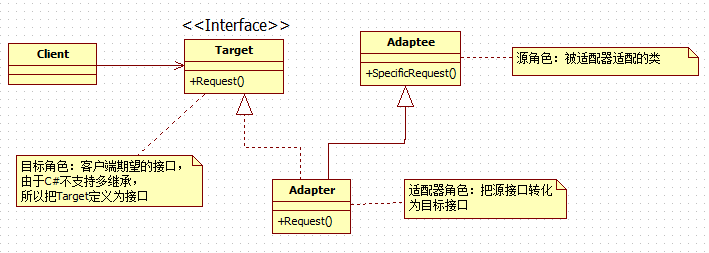

# [莫问今朝](https://www.cnblogs.com/yan7/)

## 逝者如斯夫,不舍昼夜

- [博客园](https://www.cnblogs.com/)
- [首页](https://www.cnblogs.com/yan7/)
- [新随笔](https://i.cnblogs.com/EditPosts.aspx?opt=1)
- [联系](https://msg.cnblogs.com/send/莫问今朝%26%23183%3B)
- [订阅](https://www.cnblogs.com/yan7/rss) 
- [管理](https://i.cnblogs.com/)

 随笔 - 107   文章 - 0   评论 - 57 

#  			[设计模式概念总结](https://www.cnblogs.com/yan7/p/7911815.html) 		

### 这为我的学习笔记，原文为https://www.cnblogs.com/zhili/p/DesignPatternSummery.html

百度百科【https://baike.baidu.com/item/%E8%AE%BE%E8%AE%A1%E6%A8%A1%E5%BC%8F/1212549?fr=aladdin】

### 1.单例模式(Singleton)

   确保一个类只有一个实例，并提供一个全局访问点

### 2.简单工厂

 

**优点:**

- 简单工厂模式解决了客户端直接依赖于具体对象的问题，客户端可以消除直接创建对象的责任，而仅仅是消费产品。简单工厂模式实现了对责任的分割
- 简单工厂模式也起到了代码复用的作用

**缺点：**

- 工厂类集中了所有产品创建逻辑，一旦没办法正常工作，整个系统都会受到影响
- 系统扩展困难，一旦添加新产品就不得不修改工厂逻辑，这样会造成工厂逻辑过于复杂    

### 3.工厂方法模式

 

### 4.工厂方法模式(factory method)

   定义一个用于创建对象的接口，让子类决定实例化哪个类，工厂方法使一个类的实例化延迟其子类

 

### **5.抽象工厂模式(Abstract Factory)** 

   提供了一个创建一系列相关或相互依赖对象的接口，而无需指定它们具体类。

 **优点：**

   抽象工厂模式将具体产品的创建延迟到具体工厂的子类中，这样将对象的创建封装起来，可以减少客户端与具体产品类之间的依赖，从而使系统耦合低。这样更有利于后期的维护发展

**缺点：**

   抽象工厂模式很难支持新种类产品的变化，这是因为抽象工厂接口中已经确定了可以被创建的产品集合，如果需要添加新产品，此时就必须修改抽象工厂的接口，这样涉及到抽象工厂类的以及所有子类的改变，这样违背了“开发---关闭”原则。

### 6.建造者模式（Builder Parttern）

   将一个复杂对象的构建与它的表示分离，使用同样的构造过程可以构建不同的表示

**建造模型要点**

- 在建造者模式中，指挥者是直接与客户端打交道的，指挥者将客户端创建产品的请求划分为各个部件的建造要求，再将这些请求委托到具体建造者角色，具体建造角色是完成具体产品的构建工作，却不为客户所知道
- 建造者模式主要用于“分步骤来构建一个复杂的对象”，其中“分步骤”是一个固定的组合过程，而复杂对象的各个部分是竟然变化的。
- 产品不需要抽象类，由于建造者模式的创建出的最终产品可以差异很大，所以不大可能提取出一个抽象产品类
- 由于建造者隐藏了具体产品的组装过程，所以要改变一个产品的内部表示，只需要再实现一个具体的建造者就可以了，从而能很好的更好的应对产品组成组件的需求变化
- 建造者模式解决的是“产品部分”的需要变化    

### 7.原型模式(Prototype)

​       用原型实例指定创建对象的种类,并且通过拷贝这些原型创建新对象

 

**优点：**

- 原型模式向客户隐藏了创建新实例的复杂性
- 原型模式允许动态增加或减少产品类
- 原型模式简化了实例的创建结构，工厂方法模式需要有一个与产品等级结构相同的等级结构，而原型模式不需要这样
- 产品类不需要事先确定产品的等级结构，因为原型模式适用于任何的等级结构

**缺点：**

- 每个类必须匹配一个克隆方法
- 匹配克隆方法需要对类的功能进行通盘考虑，这对于全新的类不是很难，但对于已有的类不一定容易，特别当一个类引用不支持串行化的间接对象，或者引用含有循环结构的时候。　　

###  7.适配器模式(Adapter)

​       将一个类接口转化成客户希望的另外一个接口，Adapter模式使得原来由于接口不兼容而无法一起工作的类可以一起工作

​      适配器模式分为类适配器模式和对象适配器模式

​      类适配器模式

​      

 

​     **优点**：

​           1.可以在不修改原有代码的基础上来复用现有类，很好的符合“开闭原则”

​           2.可以重新定义Adaptee（被适配的类）的部分行为，因为在类适配器模式中，Adapter是Adaptee的子类

​           3.仅仅引用一个对象，并不需要额外的字段来引用Adapter实例（这个既是优点也是缺点）

​      **缺点**：

​             1.用一个具体的Adapter类对Adaptee和Target进行匹配，当如果想要匹配一个类以及所有它的子类时，类的适配器模式就不能胜任了，因为类的适配器模式中没有引用Adaptee的实例，光调用this.SpecificRequest方法并不能去调用它的对应子类的SpecificRequest方法

​             2.采用了“多继承”的实现方式，带来了不良的高耦合

​        对象适配器

​        

 

​         **优点**：

​             1.可以在不修改原有代码的基础上来复用现有类，很好的符合“开闭原则”。

​              2.采用了“对象组合”方式，更符合松耦合

​         **缺点**：

​              1.使得重定义Adaptee的行为较困难，这需要生成Adaptee的子类并且使得Adaptee引用这个子类而不是引用Adaptee本身

​         **适配器模式使用场景**

​              1.系统需要复用现有类，而该类的接口不符合系统的需求

​               2.想要建立一个可重复使用的类，用于与一些彼此之间没有太大关系的一些类，包括一些可能在将来引进的类一起工作

​               3.对于对象适配器模式，在设计里需要改变多个已有子类的接口，如果使用类的适配器，就要针对每一个子类做一个适配器，而这不太实际。

### 8.桥接模式

​     将实现与抽象放在两个不同的类中,使两个层次可以独立改变.桥接模式强调了接口对象提供的是一种算法

​     **优点**：

​          1.抽象与实现与其实现解耦

​          2.抽象和实现可以独立扩展,不会影响到对方

​          3.实现细节对客户透明，对用于隐藏了具体的细节

​     **缺点**：

​          增加了系统的复杂度

​     **使用场景**：

​          1.如果一个系统需要在构建的抽象化角色和具体化角色之间添加更多的灵活性，避免在两个层次之间建立静态的联系

​          2.设计要求实现化角色的任何改变不应当影响客户端，或者实现化角色的改变对客户端是完全透明的

​          3.需要跨越多个平台的图形和窗口系统上

​          4.一个类存在两个独立变化的维度，且两个维度都需要进行扩展。

### 9.装饰者模式（Decorator）

​      动态的给一个对象添加一些额外的职责，就添加功能来说，装饰者模式比生成子类更加灵活

 

  **优点：**

​          1.装饰者模式和继承的目的都是扩展对象的功能，但装饰者模式比继承更加灵活

​          2.通过使用不同的具体装饰类以及这些类的排列组合，设计师可以创造出很多不同行为的组合

​          3.装饰者模式有很好的可扩展性

  **缺点：**

​         装饰者模式会导致设计中出现许多小对象，如果过度使用，会让程序变得更复杂，并且更多的对象会是的差错变得困难，特别是这些对象看起来很像。

 **使用场景：**

​        1.需要扩展一个类的功能或给一个类附加责任

​        2.需要动态的给一个对象增加功能，这些功能可以在动态的撤销

​        3.需要增加由一些基本功能的排列组合而产生的大量的功能

### 10.组合模式(CompositePattern)

​      将对象聚合成树形结构来表现"整体/部分"的层次结构。组合模型能让客户以一致的方式来处理个别对象以及对象组合。

   **组合模式中涉及到的三个角色**

​          1.抽象构件（Component）角色：这是一个抽象角色，它给参加组合的对象定义出了公共的接口及默认行为，可以用来管理所有的子对象，（在透明式的组合模型式这样的），在安全的组合模式里，构建角色并不定义出管理子对象的方法，这一定义由树枝结构对象给出。

​         2.树叶构建（Leaf）角色：树叶对象时没有下级子对象的对象，定义出参加组合的原始对象的行为

​         3.树枝（Composite）角色：代表参加组合的由下级子对象的对象，树枝对象给出所有管理子对象的方法实现，如Add，Remove等

​    **优点：**

​          1.组合模式使得客户端代码可以一致地处理对象和对象容器，无需关系处理地单个对象，还是组合地对象容器

​          2.将“客户端代码与复杂地对象容器结构”解耦

​          3.可以更容易地往组合对象中加入新的构件

​     **缺点：**

​            使得设计更加复杂，客户端需要花更多地事件理清类之间地层次关系

​    **应用场景：**

​             1.需要表示一个对象整体或部分地层次结构

​             2.希望客户忽略组合对象与单个对象地不同，用户将统一地使用组合结构中地所有对象。

### 11.外观模式（Facade pattern）

​         为子系统中一组接口提供一个一致地界面，此模式定义了一个高层接口，这个接口使得这一子系统使用更加容易。

​         外观模式地实现核心主要是----由外观类去保存各个子系统地引用，实现由一个统一地外观类去包装多个子系统类，然而客户端只需要引用这个外观类，然后由外观类去调用各个子系统中的方法

​      **外观模式与适配器模式的区别** 

​         适配器模式是将一个对象包装起来以改变其接口，而外观是将一群对象“包装”起来以简化·其接口，它们意图不一样，适配器是将接口转换为不同接口，而外观模式是提供一个统一的接口来简化接口。

​     

​         

​         **外观模式中角色：**

​                门面（Facade）角色：客户端调用这个角色的方法，该角色知道相关的一个或多个子系统的功能和责任，该角色会将客户端发来的请求委派带相应的子系统中去

​                 子系统（subsystem）角色：可以同时包含一个或多个子系统。每个子系统都不是一个单独的类，而是一个类的集合，每个子系统都可以被客户端直接调用或被门面角色调用。对于子系统而言，门面仅仅是另外一个客户端，子系统并不知道门面存在

​         **优点：**

​                1.外观模式对客户屏蔽了子系统组件，从而简化了接口，减少了客户处理的对象数目并使子系统的使用更加简单

​                2.外观模式实现了子系统与客户之间的松耦合关系，而子系统内部功能组件是紧耦合的，松耦合使得子系统的组件变化不会影响到它的客户。

​         **缺点：**

​                 如果增加了新的子系统可能需要修改外观类或客户端的源代码，这样就违背了“开-----闭原则”

​         **使用场景：**

​                 1.外一个复杂的子系统提供一个简单的接口

​                 2.提供子系统的独立性

​                 3.在层次化结构中，可以使用外观模式定义系统中每一层入口，其中三层架构就是这样一个例子

### 12:享元模式(Flyweight_Pattern)

​         运用共享技术有效地支持大量细粒度的对象，享元模式可以避免大量相似类的开销，在软件开发中如果需要生成大量细粒度的类实例来表示数据，如果这些实例除了几个参数外基本上都是相同的，这时候就可以使用享元模式来大幅度减少需要实例化类的数量。如果能把这些参数（指的这些类实例不同的参数）移动类实例外面，在方法调用时将他们传递进来，这样就可以通过共享大幅度地较少单个实例的数目。（这个也是享元模式的实现要领），然而我们把类实例外面的参数称为享元对象的外部状态，把在享元对象内部定义的称为内部状态。

​       **内部状态**：在享元对象的内部并且不会随着环境的改变而改变的共享部分

​       **外部状态**：随环境改变而改变的，不可以共享的状态。

 

   **涉及到的角色：**

​        抽象享元角色(Flyweight)：此角色是所有具体享元类的基类，为这些类规定出具体实现的公共接口，那些需要外部状态的操作可以通过调用方法以参数形式传入

​        具体享元角色(ConcreteFlyweight)：实现抽象享元角色所规定的接口，如果有内部状态，可以在类内部定义

​         享元工厂角色(FlyweightFactory)：本角色复杂创建和管理享元角色。本角色必须保证享元对象可以被系统适当的共享，当一个客户端对象调用一个享元对象时，享元工厂角色检测系统中是否已经由一个符合要求的享元对象，如果已经存在，享元工厂角色就提供已存在的享元对象，如果系统中没有符合对象的话，享元工厂角色就应当创建一个合适的享元对象

​         客户端角色(Client)：本角色需要存储所有享元对象的外部状态

   **优点**

​         降低了系统中对象的数量，从而降低了系统中细粒度对象给内存带来的压力

   **缺点**

​         1.为了使对象可以共享，需要将一些状态外部化，这使得程序的逻辑更复杂，使系统复杂化

​         2.享元模式将享元对象的状态外部化，而读取外部状态使得运行事件稍微边长

​    **使用场景**

​         1.一个系统中有大量的对象

​         2.这些对象消耗大量的内存

​         3.这些对象中的状态大部分都可以被外部化

​         4.这些对象可以按照内部状态分为很多的组，当把外部对象从对象中剔除时，每一个组都可以仅用一个对象代替

​         5.软件系统不依赖这些对象身份

###  13.代理模式(Proxy pattern)

​          给某一个对象提供一个代理,并由代理对象控制对原对象的引用.在一些情况下,一个客户不想或者不能直接引用一个对象,而代理对象可以在客户端和目标之间起到中介作用。例：电脑桌面的快捷方式就是一个代理对象，快捷方式是它所引用的程序的一个代理。

​        **代理模式种类：**

​                远程(Remote)代理：为一个位于不同的地址空间的对象提供一个局域代表对象，这个不同的地址空间可以是本电脑中，也可以在另一台电脑。最典型的例子就是---客户端调用Web服务或者WCF服务

​                虚拟代理(Virtual)：根据需要创建一个资源消耗较大的对象，使得镀锡只在需要时才会被真正创建

​                Copy-on-Write代理：虚拟代理的一种，把复制（或者叫克隆）拖延到只有客户端需要时，才真正采取行动

​                保护代理(Protect or Access)：控制一个对象的访问，可以给不同的用户提供不同级别的使用权限

​                防火墙代理(Firewall)：保护目标不让恶意用户接近

​                智能代理(Smart Reference)：当一个对象被引用时，提供一些额外的操作，比如将对此对象调用的次数记录下来等。

​                Cache代理：为一个目标操作的结果提供临时的存储空间，以便多个客户端可以得这些结果

​    **涉及到的角色**

​        抽象主题角色：声明了真实主题和代理主题的公共接口，这样一来在使用真是主题的任何地方都可以使用代理主题

​        代理主题角色：代理主题角色内部含有对真实主题的引用，从而可以操作真实主题对象；代理主题角色负责在需要的时候创建真实主题对象；代理角色通常在将客户端调用传递到真实主题之前或之后，都要执行些其它操作，而不是单纯的将调用传递给真实主题对象

​         真实主题角色：定义了代理角色所代表的真实对象

​     **优点：**

​            1.代理模式能够将调用用于真正被调用的对象隔离，在一定程序上降低了系统的耦合度

​            2.代理对象在客户端和目标对象之间起到一个中介的作用，这样可以起到对目标对象的保护。代理对象可以在对目标对象发出请求之前进行一个额外的操作，例如权限检查等。

​      **缺点：**

​            1.由于在客户端和真实主题之间添加了一个代理对象，所以会造成请求的处理速度变慢

​            2.实现代理类也需要额外的工作，从而增加了系统的实现复杂度。

### 14.模板方法模式(Template Method)

​        在一个抽象类中定义一个操作中的算法骨架,而将一些步骤延迟到子类去实现，模板方法使得子类可以在不改变一个算法的结构前提重新定义某些特定步骤，模板方法模式把不变行为搬到基类中，从而除了子类中的重复代码。

​     **模板方法模式涉及到的角色:**

​            抽象模板角色:定义了一个或多个抽象操作,以便让子类实现,这些抽象操作称为基本操作

​            具体模板角色:定义父类所定义的一个或多个抽象方法

​      **优点:**

​             1.实现了代码复用

​             2.能够灵活应对子步骤的变化,符合开-闭原则

​       **缺点:**

​             因为引入了一个抽象类,如果具体实现过多的话,需要用户或开发人员需要花更多的时间去理清类之间的关系

### 15.命令模式(Command Pattern)

​       将一个请求封装为一个对象,从而让我们可以用不同的请求对客户进行参数化,队请求排队或记录请求日志,以及支持可撤销操作,命令模式是一种行为型模式,其别名为动作(Action)模式或事物(Transaction)模式,

​        **命令模式所涉及的角色:**

​              客户角色:发出一个具体的命令以确定其接收者

​              命令角色:声明一个给所有具体命令类实现的抽象接口

​              具体命令角色:定义一个接收者和行为的弱耦合,负责调用接收者的相应方法.

​              请求者角色:负责调用命令对象的执行命令

​               接收者角色:负责具体行为的执行

​          **优点:**

​               1.命令模式使得新的命令很容易被加入到系统中

​               2.可以设计一个命令队列来实现队请求的Undo和Redo操作

​               3.可以比较容易的将命令写入日志

​               4.可以把命令对象聚合在一起,合成为合成名称,合成命令式合成模式的应用

​            **缺点:**

​                使用命令模式可能会导致系统过多的具体命令类,这会使得命令模式在这样的系统变得不实际

​            **使用场景**

​                 1.系统需要支持命令的撤销(undo)。命令对象可以把状态存储起来，等到客户端需要撤销命令所产生的效果时，可以调用undo方法将命令所产生的效果撤销掉.命令对象还可以提供redo方法，以供客户端在需要时，再重新实现命令效果

​                  2.系统需要在不同的时间指定请求，将请求排队。一个命令对象和原先的请求发出者可以有不用的声明周期。意思为：原来请求的发出者可能已经不存在了，而命令对象本身可能依然活动的，这时命令的接收者可以在本地，也可以在网络的另一个地址，命令对象可以串行地传送到接收者上。

​                 3.如果一个系统要将系统中所有地数据消息更新到日志里，以便在系统崩溃时，可以根据日志里读回所有数据地更新命令，重新调用方法来一条一条地执行这些命令，从而恢复系统在崩溃前所做地数据更新

​                 4.系统需要使用命令模式作为“CallBack（回调）”在面对对象系统中地替代，CallBack即是先将一个方法注册上，然后再以后调用该方法

### 16.迭代器模式(Iterator_Pattern)

​            迭代器模式提供了一种顺序访问一个聚合对象（理解为集合对象）中各个元素，而无需暴露该对象的内部表示，这样既可以做到不暴露集合的内部结构，又可让外部代码透明地访问集合内部的数据

 

​              **迭代器模式中涉及的角色**

​                   迭代器角色(Iterator)：迭代器角色负责定义访问和遍历元素接口

​                   具体迭代器角色：具体迭代器角色实现了迭代器接口，并需要记录遍历中的当前位置

​                   聚合角色：聚合角色负责定义获得迭代器角色的接口

​                   具体聚合角色：具体聚合角色实现聚合角色接口

​             **优点：**

​                   1.迭代器模式使得访问一个聚合对象的内容而无需暴露内部表示，即迭代抽象

　　　　　 2.迭代器模式为遍历不同的集合结构提供了一个统一的接口，从而支持同样的算法在不同的集合结构上进行操作

​             **缺点：**

​                    迭代器模式在遍历的同时更改迭代器所在的集合结构会导致出现异常，所以使用foreach语句只能在对象集合进行遍历，不能在遍历的同时更改集合的元素

​            **使用场景：**

​                     1.系统需要访问一个聚合对象的内部而无需暴露它的内部表示

　　　　　　2.系统需要支持对集合对象的多种遍历

　　　　　　3.系统需要为不同的集合结构提供一个统一的接口

###  17.观察者模式(Observer_Pattern)

​          定义了一种一对多的依赖关系,让多个观察者对象同时监听某一个主题,这个主题对象在状态发生变化时,会通知所有观察者对象,使它们能够自动更新自己

​           

​          **观察者所涉及对象:**

​                 抽象主题角色：抽象主题把所有观察者对象的引用保存在一个列表中，并提供和删除观察者对象的操作，抽象主题角色又叫做抽象被观察者角色，一般由接口类或接口实现

​                 抽象观察者角色：为所有具体观察者定义一个接口，在得到主题通知时更新自己，一般由抽象类或接口实现

  　　　　具体主体角色：实现抽象主题接口，具体主题角色又叫做具体被观察者角色

　　　　  具体观察者角色：实现抽象观察者角色所要求的接口，以便使自身状态与主题的状态相协调。

​          **优点：**

　　　　  1.观察者模式实现了表示层和数据逻辑层的分离，并定义了稳定的更新消息传递机制，并抽象了更新接口，使得可以有各种各样不同的表示层，即观察者

 　　　　 2.观察者模式在被观察者和观察者之间建立了一个抽象的耦合，被观察者并不知道任何一个具体的观察者，只是保存着抽象观察者的列表，每个具体观察者都符合一个抽象观察者的接口

　　　　  3.观察者模式支持广播通信。被观察者会向所有的注册过的观察者发出通知

　　   **缺点：**

　　　　  1.如果一个被观察者有很多直接和间接的观察者时，将所有的观察者都通知会花费很多时间

　　　　  2.虽然观察者模式可以随时时观察者知道所观察的对象发送了变化，但是观察者模式没有相应的机制使观察者知道所观察的对象是怎样发生变化的

　　　　  3.如果在被观察者之间有循环依赖的话，被观察者会触发它们之间进行循环调用，导致系统崩溃，在使用观察者模式应特别注意这点

​           **使用场景：**

　　　　  1.当一个抽象模型有两个方面，其中一个方面依赖于另一个方面，将这两者封装在独立的对象中以使它们可以各自独立的改变和复用的情况下。在方面的这个词可以想到，观察者模式肯定在AOP（面向切面编程）有所表现

　　　　  2.当在一个对象的改变需要同时改变其它对象，而又不知道具体有多少对象有待改变的情况下

　　         3.当一个对象必须通知其它对象，而又不能假定其它对象是谁的情况下。

### 18.中介者模式（Mediator_Pattern）

​            定义了一个中介对象来封装一系列对象之间的交互关系，中介者使各个对象之间不需要显示的相互引用，从而使耦合性降低，而且可以独立的改变它们之间交互行为。

​          **优点：**

　　         1.简化了对象之间的关系，将系统的各个对象之间的相互关系进行封装，将各个同事类解耦，使得系统变为松耦合

​                2.提供系统的灵活性，使得各个同事对象独立而易于复用。

​          **缺点：**

​                 1.中介者模式中，中介者角色承担了较多的责任，所以一旦这个中介者对象出现了问题，整个系统将会受到重大的影响。例如：QQ游戏中计算欢乐豆程序出错，这样会造成重大影响

​                 2.新增加一个同事类时，不得不修改抽象中中介者和具体中介者类，此时可以使用观察者模式和状态模式来解决这个问题

​           **适用场景：**

​                 　　一组定义良好的对象，现在要进行复杂的相互通信

​                         想通过一个中间类封装多个类中的行为，而又不想生成太多的子类。

### 19.状态模式(State_Parttern)

​         当一个对象的内在状态改变时允许改变其行为,这个对象看起来像改变了其类。主要解决的是当控制一个对象状态装欢的条件表达式过于复杂情况，把状态判断逻辑转移到不同的类中

​         状态者对象和已有对象存在这双向引用关系

​         **涉及角色：**

​            Account:维护了一个State类的实例，该实例标识着当前对象状态

​            State：抽象状态类，定义了一个具体状态类需要实现的行为约定

​            具体状态类：实现抽象状态类的每个行为 

​          **优点：**

​               1.将状态判断逻辑每个状态类里面，可以简化判断的逻辑

 　　　　2.当有新的状态出现时，可以通过添加新的状态类来进行扩展，扩展性好

​          **缺点：**

　　　　  如果状态过度的话，会导致有非常多的状态类，加大了开销

​          **应用场景：**

​                 1.当一个对象状态转换的条件表达式过于复杂时可以使用状态模式，把状态的判断逻辑转移到表示不同状态的一系列类中，可以把复杂的判断逻辑简单化

​       　　   2.当一个对象行为取决于它的状态，并且它需要在运行时根据状态改变其行为时，就可以考虑使用状态者模式

### 20.策略模式(Stragety_Pattern)

​         定义一个算法家族，分别封装起来，让它们相互替换，此模式让算法的变化不会影响到算法的客户

​        **涉及到的角色:**

​               1.环境角色:持有一个Stragety类的引用

​               2.抽象策略角色:这是一个抽象角色,通常由一个接口或抽象类来实现,此角色给出所有哦具体策略类所需实现的接口

​               3.具体策略角色:包装了相关算法或行为

​        **优点:**

​                1.策略类之间可以自由切换,由于策略类都实现了同一个接口,所以使得他们之间可以自由切换

　　　　  2.易于扩展,增加一个新的策略只需要增加一个具体的策略类即可,基本不需要改变原有的代码

　　　　  3.避免使用多重条件选择语句,充分体现面对对象设计思想

　　 **缺点:**

​                 客户端必须只有所有的策略类,并自行决定使用哪一个策略类.

​        **使用场景:**

　　　　   1.一个系统需要动态地在几种算法中选择一种的情况下,那么这些算法可以包装到一个个具体的算法类中,并为这些具体额算法类提供一个统一的接口

　　　　    2.如果一个对象有很多的行为,如果不使用适合的模式,这些行为就只好使用多重if-else语句来实现,此时,可以使用策略模式,把这些行为转移到相应的具体策略类中,就可以避免使用难以维护的多重条件选择语句,并体现面对对象涉及的概念

### 21.责任链模式(Chain of Responsibility_Pattern)

 

​             **涉及到的角色:**

　　　　　　1.抽象处理者角色(Handler)：定义一个处理请求的接口，这个接口通常由接口或抽象类来实现

　　　　　　2.具体处理者角色(Concretehandler)：具体处理者接收到请求后，可以选择将该请求处理掉，或者将请求传给下个处理者，因此，每一个具体处理者需要保存下一个处理者的引用，以便把请求传递下去

​       　　**优点：**

　　　　　　1.降低了请求的发送者和接收者之间的耦合

　　　　　　2.把多个条件判定分散到各个处理类中，使得代码更加清晰，责任更加明确

　　　　**缺点：**

　　　　　　1.在找到正确的处理对象之前，所有的判断条件都要执行一遍，当责任链过长时，可以回引起性能问题

　　　　　　2.可能导致某个请求不被处理

　　　　**使用场景：**

　　　　　　1.一个系统的审批需要多个对象才能完成处理的情况下，例如请假系统

　　　　　　2.代码中存在多个if-else语句的情况下，此时可以考虑使用责任链模式来对代码进行重构

### 22.访问者模式(Vistor_Pattern)　　

​        访问者模式是封装一些施加于某种数据结构上的操作，一旦这些操作需要修改的话，接受这个操作的数据结构则可以保存不变。访问者模式适用于数据结构相对稳定的系统，它把数据结构和作用于数据结构之上的耦合度降低，使得操作集合可以相对的改变。

　　 数据结构的每一个节点都可以接受一个访问者的调用，此节点向访问者对象传入节点对象，而访问者对象则放过来执行节点对象的操作，这样的过程叫做"双重分派"。节点调用访问者，将它自己传入，访问者则将某算法针对此节点执行。

 

　　**涉及到的角色:**

　　　　抽象访问者角色(Vistor):声明一个或多个访问操作《使得所有具体访问者都必须实现的接口

　　　　具体访问者角色(ConcreteVistor)：实现抽象访问者角色中所有声明的接口

　　　　抽象节点角色(Element)：声明一个接受操作，接受一个访问者作为参数

　　　　具体节点角色(ConcreteElement)：实现抽象元素所规定的接受操作

　　　　结构对象角色(ObjectStructure)：节点的容器，可以包含多个不同类或接口的容器。

　　**优点：**

　　　　1.访问者模式使得添加新的操作变得容易，如果一些操作依赖于一个复杂的结构对象的话，那么一般而言，添加新的操作会变得很复杂。而使用访问者模式，添加新的操作就意味着添加一个新的访问者类。因此，使得添加新的操作变得容易

　　　　2.访问者模式使得有关的行为操作集中到一个访问者对象中，而不是分散到一个个的元素类中，这点类似与“中介者模式”。

　　　　3.访问者模式可以访问属于不同的等级结构的成员对象，而迭代只能访问属于同一个等级结构的成员对象。

　　**缺点：**

　　　　增加新的元素变得困难，每增加一个新的元素意味着要在抽象访问者角色中增加一个新的抽象操作，并在每一个具体访问者类中添加相应的具体操作。

　　**应用场景**

　　　　1.如果系统由比较稳定的数据结构，而又易于变化的算法时，此时可以考虑使用访问者模式，因为访问者模式使得算法操作的添加比较容易

　　　　2.如果一组类中，存在着相似的操作，为了避免出现大量重复的代码，可以考虑把重复的操作封装到访问者者中（当然也可以考虑使用抽象类了）

　　　　3.如果一个对象存在着一些与本身对象不相干，或关系比较弱的操作时。为了避免操作污染这个对象，则可以考虑把这些操作封装到访问者对象中。

### 23.备忘录模式(Memento_Pattern)

　　在不破坏封装的前提下，捕捉一个对象的内部状态，并在该对象之外保存这个状态，这样以后就可以把该对象恢复到原先的状态

　　**涉及到的角色**

　　　　1.发起人角色:记录当前时刻的内部状态,负责创建和恢复备忘录数据

　　　　2.备忘录角色:负责存储发起人对象的内部状态,在进行恢复时提供给发起人需要的状态

　　　　3.管理者角色:负责保存备忘录对象

　　**优点:**

　　　　1.如果某个操作错误的破坏了数据的完整性,此时可以使用备忘录模式将数据恢复成原来正确的数据

　　　　2.备份的状态数据保存在发起人角色之外,这样发起人就不需要对各个备份状态进行管理.而是由备忘录角色进行管理,而备忘录角色又是由管理者角色管理,符合单一职责原则

　　**缺点:**

　　　　在实际的系统中,可能需要维护多个备份,需要额外的资源,这样对资源得消耗比较严重