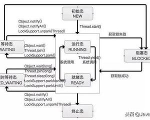
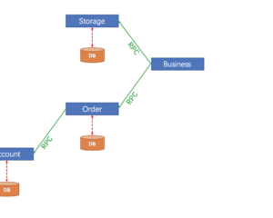
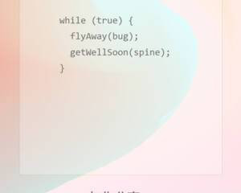
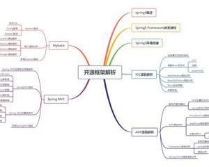

​          [](https://www.jianshu.com/)                    

​           [](https://www.jianshu.com/u/b2372a42e28d)         

 

 

​                

- ​               [                 发现 ](https://www.jianshu.com/)            
- ​               [                 关注 ](https://www.jianshu.com/subscriptions)            
- [消息   1](https://www.jianshu.com/notifications) 
- ​                                                      


广告


# 如何用重构的方式让它整洁起来？


https://www.jianshu.com/p/fe9efc548179

原文地址：[这里](https://link.jianshu.com?t=https://mp.weixin.qq.com/s?__biz=MjM5MDE0Mjc4MA==&mid=2650996556&idx=1&sn=d13b08271544b5b3056a626fe1cd7d2a&chksm=bdbf071f8ac88e09b6f2f7c7165e1fb5e985f86a6520e91f97f7590cbc0c067a43700475ebb4&scene=0&key=6f757bd94c1c518220bb52240e5ed967a3ca14b4069911ea4ee89d121eea6342c7dc1eed6aaaa4111ca929a0e63e20b5852ccdb2c223d6235e020bc0881c70d17536bb4ad6b3052021205375df41a559&ascene=0&uin=MjQ0MjQ2MjU%3D&devicetype=iMac+MacBookPro12%2C1+OSX+OSX+10.12.5+build(16F73)&version=12020810&nettype=WIFI&fontScale=100&pass_ticket=e73GEsbaOzdu71T5RMT1YFUQI2Rm43UdNtgP%2BxxwmRM%3D)


“整洁的代码简单直接。整洁的代码如同优美的散文。整洁的代码从不隐藏设计者的意图，充满了干净利落的抽象和直截了当的控制语句。”怎样让代码更加整洁？答案是重构！

### 写在前面

现在的软件系统开发难度主要在于其复杂度和规模，客户需求也不再像 Winston Royce  瀑布模型期望那样在系统编码前完成所有的设计满足用户软件需求。在这个信息爆炸技术日新月异的时代，需求总是在不断的变化，随之在 2001 年业界  17  位大牛聚集在美国犹他州的滑雪胜地雪鸟（Snowbird）雪场，提出了“Agile”（敏捷）软件开发价值观，并在他们的努力推动下，开始在业界流行起来。

在《代码整洁之道》一书中提出：一种软件质量，可持续开发不仅在于项目架构设计，还与代码质量密切相关，代码的整洁度和质量成正比，一份整洁的代码在质量上是可靠的，为团队开发，后期维护，重构奠定了良好的基础。

接下来笔者将结合自己之前的重构实践经验，来探讨平时实际开发过程中我们注重代码优化实践细节之道，而不是站在纯空洞的理论来谈论代码整洁之道。

在具体探讨如何进行代码优化之前，我们首先需要去探讨和明确下何谓是“代码的坏味道”，何谓是“整洁优秀代码”。因为一切优化的根源都是来自于我们平时开发过程中而且是开发人员自己产生的“代码坏味道”。

### 代码的坏味道

“如果尿布臭了，就换掉它。”－语出 Beck 奶奶，论抚养小孩的哲学。同样，代码如果有坏味道了，那么我们就需要去重构它使其成为优秀的整洁代码。
 谈论到何谓代码的坏味道，重复代码（Duplicated Code）首当其冲。重复在软件系统是万恶的,  我们熟悉的分离关注点，面向对象设计原则等都是为了减少重复提高重用，Don’t repeat yourself(DRY)。关于 DRY  原则，我们在平时开发过程中必须要严格遵守。
 其次还有其他坏味道：过长函数 (Long Method)、过大的类 (Large Class)、过长参数列表 (Long Parameter  List)、冗余类（Lazy Class）、冗余函数（Lazy Function）无用函数参数（Unused Function  Parameter）、函数圈复杂度超过 10（The Complexity is over 10）、依恋情结（Feature  Envy）、Switch 过多使用（Switch Abuse）、过度扩展设计（Over-extend  design）、不可读或者可读性差的变量名和函数名 (unread variable or function  name)、异曲同工类（Alternative Classes with Different  Interfaces）、过度耦合的消息链（Message Chains）、令人迷惑的临时字段（Temporary Field）、过多注释  (Too Many Comments) 等坏味道。

### 整洁代码

什么是整洁代码？不同的人会站在不同的角度阐述不同的说法。而我最喜欢的是 Grady Booch（《面向对象分析与设计》作者）阐述：
 “整洁的代码简单直接。整洁的代码如同优美的散文。整洁的代码从不隐藏设计者的意图，充满了干净利落的抽象和直截了当的控制语句。”

整洁的代码就是一种简约（简单而不过于太简单）的设计，阅读代码的人能很清晰的明白这里在干什么，而不是隐涩难懂，整洁的代码读起来让人感觉到就像阅读散文 - 艺术的沉淀，作者是精心在意缔造出来。

整洁代码是相对于代码坏味道的，如何将坏味道代码优化成整洁代码，正是笔者本文所探讨的重点内容：整洁代码之道－重构，接下来笔者将从几个角度重点描述如何对软件进行有效有技巧的重构。

### 重构 — Why

在软件开发过程中往往开发者不经意间就能产生代码的坏味道，特别是团队人员水平参差不齐每个人的经验和技术能力不同的情况下更容易产生不同阶段的代码坏味道。并且随着需求的迭代和时间推移，代码的坏味道越来越严重，甚至影响到团队的开发效率，那么遇到这个问题该如何去解决。

在软件开发 Coding 之前我们不可能事先了解所有的需求，软件设计肯定会有考虑不周到不全面的地方，而且随着项目需求的 Change，很有可能原来的代码设计结构已经不能满足当前需求。

更何况，我们很少有机会从头到尾参与并且最终完成一个项目，基本上都是接手别人的代码，即使这个项目是从头参与的，也有可能接手团队其他成员的代码。我们都有过这样的类似的抱怨经历，看到别人的代码时感觉就像垃圾一样特别差劲，有一种强烈的完全想重写的冲动，但一定要压制住这种冲动，你完全重写，可能比原来的好一点，但浪费时间不说，还有可能引入原来不存在的  Bug，而且，你不一定比原来设计得好，也许原来的设计考虑到了一些你没考虑到的分支或者异常情况。

我们写的代码，终有一天也会被别人接手，很可能到时别人会有和我们现在一样的冲动，所以开发者在看别人代码时候，要怀着一颗学习和敬畏之心，去发现别人的代码之美，在这个过程中挑出写的比较好的优秀代码，吸取精华，去其糟粕，在这个基础上，我们再去谈重构，那么你的重构会是一个好的开端。

总之，我们要做的是重构不是重写，要先从小范围的局部重构开始，然后逐步扩展到整个模块。

### 重构 — 作用

重构，绝对是软件开发写程序过程中最重要的事之一。那么什么是重构，如何解释重构。名词：对软件内部结构的一种调整，目的是在不改变软件可观察行为的前提下，提高其可理解性，降低其修改成本。**动词**：使用一系列重构手法，在不改变软件可观察行为的前提下，调整其结构。

重构不只可以改善既有的设计结构，还可以帮助我们理解原来很难理解的流程。比如一个复杂的条件表达式，我们可能需要很久才能看明白这个表达式的作用，还可能看了好久终于看明白了，过了没多长时间又忘了，现在还要从头看，如果我们把这个表达式运用  Extract Method  抽象出来，并起一个易于理解的名字，如果函数名字起得好，下次当我们再看到这段代码时，不用看逻辑我们就知道这个函数是做什么的。

如果对这个函数内所有难于理解的地方我们做了适当的重构，把每个细小的逻辑抽象成一个小函数并起一个容易理解的名字，当我们看代码时就有可能像看注释一样，不用再像以前一样通过看代码的实现来猜测这段代码到底是做什么的，我一直坚持和秉持这个观点：好的代码胜过注释，毕竟注释还是有可能更新不及时的，不及时最新的注释容易更其他人带来更多的理解上的困惑。
 此外重构可以使我们增加对代码和业务逻辑功能的理解，从而帮助我们找到 Bug；重构可以帮助我们提高编程速度，即重构改善了程序结构设计，并且因为重构的可扩展性使添加新功能变得更快更容易。

### 重构 — 时机

理解了重构的意义和作用，那么我们何时开始重构呢？笔者一直坚持这种观点：重构是一个持续的系统性的工程，它是贯穿于整个软件开发过程中，我们无需专门的挑出时间进行重构，重构应该随时随地的进行，即遵循三次法则：事不过三，三则重构。这个准则表达的意思是：第一次去实现一个功能尽管去做，但是第二次做类似的功能设计时会产生反感，但是还是会去做，第三次还是实现类似的功能做同样的事情，那你就应该去重构。三次准则比较抽象，那么对应到我们具体的软件开发流程中，一般可以在这三个时机去进行：

（1） 当添加新功能时如果不是特别容易，可以通过重构使添加特性和新功能变得更容易。在添加新功能的时候，我们就先清理这个功能所需要的代码。花一点时间，用滴水穿石的方法逐渐清理代码，随着时间的推移，我们的代码就会越来越干净，开发速度也会越来越快。

（2） 修改 Bug 的时候去重构，比如你在查找定位 Bug  的过程中，发现以前自己的代码或者别人的代码因为设计缺陷比如可扩展性、健壮性比较差造成的，那么此时就是一个比较好的重构时机。可能这个时候很多同学就有疑问了，认为我开发要赶进度，没有时间去重构，或者认为我打过补丁把  Bug  解决不就行了，不需要去重构。根据笔者之前多年的经验得出的结论：遇到即要解决即那就是每遇到一个问题，就马上解决它，而不是选择绕过它。完善当前正在使用的代码，那些还没有遇到的问题，就先不要理它。在当前前进的道路上，清除所有障碍，以后你肯定还会再一次走这条路，下次来到这里的时候你会发现路上不再有障碍。

软件开发就是这样。或许解决这个问题需要你多花一点时间。但是从长远来看，它会帮你节省下更多的时间。也就是重构是个循序渐进的过程，经过一段时间之后，你会发现之前所有的技术债务会逐步都不见了，所有的坑相继都被填平了。这种循序渐进的代码重构的好处开始显现，编程的速度明显会加快。

（3）Code Review 时去重构，很多公司研发团队都会有定期的 Code Review,  这种活动的好处多多，比如有助于在开发团队中传播知识进行技术分享，有助于让较有经验的开发者把知识传递给欠缺经验的人，并帮助更多的人对软件的其他业务模块更加熟悉从而实现跨模块的迭代开发。Code  Review  可以让更多的人有机会对自己提出更多优秀好的建议。同时重构可以帮助审查别人的代码，因为在重构前，你需要先阅读代码得到一定程度的理解和熟悉，从而提出一些建议和好的  idea,  并考虑是否可以通过重构快速实现自己的好想法，最终通过重构实践你会得到更多的成就感满足感。为了使审查代码的工作变得高效有作用，据我以前的经验，我建议一个审查者和一个原作者进行合作，审查者提出修改建议，然后两人共同判断这些修改是否能够通过重构轻松实现，如果修改成本比较低，就在  Review 的过程中一起着手修改。

如果是比较大型比较复杂的设计复查审核工作，建议原作者使用 UML 类序列图、时间序列图、流程图去向审查者展现设计的具体实现细节，在整个  Code Review  中，审查者可以提出自己的建议或者修改意见。在这种情景下，审查者一般由团队里面比较资深的工程师、架构师、技术专家等成员组成。

关于 Code Review 的形式，还可以采取极限编程中的“结对编程”形式。这种形式可以采取两个人位置坐在一起去审查代码，可以采取两个平台比如 IOS 和 android 的开发人员一起去审查，或者经验资深的和经验不资深的人员一起搭配去审查。

重构的这三个时机要把握好原则，即什么时候不应该重构，比如有时候既有代码实现太混乱啦，重构它还不如重新写一个来得简；此外，如果你的项目已经进入了尾期，此时也应该避免重构，这时机应该尽可能以保持软件的稳定性为主。

理解了重构是做什么，重构的作用，为什么要重构，以及重构的时机，我们对重构有了初步认识，接下来笔者重点篇幅来讲解如何使用重构技巧去优化代码质量达成 Clean Code .

### 重构技巧 — 函数重构

重构的源头一切从重构函数开始，掌握函数重构技巧是重构过程中很关键的一步，接下来我们来探讨下函数重构有那些实用技巧。

- 重命名函数（Rename Function Name） :  Clean Code 要求定义的变量和函数名可读性要强，从名字就可以知道这个变量和函数去做什么事情，所以好的可读性强的函数名称很重要，特别是有助于理解比较复杂的业务逻辑。
- 移除参数（Remove Parameter）: 当函数不再需要某个参数时，要果断移除，不要为了某个未知需求预留参数，过多的参数会给使用者带来参数困扰。
- 将查询函数和修改函数分离：如果某个函数既返回对象值，又修改对象状态。这时候应该建立两个不同的函数，其中一个负责查询，另一个负责修改。如果查询函数只是简单的返回一个值而没有副作用，就可以无限次的调用查询函数。对于复杂的计算也可以缓存结果。
- 令函数携带参数：如果若干函数做了类似的工作，只是少数几个值不同导致行为略有不同，合并这些函数，以参数来表达不同的值。
- 以明确函数取代参数：有一个函数其中的逻辑完全取决于参数值而采取不同行为，针对该参数的每一个可能值建立一个单独的函数。
- 保持对象完整性：如果你需要从某个对象取若干值，作为函数的多个参数传进去，特别是需要传入较多参数比如 5  个参数或者更多参数时，这种情况建议直接将这个对象直接传入作为函数参数，这样既可以减少参数的个数，增加了对象间的信赖性，而且这样被调用者需要这个对象的其他属性时可以不用人为的再去修改函数参数。
- 以函数取代参数：对象调用某个函数，并将所得结果作为参数传递给另外一个函数，而那个函数本身也能够调用前一个函数，直接让那个函数调用就行，可以直接去除那个参数，从而减少参数个数。
- 引入参数对象：某些参数总是同时出现，新建一个对象取代这些参数，不但可以减少参数个数，而且也许还有一些参数可以迁移到新建的参数类中，增加类的参数扩展性。
- 移除设值函数（Setting Method）：如果类中的某个字段应该在对象创建时赋值，此后就不再改变，这种情景下就不需要添加 Setting method。
- 隐藏函数：如果有一个函数从来没有被其他类有用到，或者是本来被用到，但随着类动态添加接口或者需求变更，之后就使用不到了，那么需要隐藏这个函数，也就是减小作用域。
- 以工厂函数取代构造函数：如果你希望创建对象时候不仅仅做简单的构建动作，最显而易见的动机就是派生子类时根据类型码创建不同的子类，或者控制类的实例个数。

### 重构技巧 — 条件表达式

- 分解条件表达式：如果有一个复杂的条件语句，if/else 语句的段落逻辑提取成一个函数。
- 合并条件表达式：一系列条件测试，都得到相同的测试结果，可以将这些测试表达式合并成成一个，并将合并后的表达式提炼成一个独立函数，如果这些条件测试是相互独立不相关的，就不要合并。
- 合并重复的条件片段：在条件表达式的每个分支上有着相同的一段代码，把这段代码迁移到表达式之外。
- 移除控制标记：不必遵循单一出口的原则，不用通过控制标记来决定是否退出循环或者跳过函数剩下的操作，直接 break 或者 return。
- 以卫语句替代嵌套条件表达式：条件表达式通常有两种表现形式，一：所有分支都属于正常行为；二：只有一种是正常行为，其他都是不常见的情况。对于一的情况，应该使用  if/else  条件表达式；对于二这种情况，如果某个条件不常见，应该单独检查条件并在该条件为真时立即从函数返回，这样的单独检查常常被称为卫语句。
- 以多态取代条件表达式：如果有个条件表达式根据对象类型的不同选择而选择不同的行为，将条件表达式的每个分支放进一个子类内的覆写函数中，将原始函数声明为抽象函数。
- 引入 Null 对象：当执行一些操作时，需要再三检查某对象是否为 NULL，可以专门新建一个 NULL  对象，让相应函数执行原来检查条件为 NULL 时要执行的动作，除 NULL 对象外，对特殊情况还可以有 Special 对象，这类对象一般是  Singleton.
- 引入断言：程序状态的一种假设
- 以 MAP 取代条件表达式：通过 HashMap 的 Key-Value 键值对优化条件表达式，条件表达式的判断条件作为 key 值，value 值存储条件表达式的返回值。
- 通过反射取代条件表达式：通过动态反射原理

### 重构技巧 — 案例

前面这多章节内容主要都是理论内容，接下来我们来看看具体的重构案例。

#### Map 去除 if 条件表达式

关于该技巧的实现方法，上章节有讲述，我们直接看代码案例如下代码所示：

原始的条件表达式代码如下图 1 所示：

```
public static int getServiceCode(String str){
    int code = 0;    
    if(str.equals("Age")){
         code = 1;
     }else if(str.equals("Address")){
         code = 2;
     }else  if(str.equals("Name")){
         code = 3;
     }else if(str.equals("No")){
         code = 4;
     }
     return  code; }
```

重构后的代码如下所示：

```
public static void initialMap(){
     map.put("Age",1);
     map.put("Address",2);
     map.put("Name",3);
     map.put("No",4); 
}
```

上述代码是直接通过 Map 结构，将条件表达式分解， Key 是条件变量，Value 是条件表达式返回值。取值很方便，显然高效率  O（1）时间复杂度取值。这种重构技巧适合于比较简单的条件表达式场景，下面是比较复杂的没有返回值的条件表达式场景，我们去看看如何处理。

#### 反射去除分支结构

原始的条件表达式代码如下图 1 所示：


图 1 条件表达式示范


 图 2 通过 Map 和反射重构示范

 如上图 2 所示，通过 Map 和反射去分解条件表达式，将条件表达式分支的逻辑抽取到子类中的覆写函数中，提取了共同的抽象类，里面包含抽象接口 handleBusinessData, 子类继承实现它。

多态取代条件表达式


 图 3 重构后的案例结果图


 图 4 重构后的案例－多态如何使用


 图 5 重构后的代码结构图


 图 6 重构－抽象类、简单工厂模式思想去实现条件表达式的分解

如上图 6 所示，在原始的条件表达式中，有两个条件表达式分支（分支逻辑）：
 中文入住人操作 HotelCNPasserngerOperaton 类

英文入住人操作 HotelEnPassengerOperation 类

共同抽取了基类抽象类：AbstractPassengerOperation, 其两个分支子类去继承抽象类。
 为了分解条件表达式，笔者采取了多态的重构技巧去实现，具体有两种实现方式，第一种实现方式是采用抽象类去实现多态，代码结构图如图 5  passenger 文件夹，UML 类图如上图 6 所示。第二种实现方式是采用接口去实现多态，代码结构如图 5 passenger2  文件夹，UML 类图如上图 7 所示。


图 7 重构－接口状态者模式思想去实现条件表达式的分解
 如上图 7 所示，在原始的条件表达式中，有两个条件表达式分支（分支逻辑），其分支逻辑分别放在了子类 HotelCNPassengerState 和  HotelENPassengerState 中，统一提取了接口类 PassengerState 类，里面包含子类都需要实现的两个基础接口。从图  7，可以看出，是使用了状态者模式。
 经过了上述重构之后，我们达成了什么效果：
 逻辑清晰

#### 主逻辑代码行数减少

业务逻辑，更好的封装解藕，无需关注具体的业务细节

采用了多态、抽象、状态模式、工厂模式、Build 模式的等不同的思想和方法，很多不同的重构技巧去重构一个功能，值得推广和借签；

### 写在最后

重构是一门比较大而深的话题和课题，笔者这次主要探讨了如何通过有效的重构技巧去写成优秀的整洁代码，代码整洁之道就是要将重构始终贯穿在整个开发过程中，不断的持续的渐进重构，从而将以前的技术债全部还完。

重构是个技术活，需要很资深的人士去整体架构把控技术方案和产品质量，才能使重构做的更加有效并且不会引入新的问题，但是无论我们最终采取什么手段去重构，最终我们都需要尽量符合 Solid 设计相关原则：

类的单一职责：体现了类只应该做一件事，良好的软件设计中系统是由一组大量的短小的类组成，以及需要他们之间功能协作完成，而不是几个上帝类。如果类的职责超过一个，这些职责之间就会产生耦合。改变一个职责，可能会影响和妨碍类为其他人服务的功能。这种类型的耦合将会导致脆弱的设计，在修改的时候可能会引入不少未知的问题。

开闭原则：其定义是说一个软件实体如类，模块和函数应该对扩展开放，而对修改关闭，具体来说就是你应该通过扩展来实现变化，而不是通过修改原有的代码来实现变化，该原则是面相对象设计最基本的原则。其指导思想就是（1）抽象出相对稳定的接口，这部分应该不动或者很少改动；（2）封装变化；不过在软件开发过程中，要一开始就完全按照开闭原则来可能比较困难，更多的情况是在不断的迭代重构过程中去改进，在可预见的变化范围内去做设计。

里氏替换原则：子类可以扩展父类的功能，但不能改变父类原有的功能。简单来说，所有使用基类代码的地方，如果换成子类对象的时候还能够正常运行，则满足这个原则，否则就是继承关系有问题，应该废除两者的继承关系，这个原则可以用来判断我们的对象继承关系是否合理。通常在设计的时候，我们都会优先采用组合而不是继承，因为继承虽然减少了代码，提高了代码的重用性，但是父类跟子类会有很强的耦合性，破坏了封装。

接口隔离原则：不能强迫用户去依赖那些他们不使用的接口。简单来说就是客户端需要什么接口，就提供给它什么样的接口，其它多余的接口就不要提供，不要让接口变得臃肿，否则当对象一个没有使用的方法被改变了，这个对象也将会受到影响。接口的设计应该遵循最小接口原则，其实这也是高内聚的一种表现，换句话说，使用多个功能单一、高内聚的接口总比使用一个庞大的接口要好。

依赖倒置（DIP）：高层模块不应该依赖低层模块，两者都应该依赖其抽象；抽象不应该依赖细节；细节应该依赖抽象。其实这就是我们经常说的“针对接口编程”，这里的接口就是抽象，我们应该依赖接口，而不是依赖具体的实现来编程。DIP  描述组件之间高层组件不应该依赖于底层组件。依赖倒置是指实现和接口倒置，采用自顶向下的方式关注所需的底层组件接口，而不是其实现。DI  模式很好例子的就是应用 IOC（控制反转）框架，构造方式分为分构造注入，函数注入，属性注入 。

当我们在做重构优化的时候应该充分考虑上面这几个原则，一开始可能设计并不完美，不过可以在重构的过程中不断完善。但其实很多人都跳过了设计这个环节，拿到一个模块直接动手编写代码，更不用说去思考设计了，项目中也有很多这样的例子。当然对于简单的模块或许不用什么设计，不过假如模块相对复杂的话，能够在动手写代码之前好好设计思考一下，养成这个习惯，肯定会对编写出可读性、稳定性、健壮性、灵活性、可服用性、可扩展性较高的代码有帮助。

欢迎大家简书或[我的个人博客](https://link.jianshu.com?t=http://blog.dawngrp.com/)与我交流

小礼物走一走，来简书关注我


​                      随笔 

​           © 著作权归作者所有         

​           举报文章         

​             [                ](https://www.jianshu.com/u/79330ad3ca7c)            

ZetaChow晓代码


写了 63431 字，被 259 人关注，获得了 447 个喜欢

资深开发者，一直在探索用代码让世界更美好的方法


 

​                                      [                    ](javascript:void((function(s,d,e,r,l,p,t,z,c){var f='http://v.t.sina.com.cn/share/share.php?appkey=1881139527',u=z||d.location,p=['&url=',e(u),'&title=',e(t||d.title),'&source=',e(r),'&sourceUrl=',e(l),'&content=',c||'gb2312','&pic=',e(p||'')].join('');function a(){if(!window.open([f,p].join(''),'mb',['toolbar=0,status=0,resizable=1,width=440,height=430,left=',(s.width-440)/2,',top=',(s.height-430)/2].join('')))u.href=[f,p].join('');};if(/Firefox/.test(navigator.userAgent))setTimeout(a,0);else a();})(screen,document,encodeURIComponent,'','','', '推荐 ZetaChow晓代码 的文章《转载：谁都忍不了烂代码，如何用重构的方式让它整洁起来？》（ 分享自 @简书 ）','https://www.jianshu.com/p/fe9efc548179?utm_campaign=maleskine&utm_content=note&utm_medium=reader_share&utm_source=weibo','页面编码gb2312|utf-8默认gb2312'));)                                                   [更多分享](javascript:void(0);)       


-  
- 
- 
-  

被以下专题收入，发现更多相似内容

收入我的专题


编程语言爱好者


work


​                  

Java并发编程40道面试题及答案——面试稳了

1、线程与进程的区别？  进程是操作系统分配资源的最小单元，线程是操作系统调度的最小单元。 一个程序至少有一个进程,一个进程至少有一个线程。  文末有福利，思维导图和视频资料等你来领 2、什么是多线程中的上下文切换？ 多线程会共同使用一组计算机上的CPU，而线程数大于给程序分配...

​                                    

杜弥

​                  

微服务架构下，解决数据一致性问题的实践

随着业务的快速发展，应用单体架构暴露出代码可维护性差、容错率低、测试难度大和敏捷交付能力差等诸多问题，微服务应运而生。微服务的诞生一方面解决了上述问题，但是另一方面却引入新的问题，其中主要问题之一就是：如何保证微服务间的业务数据一致性。  本文将通过一个商品采购的业务，来看看...

​                                    

阿里云云栖社区

​                  

三七女生节，解密阿里女程序员们的代码诗！

摘要：  云栖社区推出“三七”女生节特别分享，16位才华横溢的阿里女生们同一时间分享了代码诗，快来解密吧！  女生节快要到了，小编火速在阿里的程序员群体中发掘出了一群才华横溢的程序媛！今天就和大家分享下，阿里背后写代码、修bug的女生们！  巾帼不让须眉，如今越来越多的女性同胞参...

​                                    

阿里云云栖社区

​                  

2019年阿里Android面试必问：Java+性能优化+APP开发+NDK+跨平台技术

前言 一年之计在于春  金三银四已经要到来，2019的新的开始，作为一个开发人员，你是否面上了自己理想的公司，薪资达到心中理想的高度？  面试：如果不准备充分的面试，完全是浪费时间，更是对自己的不负责。  今天给大家分享下我整理的Java架构面试专题及答案，其中大部分都是大企业面...

​                                    

Android高级架构

​                  

如何判断你的Java 工程师的基础知识是否扎实？

集合框架：大致分几类（List/Queue/Deque/Map/Set），每一类的继承/实现关系（如ArrayList实现List，继承AbstractList，List又继承Collection），几个常用的集合框架的底层实现原理（一个HashMap就能问出N多问题），哪...

​                                    

JAVA专栏

高效编写代码的方法(二)：常量的定义

简洁语法  正式介绍常量定义前，先介绍一下Objective-C的一些语法糖，完全与常量定义无关，知道的可以跳过。一般来说，我们定义NSString，NSArray，NSDictionary时，都会直接像下面这样书写:  以上就是OC对于这三个类的简洁语法，包括数组的访问，字典...

​                                    

蜂猴

在迷茫中的日子。

人有时候很无奈，兜兜转转，很多时候自己都不知道自己需要的是什么？尤其是在一段工作结束之后你休息了有段时间，比如有些女的回家生孩子，之后就会发现突然的与世界都不会爱了，不爱说话，不爱去接触人，不爱去…  离开了这个城市两年，却发现一下子把八年的熟悉感都没了。虽然还有很多认识的名...

​                                    

杨熙

​                  

百人接力小说征文|67-千年之前

本文参加 百人接力小说征文活动上一章66|以爱之名 1  凌晨三点，伊晨飞抵阿萨市。登机前，远在杭州的陈耳东一再叮咛，半夜一个女孩打车不安全，一定请她在机场坐到天亮再走。  伊晨知道自己不会等，没理会。耳东最近学习星相占卜，有点神叨。 打开手机，蹦出曼丽信息：户连房跳楼身亡。 ...

​                                    

野树y

火

时间在这一刻仿若静止——  火在吞噬着一切，像一只无穷无尽的巨大怪物，网住了此时此刻在它猎食范围内的所有人。 挣扎着…… 在疼痛中的我脑中只有无尽的绝望，对于生的绝望。  我听见火烧“啪啪”的声音，肉体被吞噬的“咝咝”声，渴望求生的欲望在胸腔中奔腾，一次次冲撞着，最后随着被压在...

​                                    

十一醉