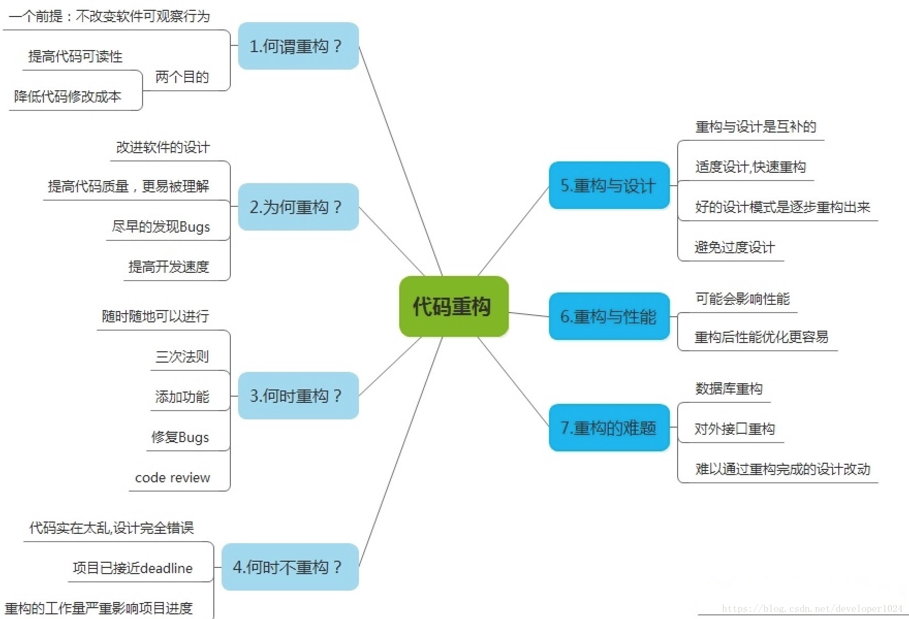

# 浅谈代码重构：常用的重构方法有哪些

https://www.2cto.com/kf/201804/737688.html

​          	          

#### 一、代码重构

软件开发中，代码质量与其整洁度成正比，干净的代码，既在质量上可靠，也为后期维护、升级奠定了良好基础。

实际开发中，我们经常听到”重构”二字。重构既不修正错误，又不增加新的功能性。反而它是用于提高代码的可读性或者改变代码内部结构与设计，并且移除死代码，使其在将来更容易被维护。

关于重构说明，如下图所示：
 

------

#### 二、常用的重构方法

##### 1.封装成员变量（Encapsulate Field）

将仅限于本类使用的变量重写成私有（private）成员变量，并提供访问方法（accessor method）。这种重构方式可以将与外部调用者无关的变量隐藏起来，减少代码的耦合性，并减少意外出错的概率。

示例代码:

[?](https://www.2cto.com/kf/201804/737688.html#)

```
`// 重构前``class` `SomeClass {``  ``public` `int` `memberA;``  ``...``}` `// 重构后``class` `SomeClass {``  ``private` `int` `memberA;``  ``public` `int` `getMemberA();``  ``public` `void` `setMemberA(``int` `a);``  ``...``}`
```

##### 2.提取方法（Extract Method）

将大段代码中的一部分提取后，构成一个新方法。这种重构可以使整段程序的结构变得更清晰，从而增加可读性。这也对函数（Function）通用。

示例代码：

[?](https://www.2cto.com/kf/201804/737688.html#)

```
`// 重构前``void` `Process(MyDataSet mds) ``{   ``　``// Step 1 ... ``　``int` `result = ``0``;  ``　``if` `(mds.isReady) ``　{  ``　　``int` `data1 = mds.param[``0``]; ``　　``int` `data2 = mds.param[``1``];  ``　　``// Preprocess... ``　　result = data1 % data2;  ``　} ``　``// Step 2... ``}` `// 重构后``void` `Process(MyDataSet mds)``{  ``　``// Step 1 ... ``　``int` `result = ``0``;  ``　``if` `(mds.isReady) ``　　result = CalculateMDS(mds.param[``0``], mds.param[``1``]);  ``　``// Step 2 ... ``}      ` `int` `CalculateMDS(``int` `data1, ``int` `data2)  ``{ ``　　``// Preprocess...  ``　　``return` `data1 % data2; ``}`
```

##### 3.一般化类型（Generalize Type）

将多个类/函数共用的类型抽象出可以公用的基类（base class），然后利用多态性追加每个类/函数需要的特殊函数。这种重构可以让结构更加清晰，同时可以增加代码的可维护性。

示例代码：

[?](https://www.2cto.com/kf/201804/737688.html#)

```
`// 重构前``class` `Rectangle {``  ``private``:``    ``int` `w, h;``  ``public``:``    ``double` `Area(){``        ``return` `w*h;``    ``}``}``class` `Triangle {``  ``private``:``    ``int` `w, h;``  ``public``:``    ``double` `Area(){``        ``return` `w*h/``2``;``    ``}``}` `// 重构后``class` `Polygon {``  ``private``:``    ``int` `w, h;``  ``public``:``    ``virtual ``double` `Area() = ``0``;``}``class` `Rectangle : ``public` `Polygon {``  ``double` `Area(){``    ``return` `w*h;``  ``}``}``class` `Triangle : ``public` `Polygon {``  ``double` `Area(){``    ``return` `w*h/``2``;``  ``}``}`
```

##### 4.函数归父（Pull Up）

将方法从子类移动到父类。

##### 5.函数归子（Push Down）

将方法从父类移动到子类。

##### 6.方法更名（Rename Method）

方法从父类移动到子类。

示例代码：

[?](https://www.2cto.com/kf/201804/737688.html#)

```
`// 重构前``public` `double` `f(``double` `m, ``double` `a);` `// 重构后``public` `double` `calculateForce(``double` `mass, ``double` `acceleration);`
```