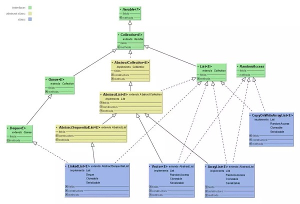
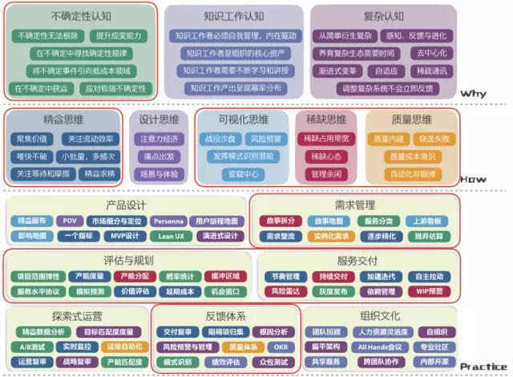
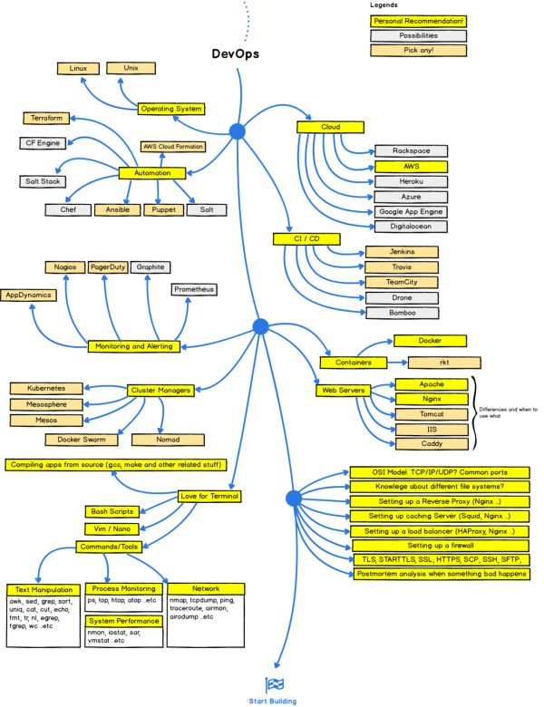

## 【重磅推荐】34张史上最全IT架构师技术知识图谱

本文是笔者多年来积累和收集的知识技能图谱，小编极力推荐分享给身边的技术人儿，希望这份技术知识图谱能够帮助到每一位奋斗在技术路上的小伙伴。

- 作者：李艳鹏来源：[51CTO技术栈](https://mp.weixin.qq.com/s/w44cOFKPpNacY5Pihu8s3A)|*2017-08-23 09:53*

  ​                 	                 		[ 收藏](javascript:favorBox('open');)                 	 					 						[  分享](javascript:;) 					                 

本文是笔者多年来积累和收集的知识技能图谱，小编极力推荐分享给身边的技术人儿，希望这份技术知识图谱能够帮助到每一位奋斗在技术路上的小伙伴。

下面是笔者多年来积累和收集的知识技能图谱，有的是笔者原创总结的最佳实践，有的是小伙伴们的分享，其中每个秘籍图谱里面的内容都是互联网高并发架构师应该了解和掌握的知识。

笔者索性把这些图谱收集在一起，并且归类便于查找和学习，希望能够帮助到每一位想成为架构师或者已经是架构师的小伙伴。

暂把标题定为：“史上最全的技术知识图谱秘籍”，暗含着笔者的一个小目标：想把更多的技术图谱和思维导图汇集在一起，成为互联网上“最全的技术图谱”。

1

**1.1 架构师图谱**

**1.2 Java架构师图谱**

**1.3 微服务架构秘籍**

**1.4 一致性图谱**

**1.5 互联网大流量的方法**

**1.6 安全秘籍**

**1.7 阿里巴巴常用小框架**

**1.8 架构方法论图谱**

**1.9 设计模式秘籍图谱**

2

**2.1 JVM虚拟机垃圾回收图谱**

**2.2 Java并发图谱**

**2.3 Java集合图谱**

**2.4 Java集合类图**

**2.5 Java List类图**

2.6 Java Map类图

**2.7 Java Set类图**

2.8 Java TCP IP

3

**3.1 Hadoop技能图谱**

**3.2 大数据技能图谱**

4

**4.1 云计算图谱**

**4.2 云计算技能图谱**

5

**5.1 iOS技能图谱**

**5.2 OpenResty技能图谱**

**5.3 前端技能图谱**

**5.4 容器技能图谱**

**5.5 嵌入式开发技能图谱**

**5.6 开发语言宝典**

**5.7 移动端测试图谱**

**5.8 运维技能图谱**

**5.9 软件工程图谱**

**5.10 DevOps图谱**

**5.11 前端开发图谱**

**5.12 后端开发图谱**

**5.13 软件发布流程**

**由于平台不允许上传超过500K的图片，文中很多高清技术图谱无法上传。想要下载全套高清技术知识图谱的同学，可扫码关注“51CTO技术栈”微信公众号，回复关键词“图谱”，即可****下载****完整版！**

【编辑推荐】

1. [Home Contact Gallery RSS Git 在团队中的最佳实践--如何正确使用Git Flow](http://mdsa.51cto.com/art/201707/545998.htm)
2. [如何优雅的使用RabbitMQ](http://mdsa.51cto.com/art/201707/546003.htm)
3. [在GitHub上最受欢迎的大多是库或框架](http://mdsa.51cto.com/art/201707/546350.htm)
4. [async / await：更好的异步解决方案](http://developer.51cto.com/art/201708/546939.htm)
5. [Ubuntu 新 Dock 抢先看，不欲重现 Unity 的体验](http://developer.51cto.com/art/201708/548343.htm)

【责任编辑：[武晓燕](mailto:sunsj@51cto.com) TEL：（010）68476606】