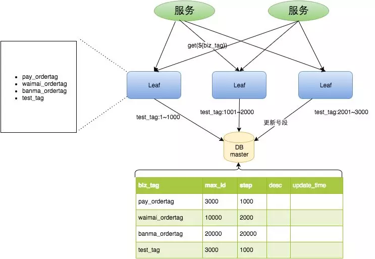
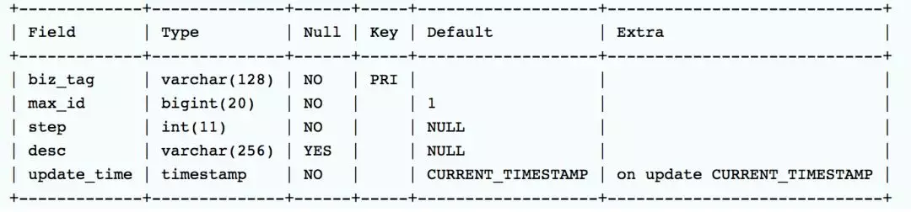
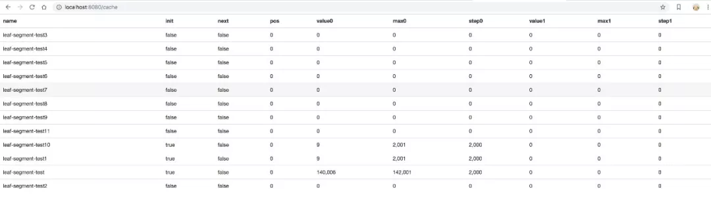
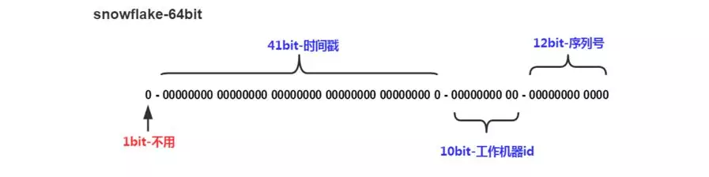

## [Leaf：美团分布式ID生成服务开源](https://mp.weixin.qq.com/s/6J7n3udEyQvUHRHwvALNYw)                       

 原创：      志桐                                                                                                                                                      [                         美团技术团队                      ](javascript:void(0);)                *3月7日*                      

**总第341篇**

**2019年 第19篇**

> ##  [Leaf——美团点评分布式ID生成系统](https://tech.meituan.com/2017/04/21/mt-leaf.html)

> ##  			[开源版本的leaf-snowflake（基于美团点评技术团队博客http://tech.meituan.com/MT_Leaf.html）](https://www.cnblogs.com/faithofjustice/p/7106643.html) 		
>

　　拜读了美团点评技术团队博客的“Leaf——美团点评分布式ID生成系统（<http://tech.meituan.com/MT_Leaf.html>）”之后，收获很多。纸上得来终觉浅 绝知此事要躬行，所以，我就按照文章中Leaf-snowflake方案做了一个开源版本的leaf-snowflake。如下：

项目地址：<https://github.com/weizhenyi/leaf-snowflake>

经过测试，TPS：1W+/sec,单机190秒生成了200W无重复，单调递增的long型整数ID。

测试版本，仅供参考，希望能一起改进。

**美美导读：**我们之前介绍过的高可靠、高并发低延迟、全局唯一的分布式ID生成服务Leaf，现在开源啦！欢迎大家使用呦～

Leaf是美团基础研发平台推出的一个分布式ID生成服务，名字取自德国哲学家、数学家莱布尼茨的一句话“There are no two identical leaves in the world”。Leaf具备高可靠、低延迟、全局唯一等特点。目前已经广泛应用于美团金融、美团外卖、美团酒旅等多个部门。具体的技术细节，可参考此前美团技术博客的一篇文章：《[Leaf美团分布式ID生成服务](http://mp.weixin.qq.com/s?__biz=MjM5NjQ5MTI5OA==&mid=2651746232&idx=1&sn=576f712a35093d1b5dba5096b9e5a819&chksm=bd12b6f58a653fe350e5475648541bf80e97a89ab0b8a2421d2ae083676cf027064b539a25fc&scene=21#wechat_redirect)》。近日，Leaf项目已经在Github上开源：<https://github.com/Meituan-Dianping/Leaf>，希望能和更多的技术同行一起交流、共建。

## Leaf特性

Leaf在设计之初就秉承着几点要求：

- 全局唯一，绝对不会出现重复的ID，且ID整体趋势递增。
- 高可用，服务完全基于分布式架构，即使MySQL宕机，也能容忍一段时间的数据库不可用。
- 高并发低延时，在CentOS 4C8G的虚拟机上，远程调用QPS可达5W+，TP99在1ms内。
- 接入简单，直接通过公司RPC服务或者HTTP调用即可接入。

## Leaf诞生

Leaf第一个版本采用了预分发的方式生成ID，即可以在DB之上挂N个Server，每个Server启动时，都会去DB拿固定长度的ID List。这样就做到了完全基于分布式的架构，同时因为ID是由内存分发，所以也可以做到很高效。接下来是数据持久化问题，Leaf每次去DB拿固定长度的ID List，然后把最大的ID持久化下来，也就是并非每个ID都做持久化，仅仅持久化一批ID中最大的那一个。这个方式有点像游戏里的定期存档功能，只不过存档的是未来某个时间下发给用户的ID，这样极大地减轻了DB持久化的压力。

整个服务的具体处理过程如下：

- Leaf Server 1：从DB加载号段[1，1000]。
- Leaf Server 2：从DB加载号段[1001，2000]。
- Leaf Server 3：从DB加载号段[2001，3000]。

用户通过Round-robin的方式调用Leaf Server的各个服务，所以某一个Client获取到的ID序列可能是：1，1001，2001，2，1002，2002......也可能是：1，2，1001，2001，2002，2003，3，4......当某个Leaf Server号段用完之后，下一次请求就会从DB中加载新的号段，这样保证了每次加载的号段是递增的。

Leaf数据库中的号段表格式如下：

Leaf Server加载号段的SQL语句如下：

整体上，V1版本实现比较简单，主要是为了尽快解决业务层DB压力的问题，而快速迭代出的一个版本。因而在生产环境中，也发现了些问题。比如：

- 在更新DB的时候会出现耗时尖刺，系统最大耗时取决于更新DB号段的时间。
- 当更新DB号段的时候，如果DB宕机或者发生主从切换，会导致一段时间的服务不可用。

## Leaf双Buffer优化

为了解决这两个问题，Leaf采用了异步更新的策略，同时通过双Buffer的方式，保证无论何时DB出现问题，都能有一个Buffer的号段可以正常对外提供服务。只要DB在一个Buffer的下发周期内恢复，就不会影响整个Leaf的可用性。

这个版本代码在线上稳定运行了半年左右，Leaf又遇到了新的问题：

- 号段长度始终是固定的，假如Leaf本来能在DB不可用的情况下，维持10分钟正常工作，那么如果流量增加10倍就只能维持1分钟正常工作了。
- 号段长度设置的过长，导致缓存中的号段迟迟消耗不完，进而导致更新DB的新号段与前一次下发的号段ID跨度过大。

## Leaf动态调整Step

假设**服务QPS为Q，号段长度为L，号段更新周期为T**，那么**Q \* T = L**。最开始L长度是固定的，导致随着Q的增长，T会越来越小。但是Leaf本质的需求是**希望T是固定的**。那么如果L可以和Q正相关的话，T就可以趋近一个定值了。所以Leaf每次更新号段的时候，根据上一次更新号段的周期T和号段长度step，来决定下一次的号段长度nextStep：

- T < 15min，nextStep = step * 2
- 15min < T < 30min，nextStep = step
- T > 30min，nextStep = step / 2

至此，满足了号段消耗稳定趋于某个时间区间的需求。当然，面对瞬时流量几十、几百倍的暴增，该种方案仍不能满足可以容忍数据库在一段时间不可用、系统仍能稳定运行的需求。因为本质上来讲，Leaf虽然在DB层做了些容错方案，但是号段方式的ID下发，最终还是需要强依赖DB。

## MySQL高可用

在MySQL这一层，Leaf目前采取了半同步的方式同步数据，通过公司DB中间件[Zebra](http://mp.weixin.qq.com/s?__biz=MjM5NjQ5MTI5OA==&mid=2651746479&idx=2&sn=1f17d8ff4dc653db36c13b61530450e8&chksm=bd12a9e28a6520f42816e33046e355803d830966a1b27f4a8e80e4cf9fb6342b42455e4c43a3&scene=21#wechat_redirect)加MHA做的主从切换。未来追求完全的强一致，会考虑切换到[MySQL Group Replication](https://dev.mysql.com/doc/refman/5.7/en/group-replication.html)。

现阶段由于公司数据库强一致的特性还在演进中，Leaf采用了一个临时方案来保证机房断网场景下的数据一致性：

- 多机房部署数据库，每个机房一个实例，保证都是跨机房同步数据。
- 半同步超时时间设置到无限大，防止半同步方式退化为异步复制。

## Leaf监控

针对服务自身的监控，Leaf提供了Web层的内存数据映射界面，可以实时看到所有号段的下发状态。比如每个号段双Buffer的使用情况，当前ID下发到了哪个位置等信息都可以在Web界面上查看。

**Leaf Snowflake**

Snowflake，Twitter开源的一种分布式ID生成算法。基于64位数实现，下图为Snowflake算法的ID构成图。

- 第1位置为0。
- 第2-42位是相对时间戳，通过当前时间戳减去一个固定的历史时间戳生成。
- 第43-52位是机器号workerID，每个Server的机器ID不同。
- 第53-64位是自增ID。

这样通过时间+机器号+自增ID的组合来实现了完全分布式的ID下发。

在这里，Leaf提供了Java版本的实现，同时对ZooKeeper生成机器号做了弱依赖处理，即使ZooKeeper有问题，也不会影响服务。Leaf在第一次从ZooKeeper拿取workerID后，会在本机文件系统上缓存一个workerID文件。即使ZooKeeper出现问题，同时恰好机器也在重启，也能保证服务的正常运行。这样做到了对第三方组件的弱依赖，一定程度上提高了SLA。

## 未来规划

号段加载优化：Leaf目前重启后的第一次请求还是会同步加载MySQL，之所以这么做而非服务初始化加载号段的原因，主要是MySQL中的Leaf  Key并非一定都被这个Leaf服务节点所加载，如果每个Leaf节点都在初始化加载所有的Leaf  Key会导致号段的大量浪费。因此，未来会在Leaf服务Shutdown时，备份这个服务节点近一天使用过的Leaf  Key列表，这样重启后会预先从MySQL加载Key List中的号段。

单调递增：简易的方式，是只要保证同一时间、同一个Leaf  Key都从一个Leaf服务节点获取ID，即可保证递增。需要注意的问题是Leaf服务节点切换时，旧Leaf  服务用过的号段需要废弃。路由逻辑，可采用主备的模型或者每个Leaf Key 配置路由表的方式来实现。

## 关于开源

分布式ID生成的方案有很多种，Leaf开源版本提供了两种ID的生成方式：

- 号段模式：低位趋势增长，较少的ID号段浪费，能够容忍MySQL的短时间不可用。
- Snowflake模式：完全分布式，ID有语义。

读者可以按需选择适合自身业务场景的ID下发方式。希望美团的方案能给予大家一些帮助，同时也希望各位能够一起交流、共建。

Leaf项目Github地址：<https://github.com/Meituan-Dianping/Leaf> 。

如有任何疑问和问题，欢迎提交至[Github issues](https://github.com/Meituan-Dianping/Leaf/issues)。

欢迎加入**美团Java技术交流群**，跟作者零距离交流。进群方式：请加美美同学微信（微信号：**MTDPtech02****）**，回复：**Leaf**，美美会自动拉你进群。

----------  END  ----------

**也许你还想看**

[开源实时监控系统CAT 3.0发布：多语言客户端及多项性能提升](http://mp.weixin.qq.com/s?__biz=MjM5NjQ5MTI5OA==&mid=2651749250&idx=2&sn=704a3c8b92e8221f0a0dfdbd947d9f85&chksm=bd12a2cf8a652bd9d1e1286c6dfb3ca85d46c1e83e958dc594bc21f74ea1a3181866a7e6edab&scene=21#wechat_redirect)

[Logan：美团点评的开源移动端基础日志库](http://mp.weixin.qq.com/s?__biz=MjM5NjQ5MTI5OA==&mid=2651748960&idx=1&sn=2bd11c883ecc787e634bc3c29dfbbe50&chksm=bd12a32d8a652a3b25f26de739555341937697e02f2f01017129514624cdb0dd2e2bdd844acb&scene=21#wechat_redirect)

[用Vue.js开发微信小程序：开源框架mpvue解析](http://mp.weixin.qq.com/s?__biz=MjM5NjQ5MTI5OA==&mid=2651747630&idx=1&sn=dfb85acb20fbfcb4a8908917357be662&chksm=bd12ac638a652575eb5e542e8159b903b8061ceeb32434ae50e2631a039eddc01e01b2837b95&scene=21#wechat_redirect)