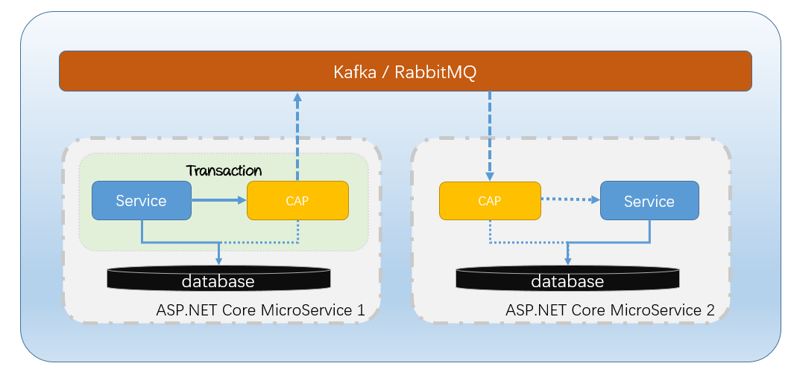

### 背景

相信前面几篇关于微服务的文章也介绍了那么多了，在构建微服务的过程中确实需要这么一个东西，即便不是在构建微服务，那么在构建分布式应用的过程中也会遇到分布式事务的问题，那么 CAP 就是在这样的背景下诞生的。

最初打算做这个东西是在去年（2016）年底，最初是为了解决分布式系统中的分布式事务的问题，然后当时有了一个大概的概念轮廓，当时我对于前面两篇文章中关于异步消息和微服务之间通讯还不是太了解，只是觉得这样能够解决这一系列的问题，然后就着手做了，最后发现和这些概念竟然不谋而合。

经过大半年的不断重构以及修改，最终 CAP 1.0 版本发布了。作为一个开源项目，最初项目是在我的个人Github下，然后于上个月已经贡献给了 [.NET China Foundation](https://github.com/dotnetcore) 组织，目前该项目由我和 DotNetCore 项目组共同维护。

### CAP 介绍

Github：<https://github.com/dotnetcore/CAP>

开源协议：MIT

CAP 是一个在分布式系统中（SOA，MicroService）实现事件总线及最终一致性（分布式事务）的一个开源的 C# 库，她具有轻量级，高性能，易使用等特点。

你可以轻松的在基于 .NET Core 技术的分布式系统中引入CAP，包括但限于 ASP.NET Core 和 ASP.NET Core on .NET Framework。

CAP 以 NuGet 包的形式提供，对项目无任何入侵，你仍然可以以你喜爱的方式来构建分布式系统。

CAP 具有 Event Bus 的所有功能，并且CAP提供了更加简化的方式来处理EventBus中的发布/订阅。

CAP 具有消息持久化的功能，也就是当你的服务进行重启或者宕机时，她可以保证消息的可靠性。

CAP 实现了分布式事务中的最终一致性，你不用再去处理这些琐碎的细节。

CAP 提供了基于 Microsoft DI 的 API 服务，她可以和你的 ASP.NET Core 系统进行无缝结合，并且能够和你的业务代码集成支持强一致性的事务处理。

CAP 是开源免费的。CAP基于MIT协议开源，你可以免费的在你的私人或者商业项目中使用，不会有人向你收取任何费用。

### Getting Started

目前， CAP 同时支持使用 RabbitMQ，Kafka，Azure Service Bus 等进行底层之间的消息发送，你不需要具备这些消息队列的使用经验，仍然可以轻松的集成到项目中。

CAP 目前支持使用 Sql Server，MySql，PostgreSql，MongoDB 数据库的项目。

CAP 同时支持使用 EntityFrameworkCore 和 ADO.NET 的项目，你可以根据需要选择不同的配置方式。

下面是CAP在系统中的一个不完全示意图：



> 图中实线部分代表用户代码，虚线部分代表CAP内部实现。

下面，我们看一下 CAP 怎么集成到项目中：

#### Step 1:

你可以运行下面的命令来安装CAP NuGet 包：

```
PM> Install-Package DotNetCore.CAP
```

根据底层消息队列，你可以选择引入不同的包：

```
PM> Install-Package DotNetCore.CAP.Kafka
PM> Install-Package DotNetCore.CAP.RabbitMQ
PM> Install-Package DotNetCore.CAP.AzureServiceBus
```

CAP 目前支持使用 SQL Server, PostgreSql, MySql, MongoDB 的项目，你可以选择引入不同的包：

```
PM> Install-Package DotNetCore.CAP.SqlServer
PM> Install-Package DotNetCore.CAP.MySql
PM> Install-Package DotNetCore.CAP.PostgreSql
PM> Install-Package DotNetCore.CAP.MongoDB     //需要 MongoDB 4.0+ 集群
```

#### Step 2:

在 `Startup.cs` 文件中，添加如下配置：

```
public void ConfigureServices(IServiceCollection services)
{
    ......

    services.AddDbContext<AppDbContext>();

    services.AddCap(x =>
    {
        //如果你使用的 EF 进行数据操作，你需要添加如下配置：
        x.UseEntityFramework<AppDbContext>();  //可选项，你不需要再次配置 x.UseSqlServer 了
        
        //如果你使用的ADO.NET，根据数据库选择进行配置：
        x.UseSqlServer("数据库连接字符串");
        x.UseMySql("数据库连接字符串");
        x.UsePostgreSql("数据库连接字符串");

        //如果你使用的 MongoDB，你可以添加如下配置：
        x.UseMongoDB("ConnectionStrings");  //注意，仅支持MongoDB 4.0+集群
    
        //CAP支持 RabbitMQ、Kafka、AzureServiceBus 等作为MQ，根据使用选择配置：
        x.UseRabbitMQ("ConnectionStrings");
        x.UseKafka("ConnectionStrings");
        x.UseAzureServiceBus("ConnectionStrings");
    });
}
```

### 发布事件/消息

在 Controller 中注入 `ICapPublisher` 然后使用 `ICapPublisher` 进行消息发布:

```
public class PublishController : Controller
{
    private readonly ICapPublisher _capBus;

    public PublishController(ICapPublisher capPublisher)
    {
        _capBus = capPublisher;
    }
    
    //不使用事务
    [Route("~/without/transaction")]
    public IActionResult WithoutTransaction()
    {
        _capBus.Publish("xxx.services.show.time", DateTime.Now);
    
        return Ok();
    }

    //Ado.Net 中使用事务，自动提交
    [Route("~/adonet/transaction")]
    public IActionResult AdonetWithTransaction()
    {
        using (var connection = new MySqlConnection(ConnectionString))
        {
            using (var transaction = connection.BeginTransaction(_capBus, autoCommit: true))
            {
                //业务代码

                _capBus.Publish("xxx.services.show.time", DateTime.Now);
            }
        }
        return Ok();
    }

    //EntityFramework 中使用事务，自动提交
    [Route("~/ef/transaction")]
    public IActionResult EntityFrameworkWithTransaction([FromServices]AppDbContext dbContext)
    {
        using (var trans = dbContext.Database.BeginTransaction(_capBus, autoCommit: true))
        {
            //业务代码

            _capBus.Publish("xxx.services.show.time", DateTime.Now);
        }
        return Ok();
    }
}
```

### 订阅事件/消息

在 `Controller` 中：
 如果是在Controller中，直接添加`[CapSubscribe("")]` 来订阅相关消息。

```
public class PublishController : Controller
{
    [NoAction]
    [CapSubscribe("xxx.services.show.time")]
    public async Task CheckReceivedMessage(DateTime time)
    {
        Console.WriteLine(time);
        return Task.CompletedTask;
    }
}
```

在 `xxxService`中：
 如果你的方法没有位于Controller 中，那么你订阅的类需要继承 `ICapSubscribe`，然后添加`[CapSubscribe("")]`标记：

```
namespace xxx.Service
{
    public interface ISubscriberService
    {
        public void CheckReceivedMessage(DateTime time);
    }
    
    
    public class SubscriberService: ISubscriberService, ICapSubscribe
    {
        [CapSubscribe("xxxx.services.show.time")]
        public void CheckReceivedMessage(DateTime time)
        {
            
        }
    }
}
```

然后在 `Startup.cs` 中的 ConfigureServices() 中注入**你的** `ISubscriberService` 类

```
public void ConfigureServices(IServiceCollection services)
{
    services.AddTransient<ISubscriberService,SubscriberService>();
}
```

结束了，怎么样，是不是很简单？

### 鸣谢

感谢 [lan Ye](https://github.com/kiss96803) 同学对本项目的英文翻译工作。

感谢 [AlexLEWIS](https://github.com/alexinea) 同学对本项目的其他支持。

感谢 [.NET China Foundation](https://github.com/dotnetcore) 团队成员对本项目的支持。

### 总结

如果你有任何问题，都可以去 Github 给我们提交 Issue，我们会在第一时间处理。

如果你觉得这个开源项目还不错，给个Github Star 支持一下那就太好了。

如果你觉得本篇文章对你有帮助的话，可以关注一下博主，顺手点个【推荐】哦。

[](https://github.com/dotnetcore/CAP/stargazers)
 [](https://github.com/dotnetcore/CAP/network)

------

> 本文地址：<http://www.cnblogs.com/savorboard/p/cap.html>
>  作者博客：[Savorboard](http://www.cnblogs.com/savorboard)
>  欢迎转载，请在明显位置给出出处及链接


分类: [.NET Core](https://www.cnblogs.com/savorboard/category/397840.html),[ASP.NET Core](https://www.cnblogs.com/savorboard/category/840273.html),[Micro Service](https://www.cnblogs.com/savorboard/category/1039202.html)

标签: [asp.net core](https://www.cnblogs.com/savorboard/tag/asp.net core/), [微服务](https://www.cnblogs.com/savorboard/tag/微服务/), [EventBus](https://www.cnblogs.com/savorboard/tag/EventBus/), [分布式事务](https://www.cnblogs.com/savorboard/tag/分布式事务/)

​         [好文要顶](javascript:void(0);)                  [收藏该文](javascript:void(0);)     [](javascript:void(0);)     [](javascript:void(0);) 


​             [Savorboard](https://home.cnblogs.com/u/savorboard/)
​             [关注 - 18](https://home.cnblogs.com/u/savorboard/followees)
​             [粉丝 - 1832](https://home.cnblogs.com/u/savorboard/followers)         


荣誉：[推荐博客](https://www.cnblogs.com/expert/)

​                 [+加关注](javascript:void(0);)     

关注我

​         164     

​         1     


​     


[« ](https://www.cnblogs.com/savorboard/p/microservice-eventbus.html) 上一篇：[微服务中的异步消息通讯](https://www.cnblogs.com/savorboard/p/microservice-eventbus.html)
[» ](https://www.cnblogs.com/savorboard/p/7243609.html) 下一篇：[CAP 介绍及使用【视频】](https://www.cnblogs.com/savorboard/p/7243609.html)